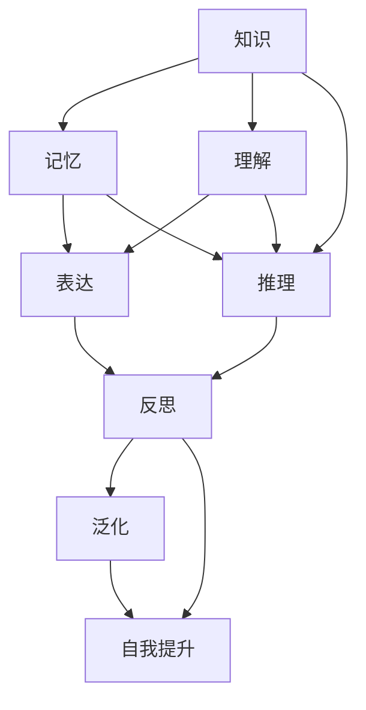

# 【大模型应用开发 动手做AI Agent】知识、记忆、理解、表达、推理、反思、泛化和自我提升

## 1. 背景介绍
### 1.1 人工智能的发展历程
#### 1.1.1 早期的人工智能
#### 1.1.2 机器学习的崛起  
#### 1.1.3 深度学习的突破

### 1.2 大语言模型的出现
#### 1.2.1 Transformer架构的提出
#### 1.2.2 GPT系列模型的发展
#### 1.2.3 ChatGPT的广泛应用

### 1.3 AI Agent的概念与意义
#### 1.3.1 AI Agent的定义
#### 1.3.2 AI Agent的特点
#### 1.3.3 AI Agent的应用前景

## 2. 核心概念与联系
### 2.1 知识
#### 2.1.1 知识的定义与分类
#### 2.1.2 知识表示方法
#### 2.1.3 知识获取与管理

### 2.2 记忆
#### 2.2.1 记忆的类型与机制
#### 2.2.2 记忆的编码与存储
#### 2.2.3 记忆的检索与利用

### 2.3 理解
#### 2.3.1 自然语言理解的概念
#### 2.3.2 语义理解与语境分析
#### 2.3.3 多模态信息的理解

### 2.4 表达
#### 2.4.1 自然语言生成的概念
#### 2.4.2 文本生成的方法与技术
#### 2.4.3 对话系统的构建

### 2.5 推理
#### 2.5.1 推理的类型与过程
#### 2.5.2 基于规则的推理
#### 2.5.3 基于知识图谱的推理

### 2.6 反思
#### 2.6.1 元认知的概念
#### 2.6.2 自我意识与自我监控
#### 2.6.3 错误检测与纠正

### 2.7 泛化
#### 2.7.1 泛化能力的定义
#### 2.7.2 少样本学习与迁移学习
#### 2.7.3 跨领域知识的应用

### 2.8 自我提升
#### 2.8.1 持续学习的意义
#### 2.8.2 主动学习与探索
#### 2.8.3 知识的更新与扩展

### 2.9 概念之间的关系


## 3. 核心算法原理具体操作步骤
### 3.1 Transformer架构
#### 3.1.1 Self-Attention机制
#### 3.1.2 Multi-Head Attention
#### 3.1.3 位置编码

### 3.2 预训练与微调
#### 3.2.1 无监督预训练
#### 3.2.2 有监督微调
#### 3.2.3 提示学习

### 3.3 知识蒸馏
#### 3.3.1 Teacher-Student模型
#### 3.3.2 软标签与硬标签
#### 3.3.3 蒸馏损失函数

### 3.4 强化学习
#### 3.4.1 马尔可夫决策过程
#### 3.4.2 Q-Learning算法
#### 3.4.3 策略梯度方法

## 4. 数学模型和公式详细讲解举例说明
### 4.1 Transformer的数学表示
#### 4.1.1 Self-Attention的计算公式
给定输入序列 $X=[x_1,x_2,...,x_n]$，Self-Attention的计算过程如下：

$$
Q = XW^Q, K = XW^K, V = XW^V \\
Attention(Q,K,V) = softmax(\frac{QK^T}{\sqrt{d_k}})V
$$

其中，$W^Q, W^K, W^V$ 是可学习的权重矩阵，$d_k$ 是 $K$ 的维度。

#### 4.1.2 Multi-Head Attention的计算公式
Multi-Head Attention将 $Q,K,V$ 线性投影 $h$ 次，得到 $h$ 组 $Q,K,V$，然后并行计算 $h$ 次Attention，最后将结果拼接起来：

$$
MultiHead(Q,K,V) = Concat(head_1,...,head_h)W^O \\
head_i = Attention(QW_i^Q, KW_i^K, VW_i^V)
$$

其中，$W_i^Q \in \mathbb{R}^{d_{model} \times d_k}, W_i^K \in \mathbb{R}^{d_{model} \times d_k}, W_i^V \in \mathbb{R}^{d_{model} \times d_v}, W^O \in \mathbb{R}^{hd_v \times d_{model}}$。

### 4.2 知识蒸馏的数学表示
#### 4.2.1 软标签蒸馏的损失函数
设 $z_t$ 和 $z_s$ 分别表示Teacher模型和Student模型的logits输出，$T$ 为温度参数，则软标签蒸馏的损失函数为：

$$
\mathcal{L}_{KD} = \mathcal{H}(y_true, \sigma(z_s)) + \alpha \mathcal{H}(\sigma(\frac{z_t}{T}), \sigma(\frac{z_s}{T}))
$$

其中，$\mathcal{H}$ 表示交叉熵损失，$\sigma$ 表示 softmax 函数，$\alpha$ 为平衡因子。

#### 4.2.2 硬标签蒸馏的损失函数
设 $y_t$ 和 $y_s$ 分别表示Teacher模型和Student模型的硬标签输出，则硬标签蒸馏的损失函数为：

$$
\mathcal{L}_{KD} = \mathcal{H}(y_true, y_s) + \beta \mathcal{H}(y_t, y_s)
$$

其中，$\beta$ 为平衡因子。

## 5. 项目实践：代码实例和详细解释说明
### 5.1 使用PyTorch实现Transformer
```python
import torch
import torch.nn as nn

class SelfAttention(nn.Module):
    def __init__(self, d_model, num_heads):
        super().__init__()
        self.d_model = d_model
        self.num_heads = num_heads
        self.head_dim = d_model // num_heads
        
        self.q_linear = nn.Linear(d_model, d_model)
        self.k_linear = nn.Linear(d_model, d_model)
        self.v_linear = nn.Linear(d_model, d_model)
        self.out_linear = nn.Linear(d_model, d_model)

    def forward(self, x):
        batch_size, seq_len, _ = x.size()
        q = self.q_linear(x).view(batch_size, seq_len, self.num_heads, self.head_dim).transpose(1, 2)
        k = self.k_linear(x).view(batch_size, seq_len, self.num_heads, self.head_dim).transpose(1, 2)
        v = self.v_linear(x).view(batch_size, seq_len, self.num_heads, self.head_dim).transpose(1, 2)
        
        scores = torch.matmul(q, k.transpose(-2, -1)) / (self.head_dim ** 0.5)
        attn_weights = torch.softmax(scores, dim=-1)
        attn_output = torch.matmul(attn_weights, v)
        attn_output = attn_output.transpose(1, 2).contiguous().view(batch_size, seq_len, self.d_model)
        
        output = self.out_linear(attn_output)
        return output

class TransformerBlock(nn.Module):
    def __init__(self, d_model, num_heads, dropout=0.1):
        super().__init__()
        self.attn = SelfAttention(d_model, num_heads)
        self.norm1 = nn.LayerNorm(d_model)
        self.dropout1 = nn.Dropout(dropout)
        
        self.ff = nn.Sequential(
            nn.Linear(d_model, d_model * 4),
            nn.ReLU(),
            nn.Linear(d_model * 4, d_model)
        )
        self.norm2 = nn.LayerNorm(d_model)
        self.dropout2 = nn.Dropout(dropout)

    def forward(self, x):
        attn_output = self.attn(x)
        x = x + self.dropout1(attn_output)
        x = self.norm1(x)
        
        ff_output = self.ff(x)
        x = x + self.dropout2(ff_output)
        x = self.norm2(x)
        return x
```

以上代码实现了Transformer的核心组件Self-Attention和Transformer Block。其中：

- `SelfAttention` 类实现了多头自注意力机制，将输入 `x` 线性变换为 `Q,K,V`，然后计算注意力权重和输出。
- `TransformerBlock` 类实现了一个完整的Transformer Block，包括Self-Attention、Layer Normalization、Dropout和前馈网络。

### 5.2 使用TensorFlow实现知识蒸馏
```python
import tensorflow as tf

@tf.function
def kd_loss(y_true, y_pred, teacher_logits, temperature=1.0, alpha=0.5):
    soft_loss = tf.keras.losses.KLD(
        tf.nn.softmax(teacher_logits / temperature, axis=1),
        tf.nn.softmax(y_pred / temperature, axis=1)
    )
    hard_loss = tf.keras.losses.categorical_crossentropy(y_true, y_pred, from_logits=True)
    return hard_loss + alpha * temperature**2 * soft_loss

def train_step(model, teacher_model, x, y, optimizer, temperature=1.0, alpha=0.5):
    with tf.GradientTape() as tape:
        y_pred = model(x, training=True)
        teacher_logits = teacher_model(x, training=False)
        loss = kd_loss(y, y_pred, teacher_logits, temperature, alpha)
    gradients = tape.gradient(loss, model.trainable_variables)
    optimizer.apply_gradients(zip(gradients, model.trainable_variables))
    return loss
```

以上代码实现了知识蒸馏的训练过程。其中：

- `kd_loss` 函数计算了软标签蒸馏和硬标签蒸馏的损失，并使用 `alpha` 和 `temperature` 参数进行平衡。
- `train_step` 函数定义了一次训练迭代的过程，使用 `tf.GradientTape` 记录梯度，并用 `optimizer` 更新模型参数。

## 6. 实际应用场景
### 6.1 智能客服
#### 6.1.1 客户意图识别
#### 6.1.2 问题自动应答
#### 6.1.3 情感分析与风险监测

### 6.2 个性化推荐
#### 6.2.1 用户画像构建
#### 6.2.2 推荐算法设计
#### 6.2.3 实时推荐与反馈

### 6.3 智能写作助手
#### 6.3.1 文本生成与补全
#### 6.3.2 语法纠错与优化
#### 6.3.3 风格迁移与创意激发

### 6.4 智能教育
#### 6.4.1 知识图谱构建
#### 6.4.2 个性化学习路径规划
#### 6.4.3 智能作业批改与反馈

## 7. 工具和资源推荐
### 7.1 开源框架
#### 7.1.1 TensorFlow
#### 7.1.2 PyTorch
#### 7.1.3 Hugging Face Transformers

### 7.2 预训练模型
#### 7.2.1 BERT
#### 7.2.2 GPT-2/GPT-3
#### 7.2.3 T5

### 7.3 数据集
#### 7.3.1 WikiText
#### 7.3.2 BookCorpus
#### 7.3.3 SQuAD

### 7.4 开发工具
#### 7.4.1 Jupyter Notebook
#### 7.4.2 Google Colab
#### 7.4.3 VS Code

## 8. 总结：未来发展趋势与挑战
### 8.1 模型的可解释性与可控性
#### 8.1.1 黑盒模型的透明化
#### 8.1.2 模型行为的约束与引导
#### 8.1.3 人机协作与互信

### 8.2 数据的隐私与安全
#### 8.2.1 联邦学习与加密计算
#### 8.2.2 差分隐私与匿名化
#### 8.2.3 数据溯源与权限管理

### 8.3 模型的公平性与伦理
#### 8.3.1 偏见检测与消除
#### 8.3.2 伦理准则与约束机制
#### 8.3.3 负责任的AI开发与应用

### 8.4 算力与能效的优化
#### 8.4.1 模型压缩与剪枝
#### 8.4.2 低精度计算与量化
#### 8.4.3 专用硬件与芯片设计

## 9. 附录：常见问题与解答
### 9.1 如何选择合适的预训练模型