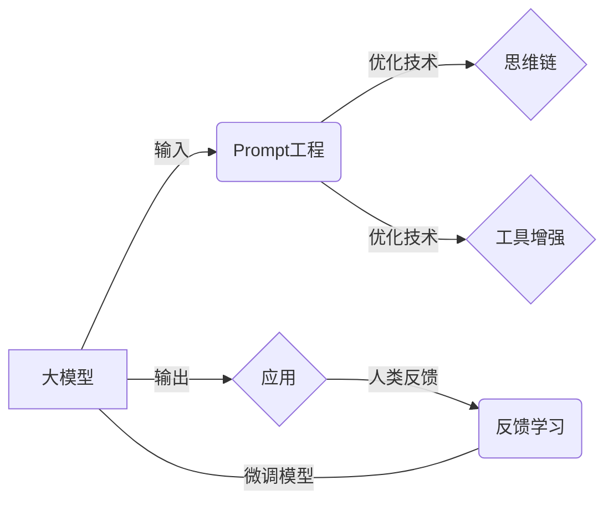

# 【大模型应用开发 动手做AI Agent】第一次调用大模型，向模型发送对话及工具定义，并获取响应

## 1. 背景介绍

人工智能(Artificial Intelligence, AI)技术的飞速发展，尤其是以ChatGPT、GPT-4等为代表的大语言模型(Large Language Model, LLM)的出现，正在深刻改变人们的工作和生活方式。这些大模型展现出了惊人的自然语言理解和生成能力，可以与人进行流畅的对话，完成写作、编程、绘画等各种任务。

但目前大模型主要还是以API方式提供服务，应用开发者需要根据API文档来调用。如何与大模型进行高效的交互，发挥其在具体场景中的智能助手能力，让大模型真正成为一个得力的AI Agent，是本文要探讨的问题。我们将介绍如何通过API接口向大模型发送对话和工具定义，并获取模型的响应，实现人机协作来完成复杂任务。

### 1.1 大模型API调用的挑战

尽管ChatGPT等大模型展现了通用智能的雏形，但要将其应用到实际场景中，仍面临诸多挑战：

- 大模型的API调用方式与传统编程范式差异较大，需要理解其交互原理
- 大模型能力虽然强大，但并非全能，需要辅以外部工具才能发挥作用
- 大模型的输入输出格式多样，需要开发者进行适配转换
- 大模型对话的上下文维护和任务连贯性把控并不容易

因此，掌握大模型API的调用方法和最佳实践，对于开发智能应用至关重要。

### 1.2 本文的主要内容

本文将重点介绍以下内容：

- 大模型API调用的基本原理和核心概念
- 如何定义对话内容和工具规范，并发送给大模型
- 如何接收和解析大模型返回的响应结果
- 如何实现多轮对话和复杂任务的交互流程
- 基于大模型API的智能应用开发实践案例

通过学习本文，你将初步掌握大模型API的开发技巧，可以尝试开发出基于大模型的AI助手应用。

## 2. 核心概念与联系

在介绍大模型API的调用方法之前，我们先来了解一些核心概念：

### 2.1 大模型(Large Language Model)

大模型是指基于海量文本数据训练的超大规模语言模型，通常包含数百亿到上万亿参数。它以自然语言作为输入和输出，具备语言理解、生成、推理等多种能力。目前主流的大模型有OpenAI的GPT系列、Anthropic的Claude、DeepMind的Chinchilla等。

### 2.2 Prompt工程(Prompt Engineering)

Prompt工程是指如何设计大模型的输入文本(即Prompt)，以引导模型生成期望的输出。一个优质的Prompt需要包含明确的指令、必要的上下文信息、输出格式要求等，可以显著提升大模型执行任务的效果。

### 2.3 思维链(Chain of Thought)

思维链是一种Prompt优化技术，通过在Prompt中引入中间推理步骤，启发模型进行逐步思考，从而提高应对复杂问题时的表现。例如在解决数学题时，可以要求模型列出详细的解题过程。

### 2.4 工具增强(Tool Augmentation)

大模型本身更擅长自然语言处理，对于网络搜索、数值计算、数据库查询等任务则力不从心。工具增强的思路是为大模型提供一系列外部工具，并教会它如何使用工具来完成超出自身能力的任务。比如模型可以调用搜索引擎来获取最新资讯，调用计算器来进行数学运算。

### 2.5 反馈学习(Feedback Learning)

即根据人类的反馈信息，对大模型的行为进行优化。常见的反馈方式包括人工评分、排序、多选等。通过这种人类反馈，可以微调模型使其更好地符合人类偏好。

以上概念之间的关系可以用下图表示：



理解这些概念之间的联系，有助于我们更好地设计大模型API的交互方式。

## 3. 核心算法原理与操作步骤

调用大模型API的核心算法可以概括为以下步骤：

### 3.1 构造Prompt

根据具体应用场景，设计一个高质量的Prompt，内容包括：

- 任务指令：明确告知模型要执行的任务，比如问答、写作、代码生成等
- 上下文信息：提供必要的背景知识，比如面向的领域、涉及的实体等  
- 格式要求：对模型输出的内容和格式进行约束，比如字数限制、输出语言等
- 思维链：可选地要求模型给出推理链或步骤说明，引导其进行深入思考
- 工具使用：如果允许模型使用外部工具，需要说明可用工具及其操作规范

一个Prompt的例子：
```
任务：请你扮演一名Python编程助手，根据用户的需求给出代码实现。输出内容以Markdown格式呈现，代码部分用Python代码块。

用户需求：实现一个函数，判断一个数是否为质数。

请给出函数实现的代码。
```

### 3.2 API调用

将构造好的Prompt通过HTTP请求发送给大模型API，并携带必要的参数，如API Key、模型选择、采样方式、温度系数等。

以OpenAI的API为例：

```python
import openai

openai.api_key = "YOUR_API_KEY"

prompt = "任务：请你扮演一名Python编程助手，根据用户的需求给出代码实现。输出内容以Markdown格式呈现，代码部分用Python代码块。\n\n用户需求：实现一个函数，判断一个数是否为质数。\n\n请给出函数实现的代码。"

response = openai.Completion.create(
    engine="text-davinci-003",
    prompt=prompt,
    max_tokens=1024,
    n=1,
    stop=None,
    temperature=0.5,
)
```

### 3.3 结果解析

API请求返回结果后，需要对响应内容进行解析，提取其中的关键信息。大模型生成的内容通常是纯文本格式，可能包含Markdown等标记。需要开发者编写代码对内容进行结构化处理，比如拆分代码块和说明文本。

```python
result = response.choices[0].text.strip()

# 提取代码块
code_blocks = []
for block in result.split("```"):
    if block.startswith("python"):
        code_blocks.append(block.split("\n", 1)[1].strip())

# 提取说明文本
description = result.split("```python")[0].strip()

print(f"代码块：\n{code_blocks}\n")
print(f"说明文本：\n{description}")
```

### 3.4 工具调用

如果Prompt中包含了对外部工具的使用，在得到模型的响应后，还需要进一步解析其中的工具调用指令，并执行相应的操作。

例如模型返回了以下内容：
```
我认为可以通过以下步骤来判断一个数是否为质数：

1. 调用计算器工具，计算出小于等于该数平方根的所有整数。
2. 遍历这些整数，调用计算器工具，判断其是否能整除该数。
   - 如果存在一个数可以整除，则说明该数不是质数，返回False。
   - 如果所有数都不能整除，则说明该数是质数，返回True。

接下来我会给出详细的代码实现。
```

这里模型要求调用了计算器工具，需要我们在代码中实现该工具的调用逻辑：

```python
import math

def calculator(expression):
    """计算器工具"""
    return eval(expression)

# 解析模型输出，提取工具调用指令
tool_calls = []
for line in result.split("\n"):
    if line.startswith("- 调用"):
        tool_name = line.split("工具")[0].split("调用")[1].strip()
        tool_input = line.split("，")[1].strip()
        tool_calls.append((tool_name, tool_input))

# 执行工具调用
for tool_name, tool_input in tool_calls:
    if tool_name == "计算器":
        print(f"计算器输入：{tool_input}, 输出：{calculator(tool_input)}")
```

### 3.5 多轮交互

在实际应用中，人机对话通常是多轮进行的。为了保持对话的连贯性，需要将之前的对话内容作为上下文，拼接到新一轮的Prompt中。同时还要注意控制上下文长度，避免超过模型允许的最大长度。

```python
context = ""

while True:
    user_input = input("用户：")
    
    # 拼接上下文
    prompt = f"{context}\n用户：{user_input}\n助手："
    
    # 截断过长的上下文
    prompt = prompt[-4096:]
    
    response = openai.Completion.create(
        engine="text-davinci-003",
        prompt=prompt,
        max_tokens=1024,
        n=1,
        stop=None,
        temperature=0.5,
    )
    
    result = response.choices[0].text.strip()
    print(f"助手：{result}")
    
    # 更新上下文
    context = f"{context}\n用户：{user_input}\n助手：{result}"
```

以上就是调用大模型API的核心算法步骤，通过设计Prompt、解析结果、调用工具、维护上下文等操作，我们可以实现与大模型的流畅交互，构建出智能的AI应用。

## 4. 数学模型和公式详解

大模型的内部原理涉及复杂的数学模型和公式，主要包括Transformer结构、注意力机制、Embedding表示等。这里我们对其中的一些关键概念进行说明。

### 4.1 Transformer结构

Transformer是大模型的核心组件，由编码器(Encoder)和解码器(Decoder)组成，可以对输入序列进行并行计算。

编码器包含多个相同的层，每一层又包含两个子层：

- 第一个子层是多头自注意力机制(Multi-Head Self-Attention)，可以捕捉序列内部的依赖关系。
- 第二个子层是前馈神经网络(Feed-Forward Neural Network)，可以对特征进行非线性变换。

解码器的结构与编码器类似，但在两个子层之间还插入了一个多头注意力层，用于关注编码器的输出。

Transformer的计算过程可以用以下公式表示：

$$
\begin{aligned}
\mathrm{Attention}(Q, K, V) &= \mathrm{softmax}(\frac{QK^T}{\sqrt{d_k}})V \\
\mathrm{MultiHead}(Q, K, V) &= \mathrm{Concat}(\mathrm{head_1}, ..., \mathrm{head_h})W^O \\
\mathrm{FFN}(x) &= \max(0, xW_1 + b_1)W_2 + b_2
\end{aligned}
$$

其中$Q$、$K$、$V$分别表示查询向量、键向量、值向量，$d_k$为向量维度，$h$为注意力头数，$W$、$b$为可学习的参数矩阵和偏置项。

### 4.2 注意力机制

注意力机制是Transformer的核心，可以学习序列中元素之间的依赖关系，关注到重要的信息。常见的注意力函数有：

- 点积注意力(Dot-Product Attention)：$\mathrm{score}(q,k) = q \cdot k$
- 缩放点积注意力(Scaled Dot-Product Attention)：$\mathrm{score}(q,k) = \frac{q \cdot k}{\sqrt{d_k}}$
- 加性注意力(Additive Attention)：$\mathrm{score}(q,k) = v^T \tanh(W_1 q + W_2 k)$

其中$\mathrm{score}$函数用于计算查询$q$和键$k$之间的相似度，得分越高表示它们的相关性越强。

### 4.3 Embedding表示

大模型的输入通常是离散的token ID序列，需要将其映射为连续的向量表示，这个映射过程称为Embedding。

给定token的ID $i$，可以用嵌入矩阵$E$的第$i$行作为其Embedding向量：

$$w_i = E[i,:]$$

其中$E \in \