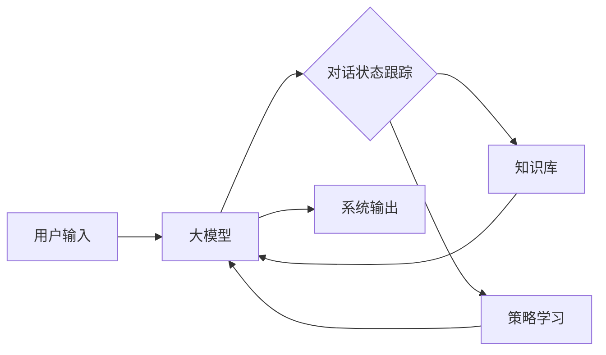

# 【大模型应用开发 动手做AI Agent】调用模型选择的工具并构建新消息

## 1. 背景介绍
### 1.1 大模型的崛起
近年来,以GPT、BERT等为代表的大规模预训练语言模型(Large Language Models, LLMs)在自然语言处理领域取得了突破性进展。这些模型通过在海量文本数据上进行无监督预训练,学习到了丰富的语言知识和常识,展现出了惊人的语言理解和生成能力。大模型的出现,为构建更加智能化的对话系统、知识问答系统、内容生成系统等AI应用带来了新的机遇。

### 1.2 AI Agent的应用前景
AI Agent是一种能够自主执行任务、与用户进行自然交互的智能软件。它集成了自然语言处理、知识表示、推理决策等多项AI技术。通过引入大模型,AI Agent的语言理解和生成能力将大幅提升,使其能够更好地理解用户需求,提供个性化服务。同时,大模型还可以赋予AI Agent更强的知识获取和学习能力,使其不断扩充和更新自身的知识库。可以预见,大模型驱动的AI Agent将在智能客服、虚拟助手、智能教育等领域得到广泛应用。

### 1.3 技术挑战与机遇
尽管大模型为AI Agent的开发带来了诸多机遇,但如何有效利用大模型构建AI Agent仍面临一些技术挑战:

1. 大模型的调用和集成。如何设计合理的系统架构,实现大模型与其他AI组件的无缝衔接和高效调用。
2. 对话管理和多轮交互。如何利用大模型构建多轮对话的AI Agent,使其能够在连贯的上下文中进行交互。 
3. 知识融合与推理。如何将大模型学习到的知识与显式构建的知识库相结合,增强AI Agent的知识表示和推理能力。
4. 安全和伦理问题。如何避免大模型生成有害、偏见的内容,构建安全可控的AI Agent。

这些挑战也意味着技术创新的机会。通过探索大模型应用开发的新方法和范式,我们有望突破瓶颈,构建出更加智能、高效、安全的AI Agent,推动人机交互体验的革新。

## 2. 核心概念与联系
### 2.1 大模型(Large Language Models)
大模型是指参数量巨大(一般在数亿到上千亿量级)的深度神经网络语言模型。其通过在大规模文本语料上进行无监督预训练,习得了丰富的语言知识和常识。当前主流的大模型包括GPT系列、BERT系列、T5、Switch Transformer等。与传统的自然语言处理模型相比,大模型具有更强的语言理解、生成和泛化能力。

### 2.2 AI Agent
AI Agent是一种智能软件系统,能够感知环境,自主执行任务,并与用户进行自然交互。典型的AI Agent包括对话系统、智能助手、推荐系统等。一个完整的AI Agent通常由自然语言理解(NLU)、对话管理(DM)、知识库(KB)、自然语言生成(NLG)等多个模块组成。其中,NLU负责将用户输入转化为结构化语义表示,DM负责根据当前对话状态和用户意图制定下一步行动策略,KB提供AI Agent所需的背景知识,NLG负责根据给定语义生成自然语言回复。

### 2.3 大模型与AI Agent的关系
大模型可以为AI Agent的构建提供新的思路和技术手段:

1. 大模型可以作为AI Agent的语言理解和生成引擎,增强其自然语言处理能力。传统的NLU和NLG模块往往采用基于规则或浅层神经网络的方法,难以处理复杂多变的对话场景。引入大模型后,AI Agent可以更好地理解用户意图,生成流畅、连贯的回复。

2. 大模型学习到的海量知识可以为AI Agent提供背景知识支持。传统的知识库需要人工构建和维护,覆盖范围有限。大模型在预训练阶段习得的常识性知识,可以作为AI Agent的知识来源,减少对人工知识库的依赖。

3. 大模型可以简化AI Agent的系统架构。传统的AI Agent需要复杂的流水线和众多独立模块,开发和维护成本高。基于大模型的AI Agent可以利用单一模型实现端到端的对话处理,架构更加简洁高效。

下图展示了一个基于大模型的AI Agent的简化架构:



可以看到,以大模型为核心,辅以对话状态跟踪、知识库查询、策略学习等技术,即可构建一个完整的AI Agent。这种架构避免了不同模块间的冗余和耦合,提高了开发和迭代效率。

## 3. 核心算法原理与操作步骤
构建基于大模型的AI Agent的核心是提示工程(Prompt Engineering)。提示工程是一种通过设计输入文本模板(即提示)来引导大模型执行特定任务的技术。通过精心设计的提示,我们可以利用大模型的语言理解和生成能力,实现对话、问答、写作等多种功能。下面介绍几种常用的提示工程技术:

### 3.1 任务描述提示
任务描述提示是指在输入文本中包含对当前任务的明确描述,引导模型朝特定方向执行。例如:

```
假设你是一位餐厅服务员,请根据以下对话生成一条得体的回复:
用户:我想点一份牛排套餐,要几分熟的?
服务员:
```

通过这样的提示,我们明确了模型所扮演的角色(服务员)以及要执行的任务(根据用户问题生成回复)。模型根据提示中的角色和任务描述,结合自身的语言知识,可以生成符合特定场景的回复,比如:

```
服务员:我们提供三分熟、五分熟、七分熟三种熟度选择。三分熟内部呈红色,口感最为鲜嫩;五分熟内部呈粉红色,口感适中;七分熟内部灰褐均匀,口感较老。请问您需要哪种熟度呢?
```

### 3.2 few-shot提示
few-shot提示是指在输入文本中包含少量示例,让模型根据示例推断出所需执行的任务。例如:

```
以下是一些常见问题及其对应的简洁回答:
Q:茶叶的种类有哪些?
A:茶叶主要分为六大类:绿茶、白茶、黄茶、青茶、红茶、黑茶。
Q:星座有哪些?
A:黄道十二星座分别为:白羊座、金牛座、双子座、巨蟹座、狮子座、处女座、天秤座、天蝎座、射手座、摩羯座、水瓶座、双鱼座。
Q:水果可以分为哪几类?
A:
```

通过提供几个问答pair作为示例,模型可以推断出这是一个问答任务,并根据示例的模式(问题+简洁答案)来生成回复,比如:

```
A:水果可以分为浆果类、柑橘类、核果类、仁果类、瓜果类、热带及亚热带水果等几大类。
```

### 3.3 角色扮演提示
角色扮演提示是指在输入文本中让模型扮演特定角色,并根据角色属性生成回复。例如:

```
现在你将扮演一位心理咨询师,用平和、专业的语气与来访者进行沟通。
来访者:最近工作压力很大,总是失眠,该怎么缓解呢?
心理咨询师:
```

通过角色扮演提示,模型会根据心理咨询师的职业属性,生成符合其身份的专业回复,比如:

```
心理咨询师:失眠确实会对身心健康造成影响。我建议您可以从以下几个方面着手缓解压力和改善睡眠:第一,合理安排工作时间,避免长时间加班;第二,每天留出一些时间做放松训练,如深呼吸、渐进性肌肉放松等;第三,睡前避免接触手机、电脑等电子设备,营造安静舒适的睡眠环境;第四,如果失眠问题严重,可以寻求医生帮助,必要时使用一些安全的助眠药物。除此之外,保持规律的作息,多运动,也有助于缓解压力和改善睡眠质量。如果您愿意,我们可以安排几次面谈,更系统地评估您的压力水平,并制定一份个性化的压力管理方案。
```

以上就是几种常用的提示工程技术及其基本原理。实践中,我们往往需要针对不同的任务和场景,灵活组合和优化提示模板,不断迭代以获得最佳效果。此外,提示工程的有效性还依赖于大模型的性能。随着大模型的不断进化,提示工程的表现力和适用范围也会不断扩展。

## 4. 数学模型和公式详解
大模型本质上是一个基于深度学习的语言模型。以最经典的Transformer结构为例,其核心是自注意力机制(Self-Attention)和前馈神经网络(Feed-Forward Network)。

### 4.1 自注意力机制
自注意力机制可以捕捉输入序列中任意两个位置之间的依赖关系。对于一个输入序列$X=(x_1,x_2,...,x_n)$,自注意力的计算过程如下:

1. 将输入序列$X$通过三个线性变换得到查询向量$Q$、键向量$K$、值向量$V$:

$$
\begin{aligned}
Q &= XW^Q \\
K &= XW^K \\
V &= XW^V
\end{aligned}
$$

其中$W^Q$、$W^K$、$W^V$为可学习的权重矩阵。

2. 计算查询向量$Q$与所有键向量$K$的相似度,得到注意力分数:

$$
A = \text{softmax}(\frac{QK^T}{\sqrt{d_k}})
$$

其中$d_k$为键向量的维度,用于缩放点积结果。

3. 将注意力分数$A$与值向量$V$相乘,得到加权求和的输出:

$$
\text{Attention}(Q,K,V) = AV
$$

通过自注意力机制,模型可以动态地关注输入序列中的重要信息,捕捉长距离依赖。

### 4.2 前馈神经网络
前馈神经网络用于对自注意力的输出进行非线性变换,增强模型的表示能力。其计算公式为:

$$
\text{FFN}(x) = \max(0, xW_1 + b_1)W_2 + b_2
$$

其中$W_1$、$W_2$为权重矩阵,$b_1$、$b_2$为偏置项。通过两个线性变换和一个ReLU激活函数,前馈神经网络可以对特征进行复杂的非线性组合。

### 4.3 多头注意力
为了让模型从不同的角度捕捉输入序列的特征,Transformer引入了多头注意力机制。多头注意力并行地执行多个自注意力操作,然后将不同头的输出拼接起来:

$$
\begin{aligned}
\text{MultiHead}(Q,K,V) &= \text{Concat}(\text{head}_1,...,\text{head}_h)W^O \\
\text{head}_i &= \text{Attention}(QW_i^Q, KW_i^K, VW_i^V)
\end{aligned}
$$

其中$W_i^Q$、$W_i^K$、$W_i^V$为第$i$个头的权重矩阵,$W^O$为输出的线性变换矩阵。

### 4.4 Transformer的整体结构
Transformer由多个编码器(Encoder)和解码器(Decoder)层堆叠而成。每个编码器层包含一个自注意力子层和一个前馈神经网络子层;每个解码器层包含一个自注意力子层、一个编码-解码注意力子层和一个前馈神经网络子层。

编码器的计算过程可以表示为:

$$
\begin{aligned}
\tilde{h}^l &= \text{Layer