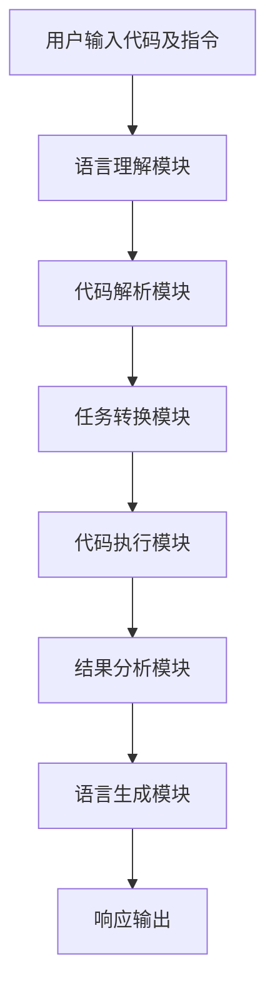

# 【大模型应用开发 动手做AI Agent】运行助手

## 1. 背景介绍

随着人工智能技术的不断发展,大型语言模型(Large Language Models, LLMs)已经成为当前最受关注的人工智能领域之一。这些模型通过消化海量文本数据,学习理解和生成人类语言,展现出惊人的语言理解和生成能力。

大型语言模型的出现,为构建智能对话系统、问答系统、写作辅助等应用提供了强大的技术支撑。其中,AI Agent就是一种基于大型语言模型的智能应用,它可以根据用户的指令执行各种任务,如查询信息、分析数据、写作创作等,为用户提供贴心的智能助手服务。

本文将探讨如何基于大型语言模型开发AI Agent运行助手,深入剖析其核心概念、算法原理,并通过实践项目讲解开发流程,最后分享工具资源、应用场景和发展趋势,旨在帮助读者掌握AI Agent开发的方方面面。

## 2. 核心概念与联系

在开发AI Agent运行助手之前,我们需要了解以下几个核心概念:

### 2.1 大型语言模型(LLMs)

大型语言模型是一种基于深度学习的自然语言处理(NLP)模型,通过消化海量文本数据进行预训练,学习理解和生成人类语言。常见的大型语言模型包括GPT(Generative Pre-trained Transformer)、BERT(Bidirectional Encoder Representations from Transformers)等。

这些模型具有强大的语言理解和生成能力,可以应用于文本生成、机器翻译、问答系统等多个领域。在AI Agent中,大型语言模型扮演着核心的角色,负责理解用户的指令并生成相应的响应。

### 2.2 AI Agent

AI Agent是一种智能代理,它基于大型语言模型,能够理解和执行用户的指令,为用户提供个性化的智能助手服务。AI Agent可以执行各种任务,如查询信息、分析数据、写作创作等,并与用户进行自然语言交互。

AI Agent的核心在于将大型语言模型的语言理解和生成能力与任务执行相结合,形成一个闭环的智能系统。用户的指令经过语言理解模块解析后,被转换为具体的任务,再由任务执行模块完成,最后将结果通过语言生成模块输出给用户。

### 2.3 运行助手

运行助手是一种特殊的AI Agent,它专注于为用户提供与代码运行、调试等相关的智能辅助服务。运行助手能够理解用户的代码相关指令,如运行代码、解释错误、优化性能等,并执行相应的操作,为用户提供高效的编程辅助。

运行助手需要将大型语言模型的能力与代码执行环境相结合,能够解析代码、执行代码、分析运行结果,并与用户进行自然语言交互,形成一个智能的代码运行辅助系统。

这三个核心概念相互关联,构成了AI Agent运行助手的基础。大型语言模型为AI Agent提供了语言理解和生成的能力,AI Agent则将这种能力与任务执行相结合,而运行助手则是AI Agent在代码运行领域的一种特殊应用。

## 3. 核心算法原理具体操作步骤  

### 3.1 大型语言模型原理

大型语言模型的核心原理是基于自注意力机制(Self-Attention)的Transformer架构。该架构通过自注意力机制捕捉输入序列中不同位置之间的依赖关系,从而更好地建模序列数据。

具体地,Transformer架构由编码器(Encoder)和解码器(Decoder)两个主要部分组成。编码器负责处理输入序列,将其映射为隐藏状态表示;解码器则基于编码器的输出,生成目标输出序列。

在训练过程中,大型语言模型会在海量文本数据上进行预训练,学习捕捉语言的语义和语法规则。预训练完成后,模型可以在特定任务上进行微调(Fine-tuning),以提高在该任务上的性能。

以GPT(Generative Pre-trained Transformer)为例,其训练目标是最大化给定上文的条件下,预测正确的下一个词的概率。通过这种自回归(Auto-regressive)的方式,GPT能够学习生成连贯、符合语义的文本。

### 3.2 AI Agent运行原理

AI Agent的运行原理可以概括为以下几个步骤:

1. **用户输入**:用户通过自然语言向AI Agent发出指令,如"运行下面的Python代码"。

2. **语言理解**:AI Agent使用大型语言模型对用户的指令进行语义理解,提取出代码、运行要求等关键信息。

3. **任务转换**:根据语义理解的结果,AI Agent将用户的指令转换为具体的任务,如执行Python代码。

4. **任务执行**:AI Agent执行转换后的任务,如在Python运行环境中运行代码,并获取运行结果。

5. **结果生成**:AI Agent使用大型语言模型根据任务执行的结果,生成自然语言的响应,如"代码运行成功,输出结果为..."。

6. **响应输出**:AI Agent将生成的响应输出给用户,完成一个交互周期。

在这个过程中,大型语言模型扮演着语言理解和生成的核心角色,而AI Agent则负责将语言能力与任务执行相结合,形成一个闭环的智能系统。

### 3.3 运行助手算法流程

运行助手作为AI Agent在代码运行领域的一种应用,其算法流程可以概括为以下步骤:

1. **用户输入**:用户输入代码及相关指令,如"运行下面的Python代码并解释错误"。

2. **语言理解模块**:使用大型语言模型对用户输入进行语义理解,提取出代码、运行要求等关键信息。

3. **代码解析模块**:对用户输入的代码进行解析,构建抽象语法树(AST)等中间表示。

4. **任务转换模块**:根据语义理解和代码解析的结果,将用户的指令转换为具体的任务,如执行Python代码、分析错误等。

5. **代码执行模块**:在相应的运行环境(如Python解释器)中执行代码,获取运行结果和错误信息(如果有)。

6. **结果分析模块**:分析代码执行的结果,提取关键信息,如错误原因、性能瓶颈等。

7. **语言生成模块**:使用大型语言模型根据结果分析的信息,生成自然语言的响应,如解释错误原因、优化建议等。

8. **响应输出**:将生成的响应输出给用户,完成一个交互周期。

在这个流程中,大型语言模型在语言理解和生成环节发挥核心作用,而代码解析、执行、结果分析等模块则负责将语言能力与代码运行相结合,形成一个完整的运行助手系统。

## 4. 数学模型和公式详细讲解举例说明

在大型语言模型和AI Agent中,有几个重要的数学模型和公式值得深入探讨。

### 4.1 自注意力机制(Self-Attention)

自注意力机制是Transformer架构的核心,它能够捕捉输入序列中不同位置之间的依赖关系,从而更好地建模序列数据。

给定一个输入序列 $X = (x_1, x_2, \dots, x_n)$,自注意力机制首先计算每个位置 $i$ 与其他所有位置 $j$ 之间的注意力权重 $\alpha_{ij}$,表示位置 $i$ 对位置 $j$ 的关注程度。注意力权重的计算公式如下:

$$\alpha_{ij} = \frac{e^{f(x_i, x_j)}}{\sum_{k=1}^{n}e^{f(x_i, x_k)}}$$

其中,函数 $f$ 用于计算两个位置之间的相似性分数,通常采用点积或缩放点积的形式:

$$f(x_i, x_j) = \frac{x_i^T x_j}{\sqrt{d}}$$

$d$ 是向量维度,用于缩放点积值,防止过大或过小的值导致梯度消失或梯度爆炸。

接下来,自注意力机制将每个位置 $j$ 的值 $x_j$ 与其注意力权重 $\alpha_{ij}$ 相乘,再对所有位置求和,得到位置 $i$ 的注意力向量表示 $z_i$:

$$z_i = \sum_{j=1}^{n}\alpha_{ij}x_j$$

最后,注意力向量 $z_i$ 通过一个前馈神经网络进行进一步转换,得到该位置的最终输出表示 $y_i$。

自注意力机制的优点在于,它能够直接捕捉序列中任意两个位置之间的依赖关系,而不需要通过递归或卷积的方式来建模序列,从而更好地捕捉长距离依赖,提高了模型的表现力。

### 4.2 掩码语言模型(Masked Language Model)

掩码语言模型(Masked Language Model, MLM)是BERT等双向编码器模型的预训练目标之一,它旨在学习理解被掩码(masked)的单词在上下文中的含义。

具体地,在预训练过程中,MLM会随机选择一些输入序列中的词,将它们用特殊的[MASK]标记替换,然后让模型尝试预测这些被掩码的词。通过这种方式,模型可以学习到上下文和被掩码词之间的双向关系,从而提高语义理解能力。

MLM的训练目标是最大化被掩码词的条件概率,即给定上下文 $C$ 和掩码位置 $i$,模型需要最大化预测正确词 $w_i$ 的条件概率 $P(w_i|C)$。这可以通过最小化交叉熵损失函数来实现:

$$\mathcal{L}_{MLM} = -\sum_{i\in M}\log P(w_i|C)$$

其中,$M$ 是所有被掩码位置的集合。

MLM预训练目标与传统的语言模型(如GPT)相比,具有更好的双向语义理解能力,因为它需要同时关注上下文的前后信息。这种能力对于许多自然语言处理任务(如问答、文本分类等)都是非常有益的。

### 4.3 生成式预训练(Generative Pre-training)

生成式预训练(Generative Pre-training)是GPT等自回归语言模型的预训练目标,它旨在最大化给定上文的条件下,预测正确的下一个词的概率。

具体地,给定一个长度为 $n$ 的输入序列 $X = (x_1, x_2, \dots, x_n)$,生成式预训练的目标是最大化序列的条件概率 $P(X)$,即:

$$\max_\theta \prod_{i=1}^{n}P(x_i|x_1, x_2, \dots, x_{i-1}; \theta)$$

其中,$\theta$ 表示模型参数。

由于直接最大化整个序列的条件概率是计算量很大的操作,因此通常采用自回归(Auto-regressive)的方式,将序列的条件概率分解为每个位置的条件概率的乘积:

$$P(X) = \prod_{i=1}^{n}P(x_i|x_1, x_2, \dots, x_{i-1}; \theta)$$

然后,模型通过最小化每个位置的交叉熵损失函数来进行训练:

$$\mathcal{L}_{GPT} = -\sum_{i=1}^{n}\log P(x_i|x_1, x_2, \dots, x_{i-1}; \theta)$$

生成式预训练的优点在于,它可以学习到生成连贯、符合语义的文本序列的能力,这对于文本生成、机器翻译等任务非常有用。同时,它也可以捕捉到语言的单向依赖关系,对于某些任务(如文本续写)具有一定优势。

以上三个数学模型和公式,分别对应了大型语言模型中的自注意力机制、掩码语言模型预训练目标和生成式预训练目标,它们共同构建