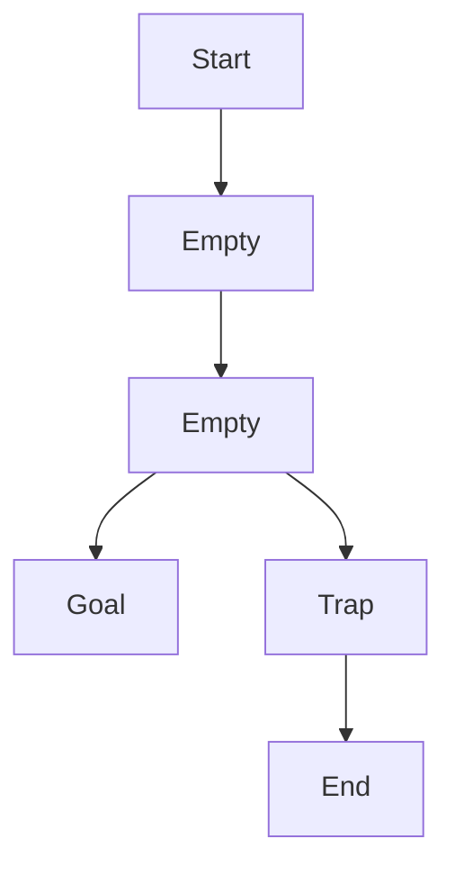

# 一切皆是映射：AI Q-learning以及深度学习的融合

## 1.背景介绍

在人工智能领域,强化学习(Reinforcement Learning)和深度学习(Deep Learning)是两个备受关注的热门话题。强化学习是一种基于奖励或惩罚来学习做出最优决策的机器学习范式,而深度学习则是利用神经网络在大量数据上进行训练以发现数据内在规律的方法。

Q-learning作为强化学习中的一种重要算法,通过不断尝试不同的行为并根据获得的奖励来更新状态-行为值函数(Q函数),最终找到一个在给定环境中获得最大累积奖励的最优策略。然而,传统的Q-learning算法在处理高维观测数据和连续动作空间时存在一些局限性。

深度学习则擅长从高维数据中提取有用的特征表示,并通过端到端的训练来学习复杂的映射关系。将深度学习与Q-learning相结合,不仅可以克服传统Q-learning的局限性,还能充分利用深度神经网络强大的函数逼近能力,从而在更复杂的环境中获得更好的性能。

## 2.核心概念与联系

### 2.1 Q-learning

Q-learning是一种基于时间差分(Temporal Difference)的强化学习算法,其核心思想是通过不断尝试不同的行为,并根据获得的奖励来更新状态-行为值函数(Q函数)。Q函数定义为在给定状态下采取某个行为所能获得的期望累积奖励,算法的目标是找到一个最优的Q函数,从而导出一个在给定环境中获得最大累积奖励的最优策略。

Q-learning算法的更新规则如下:

$$Q(s_t, a_t) \leftarrow Q(s_t, a_t) + \alpha \left[ r_t + \gamma \max_{a} Q(s_{t+1}, a) - Q(s_t, a_t) \right]$$

其中:
- $s_t$和$a_t$分别表示时刻t的状态和行为
- $r_t$表示时刻t获得的即时奖励
- $\alpha$是学习率,控制新信息对Q函数的影响程度
- $\gamma$是折现因子,控制未来奖励对当前行为的影响程度

通过不断更新Q函数,算法最终会收敛到一个最优的Q函数,从而得到一个最优策略。

### 2.2 深度学习

深度学习是机器学习中的一个新兴热点领域,其核心思想是利用具有多层非线性变换的深层神经网络在大量数据上进行训练,从而发现数据内在的复杂规律和特征表示。深度学习在计算机视觉、自然语言处理等领域取得了巨大的成功,展现出了强大的特征提取和模式识别能力。

深度神经网络通常由多个隐藏层组成,每一层都对输入数据进行非线性变换,从而逐步提取出更加抽象和复杂的特征表示。训练过程中,网络会不断调整各层的权重参数,使得输出结果逐渐逼近期望的目标值。

常见的深度学习模型包括卷积神经网络(CNN)、循环神经网络(RNN)、长短期记忆网络(LSTM)等。这些模型在不同的任务领域展现出了优异的性能,成为了深度学习研究和应用的重要工具。

### 2.3 Q-learning与深度学习的融合

传统的Q-learning算法存在一些局限性,例如:

1. 难以处理高维观测数据,需要手工设计状态特征
2. 在连续动作空间中表现不佳
3. 需要查表存储Q函数,对于大型问题存储开销巨大

将深度学习与Q-learning相结合,可以很好地解决这些问题。具体来说,我们可以使用深度神经网络来逼近Q函数,从而避免查表操作,同时利用神经网络强大的特征提取能力来处理高维观测数据。此外,通过设计合适的网络结构,也可以很好地处理连续动作空间的情况。

在这种融合框架下,Q函数由一个深度神经网络来表示和近似,网络的输入是当前状态,输出是对应于每个可能行为的Q值。在训练过程中,我们将Q-learning的时间差分更新作为损失函数,通过反向传播算法来优化网络参数,使得网络输出的Q值逐渐逼近真实的Q函数。

这种融合方法不仅保留了Q-learning的优点,同时也充分利用了深度学习强大的特征提取和函数逼近能力,因此在复杂环境中表现出了卓越的性能。

## 3.核心算法原理具体操作步骤 

Deep Q-Network(DQN)算法是将Q-learning与深度学习相结合的经典算法,其核心思路是使用一个深度神经网络来逼近Q函数。算法的具体步骤如下:

1. **初始化**:初始化一个评估网络(Q-Network)和一个目标网络(Target Network),两个网络的权重参数初始相同。同时初始化经验回放池(Experience Replay Buffer)用于存储过往的状态转移样本。

2. **采样并存储样本**:在每一个时间步,根据当前状态$s_t$和评估网络输出的Q值,选择一个行为$a_t$(可以使用$\epsilon$-贪婪策略)。执行该行为,观测到下一个状态$s_{t+1}$和即时奖励$r_t$,将转移样本$(s_t, a_t, r_t, s_{t+1})$存储到经验回放池中。

3. **采样小批量数据**:从经验回放池中随机采样一个小批量的转移样本$(s_j, a_j, r_j, s_{j+1})$。

4. **计算目标Q值**:对于每个样本,计算其目标Q值$y_j$:
   
   $$y_j = \begin{cases}
   r_j, & \text{if } s_{j+1} \text{ is terminal}\\
   r_j + \gamma \max_{a'} Q(s_{j+1}, a'; \theta^-), & \text{otherwise}
   \end{cases}$$
   
   其中$\theta^-$表示目标网络的当前参数,用于计算$\max_{a'} Q(s_{j+1}, a'; \theta^-)$。

5. **计算损失函数**:使用评估网络的当前参数$\theta$计算每个样本的预测Q值$Q(s_j, a_j; \theta)$,并将其与目标Q值$y_j$的均方误差作为损失函数:
   
   $$L(\theta) = \mathbb{E}_{(s_j, a_j, r_j, s_{j+1}) \sim U(D)}\left[(y_j - Q(s_j, a_j; \theta))^2\right]$$
   
   其中$U(D)$表示从经验回放池$D$中均匀采样。

6. **梯度下降更新**:使用梯度下降算法(如RMSProp或Adam)优化评估网络的参数$\theta$,minimizing损失函数$L(\theta)$。

7. **目标网络更新**:每隔一定步数,将评估网络的参数$\theta$复制到目标网络,即$\theta^- \leftarrow \theta$。这样可以增加目标值的稳定性,提高算法的收敛性。

8. **循环迭代**:重复步骤2-7,直到算法收敛。

DQN算法的关键点包括:

- 使用深度神经网络逼近Q函数,避免了查表操作,可以处理高维观测数据和连续动作空间。
- 引入经验回放池,打破了数据样本之间的相关性,提高了数据的利用效率。
- 使用目标网络计算目标Q值,增加了目标值的稳定性,提高了算法的收敛性。

## 4.数学模型和公式详细讲解举例说明

在DQN算法中,我们使用一个深度神经网络来逼近Q函数,即$Q(s, a; \theta) \approx Q^*(s, a)$,其中$\theta$表示网络的参数。网络的输入是当前状态$s$,输出是对应于每个可能行为$a$的Q值$Q(s, a; \theta)$。

为了训练这个Q网络,我们需要最小化一个损失函数,该损失函数衡量了网络输出的Q值与真实Q值之间的差距。具体来说,我们定义损失函数为:

$$L(\theta) = \mathbb{E}_{(s, a, r, s') \sim U(D)}\left[(y - Q(s, a; \theta))^2\right]$$

其中:

- $(s, a, r, s')$是从经验回放池$D$中均匀采样的状态转移样本
- $y$是该样本的目标Q值,定义为:
  
  $$y = r + \gamma \max_{a'} Q(s', a'; \theta^-)$$
  
  其中$\theta^-$表示目标网络的参数,用于计算$\max_{a'} Q(s', a'; \theta^-)$,这样可以增加目标值的稳定性,提高算法的收敛性。
- $\gamma$是折现因子,控制未来奖励对当前行为的影响程度。

通过最小化这个损失函数,我们可以使网络输出的Q值逐渐逼近真实的Q函数。具体的优化方法可以使用随机梯度下降(SGD)或其变体,如RMSProp、Adam等。

为了更好地理解DQN算法,我们可以通过一个简单的例子来说明。假设我们有一个格子世界环境,如下图所示:



在这个环境中,智能体的目标是从起点(Start)到达终点(Goal)。每一步,智能体可以选择向上、向下、向左或向右移动一格。如果智能体落入陷阱(Trap),就会被传送到终点(End),获得-1的奖励;如果成功到达目标(Goal),则获得+1的奖励;其他情况下,奖励为0。

我们可以使用一个简单的全连接神经网络来逼近Q函数,网络的输入是当前状态(用一个one-hot向量表示),输出是对应于四个可能行为(上下左右)的Q值。在训练过程中,我们从经验回放池中采样小批量的转移样本,计算目标Q值,并使用均方误差损失函数优化网络参数。

经过一定的训练步数后,神经网络就可以较准确地估计出每个状态下不同行为的Q值,从而导出一个近似最优的策略,指导智能体从起点到达目标。

通过这个简单的例子,我们可以直观地理解DQN算法的工作原理。在更复杂的环境中,虽然状态空间和动作空间会变得高维,但算法的基本思路是相同的,只是需要使用更复杂的神经网络结构来逼近Q函数。

## 5.项目实践:代码实例和详细解释说明

为了更好地理解DQN算法,我们提供了一个基于PyTorch的简单实现示例,并使用OpenAI Gym中的CartPole-v1环境进行测试。

### 5.1 环境介绍

CartPole-v1是一个经典的强化学习环境,其目标是通过适当地向左或向右施加力,使杆子保持直立并且小车不会跑出赛道。具体来说,环境的状态由四个变量组成:小车的位置、小车的速度、杆子的角度和杆子的角速度。每一步,智能体可以选择向左施加力或向右施加力。如果小车跑出赛道或杆子倾斜超过一定角度,就会终止当前回合。

### 5.2 代码实现

```python
import gym
import torch
import torch.nn as nn
import torch.optim as optim
import numpy as np

# 定义Q网络
class QNetwork(nn.Module):
    def __init__(self, state_dim, action_dim):
        super(QNetwork, self).__init__()
        self.fc1 = nn.Linear(state_dim, 64)
        self.fc2 = nn.Linear(64, action_dim)

    def forward(self, x):
        x = torch.relu(self.fc1(x))
        x = self.fc2(x)
        return x

# 定义DQN Agent
class DQNAgent:
    def __init__(self, state_dim, action_dim):
        self.q_net = QNetwork(state_dim, action_dim)
        self.target_q_net = QNetwork(state_dim, action_dim)
        self.optimizer = optim.Adam(self.q_net.parameters(), lr=0.001)
        self.loss_fn = nn.MSELoss()
        self.replay_buffer = []
        self.buffer_size = 10000
        self.