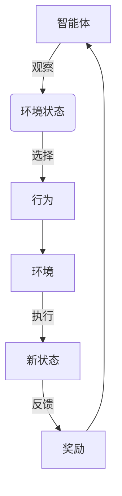

# 一切皆是映射：AI Q-learning在物联网系统中的应用

## 1.背景介绍

### 1.1 物联网系统概述

物联网(Internet of Things, IoT)是一种新兴的网络范式,旨在将各种物理对象(如传感器、执行器、嵌入式系统等)集成到互联网络中。这些物体通过各种通信技术相互连接,可以收集和共享数据,实现对物理世界的感知和控制。物联网系统广泛应用于多个领域,如智能家居、智慧城市、工业自动化、医疗保健等。

### 1.2 物联网系统面临的挑战

虽然物联网带来了巨大的机遇,但也面临着诸多挑战:

1. **异构性**:物联网由多种不同类型的设备组成,具有不同的计算能力、通信协议和操作系统,导致互操作性问题。

2. **动态性**:设备可能频繁加入或离开网络,网络拓扑结构动态变化。

3. **资源约束**:许多物联网设备具有有限的计算能力、存储空间和能源,需要高效利用资源。

4. **数据量大**:物联网系统产生海量的数据,如何高效存储、处理和分析这些数据是一大挑战。

5. **安全和隐私**:物联网系统容易受到各种攻击,如何保护系统安全和用户隐私是重中之重。

### 1.3 人工智能在物联网中的作用

为了应对上述挑战,人工智能(AI)技术在物联网系统中发挥着越来越重要的作用。AI可以帮助物联网系统实现智能决策、自主管理、预测维护等功能。其中,强化学习(Reinforcement Learning,RL)是一种重要的AI技术,可以通过与环境的交互来学习最优策略,在动态复杂的物联网场景中具有广阔的应用前景。

## 2.核心概念与联系

### 2.1 强化学习概述

强化学习是机器学习的一个重要分支,它研究如何基于环境反馈来学习最优策略。不同于监督学习需要大量标注数据,强化学习通过与环境的交互来获取经验,逐步优化策略。

强化学习系统通常由以下几个核心组件组成:

- **智能体(Agent)**: 观察环境状态,并根据策略选择行为。

- **环境(Environment)**: 智能体与之交互的外部世界。

- **状态(State)**: 环境的当前情况。

- **行为(Action)**: 智能体对环境采取的操作。

- **奖励(Reward)**: 环境对智能体行为的反馈,指导智能体学习。

- **策略(Policy)**: 智能体根据状态选择行为的规则。

强化学习的目标是通过最大化预期的累积奖励,学习到一个最优策略。

### 2.2 Q-learning算法

Q-learning是强化学习中最著名和最成功的算法之一,它属于无模型的时序差分(Temporal Difference,TD)学习方法。Q-learning直接从环境交互中学习最优的行为价值函数(Action-Value Function),而不需要建模环境的转移概率和奖励函数。

Q-learning的核心思想是使用Q表(Q-table)来存储每个状态-行为对的价值Q(s,a),并通过不断更新Q表来逼近最优的Q函数。Q表的更新规则如下:

$$Q(s_t, a_t) \leftarrow Q(s_t, a_t) + \alpha \Big(r_t + \gamma \max_{a}Q(s_{t+1}, a) - Q(s_t, a_t)\Big)$$

其中:
- $\alpha$ 是学习率,控制学习的速度。
- $\gamma$ 是折扣因子,平衡即时奖励和未来奖励。
- $r_t$ 是在时刻t获得的奖励。
- $\max_{a}Q(s_{t+1}, a)$ 是在下一状态s_{t+1}下,所有可能行为a的最大Q值。

通过不断探索和利用,Q-learning算法可以逐步找到最优策略。

### 2.3 Q-learning在物联网中的应用

Q-learning在物联网系统中有广泛的应用前景:

1. **资源管理**: 智能调度有限的计算、存储、通信和能源资源。

2. **路由优化**: 根据网络拓扑和流量动态选择最优路径。

3. **任务调度**: 在异构设备间合理分配任务,平衡负载。

4. **移动性支持**: 为移动设备选择最佳接入点和无缝切换。

5. **安全防护**: 检测和缓解各种攻击行为。

6. **自动化控制**: 实现对复杂系统的智能控制。

7. **数据处理**: 高效地收集、聚合和分析海量物联网数据。

接下来,我们将重点介绍Q-learning在物联网资源管理中的应用。

## 3.核心算法原理具体操作步骤

### 3.1 问题建模

在物联网资源管理场景中,我们可以将问题建模为一个马尔可夫决策过程(Markov Decision Process, MDP):

- **状态(State)**: 包括系统的资源利用情况(如CPU、内存、带宽等)和任务队列状态等。

- **行为(Action)**: 对资源的分配策略,如将任务分配给哪个设备执行。

- **奖励(Reward)**: 根据资源利用效率、任务完成时间等指标设计奖励函数。

- **策略(Policy)**: 智能体根据当前状态选择最优行为的规则。

我们的目标是通过Q-learning算法学习到一个最优策略,从而最大化系统的资源利用效率。

### 3.2 Q-learning算法步骤

1. **初始化Q表**

初始化一个Q表,其中的每个元素Q(s,a)代表在状态s下执行行为a的价值,初始值可以设为0或一个较小的随机值。

2. **选择行为**

对于当前状态s_t,根据一定的策略(如$\epsilon$-贪婪策略)选择一个行为a_t。$\epsilon$-贪婪策略意味着有$\epsilon$的概率随机选择行为(探索),有1-$\epsilon$的概率选择当前Q值最大的行为(利用)。

3. **执行行为并获取反馈**

执行选定的行为a_t,观察环境转移到新状态s_{t+1},并获得相应的奖励r_t。

4. **更新Q表**

根据下面的Q-learning更新规则,更新Q(s_t, a_t)的值:

$$Q(s_t, a_t) \leftarrow Q(s_t, a_t) + \alpha \Big(r_t + \gamma \max_{a}Q(s_{t+1}, a) - Q(s_t, a_t)\Big)$$

5. **重复步骤2-4**

重复执行步骤2-4,直到达到终止条件(如最大迭代次数或收敛)。

通过上述过程,Q表会不断更新,最终收敛到最优的Q函数,从而得到最优的资源分配策略。

### 3.3 算法优化

为了提高Q-learning算法的性能,可以采用一些优化技术:

1. **经验回放(Experience Replay)**

将经验存储在经验池中,每次从中随机采样一批经验进行训练,可以打破经验之间的相关性,提高数据利用效率。

2. **目标网络(Target Network)**

使用一个目标网络来计算目标Q值,其权重是主网络权重的移动平均,可以提高训练稳定性。

3. **双网络(Double Network)**

使用两个独立的Q网络,一个评估当前状态的Q值,另一个选择下一状态的最优行为,可以减轻过估计的问题。

4. **优先经验回放(Prioritized Experience Replay)**

根据经验的重要性给予不同的采样概率,可以加速训练收敛。

5. **多步更新(Multi-step Update)**

利用未来多步的奖励和状态来更新Q值,可以提高数据效率。

## 4.数学模型和公式详细讲解举例说明

在Q-learning算法中,我们需要通过不断更新Q表来逼近真实的Q函数。下面我们来推导Q-learning的更新规则,并分析其数学意义。

### 4.1 贝尔曼最优方程

在强化学习中,我们希望找到一个最优策略$\pi^*$,使得在任何状态s下,按照该策略选择行为,可以最大化预期的累积奖励。形式化地,我们定义一个价值函数$V^{\pi}(s)$,表示在状态s下,按照策略$\pi$执行,预期可以获得的累积奖励:

$$V^{\pi}(s) = \mathbb{E}_{\pi}\Big[\sum_{k=0}^{\infty}\gamma^k r_{t+k+1} \Big| s_t = s\Big]$$

其中$\gamma$是折扣因子,用于平衡即时奖励和未来奖励的权重。

对于最优策略$\pi^*$,我们定义其对应的最优价值函数为:

$$V^*(s) = \max_{\pi}V^{\pi}(s)$$

贝尔曼证明,最优价值函数$V^*$必须满足以下方程(贝尔曼最优方程):

$$V^*(s) = \max_a \Big\{R_s^a + \gamma \sum_{s'}P_{ss'}^a V^*(s')\Big\}$$

其中:
- $R_s^a$是在状态s执行行为a后获得的即时奖励。
- $P_{ss'}^a$是在状态s执行行为a后,转移到状态s'的概率。
- $\sum_{s'}P_{ss'}^a V^*(s')$是下一状态的最优价值函数的期望值。

我们还可以定义行为价值函数$Q^{\pi}(s,a)$,表示在状态s下执行行为a,之后按照策略$\pi$执行,预期可以获得的累积奖励:

$$Q^{\pi}(s, a) = \mathbb{E}_{\pi}\Big[\sum_{k=0}^{\infty}\gamma^k r_{t+k+1} \Big| s_t = s, a_t = a\Big]$$

对于最优策略$\pi^*$,我们定义其对应的最优行为价值函数为:

$$Q^*(s, a) = \max_{\pi}Q^{\pi}(s, a)$$

同样地,最优行为价值函数$Q^*$也满足一个类似的方程(贝尔曼最优方程):

$$Q^*(s, a) = R_s^a + \gamma \sum_{s'}P_{ss'}^a \max_{a'}Q^*(s', a')$$

这个方程表明,在状态s下执行行为a后获得的最优累积奖励,等于即时奖励加上下一状态的最优行为价值函数的期望值。

### 4.2 Q-learning更新规则推导

我们的目标是找到最优行为价值函数$Q^*$,从而可以根据$\max_a Q^*(s,a)$来选择最优行为。由于我们无法获知环境的转移概率$P_{ss'}^a$,因此无法直接求解贝尔曼最优方程。

Q-learning算法采用的是一种时序差分(Temporal Difference, TD)学习方法,通过不断与环境交互来逼近$Q^*$。具体来说,在时刻t,我们观察到当前状态s_t、执行行为a_t、获得即时奖励r_t,并转移到下一状态s_{t+1}。我们可以根据这些样本,更新Q(s_t, a_t)的值,使其逼近$Q^*(s_t, a_t)$。

根据贝尔曼最优方程,我们有:

$$Q^*(s_t, a_t) = r_t + \gamma \max_{a}Q^*(s_{t+1}, a)$$

由于我们无法获知真实的$Q^*$函数,因此我们使用一个可学习的函数$Q(s,a)$来逼近它。我们希望通过不断更新$Q(s_t, a_t)$,使其尽可能接近$Q^*(s_t, a_t)$。

为此,我们定义一个时序差分(TD)误差:

$$\delta_t = r_t + \gamma \max_{a}Q(s_{t+1}, a) - Q(s_t, a_t)$$

这个误差表示,当前的Q值与基于下一状态的最优Q值和即时奖励计算出的目标值之间的差距。我们希望通过最小化这个误差,来更新Q值。

具体的更