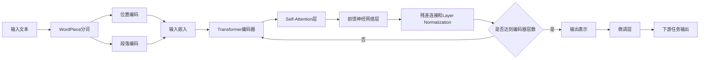

# 一切皆是映射：BERT模型原理及其在文本理解中的应用

## 1. 背景介绍

### 1.1 自然语言处理的发展历程
#### 1.1.1 早期的基于规则的方法
#### 1.1.2 基于统计机器学习的方法
#### 1.1.3 深度学习的崛起

### 1.2 Transformer模型的诞生
#### 1.2.1 Transformer的核心思想
#### 1.2.2 Self-Attention机制
#### 1.2.3 Transformer在NLP领域的影响

### 1.3 BERT模型的提出
#### 1.3.1 BERT的创新点
#### 1.3.2 预训练和微调范式
#### 1.3.3 BERT在NLP任务上的突破性表现

## 2. 核心概念与联系

### 2.1 自注意力机制（Self-Attention）
#### 2.1.1 注意力机制的基本原理
#### 2.1.2 Self-Attention的计算过程
#### 2.1.3 Multi-Head Attention

### 2.2 Transformer编码器结构
#### 2.2.1 Transformer编码器的组成
#### 2.2.2 残差连接和Layer Normalization
#### 2.2.3 前馈神经网络

### 2.3 BERT的输入表示
#### 2.3.1 WordPiece分词
#### 2.3.2 位置编码
#### 2.3.3 段落编码

### 2.4 预训练任务
#### 2.4.1 Masked Language Model（MLM）
#### 2.4.2 Next Sentence Prediction（NSP）
#### 2.4.3 预训练数据集

## 3. 核心算法原理具体操作步骤

### 3.1 BERT的训练过程
#### 3.1.1 预训练阶段
#### 3.1.2 微调阶段
#### 3.1.3 模型优化技巧

### 3.2 Masked Language Model（MLM）
#### 3.2.1 MLM的目标函数
#### 3.2.2 动态掩码
#### 3.2.3 MLM的实现细节

### 3.3 Next Sentence Prediction（NSP）  
#### 3.3.1 NSP的目标函数
#### 3.3.2 正负样本的构建
#### 3.3.3 NSP的实现细节

### 3.4 微调过程
#### 3.4.1 微调的基本原理
#### 3.4.2 不同下游任务的微调策略
#### 3.4.3 微调的超参数选择

## 4. 数学模型和公式详细讲解举例说明

### 4.1 Self-Attention的数学表示
#### 4.1.1 查询、键、值的计算
#### 4.1.2 注意力权重的计算
#### 4.1.3 注意力输出的计算

### 4.2 Multi-Head Attention的数学表示 
#### 4.2.1 多头注意力的并行计算
#### 4.2.2 多头注意力的拼接与线性变换
#### 4.2.3 残差连接和Layer Normalization

### 4.3 前馈神经网络的数学表示
#### 4.3.1 前馈层的计算
#### 4.3.2 激活函数的选择
#### 4.3.3 残差连接和Layer Normalization

### 4.4 损失函数的数学表示
#### 4.4.1 MLM的损失函数
#### 4.4.2 NSP的损失函数
#### 4.4.3 联合损失函数

## 5. 项目实践：代码实例和详细解释说明

### 5.1 BERT的PyTorch实现
#### 5.1.1 模型结构的定义
#### 5.1.2 数据加载与预处理
#### 5.1.3 模型训练与评估

### 5.2 基于BERT的文本分类任务
#### 5.2.1 数据集准备
#### 5.2.2 模型微调
#### 5.2.3 模型预测与评估

### 5.3 基于BERT的命名实体识别任务
#### 5.3.1 数据集准备
#### 5.3.2 模型微调
#### 5.3.3 模型预测与评估

### 5.4 基于BERT的问答任务
#### 5.4.1 数据集准备
#### 5.4.2 模型微调
#### 5.4.3 模型预测与评估

## 6. 实际应用场景

### 6.1 智能客服
#### 6.1.1 客户意图识别
#### 6.1.2 问题自动回复
#### 6.1.3 情感分析

### 6.2 舆情监测
#### 6.2.1 文本分类
#### 6.2.2 关键词提取
#### 6.2.3 事件追踪

### 6.3 个性化推荐
#### 6.3.1 用户画像构建
#### 6.3.2 物品描述理解
#### 6.3.3 推荐系统优化

### 6.4 智能搜索
#### 6.4.1 查询理解
#### 6.4.2 文档排序
#### 6.4.3 相关性反馈

## 7. 工具和资源推荐

### 7.1 BERT的开源实现
#### 7.1.1 Google BERT
#### 7.1.2 Hugging Face Transformers
#### 7.1.3 BERT-as-service

### 7.2 预训练模型资源
#### 7.2.1 BERT-Base与BERT-Large
#### 7.2.2 多语言BERT
#### 7.2.3 领域特定BERT

### 7.3 数据集资源
#### 7.3.1 GLUE基准测试
#### 7.3.2 SQuAD问答数据集
#### 7.3.3 自定义数据集构建

### 7.4 可视化与调试工具
#### 7.4.1 TensorBoard
#### 7.4.2 PyTorch Profiler
#### 7.4.3 BERT可视化工具

## 8. 总结：未来发展趋势与挑战

### 8.1 BERT的局限性
#### 8.1.1 计算资源要求高
#### 8.1.2 模型解释性不足
#### 8.1.3 鲁棒性与泛化能力

### 8.2 后BERT时代的发展方向
#### 8.2.1 模型压缩与加速
#### 8.2.2 知识增强与注入  
#### 8.2.3 无监督与自监督学习

### 8.3 多模态与跨领域应用
#### 8.3.1 图像-文本跨模态理解
#### 8.3.2 语音-文本跨模态理解
#### 8.3.3 领域自适应与迁移学习

### 8.4 可持续发展与绿色计算
#### 8.4.1 模型碳足迹评估
#### 8.4.2 节能高效的模型设计
#### 8.4.3 可持续的数据与计算资源利用

## 9. 附录：常见问题与解答

### 9.1 如何选择合适的BERT模型？
### 9.2 如何处理BERT的过拟合问题？
### 9.3 如何平衡模型性能与计算效率？
### 9.4 如何解释BERT模型的预测结果？
### 9.5 如何将BERT应用于特定领域？

BERT（Bidirectional Encoder Representations from Transformers）是一种基于Transformer架构的预训练语言模型，它通过自监督学习从大规模无标注文本数据中学习通用的语言表示。BERT的核心思想是利用自注意力机制（Self-Attention）捕捉文本中的长距离依赖关系，并通过双向上下文信息的融合生成更加丰富和有效的词嵌入表示。

BERT的训练过程分为两个阶段：预训练阶段和微调阶段。在预训练阶段，BERT使用两个任务：Masked Language Model（MLM）和Next Sentence Prediction（NSP）。MLM任务通过随机掩盖一定比例的词汇，然后让模型根据上下文预测被掩盖的词汇，这促使模型学习到词汇之间的关联关系。NSP任务则通过判断两个句子是否前后相邻，使模型学习到句子级别的语义连贯性。

预训练完成后，BERT可以应用于各种下游NLP任务，如文本分类、命名实体识别、问答系统等。在微调阶段，我们将预训练的BERT模型与任务特定的输出层相连，并使用标注数据对整个模型进行端到端的微调。通过这种迁移学习的方式，BERT能够在少量标注数据的情况下取得优异的性能。

BERT的核心组件是Transformer编码器，它由多个Self-Attention层和前馈神经网络层组成。Self-Attention机制允许模型的每个位置都能够与其他位置进行交互，从而捕捉到文本中的长距离依赖关系。具体而言，Self-Attention的计算过程如下：

1. 将输入表示映射为查询（Query）、键（Key）和值（Value）。
2. 计算查询与所有键之间的注意力权重，即查询与键的点积，然后除以 $\sqrt{d_k}$（$d_k$ 为键的维度），再经过Softmax函数得到归一化的注意力权重。
3. 将注意力权重与对应的值进行加权求和，得到注意力输出。

数学表示如下：

$$
\text{Attention}(Q, K, V) = \text{softmax}(\frac{QK^T}{\sqrt{d_k}})V
$$

其中，$Q$、$K$、$V$ 分别表示查询、键、值矩阵。

为了捕捉不同子空间的信息，BERT引入了Multi-Head Attention，即将查询、键、值通过线性变换投影到多个子空间，并在每个子空间独立地执行Self-Attention，最后将所有子空间的输出拼接起来并经过另一个线性变换得到最终的输出。

$$
\text{MultiHead}(Q, K, V) = \text{Concat}(\text{head}_1, ..., \text{head}_h)W^O \\
\text{head}_i = \text{Attention}(QW^Q_i, KW^K_i, VW^V_i)
$$

其中，$W^Q_i$、$W^K_i$、$W^V_i$ 和 $W^O$ 是可学习的线性变换矩阵。

除了Self-Attention层，Transformer编码器还包括前馈神经网络层，用于对Self-Attention的输出进行非线性变换。前馈层由两个线性变换和一个非线性激活函数（通常为ReLU）组成：

$$
\text{FFN}(x) = \max(0, xW_1 + b_1)W_2 + b_2
$$

其中，$W_1$、$b_1$、$W_2$ 和 $b_2$ 是可学习的参数。

为了促进模型的训练和泛化，BERT在每个子层（Self-Attention层和前馈神经网络层）之后应用残差连接（Residual Connection）和Layer Normalization。残差连接将子层的输入与输出相加，有助于梯度的传播和模型的收敛。Layer Normalization则对每个样本的特征维度进行归一化，使得模型对输入的尺度变化更加鲁棒。

在实践中，BERT已经在各种NLP任务上取得了State-of-the-art的性能，如GLUE基准测试、SQuAD问答任务等。研究人员和工程师可以使用Google提供的官方BERT实现或Hugging Face的Transformers库来快速搭建和微调BERT模型。此外，还有多种预训练的BERT模型可供选择，如BERT-Base、BERT-Large、多语言BERT等，可以根据任务的需求和计算资源的限制进行选择。

尽管BERT已经取得了巨大的成功，但它仍然存在一些局限性，如计算资源要求高、模型解释性不足等。未来的研究方向包括模型压缩与加速、知识增强与注入、无监督与自监督学习等。此外，将BERT拓展到多模态和跨领域应用也是一个充满机遇和挑战的方向。

总之，BERT作为一种强大的语言表示模型，已经在NLP领域掀起了一场革命。它不仅提升了各种任务的性能，也为语言理解与交互系统的构建提供了新的思路。相信通过研究者和工程师的不断探索和创新，BERT及其变体将继续