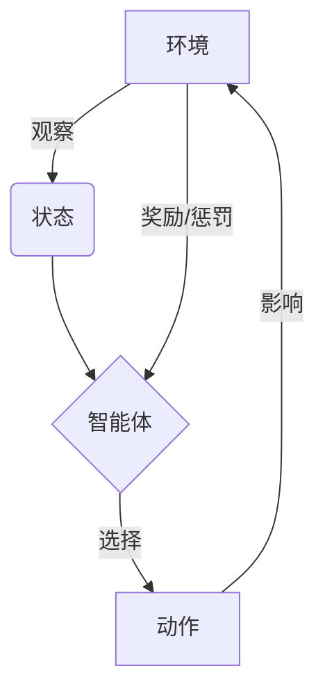

# 一切皆是映射：DQN在工业4.0中的角色与应用实践

## 1.背景介绍

### 1.1 工业4.0的兴起

工业4.0是继机械化、电气化和信息化之后的第四次工业革命浪潮。它融合了人工智能、大数据、物联网、云计算等新兴技术,旨在实现智能制造,提高生产效率和产品质量。在工业4.0时代,制造业正经历着前所未有的变革,传统的生产模式面临着巨大的挑战。

### 1.2 强化学习在工业4.0中的作用  

强化学习作为人工智能的一个重要分支,在工业4.0中扮演着越来越重要的角色。它能够通过与环境的交互,学习最优策略,从而解决复杂的决策和控制问题。Deep Q-Network(DQN)作为强化学习的一种重要算法,已经在工业4.0的多个领域取得了卓越的成绩。

## 2.核心概念与联系

### 2.1 强化学习概述

强化学习是一种基于奖励或惩罚的机器学习方法,旨在通过与环境的交互,学习一个最优策略。它包括四个核心要素:

- 环境(Environment)
- 状态(State)
- 动作(Action)
- 奖励(Reward)

智能体(Agent)通过观察当前状态,选择一个动作,并根据动作对环境产生的影响,获得相应的奖励或惩罚。通过不断尝试和学习,智能体最终能够找到一个最优策略,以最大化长期累积奖励。



### 2.2 DQN算法介绍

Deep Q-Network(DQN)是一种结合深度学习和Q-Learning的强化学习算法。它使用神经网络来估计Q值函数,从而解决了传统Q-Learning在处理高维状态空间时的困难。DQN算法的核心思想是使用一个深度神经网络来近似Q值函数,并通过经验回放和目标网络的方式来提高训练的稳定性和收敛性。

## 3.核心算法原理具体操作步骤

DQN算法的核心步骤如下:

1. 初始化经验回放池和神经网络参数
2. 对于每个时间步:
   a. 从当前状态$s_t$出发,使用$\epsilon$-贪婪策略选择一个动作$a_t$
   b. 执行动作$a_t$,观察到新的状态$s_{t+1}$和奖励$r_t$
   c. 将转移($s_t$, $a_t$, $r_t$, $s_{t+1}$)存储到经验回放池
   d. 从经验回放池中采样一个小批量数据
   e. 计算目标Q值:$y_j = \begin{cases}r_j & \text{for terminal } s_{j+1} \\ r_j + \gamma \max_{a'} Q(s_{j+1}, a'; \theta^-) & \text{for non-terminal } s_{j+1}\end{cases}$
   f. 使用均方误差损失函数优化网络参数$\theta$:$L = \mathbb{E}_{(s, a, r, s')\sim U(D)}[(y - Q(s, a; \theta))^2]$
   g. 每隔一定步数,将网络参数$\theta^-$更新为$\theta$
3. 重复步骤2,直到收敛

其中,$\epsilon$-贪婪策略用于在探索(exploration)和利用(exploitation)之间达成平衡,$\gamma$是折扣因子,用于权衡当前奖励和未来奖励的重要性。目标Q值$y_j$是根据贝尔曼方程计算的,它反映了在当前状态下采取特定动作所能获得的长期累积奖励。

## 4.数学模型和公式详细讲解举例说明

### 4.1 Q-Learning

Q-Learning是一种基于时间差分的强化学习算法,它旨在学习一个最优的Q值函数,该函数能够估计在给定状态下采取某个动作所能获得的长期累积奖励。Q值函数的更新规则如下:

$$Q(s_t, a_t) \leftarrow Q(s_t, a_t) + \alpha \left[ r_t + \gamma \max_{a} Q(s_{t+1}, a) - Q(s_t, a_t) \right]$$

其中,$\alpha$是学习率,$\gamma$是折扣因子,$r_t$是在时间步$t$获得的即时奖励,$\max_{a} Q(s_{t+1}, a)$是在下一个状态$s_{t+1}$下采取最优动作所能获得的最大Q值。

通过不断更新Q值函数,Q-Learning算法最终能够收敛到一个最优策略,该策略能够在任何给定状态下选择最优动作,从而最大化长期累积奖励。

### 4.2 DQN中的目标Q值计算

在DQN算法中,目标Q值的计算公式如下:

$$y_j = \begin{cases}r_j & \text{for terminal } s_{j+1} \\ r_j + \gamma \max_{a'} Q(s_{j+1}, a'; \theta^-) & \text{for non-terminal } s_{j+1}\end{cases}$$

其中,$y_j$是目标Q值,$r_j$是在时间步$j$获得的即时奖励,$\gamma$是折扣因子,$\max_{a'} Q(s_{j+1}, a'; \theta^-)$是在下一个状态$s_{j+1}$下采取最优动作所能获得的最大Q值,该值是由目标网络$\theta^-$计算得到的。

使用目标网络的主要原因是为了提高训练的稳定性和收敛性。由于Q值函数是由神经网络近似得到的,因此在训练过程中,Q值函数会不断发生变化。如果直接使用当前的Q值函数来计算目标Q值,会导致目标值不断变化,从而影响训练的稳定性。使用目标网络可以确保目标值在一段时间内保持不变,从而提高训练的稳定性和收敛性。

### 4.3 DQN损失函数

DQN算法使用均方误差损失函数来优化神经网络参数$\theta$:

$$L = \mathbb{E}_{(s, a, r, s')\sim U(D)}[(y - Q(s, a; \theta))^2]$$

其中,$y$是目标Q值,$Q(s, a; \theta)$是当前网络对于状态$s$和动作$a$预测的Q值,$(s, a, r, s')$是从经验回放池$D$中均匀采样得到的转移样本。

通过最小化损失函数,可以使得神经网络预测的Q值尽可能接近目标Q值,从而逐步改进Q值函数的估计精度。

## 5.项目实践:代码实例和详细解释说明

以下是一个使用PyTorch实现DQN算法的简单示例,用于解决经典的CartPole问题。

```python
import torch
import torch.nn as nn
import torch.optim as optim
import gym
import random
import collections

# 定义DQN网络
class DQN(nn.Module):
    def __init__(self, state_dim, action_dim):
        super(DQN, self).__init__()
        self.fc1 = nn.Linear(state_dim, 64)
        self.fc2 = nn.Linear(64, action_dim)

    def forward(self, x):
        x = torch.relu(self.fc1(x))
        return self.fc2(x)

# 定义经验回放池
class ReplayBuffer:
    def __init__(self, capacity):
        self.buffer = collections.deque(maxlen=capacity)

    def push(self, state, action, reward, next_state, done):
        self.buffer.append((state, action, reward, next_state, done))

    def sample(self, batch_size):
        transitions = random.sample(self.buffer, batch_size)
        batch = tuple(zip(*transitions))
        return batch

# 定义DQN Agent
class DQNAgent:
    def __init__(self, state_dim, action_dim, gamma=0.99, epsilon=1.0, epsilon_min=0.01, epsilon_decay=0.995, lr=0.001, batch_size=64, buffer_size=10000):
        self.state_dim = state_dim
        self.action_dim = action_dim
        self.gamma = gamma
        self.epsilon = epsilon
        self.epsilon_min = epsilon_min
        self.epsilon_decay = epsilon_decay
        self.lr = lr
        self.batch_size = batch_size
        self.buffer_size = buffer_size

        self.policy_net = DQN(state_dim, action_dim)
        self.target_net = DQN(state_dim, action_dim)
        self.target_net.load_state_dict(self.policy_net.state_dict())
        self.optimizer = optim.Adam(self.policy_net.parameters(), lr=self.lr)
        self.memory = ReplayBuffer(self.buffer_size)

    def select_action(self, state):
        if random.random() < self.epsilon:
            action = random.randrange(self.action_dim)
        else:
            with torch.no_grad():
                state = torch.tensor(state, dtype=torch.float32).unsqueeze(0)
                q_values = self.policy_net(state)
                action = torch.argmax(q_values).item()
        return action

    def update(self):
        if len(self.memory.buffer) < self.batch_size:
            return

        states, actions, rewards, next_states, dones = self.memory.sample(self.batch_size)

        states = torch.tensor(states, dtype=torch.float32)
        actions = torch.tensor(actions, dtype=torch.int64).unsqueeze(1)
        rewards = torch.tensor(rewards, dtype=torch.float32)
        next_states = torch.tensor(next_states, dtype=torch.float32)
        dones = torch.tensor(dones, dtype=torch.float32)

        q_values = self.policy_net(states).gather(1, actions)
        next_q_values = self.target_net(next_states).max(1)[0].detach()
        expected_q_values = rewards + self.gamma * next_q_values * (1 - dones)

        loss = nn.MSELoss()(q_values, expected_q_values.unsqueeze(1))
        self.optimizer.zero_grad()
        loss.backward()
        self.optimizer.step()

        if self.epsilon > self.epsilon_min:
            self.epsilon *= self.epsilon_decay

        if len(self.memory.buffer) >= self.batch_size:
            self.update_target_net()

    def update_target_net(self):
        self.target_net.load_state_dict(self.policy_net.state_dict())

# 训练DQN Agent
env = gym.make('CartPole-v1')
state_dim = env.observation_space.shape[0]
action_dim = env.action_space.n
agent = DQNAgent(state_dim, action_dim)

num_episodes = 1000
for episode in range(num_episodes):
    state = env.reset()
    done = False
    total_reward = 0

    while not done:
        action = agent.select_action(state)
        next_state, reward, done, _ = env.step(action)
        agent.memory.push(state, action, reward, next_state, done)
        agent.update()
        state = next_state
        total_reward += reward

    print(f'Episode {episode+1}, Total Reward: {total_reward}')

env.close()
```

在这个示例中,我们首先定义了DQN网络和经验回放池。然后,我们定义了DQNAgent类,它包含了DQN算法的核心逻辑,如选择动作、更新Q值函数和更新目标网络等。

在训练过程中,我们使用OpenAI Gym提供的CartPole环境进行训练。对于每个时间步,我们先使用$\epsilon$-贪婪策略选择一个动作,然后执行该动作,观察到新的状态和奖励,并将转移存储到经验回放池中。接着,我们从经验回放池中采样一个小批量数据,计算目标Q值,并使用均方误差损失函数优化网络参数。每隔一定步数,我们会将目标网络的参数更新为当前网络的参数。

通过不断地与环境交互、学习和更新网络参数,DQN Agent最终能够学习到一个最优策略,从而解决CartPole问题。

## 6.实际应用场景

DQN算法在工业4.0中有着广泛的应用前景,包括但不限于以下几个领域:

### 6.1 智能制造

在智能制造领域,DQN可以用于优化生产流程、调度资源和控制机器人等任务。例如,DQN可以学习最优的生产计划,以最大化产品质量和生产效率。同时,DQN也可以用于控制机器人执行复杂的装配任务,提高自动化水平。

### 6.2 预测性维护

在预测性维护领域,DQN可以通过分析设备的运行数据,学习设备故障的模式,从而预测设备何时可能出现故障,并提前采取维护措施。这有助于降低维护成本,减少意外停机时间,提高设备的可靠性和使用寿命。

### 6.3 供应链优化

在供应链管理领