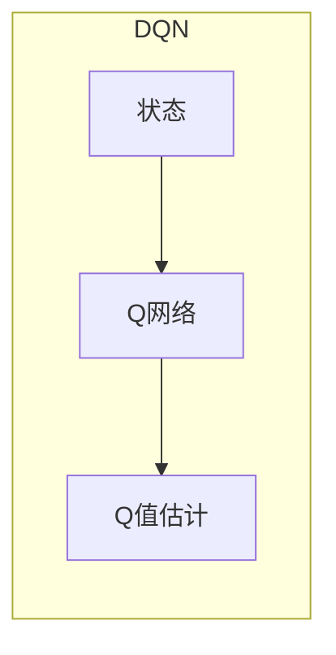
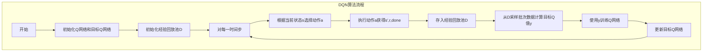

# 一切皆是映射：DQN在智慧城市中的应用场景与实践

## 1.背景介绍

### 1.1 智慧城市的兴起

随着城市化进程的不断加快,城市面临着日益严峻的挑战,如交通拥堵、环境污染、能源浪费等。为了应对这些挑战,智慧城市应运而生。智慧城市是一种新型城市发展模式,它利用物联网、云计算、大数据等新兴技术,实现城市运行的智能化管理和优化,从而提高城市运营效率、改善市民生活质量。

### 1.2 强化学习在智慧城市中的作用

在智慧城市的建设过程中,需要解决诸多复杂的决策与控制问题,如交通信号优化、能源调度等。这些问题往往具有动态、非线性等特点,难以用传统的规则或模型进行描述和求解。强化学习作为一种全新的机器学习范式,能够通过与环境的交互来学习最优策略,从而为解决这些复杂问题提供了有力工具。

### 1.3 DQN算法概述

深度强化学习算法Deep Q-Network(DQN)是将深度神经网络与Q学习相结合的创新性算法,它能够直接从高维观测数据中学习出优化策略,避免了传统强化学习算法在高维状态空间下遇到的"维数灾难"问题。DQN算法自2015年被提出以来,在多个领域取得了卓越的应用成果,如Atari视频游戏、机器人控制等。

## 2.核心概念与联系

### 2.1 马尔可夫决策过程(MDP)

马尔可夫决策过程是强化学习问题的数学模型,由一个五元组(S, A, P, R, γ)组成:

- S是状态空间集合
- A是动作空间集合  
- P是状态转移概率,P(s'|s,a)表示在状态s执行动作a后,转移到状态s'的概率
- R是即时奖励函数,R(s,a)表示在状态s执行动作a获得的即时奖励
- γ是折扣因子,用于权衡未来奖励的重要程度

强化学习的目标是找到一个策略π,使得期望的累计折扣回报最大化:

$$\max_\pi \mathbb{E}_\pi \left[\sum_{t=0}^\infty \gamma^t R(s_t, a_t)\right]$$

其中$s_t$和$a_t$分别是第t个时刻的状态和动作。

### 2.2 Q学习

Q学习是解决MDP问题的一种经典算法。它维护一个Q函数Q(s,a),用于估计在状态s执行动作a后,能获得的期望累计回报。Q函数满足以下贝尔曼方程:

$$Q(s,a) = \mathbb{E}_{s' \sim P}\left[R(s,a) + \gamma \max_{a'} Q(s',a')\right]$$

Q学习通过不断更新Q函数,使其收敛到最优Q函数Q*(s,a),从而得到最优策略π*(s) = argmax_a Q*(s,a)。

### 2.3 深度神经网络

深度神经网络是一种强大的函数逼近器,能够对复杂的非线性映射建模。将深度神经网络应用于Q学习中,就形成了DQN算法。具体来说,DQN使用一个深度卷积神经网络来拟合Q函数,其输入是当前状态,输出是所有动作对应的Q值。通过训练,神经网络可以自动从数据中学习出状态到Q值的映射,避免了手工设计特征的需求。



## 3.核心算法原理具体操作步骤

DQN算法的核心思想是使用一个深度神经网络来逼近Q函数,并通过经验回放和目标网络的方式来提高训练的稳定性和效果。具体步骤如下:

1. 初始化Q网络和目标Q网络,两个网络参数完全相同。
2. 初始化经验回放池D,用于存储过往的状态、动作、奖励等数据。
3. 对于每一个时间步:
    1) 根据当前状态s,使用ε-贪婪策略从Q网络中选择动作a。
    2) 执行动作a,获得下一状态s'、即时奖励r和是否终止的标志done。
    3) 将(s,a,r,s',done)存入经验回放池D。
    4) 从D中随机采样一个批次的数据,计算目标Q值y:
        - 若done=True,则y=r
        - 若done=False,则y=r+γ*max_a' Q'(s',a')
    5) 使用y作为标签,对Q网络进行训练,最小化损失函数:
        $$ \mathcal{L} = \mathbb{E}_{(s,a,y)\sim D}\left[(y - Q(s,a))^2\right] $$
    6) 每隔一定步数,将Q网络的参数复制到目标Q网络。



上述算法流程中,经验回放池和目标Q网络起到了非常关键的作用:

- 经验回放池打破了数据的相关性,使得训练更加稳定,并且可以更有效地利用数据。
- 目标Q网络的引入避免了Q值估计的非稳定性,提高了训练效果。

## 4.数学模型和公式详细讲解举例说明

为了更好地理解DQN算法,我们来具体分析其中涉及的数学模型和公式。

### 4.1 Q值迭代公式

在Q学习中,我们希望找到一个最优的Q函数Q*(s,a),使得对于任意的状态动作对(s,a),都有:

$$Q^*(s,a) = \mathbb{E}_{s' \sim P}\left[R(s,a) + \gamma \max_{a'} Q^*(s',a')\right]$$

这就是著名的Q值迭代公式,也称为贝尔曼最优方程。它建立了当前Q值与下一状态的最大Q值之间的递推关系。

在DQN算法中,我们使用一个深度神经网络Q(s,a;θ)来逼近真实的Q函数,其中θ是网络的参数。在训练过程中,我们希望通过不断调整θ,使得Q(s,a;θ)尽可能接近Q*(s,a)。

为此,我们定义了以下损失函数:

$$\mathcal{L}(\theta) = \mathbb{E}_{(s,a,r,s')\sim D}\left[\left(y - Q(s,a;\theta)\right)^2\right]$$

其中,y是目标Q值,对于非终止状态,有:

$$y = r + \gamma \max_{a'} Q(s',a';\theta^-)$$

θ^-表示目标Q网络的参数,这种分离目标Q值和Q值估计的做法,可以极大提高训练的稳定性。

通过最小化损失函数L(θ),我们可以使Q网络的输出Q(s,a;θ)逐渐逼近目标Q值y,从而达到逼近最优Q函数Q*(s,a)的目的。

### 4.2 ε-贪婪策略

在DQN算法中,我们需要根据当前Q网络的输出,选择一个动作a。最简单的做法是选择Q值最大的动作,即:

$$a = \arg\max_{a'} Q(s,a';\theta)$$

然而,这种做法存在一个问题:如果我们总是选择当前看起来最优的动作,就无法去探索新的状态,可能会陷入次优的策略中。

为了在探索(exploration)和利用(exploitation)之间达到平衡,我们采用了ε-贪婪(ε-greedy)策略:

- 以概率ε选择随机动作,用于探索
- 以概率1-ε选择当前最优动作,用于利用

具体来说,在每个时间步,我们首先生成一个0到1之间的随机数rand,若rand<ε,则随机选择一个动作,否则选择当前Q值最大的动作。

ε的值在训练的早期设置为较大值(如0.9),以促进充分探索,随着训练的进行,ε会逐渐减小(如0.1),以利用学到的经验。

### 4.3 举例说明

假设我们正在训练一个控制交通信号灯的DQN智能体。其状态s包括当前路口的车流量、相位周期等,动作a是改变信号灯的相位组合。

在某个时间步t,智能体观测到当前状态为s,根据ε-贪婪策略选择动作a。执行a后,交通状态变为s',同时获得即时奖励r(如路口通过车辆的数量)。这个(s,a,r,s')的转移过程被存入经验回放池D。

从D中采样出一个批次的数据,计算目标Q值y。对于非终止状态,有:

$$y = r + \gamma \max_{a'} Q(s',a';\theta^-)$$

其中,Q(s',a';θ^-)是目标Q网络在状态s'下,对所有可能动作a'的Q值的最大值。

接下来,使用y作为标签,对Q网络的参数θ进行梯度下降,最小化损失函数:

$$\mathcal{L}(\theta) = \mathbb{E}_{(s,a,y)\sim D}\left[\left(y - Q(s,a;\theta)\right)^2\right]$$

通过不断迭代这个过程,Q网络就能够逐渐学习到在不同交通状态下,选择最优信号相位组合的策略。

## 5.项目实践：代码实例和详细解释说明

为了更好地理解DQN算法,我们将使用PyTorch框架,实现一个简单的DQN智能体,用于控制经典的CartPole(车杆平衡)环境。

### 5.1 环境介绍

CartPole环境模拟了一个小车和一根杆的系统。智能体的目标是通过向左或向右推动小车,使杆保持垂直状态,并使小车在轨道上尽可能长时间地运动。

该环境的状态s是一个4维向量,包括小车的位置、速度,杆的角度和角速度。动作a是一个离散值,0表示向左推动小车,1表示向右推动。当杆偏离垂直超过某个角度,或小车移出了一定范围,episodio就会终止,同时获得一个较小的奖励。

我们将使用OpenAI Gym库来模拟该环境,并训练一个DQN智能体,让它学会如何平衡杆并尽可能长时间地运动。

### 5.2 代码实现

首先,我们导入所需的库:

```python
import gym
import math
import random
import numpy as np
import matplotlib.pyplot as plt

import torch
import torch.nn as nn
import torch.optim as optim
import torch.nn.functional as F

from collections import namedtuple, deque
```

定义一些超参数:

```python
BUFFER_SIZE = 100000    # 经验回放池大小
BATCH_SIZE = 64         # 小批量数据大小
GAMMA = 0.99            # 折扣因子
TAU = 1e-3              # 软更新目标网络的比例
LR = 5e-4               # 学习率
UPDATE_EVERY = 4        # 多少步更新一次网络
```

定义经验元组Transition,用于存储每个时间步的(s,a,r,s')转移:

```python
Transition = namedtuple('Transition', ('state', 'action', 'next_state', 'reward'))
```

实现经验回放池ReplayBuffer:

```python
class ReplayBuffer(object):
    def __init__(self, buffer_size):
        self.buffer = deque(maxlen=buffer_size)
    
    def push(self, *transition):
        self.buffer.append(Transition(*transition))
    
    def sample(self, batch_size):
        transitions = random.sample(self.buffer, batch_size)
        batch = Transition(*zip(*transitions))
        return batch
    
    def __len__(self):
        return len(self.