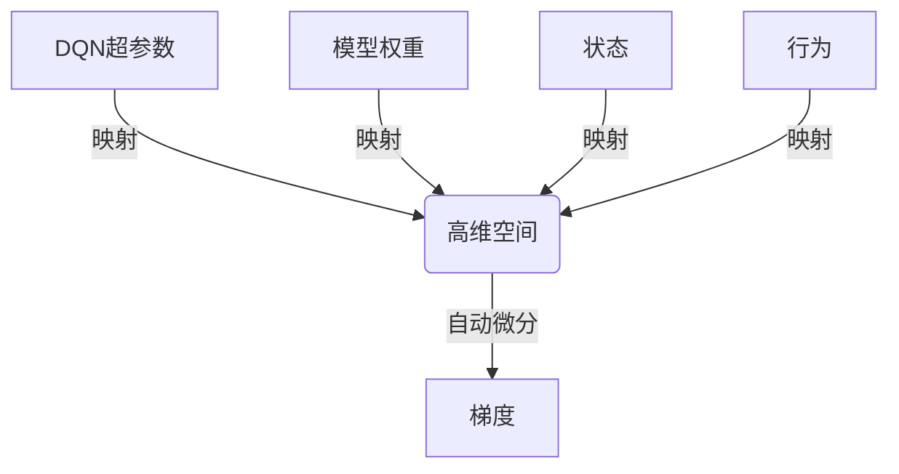
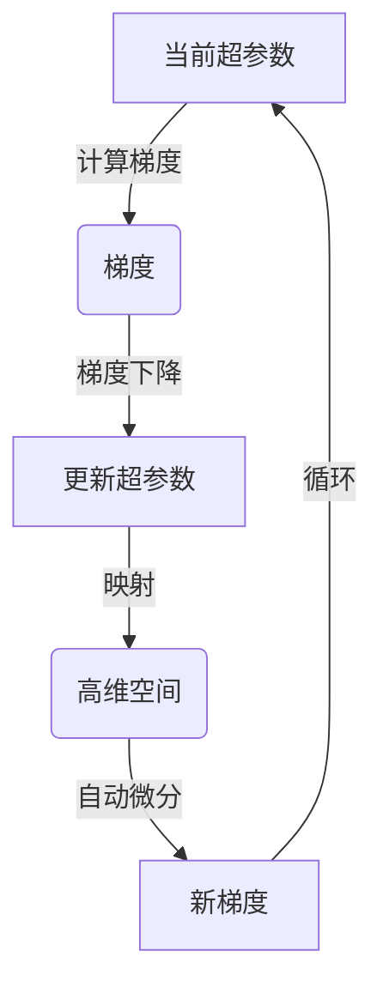
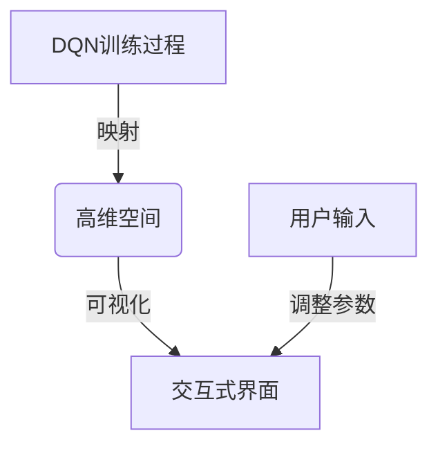

# 一切皆是映射：DQN的实时调参与性能可视化策略

## 1.背景介绍

### 1.1 强化学习与深度Q网络

强化学习(Reinforcement Learning)是机器学习的一个重要分支,它关注如何基于环境的反馈信号来学习执行一系列行为,以最大化预期的长期回报。深度Q网络(Deep Q-Network, DQN)是将深度神经网络应用于强化学习中的一种突破性方法,它能够直接从高维观测数据(如视频图像)中学习出一个有效的行为策略,而无需手动设计特征。

### 1.2 DQN在实践中的挑战

尽管DQN取得了巨大的成功,但在实际应用中,我们仍然面临着一些挑战:

1. **超参数调优**:DQN包含许多超参数,如学习率、折扣因子等,这些参数的选择对模型性能有着重大影响。然而,找到最优参数组合是一个耗时且具有挑战性的过程。

2. **性能监控**:训练DQN模型时,我们需要密切监控模型的训练过程,包括损失函数的变化、策略的收敛情况等,以确保模型能够正常训练并获得良好的性能。

3. **实时调整**:在模型训练和部署的过程中,我们可能需要根据实时性能反馈来动态调整模型参数,以获得更好的结果。然而,这种实时调整通常需要人工干预,效率低下且容易出错。

为了解决这些挑战,我们提出了一种新颖的实时调参与性能可视化策略,它能够自动化地优化DQN的超参数,同时实时监控和可视化模型的训练过程,从而提高DQN在实际应用中的性能和可解释性。

## 2.核心概念与联系

### 2.1 映射与自动微分

在我们的方法中,核心思想是将DQN的所有超参数、模型权重、状态和行为等映射到一个高维空间中,并利用自动微分技术来计算每个量相对于其他量的梯度。通过这种映射,我们可以将DQN的训练过程视为一个巨大的计算图,其中每个节点都代表一个量,边则表示这些量之间的依赖关系。

通过自动微分,我们可以高效地计算出任意两个量之间的梯度,从而实现对DQN的实时调参和性能监控。

### 2.2 实时调参

利用计算得到的梯度信息,我们可以根据预定的目标函数(如最大化累计奖励)来调整DQN的超参数,实现自动化的参数优化。具体来说,我们采用了一种基于梯度下降的优化算法,在每个时间步都根据当前的梯度信息来更新超参数的值,从而逐步逼近最优参数组合。

### 2.3 性能可视化

除了实时调参之外,我们的方法还能够实时监控和可视化DQN的训练过程。由于所有相关量都映射到了同一个高维空间中,我们可以方便地对它们进行可视化,从而直观地观察模型的训练状态。

例如,我们可以绘制损失函数的变化曲线、策略的收敛情况、奖励的累积分布等,帮助我们及时发现并诊断潜在的问题。同时,我们还提供了一种交互式的可视化界面,允许用户实时调整可视化参数,以获得更加直观和个性化的视角。

## 3.核心算法原理具体操作步骤

我们的实时调参与性能可视化策略主要包括以下几个核心步骤:

1. **建模与映射**:将DQN的所有相关量(超参数、权重、状态、行为等)映射到一个高维空间中,构建计算图。

2. **自动微分**:利用反向模式自动微分,高效计算任意两个量之间的梯度。

3. **实时调参**:根据预定的目标函数(如最大化累计奖励),采用基于梯度下降的优化算法实时调整DQN的超参数。

4. **性能监控**:实时监控DQN的训练过程,包括损失函数、策略收敛情况、奖励累积分布等,并进行可视化。

5. **交互式界面**:提供一种交互式的可视化界面,允许用户实时调整可视化参数,获得个性化的视角。

下面我们将详细介绍这些步骤的具体实现细节。

### 3.1 建模与映射

我们首先需要将DQN的所有相关量映射到一个高维空间中,以构建计算图。具体来说,我们定义了一个映射函数 $f$,它将DQN的超参数 $\theta$、权重 $w$、状态 $s$ 和行为 $a$ 映射到一个高维向量 $x$:

$$x = f(\theta, w, s, a)$$

在实现上,我们利用了PyTorch的动态计算图功能,将所有相关量都封装为PyTorch的张量(Tensor),并使用PyTorch的自动求导机制来计算梯度。

### 3.2 自动微分

有了映射函数 $f$ 之后,我们就可以利用自动微分技术来高效计算任意两个量之间的梯度。我们采用了反向模式自动微分,它可以通过一次前向传播和一次反向传播来计算所有相关梯度。

具体来说,我们定义了一个标量目标函数 $J$,它取决于映射向量 $x$:

$$J = g(x)$$

其中 $g$ 是一个可微函数,用于表示我们的优化目标(如最大化累计奖励)。

然后,我们可以使用PyTorch的 `backward` 函数来计算 $J$ 相对于任意量(如超参数 $\theta$)的梯度:

$$\frac{\partial J}{\partial \theta} = \frac{\partial J}{\partial x} \cdot \frac{\partial x}{\partial \theta}$$

由于 $x$ 是一个高维向量,PyTorch会自动使用链式法则来计算这个复合导数,从而高效地得到所需的梯度信息。

### 3.3 实时调参

利用计算得到的梯度信息,我们可以采用基于梯度下降的优化算法来实时调整DQN的超参数,以逐步逼近最优参数组合。

具体来说,我们定义了一个更新规则:

$$\theta_{t+1} = \theta_t - \alpha \cdot \frac{\partial J}{\partial \theta}$$

其中 $\alpha$ 是学习率,用于控制每次更新的步长。

在每个时间步 $t$,我们首先计算当前超参数 $\theta_t$ 下的目标函数梯度 $\frac{\partial J}{\partial \theta}$,然后根据上述更新规则得到新的超参数 $\theta_{t+1}$。通过不断迭代这个过程,我们就可以自动地优化超参数,使目标函数 $J$ 不断增大(或减小,取决于具体目标)。

需要注意的是,在实际实现中,我们还引入了一些技巧来提高优化效率和稳定性,如动态调整学习率、添加动量项等。

### 3.4 性能监控

除了实时调参之外,我们的方法还能够实时监控和可视化DQN的训练过程。由于所有相关量都映射到了同一个高维空间中,我们可以方便地对它们进行可视化,从而直观地观察模型的训练状态。

具体来说,我们定义了一系列可视化函数 $v_i$,它们分别对应不同的可视化目标,如损失函数的变化曲线、策略的收敛情况、奖励的累积分布等:

$$y_i = v_i(x)$$

其中 $y_i$ 是可视化结果,如一个曲线或者分布图。

我们利用PyTorch的可视化工具包(如Matplotlib)来渲染这些可视化结果,从而实时监控DQN的训练过程。同时,我们还提供了一种交互式的可视化界面,允许用户实时调整可视化参数(如坐标轴范围、颜色主题等),以获得更加直观和个性化的视角。

### 3.5 交互式界面

为了提高可用性和交互性,我们开发了一种基于Web的交互式可视化界面。这个界面允许用户实时查看DQN的训练过程,并动态调整可视化参数以获得最佳视角。

界面的主要组件包括:

1. **监控面板**:显示DQN的关键训练指标,如损失函数值、策略收敛程度、累计奖励等。

2. **可视化窗口**:以图表或动画的形式展示DQN的训练过程,如损失曲线、策略变化轨迹等。

3. **参数控制台**:允许用户调整可视化参数,如坐标轴范围、颜色主题、动画播放速度等。

4. **日志查看器**:记录并显示DQN训练过程中的详细日志信息,方便诊断和调试。

这个交互式界面是基于React、D3.js等前端技术构建的Web应用,它通过WebSocket与后端的PyTorch模型进行实时通信,实现了高效的数据传输和可视化渲染。

用户可以在本地或远程服务器上启动这个Web应用,并通过浏览器访问,从而实时监控和调整DQN的训练过程,获得更好的可解释性和可控性。

## 4.数学模型和公式详细讲解举例说明

在前面的章节中,我们介绍了实时调参与性能可视化策略的核心思想和算法步骤。现在,我们将进一步深入探讨其中涉及的一些数学模型和公式。

### 4.1 映射函数

我们首先定义了一个映射函数 $f$,它将DQN的超参数 $\theta$、权重 $w$、状态 $s$ 和行为 $a$ 映射到一个高维向量 $x$:

$$x = f(\theta, w, s, a)$$

这个映射函数的具体形式取决于DQN的结构和输入数据的形式。例如,对于一个具有卷积层和全连接层的DQN,映射函数可以写成:

$$x = \begin{bmatrix} 
\theta_\text{conv} \\
\theta_\text{fc} \\
w_\text{conv} \\
w_\text{fc} \\
s \\
a
\end{bmatrix}$$

其中 $\theta_\text{conv}$ 和 $\theta_\text{fc}$ 分别表示卷积层和全连接层的超参数(如学习率、正则化强度等), $w_\text{conv}$ 和 $w_\text{fc}$ 分别表示对应层的权重张量,而 $s$ 和 $a$ 则分别代表当前状态和行为。

通过这种映射,我们将DQN的所有相关量都封装到了一个高维向量中,为后续的自动微分和优化过程奠定了基础。

### 4.2 目标函数

在实时调参过程中,我们需要定义一个标量目标函数 $J$,它取决于映射向量 $x$:

$$J = g(x)$$

其中 $g$ 是一个可微函数,用于表示我们的优化目标。

对于DQN来说,一个常见的优化目标是最大化累计奖励(Cumulative Reward)。在这种情况下,目标函数 $J$ 可以写成:

$$J = \sum_{t=0}^{T} \gamma^t r_t$$

其中 $r_t$ 是在时间步 $t$ 获得的即时奖励,而 $\gamma \in [0, 1]$ 是折扣因子,用于平衡即时奖励和长期回报的权重。

当然,除了累计奖励之外,我们还可以定义其他形式的目标函数,如最小化损失函数、最大化探索率等,只要