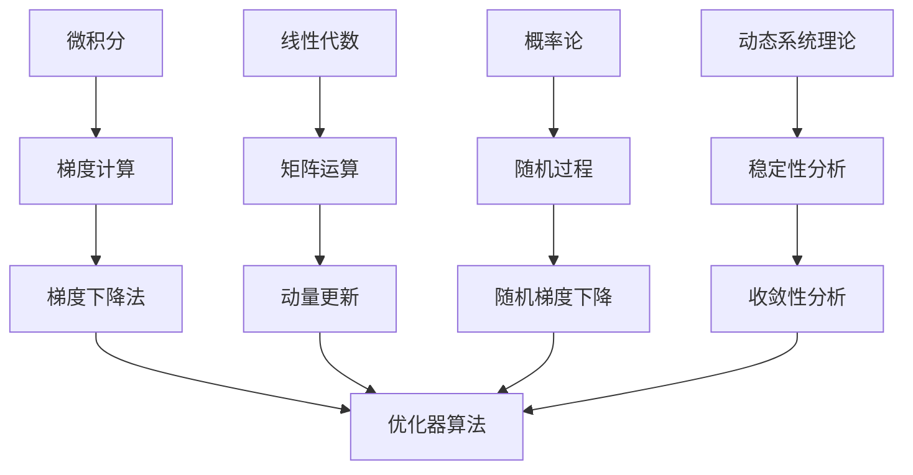

# 一切皆是映射：优化器算法及其在深度学习中的应用

## 1.背景介绍

在深度学习的世界里,优化器扮演着至关重要的角色。它们负责调整神经网络中的可训练参数,以最小化损失函数,从而提高模型的性能。然而,优化器的选择和配置往往是一个棘手的问题,因为不同的问题场景需要不同的优化策略。本文将深入探讨优化器算法的本质,揭示它们背后的数学原理,并剖析它们在深度学习中的应用。

### 1.1 优化问题的本质

在数学领域,优化问题通常被形式化为寻找一个目标函数的极值点。在深度学习中,这个目标函数就是损失函数,它衡量了模型预测与真实标签之间的差异。我们的目标是找到一组参数,使得损失函数达到最小值,从而获得最佳的模型性能。

### 1.2 梯度下降法

梯度下降法是解决优化问题的一种经典方法。它通过沿着目标函数梯度的反方向移动,逐步接近极值点。在深度学习中,我们利用反向传播算法计算损失函数相对于每个参数的梯度,然后根据梯度的方向和步长调整参数。

### 1.3 挑战与机遇

尽管梯度下降法简单有效,但它也面临着一些挑战,例如参数初始化、学习率设置、局部极小值陷阱等。为了应对这些挑战,研究人员提出了各种优化算法,如动量优化、自适应学习率优化等。这些算法通过引入新的思路和技巧,旨在加速收敛、提高鲁棒性和泛化能力。

## 2.核心概念与联系

优化器算法的核心概念涉及多个数学领域,包括微积分、线性代数、概率论和动态系统理论。这些概念相互关联,共同构建了优化器的理论基础。

### 2.1 微积分与梯度计算

微积分为优化器提供了计算梯度的理论基础。梯度是一个向量,它指向目标函数在当前点处的最大增长方向。通过计算梯度,我们可以确定应该如何调整参数以减小损失函数。

### 2.2 线性代数与矩阵运算

在深度学习中,我们通常会使用矩阵和向量来表示数据和参数。线性代数为优化器提供了高效的矩阵运算工具,例如矩阵乘法、矩阵求导等,这些运算在梯度计算和参数更新中扮演着重要角色。

### 2.3 概率论与随机过程

随机梯度下降(SGD)是深度学习中广泛使用的优化算法之一。它通过在每次迭代中随机选择一个小批量数据来估计梯度,从而提高了计算效率。概率论为SGD提供了理论支持,帮助我们分析其收敛性和鲁棒性。

### 2.4 动态系统理论与稳定性分析

优化过程可以被视为一个动态系统,其中参数的变化受到梯度更新规则的驱动。动态系统理论为我们提供了分析优化器收敛性和稳定性的工具,例如李雅普诺夫稳定性理论和吸引子理论。

## 3.核心算法原理具体操作步骤

在深入探讨具体的优化器算法之前,让我们先了解一下优化过程的一般步骤。

1. **初始化参数**:首先,我们需要为神经网络的可训练参数赋予初始值。通常使用一些特定的初始化策略,如Xavier初始化或He初始化,以避免梯度消失或梯度爆炸的问题。

2. **前向传播**:将输入数据传递给神经网络,计算输出预测值。

3. **计算损失函数**:将预测值与真实标签进行比较,计算损失函数的值。

4. **反向传播**:利用链式法则,计算损失函数相对于每个参数的梯度。

5. **参数更新**:根据优化器算法的规则,使用计算得到的梯度来更新参数。

6. **重复迭代**:重复执行步骤2到5,直到达到收敛条件或达到最大迭代次数。

接下来,我们将介绍几种流行的优化器算法,并深入探讨它们的工作原理。

### 3.1 随机梯度下降(SGD)

随机梯度下降是深度学习中最基本也是最常用的优化算法之一。它的核心思想是在每次迭代中,从训练数据中随机选择一个小批量样本,并基于这些样本估计梯度,然后根据估计的梯度更新参数。

SGD的参数更新规则如下:

$$\theta_{t+1} = \theta_t - \eta \cdot \nabla_\theta J(\theta_t; x^{(i)}, y^{(i)})$$

其中,$\theta_t$表示当前的参数值,$\eta$是学习率,$(x^{(i)}, y^{(i)})$是随机选择的小批量样本,$ \nabla_\theta J(\theta_t; x^{(i)}, y^{(i)})$是基于这些样本估计的梯度。

SGD的优点是简单高效,能够快速收敛。但它也存在一些缺陷,例如容易陷入局部极小值,对学习率的选择敏感,以及在高曲率区域收敛缓慢等。

### 3.2 动量优化(Momentum)

动量优化是对SGD的一种改进,它通过引入一个动量项来加速优化过程。动量项累积了过去几次迭代的梯度方向,从而使优化过程更加平滑,有助于跳出局部极小值,并加快在平缓区域的收敛速度。

动量优化的参数更新规则如下:

$$\begin{align}
v_t &= \gamma v_{t-1} + \eta \nabla_\theta J(\theta_t) \\
\theta_{t+1} &= \theta_t - v_t
\end{align}$$

其中,$v_t$是动量向量,$\gamma$是动量系数,控制了过去梯度对当前更新的影响程度。当$\gamma=0$时,动量优化就等价于标准的SGD。

通常,我们会选择一个较大的动量系数(如0.9),这样可以更好地利用过去的梯度信息,加速收敛。但是,过大的动量系数也可能导致优化过程越过最优解而无法收敛。

### 3.3 Adagrad

Adagrad是一种自适应学习率优化算法。它根据过去所有梯度的累积值动态调整每个参数的学习率,从而解决了SGD对学习率选择敏感的问题。

Adagrad的参数更新规则如下:

$$\begin{align}
g_t &= \nabla_\theta J(\theta_t) \\
G_t &= G_{t-1} + g_t^2 \\
\theta_{t+1} &= \theta_t - \frac{\eta}{\sqrt{G_t + \epsilon}} \odot g_t
\end{align}$$

其中,$g_t$是当前梯度,$G_t$是所有过去梯度的累积平方和,$\epsilon$是一个平滑项,用于避免除以零。符号$\odot$表示元素wise相乘。

Adagrad通过累积过去梯度的平方和来自适应地调整每个参数的学习率。对于那些梯度较大的参数,学习率会被降低,从而避免了参数的剧烈振荡;而对于那些梯度较小的参数,学习率会被提高,以加速收敛。

然而,Adagrad也存在一个缺陷,就是由于累积项$G_t$会无限增长,导致学习率过度衰减,最终停止学习。为了解决这个问题,后来提出了Adadelta和RMSprop等改进算法。

### 3.4 RMSprop

RMSprop是Adagrad的一种改进版本,它通过指数加权移动平均的方式来计算累积梯度,从而避免了Adagrad中学习率过度衰减的问题。

RMSprop的参数更新规则如下:

$$\begin{align}
g_t &= \nabla_\theta J(\theta_t) \\
E[g^2]_t &= \gamma E[g^2]_{t-1} + (1 - \gamma) g_t^2 \\
\theta_{t+1} &= \theta_t - \frac{\eta}{\sqrt{E[g^2]_t + \epsilon}} \odot g_t
\end{align}$$

其中,$E[g^2]_t$是过去梯度平方的指数加权移动平均值,$\gamma$是衰减系数,控制了过去梯度对当前估计的影响程度。

与Adagrad不同,RMSprop使用了一种指数加权的方式来计算累积梯度,这样可以避免累积项无限增长,从而保持了适当的学习率。通常,我们会选择一个较大的衰减系数(如0.9),以给予最近的梯度更大的权重。

### 3.5 Adam

Adam(Adaptive Moment Estimation)是一种结合了动量优化和RMSprop思想的自适应学习率优化算法。它同时利用了一阶矩估计(动量项)和二阶矩估计(RMSprop中的累积梯度平方和)来调整每个参数的学习率。

Adam的参数更新规则如下:

$$\begin{align}
g_t &= \nabla_\theta J(\theta_t) \\
m_t &= \beta_1 m_{t-1} + (1 - \beta_1) g_t \\
v_t &= \beta_2 v_{t-1} + (1 - \beta_2) g_t^2 \\
\hat{m}_t &= \frac{m_t}{1 - \beta_1^t} \\
\hat{v}_t &= \frac{v_t}{1 - \beta_2^t} \\
\theta_{t+1} &= \theta_t - \frac{\eta}{\sqrt{\hat{v}_t} + \epsilon} \odot \hat{m}_t
\end{align}$$

其中,$m_t$是一阶矩估计(动量项),$v_t$是二阶矩估计(累积梯度平方和),$\beta_1$和$\beta_2$分别是一阶矩和二阶矩的指数衰减系数,$\hat{m}_t$和$\hat{v}_t$是对应的偏差修正项。

Adam算法综合了动量优化和RMSprop的优点,能够更好地处理梯度的稀疏性和噪声,同时也具有较好的收敛性能。在实践中,Adam通常被认为是一种高效且鲁棒的优化算法,因此被广泛应用于各种深度学习任务中。

## 4.数学模型和公式详细讲解举例说明

在上一节中,我们介绍了几种流行的优化器算法,并给出了它们的参数更新规则。现在,让我们深入探讨这些算法背后的数学原理和理论基础。

### 4.1 梯度下降法的数学模型

梯度下降法是解决无约束优化问题的一种经典方法。假设我们要最小化一个可微函数$f(x)$,其中$x \in \mathbb{R}^n$是参数向量。梯度下降法的迭代过程可以表示为:

$$x_{t+1} = x_t - \eta \nabla f(x_t)$$

其中,$\eta$是学习率,控制了每次迭代的步长,$\nabla f(x_t)$是函数$f(x)$在点$x_t$处的梯度。

梯度下降法的基本思想是沿着梯度的反方向移动,以减小函数值。事实上,梯度指向函数在当前点处增长最快的方向,因此沿着梯度的反方向移动可以最快地减小函数值。

为了保证梯度下降法的收敛性,我们需要满足以下条件:

1. 目标函数$f(x)$是连续可微的。
2. 学习率$\eta$足够小,以确保每次迭代都能减小函数值。

在满足上述条件的情况下,梯度下降法可以保证收敛到局部极小值点。然而,由于存在局部极小值的问题,梯度下降法并不能保证找到全局最优