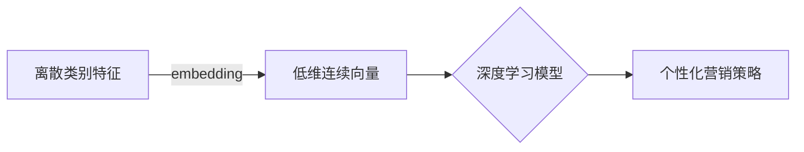
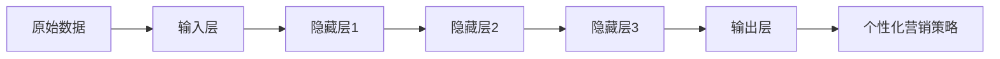
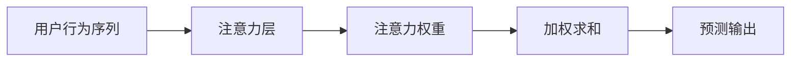
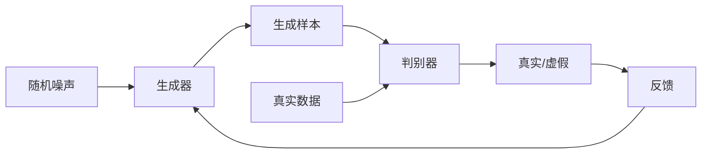
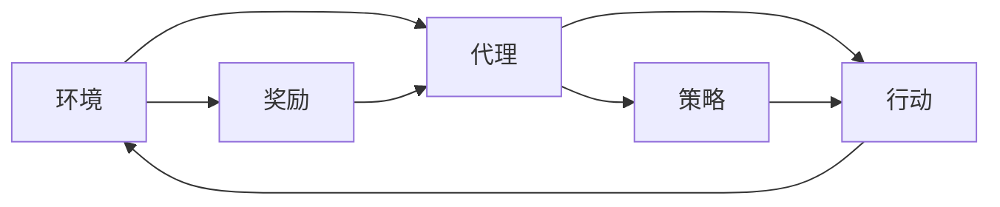
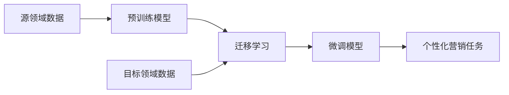

# 一切皆是映射：利用深度学习提升个性化营销策略

## 1. 背景介绍

### 1.1 个性化营销的重要性

在当今竞争激烈的商业环境中，个性化营销已经成为企业吸引和保留客户的关键策略。传统的大规模营销方式已经难以满足消费者日益增长的个性化需求。通过深入了解每位客户的独特偏好和行为模式,企业可以提供更加贴近个人需求的产品和服务,从而提高客户满意度、增强品牌忠诚度并实现可持续增长。

### 1.2 大数据时代的机遇与挑战

随着大数据时代的到来,企业可以获取海量的客户数据,包括人口统计数据、购买历史、浏览记录、社交媒体活动等。然而,如何从这些海量数据中提取有价值的信息并将其转化为个性化营销策略,成为企业面临的巨大挑战。传统的数据分析方法往往难以发现数据中的深层次模式和关联,从而无法充分利用数据的潜力。

### 1.3 深度学习在个性化营销中的应用

深度学习作为一种强大的机器学习技术,在图像识别、自然语言处理、推荐系统等领域展现出了卓越的性能。它具有自动提取高维特征、发现复杂模式的能力,使其成为解决个性化营销挑战的理想选择。通过将深度学习应用于客户数据分析,企业可以更精准地预测客户需求,优化营销策略,提高营销投资回报率。

## 2. 核心概念与联系

### 2.1 embedding 技术

在个性化营销中,embedding 技术扮演着至关重要的角色。embedding 是将离散的类别特征(如用户ID、商品ID等)映射到连续的低维向量空间的过程。这种映射不仅可以有效地捕捉特征之间的相似性,还能够将高维稀疏数据压缩为低维密集表示,从而提高模型的计算效率和泛化能力。

### 2.2 深度神经网络

深度神经网络是深度学习的核心技术,它由多层非线性变换单元组成,能够自动从原始数据中提取抽象特征。在个性化营销场景中,深度神经网络可以学习用户行为和偏好的复杂模式,从而实现精准的用户画像、商品推荐和广告定向等功能。

### 2.3 注意力机制

注意力机制是深度学习中的一种重要技术,它允许模型在处理序列数据时动态地分配注意力权重,从而更好地捕捉关键信息。在个性化营销中,注意力机制可以帮助模型关注用户行为序列中的重要时间点,从而更准确地预测用户的未来行为和偏好。

### 2.4 生成对抗网络

生成对抗网络(GAN)是一种新兴的深度学习架构,它由生成器和判别器两个对抗网络组成。在个性化营销中,GAN可以用于生成逼真的用户画像和内容,从而增强营销策略的多样性和创新性。例如,可以生成虚拟用户画像来测试营销策略的有效性,或者生成个性化的广告创意来吸引目标受众。

### 2.5 强化学习

强化学习是一种基于环境交互的学习范式,它通过试错和奖惩机制来优化决策策略。在个性化营销中,强化学习可以用于动态调整营销策略,根据用户的实时反馈不断优化营销决策,从而提高营销效果。例如,可以将用户对广告的点击和购买行为作为奖励信号,训练出一个个性化的广告投放策略。

### 2.6 迁移学习

迁移学习是一种利用已有知识来解决新问题的技术,它可以显著减少训练深度神经网络所需的数据量和计算资源。在个性化营销中,可以利用迁移学习将在其他领域(如计算机视觉、自然语言处理等)预训练的模型迁移到营销任务中,从而加速模型的训练和部署过程。

## 3. 核心算法原理具体操作步骤

在个性化营销中,深度学习算法通常需要经历以下几个关键步骤:

### 3.1 数据预处理

1. **数据收集**: 从多个来源(如网站、移动应用、社交媒体等)收集用户数据,包括人口统计信息、浏览记录、购买历史等。
2. **数据清洗**: 处理缺失值、异常值和重复数据,确保数据的完整性和一致性。
3. **特征工程**: 从原始数据中提取有意义的特征,如将时间戳转换为小时、星期等周期性特征。
4. **数据编码**: 将类别特征(如用户ID、商品ID等)转换为数值表示,以便输入到深度学习模型中。

### 3.2 模型构建

1. **选择模型架构**: 根据任务需求选择合适的深度学习模型架构,如前馈神经网络、卷积神经网络、递归神经网络等。
2. **embedding层**: 构建embedding层将离散特征映射到低维连续向量空间。
3. **隐藏层**: 添加多层隐藏层,每层由线性变换和非线性激活函数组成,用于自动提取高阶特征。
4. **注意力机制**: 根据需求添加注意力层,帮助模型关注输入序列中的关键信息。
5. **输出层**: 设计输出层,根据任务类型选择合适的激活函数和损失函数。

### 3.3 模型训练

1. **数据划分**: 将数据集划分为训练集、验证集和测试集。
2. **超参数选择**: 设置合理的超参数,如学习率、正则化系数、批量大小等。
3. **模型初始化**: 根据选择的初始化策略(如Xavier初始化、He初始化等)初始化模型参数。
4. **迭代训练**: 使用优化算法(如梯度下降、Adam等)迭代训练模型,并在验证集上监控模型性能。
5. **早停和模型保存**: 当模型在验证集上的性能不再提升时,停止训练并保存最佳模型。

### 3.4 模型评估和优化

1. **模型评估**: 在测试集上评估模型的性能,计算相关指标(如准确率、召回率、AUC等)。
2. **错误分析**: 分析模型的错误案例,识别模型的弱点和改进空间。
3. **模型优化**: 根据错误分析的结果,调整模型架构、超参数或训练策略,以提高模型性能。
4. **在线A/B测试**: 将优化后的模型部署到线上,通过A/B测试评估其在真实场景下的表现。

## 4. 数学模型和公式详细讲解举例说明

在个性化营销中,深度学习算法通常涉及以下几种核心数学模型和公式:

### 4.1 embedding 向量

embedding 向量是将离散特征映射到连续向量空间的关键技术。假设我们有一个离散特征 $x$,其取值范围为 $\{1, 2, \dots, N\}$,我们可以为每个离散值 $i$ 分配一个 $d$ 维的embedding向量 $\mathbf{v}_i \in \mathbb{R}^d$。这些embedding向量通常是模型需要学习的参数,可以通过反向传播算法进行优化。

在实际应用中,我们通常使用查找表(lookup table)或嵌入矩阵(embedding matrix)来存储和检索embedding向量。对于一个one-hot编码的输入 $\mathbf{x} \in \mathbb{R}^N$,其embedding向量可以表示为:

$$\mathrm{embedding}(\mathbf{x}) = \mathbf{W}_\mathrm{emb} \mathbf{x}$$

其中 $\mathbf{W}_\mathrm{emb} \in \mathbb{R}^{d \times N}$ 是embedding矩阵,其第 $i$ 列对应于第 $i$ 个离散值的embedding向量 $\mathbf{v}_i$。

### 4.2 前馈神经网络

前馈神经网络(Feed-Forward Neural Network, FFNN)是深度学习中最基本的网络架构之一。对于一个输入向量 $\mathbf{x} \in \mathbb{R}^{d_0}$,前馈神经网络将其传递through多个隐藏层,每个隐藏层执行以下变换:

$$\mathbf{h}^{(l)} = \sigma\left(\mathbf{W}^{(l)} \mathbf{h}^{(l-1)} + \mathbf{b}^{(l)}\right)$$

其中 $\mathbf{W}^{(l)} \in \mathbb{R}^{d_l \times d_{l-1}}$ 是第 $l$ 层的权重矩阵, $\mathbf{b}^{(l)} \in \mathbb{R}^{d_l}$ 是偏置向量,而 $\sigma(\cdot)$ 是非线性激活函数(如ReLU、sigmoid或tanh)。

对于分类任务,最后一层通常使用softmax激活函数输出预测概率:

$$\hat{\mathbf{y}} = \mathrm{softmax}\left(\mathbf{W}^{(L)} \mathbf{h}^{(L-1)} + \mathbf{b}^{(L)}\right)$$

其中 $\hat{\mathbf{y}} \in \mathbb{R}^K$ 是 $K$ 个类别的预测概率。模型的参数 $\{\mathbf{W}^{(l)}, \mathbf{b}^{(l)}\}$ 通常使用反向传播算法和梯度下降法进行优化,以最小化损失函数(如交叉熵损失)。

### 4.3 注意力机制

注意力机制是一种有效的序列建模技术,它允许模型动态地分配注意力权重,从而关注输入序列中的关键部分。对于一个长度为 $T$ 的输入序列 $\{\mathbf{x}_1, \mathbf{x}_2, \dots, \mathbf{x}_T\}$,注意力机制首先计算注意力分数:

$$e_t = \mathrm{score}(\mathbf{x}_t, \mathbf{h})$$

其中 $\mathbf{h}$ 是查询向量(query vector),而 $\mathrm{score}(\cdot)$ 是一个评分函数,如点积或多层感知机。然后,注意力分数被归一化为注意力权重:

$$\alpha_t = \frac{\exp(e_t)}{\sum_{i=1}^T \exp(e_i)}$$

最后,注意力权重用于计算加权和,作为序列的表示:

$$\mathbf{c} = \sum_{t=1}^T \alpha_t \mathbf{x}_t$$

注意力机制可以应用于各种序列建模任务,如机器翻译、文本摘要和推荐系统等。

### 4.4 生成对抗网络

生成对抗网络(Generative Adversarial Network, GAN)是一种用于生成式建模的深度学习架构。它由两个对抗网络组成:生成器(Generator) $G$ 和判别器(Discriminator) $D$。

生成器 $G$ 的目标是从