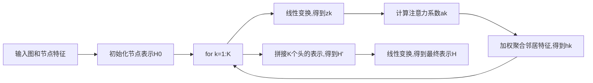

# 一切皆是映射：图神经网络(GNN)的兴起与展望

## 1. 背景介绍
### 1.1 图数据无处不在
在现实世界中,图无处不在。社交网络、交通网络、分子结构、知识图谱等,都可以用图来建模。图由节点(node)和边(edge)组成,节点表示实体,边表示实体之间的关系。与传统的表格数据和图像数据不同,图数据具有独特的非欧几何结构,蕴含着丰富的关联信息。

### 1.2 传统机器学习方法的局限
传统的机器学习方法如支持向量机(SVM)、随机森林等,主要针对表格数据,很难直接应用于图数据。虽然可以先提取图的统计特征再输入这些模型,但会损失图的拓扑结构信息。深度学习模型如卷积神经网络(CNN)和循环神经网络(RNN)在图像和序列数据上取得了巨大成功,但它们主要针对规则的欧式数据,无法有效处理图的非欧结构。

### 1.3 图神经网络的兴起
近年来,图神经网络(Graph Neural Network, GNN)作为一种专门处理图数据的深度学习模型,受到学术界和工业界的广泛关注。GNN通过对图的节点及其邻居进行递归的特征聚合和转换,学习节点的低维向量表示,从而可以应用于节点分类、链路预测、图分类等任务。GNN在社交网络分析、推荐系统、计算化学、知识图谱等领域取得了state-of-the-art的效果。

## 2. 核心概念与联系
### 2.1 图的数学定义
图$G=(V,E)$由节点集合$V$和边集合$E$组成。无向图的边是节点的无序对$(v_i,v_j)$,有向图的边是有序对。边还可以带有权重,称为加权图。图可以表示为邻接矩阵$A$,$A_{ij}=1$表示节点$i$和$j$之间有边相连,$A_{ij}=0$表示不相连。

### 2.2 GNN的核心思想
GNN的核心思想是通过迭代地聚合节点自身特征$x_v$和邻居特征$\{x_u, u\in N(v)\}$来更新节点表示$h_v$:

$$h_v^{(k)} = f(x_v, \{x_u, u\in N(v)\}, h_v^{(k-1)}, \{h_u^{(k-1)}, u\in N(v)\})$$

其中$f$是非线性转换函数,比如MLP。这个过程可以迭代K轮,得到节点的最终表示。

### 2.3 GNN的分类
根据聚合邻居信息的方式,GNN可以分为以下几类:
- 卷积型GNN:类似CNN,定义了图卷积操作,比如GraphSage、GCN等
- 门控型GNN:类似RNN,使用门控机制聚合信息,比如GRU、GAT等 
- 图注意力网络:使用attention机制自适应地聚合邻居信息,比如GAT
- 图自编码器:无监督学习节点表示,重构图的邻接矩阵,比如GAE、VGAE等

### 2.4 GNN与其他方法的联系
- GNN与CNN:卷积型GNN可以看作将CNN推广到非欧数据,定义了图卷积操作
- GNN与RNN:门控型GNN使用了类似RNN的门控机制
- GNN与Transformer:图注意力网络使用了类似Transformer的注意力机制
- GNN与网络嵌入(DeepWalk等):都学习节点的低维向量表示,但GNN是端到端、归纳式的表示学习

## 3. 核心算法原理具体操作步骤
以下详细介绍几种经典的GNN模型算法。

### 3.1 图卷积网络(GCN)
GCN是最简单的卷积型GNN,只考虑一阶邻居。定义图卷积为:

$$H^{(k)} = \sigma(\tilde{D}^{-\frac{1}{2}}\tilde{A}\tilde{D}^{-\frac{1}{2}}H^{(k-1)}W^{(k)})$$

其中$\tilde{A}=A+I$是加入自环的邻接矩阵,$\tilde{D}$是$\tilde{A}$的度矩阵,$H^{(k)}$是k层的节点表示矩阵,$W^{(k)}$是k层的权重矩阵。

算法步骤:
1. 计算归一化的邻接矩阵 $\tilde{D}^{-\frac{1}{2}}\tilde{A}\tilde{D}^{-\frac{1}{2}}$
2. 将上一层节点表示$H^{(k-1)}$左乘归一化邻接矩阵
3. 将结果乘以权重矩阵$W^{(k)}$并过激活函数,得到新一层节点表示$H^{(k)}$
4. 重复2-3直到达到指定层数

### 3.2 图注意力网络(GAT)
GAT使用注意力机制为邻居分配不同的权重。定义图注意力层为:

$$h_i^{(k)} = \sigma(\sum_{j\in N(i)}\alpha_{ij}W^{(k)}h_j^{(k-1)})$$
$$\alpha_{ij} = \frac{\exp(LeakyReLU(a^T[Wh_i||Wh_j]))}{\sum_{k\in N(i)}\exp(LeakyReLU(a^T[Wh_i||Wh_k]))}$$

其中$\alpha_{ij}$是节点$i$分配给邻居$j$的注意力权重,$\cdot^T$是转置,$||$是拼接,$a$是注意力机制的参数向量。

算法步骤:
1. 将节点表示$h_i^{(k-1)}$通过权重矩阵$W$进行线性变换
2. 计算节点$i$与邻居$j$的注意力系数$\alpha_{ij}$ 
3. 将邻居节点表示$h_j^{(k-1)}$乘以对应权重$\alpha_{ij}$,相加并激活得到新表示$h_i^{(k)}$
4. 重复1-3直到达到指定层数

### 3.3 GraphSAGE
GraphSAGE是一种用于归纳式学习的GNN,可以在动态图上生成新节点的embedding。GraphSAGE定义了三种聚合函数:

$$h_{\mathcal{N}(v)}^k \leftarrow AGG_{k}(\{h_{u}^{k-1}, \forall u \in \mathcal{N}(v)\})$$
$$h_v^k \leftarrow \sigma(W^k\cdot CONCAT(h_v^{k-1}, h_{\mathcal{N}(v)}^k))$$

其中$AGG_k$可以是mean、pooling或LSTM聚合函数。

算法步骤:
1. 采样节点的邻居形成$k$跳邻居集合$\mathcal{N}(v)$
2. 用聚合函数$AGG_k$聚合邻居节点的上一层表示$h_{u}^{k-1}$
3. 将节点自身表示$h_v^{k-1}$与聚合的邻居表示$h_{\mathcal{N}(v)}^k$拼接
4. 过一个全连接层和激活函数得到新一层节点表示$h_v^k$
5. 重复2-4直到达到指定层数

## 4. 数学模型和公式详细讲解举例说明
下面以图注意力网络GAT为例,详细推导其前向传播公式。

### 4.1 输入与初始化
输入图$G=(V,E)$,节点特征矩阵$X\in R^{N\times F}$,隐藏层维度$F'$,注意力头数$K$。令$H^{(0)}=X$。

### 4.2 线性变换
对节点表示进行线性变换,得到$K$组特征矩阵:

$$\mathbf{z}_i^{(k)} = \mathbf{W}^{(k)} \mathbf{h}_i, \forall i\in V$$

其中$\mathbf{W}^{(k)}\in R^{F'\times F}$是第$k$个注意力头的参数矩阵。

### 4.3 计算注意力系数
对于节点$i$,计算其与邻居$j$在第$k$个注意力头的注意力系数:

$$e_{ij}^{(k)} = a^T[z_i^{(k)}||z_j^{(k)}]$$
$$\alpha_{ij}^{(k)} = softmax_j(e_{ij}^{(k)}) = \frac{\exp(LeakyReLU(e_{ij}^{(k)}))}{\sum_{l\in N(i)}\exp(LeakyReLU(e_{il}^{(k)}))}$$

其中$a\in R^{2F'}$是注意力机制的参数向量。

### 4.4 聚合邻居信息
利用注意力系数对邻居节点的特征进行加权求和:

$$\mathbf{h}_i^{(k)} = \sigma(\sum_{j\in N(i)} \alpha_{ij}^{(k)} \mathbf{z}_j^{(k)})$$

其中$\sigma$是激活函数,如ReLU。

### 4.5 多头注意力
将$K$个注意力头得到的节点表示拼接起来:

$$\mathbf{h}_i^{'} = ||_{k=1}^K \mathbf{h}_i^{(k)}$$

然后通过一个线性变换得到最终的节点表示:

$$\mathbf{h}_i = \mathbf{W}^{'} \mathbf{h}_i^{'}$$

其中$\mathbf{W}^{'}\in R^{F\times KF'}$。

### 4.6 前向传播算法流程



## 5. 项目实践：代码实例和详细解释说明
下面用PyTorch Geometric(PyG)库实现一个简单的GAT模型,并应用于Cora引文网络数据集的节点分类任务。

### 5.1 导入库和数据集

```python
import torch
import torch.nn as nn
import torch.nn.functional as F
from torch_geometric.datasets import Planetoid
from torch_geometric.nn import GATConv

dataset = Planetoid(root='/tmp/Cora', name='Cora')
```

### 5.2 定义GAT模型类

```python
class GAT(nn.Module):
    def __init__(self, in_dim, hidden_dim, out_dim, heads):
        super(GAT, self).__init__()
        self.conv1 = GATConv(in_dim, hidden_dim, heads=heads)
        self.conv2 = GATConv(hidden_dim*heads, out_dim, heads=1)

    def forward(self, data):
        x, edge_index = data.x, data.edge_index
        x = self.conv1(x, edge_index) 
        x = F.relu(x)
        x = F.dropout(x, training=self.training)
        x = self.conv2(x, edge_index)
        return F.log_softmax(x, dim=1)
```

模型包含两层GATConv图注意力层,第一层有多头注意力,第二层将多头concat后输出。

### 5.3 实例化模型和优化器

```python
device = torch.device('cuda' if torch.cuda.is_available() else 'cpu')
model = GAT(dataset.num_node_features, 8, dataset.num_classes, heads=8).to(device)
data = dataset[0].to(device)
optimizer = torch.optim.Adam(model.parameters(), lr=0.005, weight_decay=5e-4)
```

### 5.4 定义训练和测试函数

```python
def train():
    model.train()
    optimizer.zero_grad()
    out = model(data)
    loss = F.nll_loss(out[data.train_mask], data.y[data.train_mask])
    loss.backward()
    optimizer.step()
    return loss.item()
    
@torch.no_grad()
def test():
    model.eval()
    out = model(data)
    pred = out.argmax(dim=1)
    accs = []
    for mask in [data.train_mask, data.val_mask, data.test_mask]:
        correct = pred[mask] == data.y[mask]
        accs.append(int(correct.sum()) / int(mask.sum()))
    return accs
```

### 5.5 训练模型并评估

```python
for epoch in range(1, 201):
    loss = train()
    train_acc, val_acc, test_acc = test()
    print(f'Epoch: {epoch:03d}, Loss: {loss:.4f}, Train: {train_acc:.4f}, '
          f'Val: {val_acc:.4f}, Test: {test_acc:.4