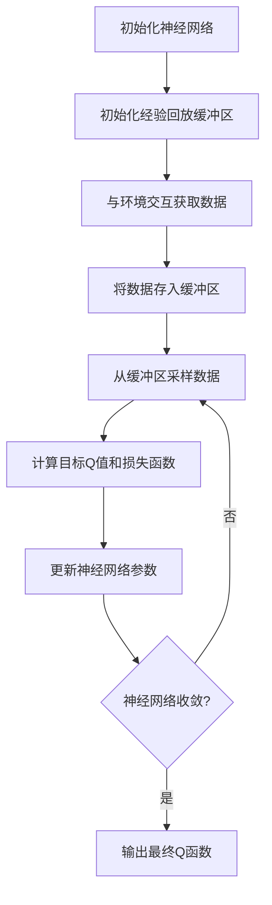

# 一切皆是映射：如何通过软件工程方法来维护和优化DQN代码

## 1. 背景介绍

### 1.1 强化学习与深度Q网络

强化学习(Reinforcement Learning)是机器学习的一个重要分支,它关注智能体与环境的交互过程,通过不断试错并获得反馈来学习如何采取最优策略。在强化学习中,智能体的目标是最大化长期累积的奖励。深度Q网络(Deep Q-Network, DQN)是一种结合深度学习和Q学习的强化学习算法,它使用神经网络来近似Q函数,从而能够处理高维状态空间和连续动作空间。

DQN算法在2013年由DeepMind公司提出,并在2015年在Nature杂志上发表,展示了在Atari游戏中超越人类水平的表现。这一突破性成果推动了深度强化学习在各个领域的广泛应用,包括机器人控制、自动驾驶、对话系统等。

### 1.2 软件工程在人工智能系统中的重要性

尽管人工智能算法的性能不断提高,但将这些算法应用于实际系统并非一蹴而就。人工智能系统往往涉及大量的代码、复杂的数据流程和多个组件之间的交互。如果缺乏适当的软件工程实践,这些系统很容易变得难以维护、扩展和调试。

软件工程方法为构建高质量、可靠和可维护的软件系统提供了指导原则和最佳实践。通过采用适当的软件工程方法,我们可以提高人工智能系统的可读性、可测试性、可扩展性和可维护性。这不仅有助于加速开发过程,还能确保系统在生产环境中的稳定性和可靠性。

## 2. 核心概念与联系

### 2.1 DQN算法概述

DQN算法的核心思想是使用深度神经网络来近似Q函数,即状态-动作值函数。Q函数定义为在给定状态下采取某个动作后可获得的期望累积奖励。通过学习Q函数,智能体可以选择在当前状态下具有最大期望累积奖励的动作。

DQN算法的主要步骤如下:

1. 初始化一个深度神经网络,用于近似Q函数。
2. 使用经验回放(Experience Replay)机制存储智能体与环境的交互数据。
3. 从经验回放缓冲区中随机采样一批数据,作为神经网络的训练数据。
4. 使用采样数据计算目标Q值,并将其与神经网络输出的Q值进行比较,计算损失函数。
5. 使用优化算法(如随机梯度下降)更新神经网络的参数,最小化损失函数。
6. 重复步骤3-5,直到神经网络收敛。

### 2.2 软件工程与DQN算法的关系

软件工程方法可以在多个层面上帮助我们构建高质量的DQN系统:

1. **模块化设计**: 将DQN算法的不同组件(如神经网络、经验回放缓冲区、环境交互等)设计为独立的模块,有助于提高代码的可读性和可维护性。
2. **版本控制**: 使用版本控制系统(如Git)来管理代码的变更历史,便于协作和回溯。
3. **测试驱动开发(TDD)**: 编写单元测试和集成测试,确保代码的正确性和稳定性。
4. **持续集成(CI)**: 自动化构建、测试和部署过程,加快开发周期并提高质量保证。
5. **代码质量管理**: 通过静态代码分析和代码审查,发现潜在的错误和代码质量问题。
6. **文档化**: 编写清晰的文档,记录系统的设计、实现和使用方法,方便团队协作和知识传递。
7. **性能优化**: 采用性能分析和优化技术,提高DQN算法的运行效率。
8. **可扩展性**: 设计可扩展的架构,以便在未来添加新功能或集成其他组件。

通过将软件工程实践与DQN算法相结合,我们可以构建更加健壮、可维护和高效的人工智能系统。

## 3. 核心算法原理具体操作步骤

### 3.1 DQN算法流程图



上图展示了DQN算法的核心流程。我们将逐步介绍每个步骤的具体实现细节。

### 3.2 初始化神经网络

DQN算法使用深度神经网络来近似Q函数。神经网络的输入是当前状态,输出是每个可能动作对应的Q值。我们可以使用PyTorch或TensorFlow等深度学习框架来定义和初始化神经网络。

```python
import torch.nn as nn

class DQN(nn.Module):
    def __init__(self, state_dim, action_dim):
        super(DQN, self).__init__()
        self.fc1 = nn.Linear(state_dim, 128)
        self.fc2 = nn.Linear(128, 64)
        self.fc3 = nn.Linear(64, action_dim)

    def forward(self, x):
        x = torch.relu(self.fc1(x))
        x = torch.relu(self.fc2(x))
        x = self.fc3(x)
        return x
```

上面的代码定义了一个简单的全连接神经网络,包含两个隐藏层。`state_dim`和`action_dim`分别表示状态空间和动作空间的维度。在实际应用中,我们可以根据具体问题设计更加复杂的网络结构。

### 3.3 初始化经验回放缓冲区

经验回放(Experience Replay)是DQN算法的一个关键组件。它用于存储智能体与环境的交互数据,包括状态、动作、奖励和下一个状态。通过从缓冲区中随机采样数据进行训练,可以破坏数据之间的相关性,提高训练的稳定性和效率。

```python
import random
from collections import deque

class ReplayBuffer:
    def __init__(self, buffer_size):
        self.buffer = deque(maxlen=buffer_size)

    def store(self, state, action, reward, next_state, done):
        self.buffer.append((state, action, reward, next_state, done))

    def sample(self, batch_size):
        samples = random.sample(self.buffer, batch_size)
        states, actions, rewards, next_states, dones = zip(*samples)
        return states, actions, rewards, next_states, dones
```

上面的代码定义了一个简单的经验回放缓冲区。`store`方法用于将交互数据存入缓冲区,`sample`方法用于从缓冲区中随机采样一批数据。在实际应用中,我们可以添加优先级经验回放等高级技术来进一步提高训练效率。

### 3.4 与环境交互获取数据

智能体与环境的交互是强化学习算法的核心。在每个时间步,智能体会根据当前状态选择一个动作,并将动作执行在环境中。环境会根据这个动作转移到下一个状态,并返回一个奖励信号。智能体的目标是最大化长期累积的奖励。

```python
import gym

env = gym.make('CartPole-v1')

def interact(policy, buffer, episode_count=1000):
    for episode in range(episode_count):
        state = env.reset()
        done = False
        while not done:
            action = policy(state)
            next_state, reward, done, _ = env.step(action)
            buffer.store(state, action, reward, next_state, done)
            state = next_state
```

上面的代码使用OpenAI Gym库与一个经典的控制环境"CartPole"进行交互。`interact`函数执行多个episode,在每个时间步根据当前策略选择动作,并将交互数据存入经验回放缓冲区。在实际应用中,我们可以使用更复杂的环境,如Atari游戏或机器人模拟器。

### 3.5 从缓冲区采样数据

在每个训练迭代中,我们需要从经验回放缓冲区中采样一批数据,作为神经网络的训练数据。采样过程是随机的,以破坏数据之间的相关性。

```python
batch_size = 32
states, actions, rewards, next_states, dones = buffer.sample(batch_size)
```

上面的代码从缓冲区中随机采样一批数据,包括状态、动作、奖励、下一个状态和是否结束标志。这些数据将用于计算目标Q值和更新神经网络参数。

### 3.6 计算目标Q值和损失函数

在DQN算法中,我们使用贝尔曼方程来计算目标Q值。目标Q值是基于当前Q函数估计和实际获得的奖励计算出来的期望累积奖励。

$$
Q_{target}(s_t, a_t) = r_t + \gamma \max_{a'} Q(s_{t+1}, a')
$$

其中,$Q_{target}$是目标Q值,$r_t$是当前时间步获得的奖励,$\gamma$是折现因子,$\max_{a'} Q(s_{t+1}, a')$是基于当前Q函数估计的下一个状态的最大Q值。

我们可以使用PyTorch或TensorFlow等深度学习框架来计算目标Q值和损失函数。

```python
import torch

def compute_loss(model, states, actions, rewards, next_states, dones):
    curr_q = model(states).gather(1, actions.unsqueeze(1)).squeeze(1)
    next_q = model(next_states).max(1)[0]
    next_q[dones] = 0.0
    target_q = rewards + gamma * next_q
    loss = F.mse_loss(curr_q, target_q)
    return loss
```

上面的代码计算了当前Q值`curr_q`和目标Q值`target_q`之间的均方误差作为损失函数。`gather`和`squeeze`操作用于从神经网络输出中选取对应动作的Q值。`max`操作用于获取下一个状态的最大Q值。当episode结束时,下一个状态的Q值设置为0。

### 3.7 更新神经网络参数

在计算出损失函数后,我们需要使用优化算法来更新神经网络的参数,最小化损失函数。常用的优化算法包括随机梯度下降(SGD)、Adam等。

```python
import torch.optim as optim

optimizer = optim.Adam(model.parameters(), lr=0.001)

def update_model(model, optimizer, loss):
    optimizer.zero_grad()
    loss.backward()
    optimizer.step()
```

上面的代码使用Adam优化算法来更新神经网络参数。`zero_grad`用于清除上一次迭代的梯度,`backward`用于计算梯度,`step`用于根据梯度更新参数。

### 3.8 算法收敛条件

在训练过程中,我们需要监控神经网络的收敛情况。当损失函数或评估指标满足预定义的条件时,我们可以认为神经网络已经收敛,并输出最终的Q函数。

```python
def train(model, buffer, num_episodes=1000, max_steps=1000, epsilon=0.1):
    for episode in range(num_episodes):
        state = env.reset()
        done = False
        step = 0
        while not done and step < max_steps:
            # 与环境交互获取数据
            # ...

            # 从缓冲区采样数据
            states, actions, rewards, next_states, dones = buffer.sample(batch_size)

            # 计算损失函数
            loss = compute_loss(model, states, actions, rewards, next_states, dones)

            # 更新神经网络参数
            update_model(model, optimizer, loss)

            step += 1

        # 评估当前模型性能
        # ...

        # 检查收敛条件
        if converged:
            break

    return model
```

上面的代码展示了DQN算法的完整训练过程。在每个episode中,我们与环境交互获取数据,从缓冲区采样数据,计算损失函数并更新神经网络参数。在每个episode结束时,我们可以评估当前模型的性能,并检查是否满足收敛条件。如果满足,则输出最终的Q函数模型。

## 4. 数学模型和公式详细讲解举例说明

### 4.1 Q函数和贝尔曼方程

Q函数是强化学习中的一个核心概念,它定义为在给定状态下采取某个动作后可获得的期望累积奖励。数学上,Q函数可以表示为: