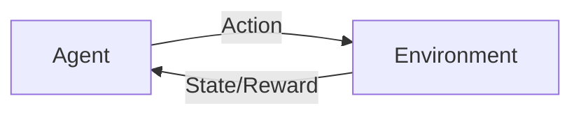

# 一切皆是映射：强化学习在工业自动化中的应用：挑战与机遇

## 1.背景介绍
### 1.1 工业自动化的发展历程
### 1.2 强化学习的起源与发展
### 1.3 强化学习在工业自动化中的应用前景

工业自动化经历了从机械化、电气化到信息化的发展历程。在这一过程中，人工智能技术的引入为工业自动化带来了革命性的变革。其中，强化学习作为人工智能的重要分支，以其卓越的自主学习和决策能力，在工业自动化领域展现出广阔的应用前景。

强化学习源于心理学中的行为主义理论，其核心思想是通过智能体与环境的交互，不断学习和优化策略，以获得最大的累积奖励。自20世纪50年代提出以来，强化学习经历了从表格型方法到基于值函数和策略梯度的发展历程。近年来，随着深度学习的兴起，深度强化学习将深度神经网络引入强化学习框架，极大地提升了强化学习的表征能力和决策效率，在围棋、视频游戏、机器人控制等领域取得了瞩目的成就。

在工业自动化领域，强化学习为智能优化控制、故障诊断、生产调度等关键问题提供了新的解决思路。通过引入强化学习，工业系统可以自主学习和适应复杂多变的工况，在满足各类约束条件的同时，实现全局最优的控制决策。这不仅大幅提升了工业过程的效率和质量，更为实现智能工厂和工业4.0奠定了坚实基础。

## 2.核心概念与联系
### 2.1 马尔可夫决策过程
### 2.2 值函数与策略函数
### 2.3 探索与利用的平衡

强化学习的理论基础是马尔可夫决策过程（Markov Decision Process, MDP）。MDP由状态空间、动作空间、转移概率和奖励函数组成，描述了智能体与环境交互的动态过程。智能体根据当前状态选择动作，环境根据动作给出下一个状态和即时奖励，智能体的目标是最大化累积奖励。马尔可夫性质保证了当前状态包含了历史信息，为决策提供了充分的依据。

强化学习的核心是值函数和策略函数。值函数刻画了状态或状态-动作对的长期价值，常见的值函数包括状态值函数和动作值函数。策略函数则直接给出在某个状态下应该采取的动作。强化学习的目标可以形式化为学习最优值函数或最优策略函数。基于值函数的方法通过逼近最优值函数来隐式地获得最优策略，而基于策略梯度的方法则直接对策略函数进行优化。

强化学习面临探索与利用的平衡问题。探索是指尝试新的动作以发现潜在的高回报，利用则是执行已知的最优动作以获得稳定的回报。过度探索会降低学习效率，而过度利用则可能陷入局部最优。ε-贪心和上置信界等探索策略在理论和实践中被广泛采用。此外，内在好奇心机制通过引入额外的内在奖励，鼓励智能体主动探索环境，以发现新知识、提升探索效率。



## 3.核心算法原理具体操作步骤
### 3.1 基于值函数的方法
#### 3.1.1 Q-learning算法
#### 3.1.2 DQN算法
### 3.2 基于策略梯度的方法  
#### 3.2.1 REINFORCE算法
#### 3.2.2 Actor-Critic算法
### 3.3 基于模型的方法
#### 3.3.1 Dyna算法
#### 3.3.2 AlphaZero算法

强化学习可分为基于值函数、基于策略梯度和基于模型三大类方法。

基于值函数的方法通过学习值函数来隐式地获得最优策略。Q-learning是一种经典的值迭代算法，通过贝尔曼最优方程来更新动作值函数，收敛至最优值函数。DQN将深度神经网络引入Q-learning，用于拟合动作值函数，并引入经验回放和目标网络等技巧来提升稳定性和样本效率。

基于策略梯度的方法直接对策略函数进行优化。REINFORCE算法基于蒙特卡洛方法，使用整个episode的回报来估计策略梯度，更新策略参数。Actor-Critic算法引入值函数作为Critic，用TD误差来估计回报，并引导Actor更新策略。AC算法结合了值函数和策略梯度的优点，被广泛应用于连续控制任务。

基于模型的方法通过学习环境模型来规划和优化策略。Dyna算法在学习值函数或策略的同时，学习环境的转移和奖励模型，并利用模型生成虚拟经验来加速学习。AlphaZero算法将Dyna框架与MCTS结合，通过自博弈来学习模型和策略，在围棋、国际象棋等领域取得了全面超越人类的表现。

## 4.数学模型和公式详细讲解举例说明
### 4.1 MDP的数学定义
### 4.2 值函数的贝尔曼方程
### 4.3 策略梯度定理

马尔可夫决策过程可以用一个六元组 $(S,A,P,R,\gamma,\mu_0)$ 来描述：
- 状态空间 $S$：所有可能的状态集合。
- 动作空间 $A$：在每个状态下可以采取的动作集合。
- 转移概率 $P(s'|s,a)$：在状态 $s$ 下采取动作 $a$ 后转移到状态 $s'$ 的概率。
- 奖励函数 $R(s,a)$：在状态 $s$ 下采取动作 $a$ 后获得的即时奖励。
- 折扣因子 $\gamma \in [0,1]$：未来奖励的折扣率，用于平衡即时和长期回报。
- 初始状态分布 $\mu_0$：智能体初始状态的概率分布。

状态值函数 $V^\pi(s)$ 表示在状态 $s$ 下遵循策略 $\pi$ 的期望累积回报，满足贝尔曼方程：

$$
V^\pi(s) = \sum_{a \in A} \pi(a|s) \left( R(s,a) + \gamma \sum_{s' \in S} P(s'|s,a) V^\pi(s') \right)
$$

动作值函数 $Q^\pi(s,a)$ 表示在状态 $s$ 下采取动作 $a$ 并遵循策略 $\pi$ 的期望累积回报，满足贝尔曼方程：

$$
Q^\pi(s,a) = R(s,a) + \gamma \sum_{s' \in S} P(s'|s,a) \sum_{a' \in A} \pi(a'|s') Q^\pi(s',a')
$$

最优值函数 $V^*(s)$ 和 $Q^*(s,a)$ 满足贝尔曼最优方程：

$$
V^*(s) = \max_{a \in A} \left( R(s,a) + \gamma \sum_{s' \in S} P(s'|s,a) V^*(s') \right)
$$

$$
Q^*(s,a) = R(s,a) + \gamma \sum_{s' \in S} P(s'|s,a) \max_{a' \in A} Q^*(s',a')
$$

策略梯度定理给出了期望累积回报 $J(\theta)$ 关于策略参数 $\theta$ 的梯度：

$$
\nabla_\theta J(\theta) = \mathbb{E}_{\tau \sim p_\theta(\tau)} \left[ \sum_{t=0}^T \nabla_\theta \log \pi_\theta(a_t|s_t) Q^{\pi_\theta}(s_t,a_t) \right]
$$

其中 $\tau$ 表示一个状态-动作轨迹，$p_\theta(\tau)$ 是在策略 $\pi_\theta$ 下产生轨迹 $\tau$ 的概率。策略梯度定理揭示了更新策略参数的方向，即提升优势函数 $A^{\pi_\theta}(s,a) = Q^{\pi_\theta}(s,a) - V^{\pi_\theta}(s)$ 的动作概率，降低劣势函数的动作概率。

## 5.项目实践：代码实例和详细解释说明
### 5.1 基于DQN的倒立摆控制
### 5.2 基于DDPG的机械臂控制
### 5.3 基于PPO的工业流程优化

以基于DQN的倒立摆控制为例。倒立摆是强化学习的经典测试环境，目标是通过施加力矩使摆杆保持平衡。状态空间包括摆杆角度和角速度，动作空间包括向左、向右和不施力三种离散动作。

```python
import gym
import numpy as np
import tensorflow as tf

# 超参数设置
learning_rate = 0.001
gamma = 0.99
epsilon = 0.1
memory_size = 10000
batch_size = 64

# 定义Q网络
def build_model():
    inputs = tf.keras.layers.Input(shape=(4,))
    x = tf.keras.layers.Dense(64, activation='relu')(inputs)
    x = tf.keras.layers.Dense(64, activation='relu')(x)
    outputs = tf.keras.layers.Dense(2, activation='linear')(x)
    model = tf.keras.Model(inputs=inputs, outputs=outputs)
    model.compile(loss='mse', optimizer=tf.keras.optimizers.Adam(learning_rate))
    return model

# 定义DQN Agent
class DQNAgent:
    def __init__(self):
        self.model = build_model()
        self.target_model = build_model()
        self.memory = []
        self.epsilon = epsilon
        
    def choose_action(self, state):
        if np.random.rand() < self.epsilon:
            return np.random.randint(2)
        q_values = self.model.predict(state[np.newaxis])
        return np.argmax(q_values[0])
    
    def update_memory(self, state, action, reward, next_state, done):
        self.memory.append((state, action, reward, next_state, done))
        if len(self.memory) > memory_size:
            self.memory.pop(0)
            
    def train(self):
        if len(self.memory) < batch_size:
            return
        samples = np.random.choice(len(self.memory), batch_size)
        states, actions, rewards, next_states, dones = zip(*[self.memory[i] for i in samples])
        states = np.array(states)
        next_states = np.array(next_states)
        q_values = self.model.predict(states)
        next_q_values = self.target_model.predict(next_states)
        for i in range(batch_size):
            if dones[i]:
                q_values[i][actions[i]] = rewards[i]
            else:
                q_values[i][actions[i]] = rewards[i] + gamma * np.max(next_q_values[i])
        self.model.fit(states, q_values, verbose=0)
        
    def update_target_model(self):
        self.target_model.set_weights(self.model.get_weights())
        
# 训练过程        
env = gym.make('CartPole-v1')
agent = DQNAgent()
episodes = 500
for episode in range(episodes):
    state = env.reset()
    done = False
    total_reward = 0
    while not done:
        action = agent.choose_action(state)
        next_state, reward, done, _ = env.step(action)
        agent.update_memory(state, action, reward, next_state, done)
        agent.train()
        state = next_state
        total_reward += reward
    agent.update_target_model()
    print(f'Episode: {episode+1}, Reward: {total_reward}')
```

上述代码实现了基于DQN的倒立摆控制。首先定义了Q网络的结构，包括两个隐藏层和一个输出层。然后定义了DQNAgent类，包括选择动作、更新记忆、训练模型等方法。在训练过程中，智能体与环境交互，将转移数据存入记忆，并从中采样一个batch进行训练。同时，定期将Q网络的参数复制给目标网络，以提升训练稳定性。最终，智能体学习到了平衡摆杆的控制策略。

## 6.实际应用场景
### 6.1 智能制造中的设备控制与调度优化
### 6.2 能源系统中的需求响应与负荷管理
### 6.3 智慧交通中的信号控制与路径规划

在智能制造领域，强化学习可用于设备控制与调度优化。传统的PID控制难以适应复杂工况，而强化学习可以通过不断与环境交互，学习最优的控制策略，实现设备的智能