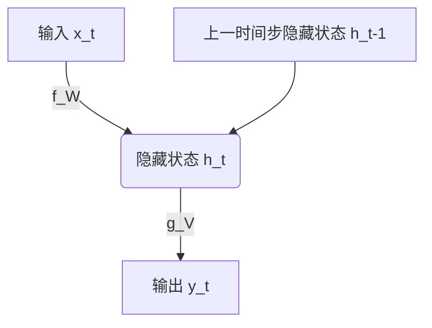
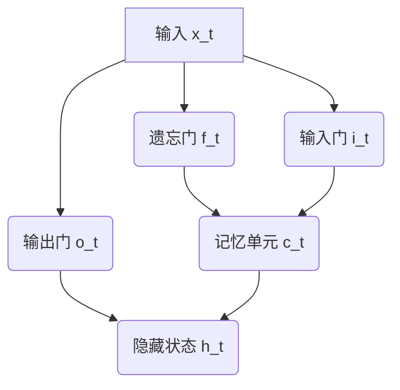
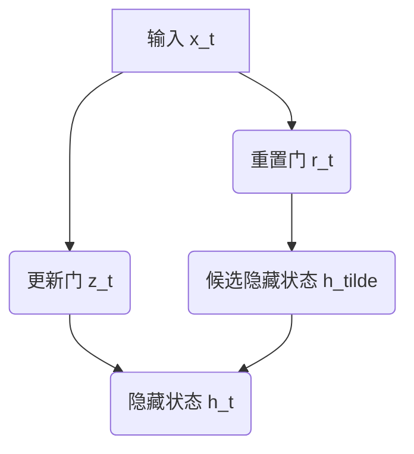

# 一切皆是映射：循环神经网络(RNNs)在时间序列分析中的作用

## 1.背景介绍

### 1.1 时间序列数据的重要性

在当今的数据驱动时代,时间序列数据无处不在。从金融市场的股票价格走势到气象部门的天气预报,从语音识别系统到自然语言处理,时间序列数据都扮演着关键角色。时间序列数据是指按照时间顺序排列的数据序列,通常具有自相关性和趋势性等特征。

### 1.2 传统方法的局限性

传统的时间序列分析方法,如ARIMA模型、指数平滑模型等,主要依赖于数据的统计特性,对于复杂的非线性时间序列数据往往表现不佳。此外,这些方法通常需要大量的人工特征工程,难以捕捉数据中潜在的复杂模式。

### 1.3 循环神经网络(RNNs)的优势

循环神经网络(Recurrent Neural Networks, RNNs)作为一种强大的深度学习模型,在处理时间序列数据方面展现出独特的优势。与传统方法不同,RNNs能够自动学习数据中的时间依赖关系,无需人工设计复杂的特征。RNNs通过内部循环机制,可以有效地捕捉序列数据中的长期依赖关系,从而更好地建模和预测时间序列数据。

## 2.核心概念与联系

### 2.1 循环神经网络的基本结构

循环神经网络是一种特殊的人工神经网络,其中神经元之间不仅存在前向连接,还存在反馈连接,形成了一个循环结构。这种循环结构使得RNNs能够对序列数据进行建模,并捕捉数据中的时间依赖关系。

RNNs的基本计算单元是一个循环单元,它接收当前时间步的输入和上一时间步的隐藏状态,并计算出当前时间步的隐藏状态和输出。这个过程可以表示为:

$$
h_t = f_W(x_t, h_{t-1})
$$
$$
y_t = g_V(h_t)
$$

其中,$x_t$是当前时间步的输入,$h_t$是当前时间步的隐藏状态,$h_{t-1}$是上一时间步的隐藏状态,$y_t$是当前时间步的输出,$f_W$和$g_V$分别是参数为$W$和$V$的非线性函数。

这种循环结构使得RNNs能够捕捉序列数据中的长期依赖关系,但也带来了梯度消失或爆炸的问题,导致训练过程不稳定。

### 2.2 长短期记忆网络(LSTMs)

为了解决RNNs中的梯度消失或爆炸问题,长短期记忆网络(Long Short-Term Memory, LSTMs)被提出。LSTMs通过引入门控机制和记忆单元,可以更好地捕捉长期依赖关系,同时避免梯度消失或爆炸问题。

LSTMs的核心是一个记忆单元$c_t$,它被设计用于存储长期信息。记忆单元$c_t$通过遗忘门$f_t$、输入门$i_t$和输出门$o_t$来控制信息的流动。

$$
f_t = \sigma(W_f \cdot [h_{t-1}, x_t] + b_f)
$$
$$
i_t = \sigma(W_i \cdot [h_{t-1}, x_t] + b_i)
$$
$$
\tilde{c}_t = \tanh(W_c \cdot [h_{t-1}, x_t] + b_c)
$$
$$
c_t = f_t \odot c_{t-1} + i_t \odot \tilde{c}_t
$$
$$
o_t = \sigma(W_o \cdot [h_{t-1}, x_t] + b_o)
$$
$$
h_t = o_t \odot \tanh(c_t)
$$

其中,$\sigma$是sigmoid函数,$\odot$表示元素wise乘积,$f_t$、$i_t$、$o_t$分别是遗忘门、输入门和输出门,$\tilde{c}_t$是候选记忆单元,$c_t$是当前时间步的记忆单元,$h_t$是当前时间步的隐藏状态。

LSTMs通过门控机制和记忆单元,可以有效地捕捉长期依赖关系,从而更好地处理时间序列数据。

### 2.3 门控循环单元(GRUs)

门控循环单元(Gated Recurrent Unit, GRU)是另一种改进的RNN变体,它相对于LSTMs结构更加简单,参数更少,计算效率更高。GRU通过引入重置门$r_t$和更新门$z_t$来控制信息的流动。

$$
z_t = \sigma(W_z \cdot [h_{t-1}, x_t])
$$
$$
r_t = \sigma(W_r \cdot [h_{t-1}, x_t])
$$
$$
\tilde{h}_t = \tanh(W_h \cdot [r_t \odot h_{t-1}, x_t])
$$
$$
h_t = (1 - z_t) \odot h_{t-1} + z_t \odot \tilde{h}_t
$$

其中,$z_t$是更新门,$r_t$是重置门,$\tilde{h}_t$是候选隐藏状态,$h_t$是当前时间步的隐藏状态。

GRU通过更新门和重置门来控制信息的流动,从而捕捉长期依赖关系。相比于LSTMs,GRU的结构更加简单,参数更少,但在某些任务上的性能可能略差于LSTMs。

## 3.核心算法原理具体操作步骤

### 3.1 RNNs的前向传播

RNNs的前向传播过程是一个递归的过程,它按照时间顺序逐步计算每个时间步的隐藏状态和输出。具体步骤如下:

1. 初始化第一个时间步的隐藏状态$h_0$,通常将其初始化为全0向量。
2. 对于每个时间步$t$:
   a. 计算当前时间步的隐藏状态$h_t$,根据前一时间步的隐藏状态$h_{t-1}$和当前输入$x_t$:
      $$h_t = f_W(x_t, h_{t-1})$$
   b. 计算当前时间步的输出$y_t$,根据当前隐藏状态$h_t$:
      $$y_t = g_V(h_t)$$
3. 重复步骤2,直到处理完整个序列。

### 3.2 RNNs的反向传播

RNNs的反向传播过程也是一个递归的过程,它需要计算每个时间步的梯度,并通过时间反向传播梯度。具体步骤如下:

1. 初始化最后一个时间步的梯度$\frac{\partial L}{\partial h_T} = 0$,其中$L$是损失函数。
2. 对于每个时间步$t$,从最后一个时间步开始反向计算:
   a. 计算当前时间步的输出梯度$\frac{\partial L}{\partial y_t}$。
   b. 计算当前时间步的隐藏状态梯度$\frac{\partial L}{\partial h_t}$,根据输出梯度和隐藏状态到输出的梯度:
      $$\frac{\partial L}{\partial h_t} = \frac{\partial L}{\partial y_t} \cdot \frac{\partial y_t}{\partial h_t}$$
   c. 计算当前时间步的参数梯度$\frac{\partial L}{\partial W}$和$\frac{\partial L}{\partial V}$,根据隐藏状态梯度和输入。
   d. 计算前一时间步的隐藏状态梯度$\frac{\partial L}{\partial h_{t-1}}$,根据当前时间步的隐藏状态梯度和隐藏状态到隐藏状态的梯度:
      $$\frac{\partial L}{\partial h_{t-1}} = \frac{\partial L}{\partial h_t} \cdot \frac{\partial h_t}{\partial h_{t-1}}$$
3. 使用计算得到的梯度更新RNNs的参数。

### 3.3 LSTMs和GRUs的前向和反向传播

LSTMs和GRUs的前向和反向传播过程与RNNs类似,但由于它们引入了门控机制和记忆单元,因此计算过程更加复杂。具体步骤如下:

对于LSTMs:

1. 前向传播:
   a. 计算遗忘门$f_t$、输入门$i_t$、输出门$o_t$和候选记忆单元$\tilde{c}_t$。
   b. 计算当前时间步的记忆单元$c_t$和隐藏状态$h_t$。
2. 反向传播:
   a. 计算记忆单元梯度$\frac{\partial L}{\partial c_t}$和隐藏状态梯度$\frac{\partial L}{\partial h_t}$。
   b. 计算门和候选记忆单元的梯度,并反向传播到前一时间步。

对于GRUs:

1. 前向传播:
   a. 计算重置门$r_t$和更新门$z_t$。
   b. 计算候选隐藏状态$\tilde{h}_t$和当前时间步的隐藏状态$h_t$。
2. 反向传播:
   a. 计算隐藏状态梯度$\frac{\partial L}{\partial h_t}$。
   b. 计算门和候选隐藏状态的梯度,并反向传播到前一时间步。

## 4.数学模型和公式详细讲解举例说明

在前面的章节中,我们已经介绍了RNNs、LSTMs和GRUs的核心公式。现在,让我们通过一些具体的例子来更深入地理解这些公式。

### 4.1 RNNs的数学模型

考虑一个简单的RNNs,它接收一个长度为3的序列$[x_1, x_2, x_3]$作为输入,每个时间步的输入维度为2,隐藏状态维度为3,输出维度为1。我们使用tanh作为非线性函数。

设RNNs的参数为:

$$
W_x = \begin{bmatrix}
0.1 & 0.2\\
0.3 & 0.4\\
0.5 & 0.6
\end{bmatrix}, \quad
W_h = \begin{bmatrix}
0.7 & 0.8 & 0.9\\
0.1 & 0.2 & 0.3\\
0.4 & 0.5 & 0.6
\end{bmatrix}, \quad
b_h = \begin{bmatrix}
0.1\\
0.2\\
0.3
\end{bmatrix}, \quad
W_y = \begin{bmatrix}
0.4 & 0.5 & 0.6
\end{bmatrix}, \quad
b_y = 0.1
$$

初始化隐藏状态$h_0 = [0, 0, 0]^T$。

对于第一个时间步:

$$
h_1 = \tanh(W_x x_1 + W_h h_0 + b_h) = \tanh\begin{bmatrix}
0.1 \times x_{1,1} + 0.2 \times x_{1,2} + 0.1\\
0.3 \times x_{1,1} + 0.4 \times x_{1,2} + 0.2\\
0.5 \times x_{1,1} + 0.6 \times x_{1,2} + 0.3
\end{bmatrix}
$$
$$
y_1 = W_y h_1 + b_y = 0.4 \times h_{1,1} + 0.5 \times h_{1,2} + 0.6 \times h_{1,3} + 0.1
$$

对于后续时间步,计算过程类似。

通过这个例子,我们可以更清楚地看到RNNs是如何计算每个时间步的隐藏状态和输出的。

### 4.2 