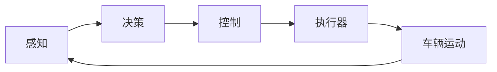

# 一切皆是映射：无人驾驶车辆中的神经网络系统

## 1. 背景介绍

### 1.1 无人驾驶技术的发展历程
无人驾驶技术经历了从概念到实践的漫长过程。早在20世纪80年代,就有研究者开始探索无人驾驶的可能性。随着传感器、计算机视觉、机器学习等技术的进步,无人驾驶逐渐从理论走向现实。近年来,谷歌、特斯拉等科技巨头以及众多初创公司都在加速推进无人驾驶的研发和落地。

### 1.2 神经网络在无人驾驶中的应用
神经网络是一种模仿生物神经系统的机器学习算法,在无人驾驶系统中扮演着关键角色。它可以用于处理车载传感器采集的海量数据,实现环境感知、路径规划、决策控制等核心功能。利用神经网络,无人车可以准确识别车道线、交通标志、行人、其他车辆等要素,预测它们的运动轨迹,并做出恰当的决策和控制。

### 1.3 映射的思想
"一切皆是映射"是理解神经网络的一个重要视角。所谓映射,就是将一个域(domain)中的元素关联到另一个域(codomain)中的元素。在神经网络中,输入数据通过一系列非线性变换被映射到输出。每一层网络都在学习一个映射函数,将前一层的输出转化为后一层的输入。通过层层叠加,神经网络可以学习到高度复杂的非线性映射,从而具备强大的感知、判断和决策能力。

## 2. 核心概念与联系

### 2.1 感知
- 传感器融合:激光雷达、摄像头、毫米波雷达等异构传感器数据的融合
- 场景理解:对道路、交通标志、车辆、行人等要素的识别与跟踪

### 2.2 决策
- 路径规划:根据目的地和实时路况生成最优行驶路径
- 行为决策:根据交通规则和周围物体的意图做出决策,如加速、减速、变道、停车等

### 2.3 控制
- 横向控制:方向盘控制,保持车辆在车道内行驶
- 纵向控制:油门和刹车控制,实现车速调节和车距保持



## 3. 核心算法原理具体操作步骤

### 3.1 卷积神经网络(CNN)
- 输入:图像数据
- 卷积层:通过卷积核提取局部特征
- 池化层:降低特征图尺寸,提高特征不变性
- 全连接层:将特征向量映射到输出
- 输出:分类或回归结果

### 3.2 循环神经网络(RNN)
- 输入:时间序列数据
- 循环单元:携带历史信息,更新隐藏状态
- 输出:时间步上的输出序列

### 3.3 端到端学习
- 数据采集:收集大规模的传感器数据和人类驾驶员的操作数据
- 数据预处理:时空对齐、数据增强等
- 网络设计:根据任务设计合适的神经网络结构
- 训练:端到端训练网络,直接学习从感知到控制的映射
- 测试与迭代:在真实或仿真环境中测试,不断迭代优化算法

## 4. 数学模型和公式详细讲解举例说明

### 4.1 卷积的数学表示
卷积操作可以表示为:
$$
(f*g)(x) = \int_{-\infty}^{\infty} f(\tau)g(x-\tau)d\tau
$$
其中,$f$为输入函数,$g$为卷积核函数。离散形式为:
$$
(f*g)[n] = \sum_{m=-\infty}^{\infty} f[m]g[n-m]
$$

### 4.2 循环神经网络的前向传播
以简单RNN为例,前向传播公式为:
$$
h_t = \sigma(W_{hh}h_{t-1} + W_{xh}x_t + b_h) \\
y_t = W_{hy}h_t + b_y
$$
其中,$h_t$为$t$时刻的隐藏状态,$x_t$为$t$时刻的输入,$y_t$为$t$时刻的输出,$W$和$b$为可学习的参数,$\sigma$为激活函数。

### 4.3 端到端学习的损失函数
端到端学习常用的损失函数有均方误差(MSE)和交叉熵(Cross Entropy)。
- 均方误差:
$$
L(y, \hat{y}) = \frac{1}{N}\sum_{i=1}^{N}(y_i - \hat{y}_i)^2
$$
- 交叉熵:
$$
L(y, \hat{y}) = -\frac{1}{N}\sum_{i=1}^{N}[y_i\log\hat{y}_i + (1-y_i)\log(1-\hat{y}_i)]
$$
其中,$y$为真实标签,$\hat{y}$为预测值。

## 5. 项目实践：代码实例和详细解释说明

下面是一个简单的CNN模型用于交通标志识别的PyTorch代码示例:

```python
import torch
import torch.nn as nn
import torch.optim as optim
from torch.utils.data import DataLoader
from torchvision import datasets, transforms

# 定义网络结构
class Net(nn.Module):
    def __init__(self):
        super(Net, self).__init__()
        self.conv1 = nn.Conv2d(3, 16, 3)
        self.pool = nn.MaxPool2d(2, 2)
        self.conv2 = nn.Conv2d(16, 32, 3)
        self.fc1 = nn.Linear(32 * 5 * 5, 120)
        self.fc2 = nn.Linear(120, 84)
        self.fc3 = nn.Linear(84, 10)

    def forward(self, x):
        x = self.pool(torch.relu(self.conv1(x)))
        x = self.pool(torch.relu(self.conv2(x)))
        x = x.view(-1, 32 * 5 * 5)
        x = torch.relu(self.fc1(x))
        x = torch.relu(self.fc2(x))
        x = self.fc3(x)
        return x

# 加载数据集
transform = transforms.Compose([transforms.Resize((32, 32)),
                                transforms.ToTensor(),
                                transforms.Normalize((0.5, 0.5, 0.5), (0.5, 0.5, 0.5))])
trainset = datasets.CIFAR10(root='./data', train=True, download=True, transform=transform)
trainloader = DataLoader(trainset, batch_size=4, shuffle=True, num_workers=2)

# 初始化网络和优化器
net = Net()
criterion = nn.CrossEntropyLoss()
optimizer = optim.SGD(net.parameters(), lr=0.001, momentum=0.9)

# 训练
for epoch in range(10):
    running_loss = 0.0
    for i, data in enumerate(trainloader, 0):
        inputs, labels = data
        optimizer.zero_grad()
        outputs = net(inputs)
        loss = criterion(outputs, labels)
        loss.backward()
        optimizer.step()
        running_loss += loss.item()
        if i % 2000 == 1999:
            print('[%d, %5d] loss: %.3f' % (epoch + 1, i + 1, running_loss / 2000))
            running_loss = 0.0

print('Finished Training')
```

这个例子展示了如何定义一个简单的卷积神经网络,并用CIFAR-10数据集进行训练。网络包含两个卷积层和三个全连接层,使用ReLU激活函数和最大池化。损失函数为交叉熵,优化器为带动量的随机梯度下降。通过10个epoch的训练,网络可以学习到识别不同类别的交通标志。

## 6. 实际应用场景

无人驾驶技术在多个领域有广阔的应用前景:

### 6.1 自动驾驶出租车
无人驾驶技术可以应用于出租车服务,提供全天候、低成本、安全可靠的出行选择。用户可以通过手机应用呼叫无人车,系统根据实时路况规划最优路径,全自动驾驶到目的地。这种模式有望缓解交通拥堵,减少事故发生,提高出行效率。

### 6.2 智能物流配送
将无人驾驶技术应用于物流配送,可以实现24小时不间断运输,提高配送效率,降低人力成本。无人驾驶卡车可以编队行驶,优化货物运输路线,减少燃料消耗和排放。末端配送可以使用无人配送车,灵活应对复杂的城市道路环境,实现最后一公里的高效配送。

### 6.3 智慧农业
无人驾驶技术在农业领域也有广阔应用空间。无人驾驶拖拉机可以精准操控,实现精准播种、施肥、收割等农事操作,提高农业生产效率。配合遥感、物联网等技术,可以实现农田的实时监测和管理,精准调控农业生产过程。无人驾驶让现代农业更加智能化。

## 7. 工具和资源推荐

### 7.1 数据集
- KITTI:包含真实道路场景的大规模数据集,涵盖立体视觉、光流、视觉测距、3D目标检测等
- Udacity Self-Driving Car:Udacity自动驾驶开放数据集,包含图像、激光雷达点云、GPS/IMU等多模态传感器数据
- BDD100K:伯克利大学DeepDrive数据集,包含10万个视频和各种注释数据

### 7.2 仿真平台
- CARLA:开源的自动驾驶仿真平台,提供逼真的城市环境和传感器模拟
- AirSim:微软开发的开源模拟器,支持汽车和无人机的仿真训练
- LGSVL:LG电子开发的多传感器仿真平台,可以模拟复杂的自动驾驶场景

### 7.3 开发框架
- Autoware:一站式的开源自动驾驶软件栈,提供从感知到规划控制的全流程解决方案
- Apollo:百度的开源自动驾驶平台,包含目标检测、轨迹预测、路径规划、控制等模块
- Nvidia DRIVE:英伟达的自动驾驶开发套件,提供感知、映射、规划和控制的端到端解决方案

## 8. 总结：未来发展趋势与挑战

无人驾驶技术正在快速发展,神经网络的应用让无人车具备了类似人类的感知和决策能力。未来,无人驾驶技术有望在出行、物流、农业等领域得到广泛应用,极大提升生产生活效率。但同时,无人驾驶也面临着技术、安全、法律、伦理等多方面挑战。

技术方面,如何进一步提高神经网络的泛化能力和鲁棒性,实现全天候、全场景的自动驾驶,仍需要大量的研究和攻关。安全方面,需要构建完善的测试评估体系,确保无人车在复杂环境下的安全性和可靠性。法律和伦理方面,无人驾驶事故的责任认定、隐私保护等问题亟待明确。

尽管挑战众多,无人驾驶技术仍在持续突破,人工智能、新材料、新能源等前沿技术也在赋能无人驾驶的发展。可以预见,随着技术进步和产业成熟,无人驾驶将逐步走向商业化落地,为人类生活带来巨大改变。"一切皆是映射"的理念也将在无人驾驶的发展中得到更深刻的诠释。

## 9. 附录：常见问题与解答

### 9.1 无人驾驶安全吗?
无人驾驶系统经过大量的训练和测试,在大多数情况下可以安全驾驶。但在极端天气、复杂路况等特殊情形下,仍然存在一定的安全隐患。为此,无人车配备了多重冗余的感知、决策和控制系统,可以及时发现故障并采取应对措施。同时,安全驾驶员可以随时接管车辆控制权。随着技术的不断成熟,无人驾驶的安全性将得到进一步提升。

### 9.2 无人驾驶会取代人类驾驶员吗?
在可预见的未来,无人驾驶技术将与人类驾驶员并存。一方面,无人驾驶