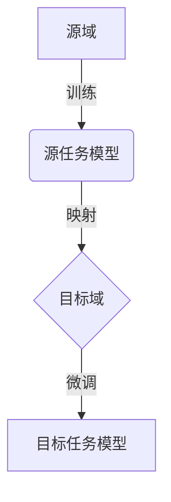

# 一切皆是映射：深度迁移学习：AI在不同域间的知识转移

## 1. 背景介绍

### 1.1 人工智能的新时代

人工智能(AI)已经成为当今科技领域最炙手可热的话题之一。随着算力的不断提升和数据量的激增,AI系统在诸多领域展现出了令人惊叹的能力,从游戏到医疗诊断,从语音识别到自动驾驶,AI正在彻底改变着我们的生活方式。然而,尽管取得了巨大进步,AI系统仍然面临着一些挑战,其中之一就是知识迁移的问题。

### 1.2 知识迁移的重要性

传统的机器学习方法通常需要为每个新任务重新训练一个全新的模型,这不仅代价高昂,而且效率低下。相比之下,人类具有出色的知识迁移能力,我们可以将已有的知识和经验应用于新的场景和任务中。例如,一个人学会了骑自行车,就可以更快地学会骑摩托车,因为两者都涉及了平衡和操控的基本技能。

### 1.3 深度迁移学习的兴起

为了解决这一挑战,深度迁移学习(Deep Transfer Learning)应运而生。它是一种将在源域中学习到的知识迁移到目标域的技术,旨在提高模型在新任务上的性能,同时减少训练时间和数据需求。深度迁移学习已经在计算机视觉、自然语言处理等多个领域取得了卓越的成果,展现出了巨大的潜力。

## 2. 核心概念与联系

### 2.1 域(Domain)

在深度迁移学习中,域是指数据的分布和特征空间。源域(Source Domain)是指已经拥有大量标注数据和训练好的模型的领域,而目标域(Target Domain)则是我们希望将知识迁移到的新领域。

### 2.2 任务(Task)

任务是指我们希望机器学习模型能够完成的具体目标,例如图像分类、机器翻译等。源任务(Source Task)和目标任务(Target Task)可能相同,也可能不同。

### 2.3 映射(Mapping)

映射是指将源域的知识转移到目标域的过程。这可能涉及特征空间的转换、模型参数的调整等操作。深度迁移学习的核心就是找到一种有效的映射方式,使得源域的知识能够很好地迁移到目标域。

### 2.4 领域适应(Domain Adaptation)

领域适应是深度迁移学习的一个重要分支,它专注于解决源域和目标域数据分布不同的问题。通过对源域和目标域数据进行适当的转换,可以缩小两个域之间的差异,从而提高模型在目标域上的性能。

### 2.5 Mermaid流程图



上图展示了深度迁移学习的基本流程。首先,在源域中训练一个源任务模型。然后,通过某种映射方法将源域的知识迁移到目标域。最后,在目标域上进行微调,得到适用于目标任务的模型。

## 3. 核心算法原理具体操作步骤

深度迁移学习包含多种不同的算法和方法,下面我们将介绍其中几种核心算法的原理和具体操作步骤。

### 3.1 特征提取(Feature Extraction)

特征提取是深度迁移学习中最简单、最直接的方法之一。其基本思路是:首先在源域训练一个深度神经网络模型,然后将该模型的部分层(通常是卷积层或编码器层)作为特征提取器,提取目标域数据的特征表示。接下来,我们可以在目标域上训练一个新的分类器(或其他任务相关的模型),使用提取到的特征作为输入。具体操作步骤如下:

1. 在源域训练一个深度神经网络模型,例如在ImageNet数据集上训练一个卷积神经网络(CNN)进行图像分类。
2. 冻结该模型的卷积层参数,将其作为特征提取器。
3. 对目标域数据进行前向传播,提取目标域数据的特征表示。
4. 在目标域上训练一个新的分类器(或其他任务相关的模型),使用提取到的特征作为输入。

特征提取的优点是简单、高效,但缺点是无法充分利用目标域数据,因此可能导致子优化的问题。

### 3.2 微调(Fine-tuning)

微调是一种更加复杂、但也更加有效的深度迁移学习方法。它的基本思路是:首先在源域训练一个深度神经网络模型,然后将该模型的参数作为初始化参数,在目标域上进行进一步的训练和微调。具体操作步骤如下:

1. 在源域训练一个深度神经网络模型,例如在ImageNet数据集上训练一个卷积神经网络(CNN)进行图像分类。
2. 将源域模型的参数作为初始化参数,在目标域上构建一个新的神经网络模型。
3. 在目标域上进行训练,对模型参数进行微调。通常会采用较小的学习率,避免过度修改源域模型中已经学习到的有用知识。
4. 可以选择冻结部分层(如卷积层)的参数,只微调其他层(如全连接层)的参数,这样可以更好地保留源域知识。

微调的优点是可以充分利用源域和目标域的数据,通常能够取得更好的性能。但缺点是计算开销较大,需要在目标域上进行完整的训练过程。

### 3.3 对抗迁移(Adversarial Transfer)

对抗迁移是一种基于生成对抗网络(GAN)的深度迁移学习方法。它的基本思路是:通过对抗训练,学习一个域不变的特征表示,使得源域和目标域的数据在该特征空间中具有相似的分布。具体操作步骤如下:

1. 构建一个生成模型G和一个判别模型D,它们组成了一个生成对抗网络(GAN)。
2. G的目标是生成能够欺骗D的特征表示,使D无法区分该特征来自源域还是目标域。
3. D的目标是正确区分特征的来源域,即源域或目标域。
4. G和D进行对抗训练,直到达到纳什均衡,此时G生成的特征表示在源域和目标域具有相似的分布。
5. 使用对抗训练得到的域不变特征表示,在目标域上训练任务相关的模型。

对抗迁移的优点是可以有效缩小源域和目标域之间的分布差异,提高模型的泛化能力。但缺点是训练过程复杂,需要同时优化生成模型和判别模型,存在模式崩溃等问题。

## 4. 数学模型和公式详细讲解举例说明

深度迁移学习涉及到多种数学模型和公式,下面我们将详细讲解其中几种核心模型。

### 4.1 最小化源域和目标域分布差异

在许多深度迁移学习方法中,关键目标是最小化源域和目标域之间的分布差异。一种常见的做法是最小化两个域的样本分布之间的最大均值差异(Maximum Mean Discrepancy, MMD)。

MMD的定义如下:

$$
\begin{aligned}
\mathrm{MMD}(\mathcal{D}_s, \mathcal{D}_t) &= \sup_{f \in \mathcal{F}} \left( \mathbb{E}_{x_s \sim \mathcal{D}_s}[f(x_s)] - \mathbb{E}_{x_t \sim \mathcal{D}_t}[f(x_t)] \right) \\
&= \sup_{f \in \mathcal{F}} \left( \frac{1}{n_s} \sum_{i=1}^{n_s} f(x_s^{(i)}) - \frac{1}{n_t} \sum_{j=1}^{n_t} f(x_t^{(j)}) \right)
\end{aligned}
$$

其中 $\mathcal{D}_s$ 和 $\mathcal{D}_t$ 分别表示源域和目标域的数据分布, $\mathcal{F}$ 是一个再生核希尔伯特空间(Reproducing Kernel Hilbert Space, RKHS)中的函数集合, $x_s^{(i)}$ 和 $x_t^{(j)}$ 分别表示源域和目标域中的样本。

MMD的值越小,表示两个域的分布越相似。因此,我们可以通过最小化MMD来缩小源域和目标域之间的分布差异。

### 4.2 对抗loss

在对抗迁移方法中,常常使用对抗loss来训练生成模型G和判别模型D。对抗loss的定义如下:

$$
\begin{aligned}
\mathcal{L}_\mathrm{adv}(G, D) &= \mathbb{E}_{x_s \sim \mathcal{D}_s}[\log D(x_s)] + \mathbb{E}_{x_t \sim \mathcal{D}_t}[\log(1 - D(G(x_t)))] \\
&= \frac{1}{n_s} \sum_{i=1}^{n_s} \log D(x_s^{(i)}) + \frac{1}{n_t} \sum_{j=1}^{n_t} \log(1 - D(G(x_t^{(j)})))
\end{aligned}
$$

其中 $D$ 是判别模型, $G$ 是生成模型, $x_s$ 和 $x_t$ 分别表示源域和目标域中的样本。

在训练过程中,G的目标是最小化对抗loss,即生成能够欺骗D的特征表示;而D的目标是最大化对抗loss,即正确区分源域和目标域的特征。通过这种对抗训练,我们可以得到域不变的特征表示,从而缩小源域和目标域之间的分布差异。

### 4.3 正则化项

为了防止过拟合和提高模型的泛化能力,深度迁移学习中常常引入正则化项。一种常见的正则化方法是 $\ell_2$ 范数正则化,其定义如下:

$$
\Omega(\theta) = \frac{1}{2} \lambda \|\theta\|_2^2 = \frac{1}{2} \lambda \sum_{i=1}^{n} \theta_i^2
$$

其中 $\theta$ 表示模型参数, $\lambda$ 是正则化系数, $n$ 是参数的个数。

在训练过程中,我们将正则化项 $\Omega(\theta)$ 加入到损失函数中,从而约束模型参数的大小,避免过拟合。

## 5. 项目实践:代码实例和详细解释说明

为了更好地理解深度迁移学习的原理和应用,我们将通过一个实际项目来进行讲解。该项目的目标是将在ImageNet数据集上训练好的ResNet模型迁移到一个新的数据集上,进行图像分类任务。

### 5.1 导入必要的库

```python
import torch
import torch.nn as nn
import torchvision.models as models
from torchvision import datasets, transforms
```

我们将使用PyTorch作为深度学习框架,并导入必要的库和模型。

### 5.2 加载数据集

```python
# 定义数据预处理方式
data_transforms = {
    'train': transforms.Compose([
        transforms.RandomResizedCrop(224),
        transforms.RandomHorizontalFlip(),
        transforms.ToTensor(),
        transforms.Normalize([0.485, 0.456, 0.406], [0.229, 0.224, 0.225])
    ]),
    'val': transforms.Compose([
        transforms.Resize(256),
        transforms.CenterCrop(224),
        transforms.ToTensor(),
        transforms.Normalize([0.485, 0.456, 0.406], [0.229, 0.224, 0.225])
    ]),
}

# 加载数据集
data_dir = 'data/new_dataset'
image_datasets = {x: datasets.ImageFolder(os.path.join(data_dir, x), data_transforms[x])
                  for x in ['train', 'val']}
dataloaders = {x: torch.utils.data.DataLoader(image_datasets[x], batch_size=4, shuffle=True)
               for x in ['train', 'val']}
dataset_sizes = {x: len(image_datasets[x]) for x in ['train', 'val']}
class_names = image_datasets['train'].classes
```

我们定义了数据预处理方式,并从磁盘加载了一个新的数据集。该数据集包含了训练集和验证集,我们将使用DataLoader来批量加载数据。

### 5