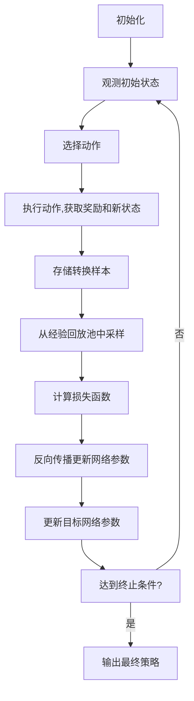

# 一切皆是映射：逆向工程：深入理解DQN决策过程

## 1. 背景介绍

### 1.1 强化学习与决策过程

强化学习是机器学习领域的一个重要分支,旨在训练智能体(Agent)通过与环境(Environment)的交互来学习如何做出最优决策。在这个过程中,智能体会根据当前状态采取行动,并从环境中获得反馈(奖励或惩罚),进而不断优化其决策策略。强化学习广泛应用于游戏、机器人控制、自动驾驶等领域,展现出巨大的潜力。

### 1.2 DQN及其重要性

深度Q网络(Deep Q-Network,DQN)是强化学习中的一种突破性算法,它将深度神经网络引入到Q学习中,成功解决了传统Q学习在处理高维观测数据和连续状态空间时的困难。DQN的提出极大推动了强化学习在实际应用中的发展,成为了当前强化学习研究的基础。深入理解DQN的决策过程对于掌握强化学习的核心思想至关重要。

## 2. 核心概念与联系

### 2.1 Q学习

Q学习是强化学习中的一种基本算法,旨在学习一个最优的行为价值函数Q(s,a),表示在状态s下采取行动a所能获得的最大预期未来奖励。通过不断更新Q值表,智能体可以逐步优化其决策策略。然而,传统Q学习在处理高维观测数据和连续状态空间时存在瓶颈。

### 2.2 深度神经网络

深度神经网络是一种强大的机器学习模型,能够从原始数据中自动提取有用的特征表示。它由多层神经元组成,每一层对上一层的输出进行非线性变换,最终将输入映射到所需的输出。深度神经网络在计算机视觉、自然语言处理等领域取得了巨大成功。

### 2.3 DQN的核心思想

DQN的核心思想是将深度神经网络作为Q函数的逼近器,利用其强大的特征提取能力来处理高维观测数据。通过训练神经网络来拟合Q值函数,DQN可以直接从原始输入(如像素数据)中学习最优策略,而无需手工设计特征。同时,DQN还引入了经验回放(Experience Replay)和目标网络(Target Network)等技巧,提高了训练的稳定性和效率。

## 3. 核心算法原理具体操作步骤

DQN算法的核心操作步骤如下:



1. **初始化**: 初始化评估网络(Q网络)和目标网络(Target Network),两个网络的参数初始时相同。同时初始化经验回放池(Experience Replay Memory)。

2. **观测初始状态**: 从环境中获取初始状态。

3. **选择动作**: 使用当前的评估网络根据当前状态选择一个动作,可以使用$\epsilon$-贪婪策略在探索(选择随机动作)和利用(选择评估网络给出的最优动作)之间进行权衡。

4. **执行动作,获取奖励和新状态**: 在环境中执行选择的动作,获得执行该动作后的即时奖励和新的状态。

5. **存储转换样本**: 将当前状态、选择的动作、获得的奖励和新状态作为一个转换样本(transition)存储到经验回放池中。

6. **从经验回放池中采样**: 从经验回放池中随机采样一个批次的转换样本。

7. **计算损失函数**: 使用采样的批次数据计算当前评估网络与目标Q值之间的损失函数,目标Q值由贝尔曼方程计算得到:

   $$Q_{target} = r + \gamma \max_{a'}Q(s', a'; \theta^-)$$

   其中,$r$是即时奖励,$\gamma$是折现因子,$\theta^-$是目标网络的参数。

8. **反向传播更新网络参数**: 使用优化算法(如随机梯度下降)反向传播更新评估网络的参数,最小化损失函数。

9. **更新目标网络参数**: 每隔一定步数,将评估网络的参数复制到目标网络,以提高训练稳定性。

10. **达到终止条件?**: 检查是否达到终止条件(如最大训练步数或策略收敛),如果是,输出最终的策略;否则,返回步骤2,继续训练。

通过上述操作步骤,DQN算法可以逐步优化评估网络的参数,使其逼近最优的Q函数,从而学习到一个高质量的决策策略。

## 4. 数学模型和公式详细讲解举例说明

### 4.1 Q学习的数学模型

在强化学习中,我们希望找到一个最优策略$\pi^*$,使得在该策略下,智能体可以获得最大的预期累积奖励。Q学习的目标是学习一个行为价值函数$Q^{\pi}(s,a)$,表示在策略$\pi$下,从状态$s$执行动作$a$后,可以获得的预期累积奖励:

$$Q^{\pi}(s,a) = \mathbb{E}_{\pi}\left[ \sum_{k=0}^{\infty} \gamma^k r_{t+k+1} | s_t=s, a_t=a \right]$$

其中,$\gamma$是折现因子,用于平衡即时奖励和长期奖励的权重。

根据贝尔曼最优方程,最优行为价值函数$Q^*(s,a)$满足:

$$Q^*(s,a) = \mathbb{E}_{s' \sim \mathcal{P}}\left[ r + \gamma \max_{a'} Q^*(s',a') | s,a \right]$$

这个方程表明,最优Q值是即时奖励$r$加上从下一状态$s'$开始获得的最大预期累积奖励的折现和。传统Q学习通过不断更新Q值表来逼近$Q^*$,但在高维观测数据和连续状态空间下会遇到维数灾难的问题。

### 4.2 DQN的数学模型

DQN的核心思想是使用深度神经网络$Q(s,a;\theta)$来逼近真实的Q函数,其中$\theta$是网络的参数。训练目标是最小化网络输出与目标Q值之间的均方差损失:

$$\mathcal{L}(\theta) = \mathbb{E}_{(s,a,r,s') \sim \mathcal{D}}\left[ \left( r + \gamma \max_{a'} Q(s',a';\theta^-) - Q(s,a;\theta) \right)^2 \right]$$

其中,$\mathcal{D}$是经验回放池,$(s,a,r,s')$是从中采样的转换样本,$\theta^-$是目标网络的参数。

通过梯度下降优化该损失函数,可以逐步更新评估网络的参数$\theta$,使其逼近最优的Q函数。同时,DQN引入了目标网络和经验回放等技巧,提高了训练的稳定性和效率。

### 4.3 探索与利用权衡

在强化学习中,探索(Exploration)和利用(Exploitation)之间的权衡是一个关键问题。过多探索会导致效率低下,而过多利用又可能陷入次优解。DQN通常采用$\epsilon$-贪婪策略来平衡探索和利用:

$$a = \begin{cases}
    \arg\max_a Q(s,a;\theta), & \text{with probability } 1-\epsilon\\
    \text{random action}, & \text{with probability } \epsilon
\end{cases}$$

其中,$\epsilon$是探索率,控制选择随机动作的概率。在训练早期,$\epsilon$设置为较大值,鼓励更多探索;随着训练进行,$\epsilon$逐渐降低,更多利用已学习的策略。

## 5. 项目实践:代码实例和详细解释说明

以下是一个使用PyTorch实现DQN算法的简化代码示例,用于解决经典的CartPole问题(用杆平衡问题):

```python
import torch
import torch.nn as nn
import torch.optim as optim
import numpy as np

# 定义DQN网络
class DQN(nn.Module):
    def __init__(self, state_dim, action_dim):
        super(DQN, self).__init__()
        self.fc1 = nn.Linear(state_dim, 64)
        self.fc2 = nn.Linear(64, action_dim)

    def forward(self, x):
        x = torch.relu(self.fc1(x))
        return self.fc2(x)

# 初始化
state_dim = 4  # CartPole状态维度
action_dim = 2  # 左右两个动作
q_net = DQN(state_dim, action_dim)
target_net = DQN(state_dim, action_dim)
target_net.load_state_dict(q_net.state_dict())  # 初始化目标网络
optimizer = optim.Adam(q_net.parameters(), lr=1e-3)
replay_buffer = []  # 经验回放池
epsilon = 1.0  # 探索率

# 训练循环
for episode in range(1000):
    state = env.reset()
    done = False
    while not done:
        # 选择动作
        if np.random.rand() < epsilon:
            action = env.action_space.sample()  # 探索
        else:
            state_tensor = torch.tensor(state, dtype=torch.float32)
            q_values = q_net(state_tensor)
            action = torch.argmax(q_values).item()  # 利用

        # 执行动作,获取奖励和新状态
        next_state, reward, done, _ = env.step(action)
        replay_buffer.append((state, action, reward, next_state, done))

        # 采样批次数据,更新网络
        if len(replay_buffer) >= batch_size:
            samples = random.sample(replay_buffer, batch_size)
            states, actions, rewards, next_states, dones = zip(*samples)
            states = torch.tensor(states, dtype=torch.float32)
            actions = torch.tensor(actions, dtype=torch.int64)
            rewards = torch.tensor(rewards, dtype=torch.float32)
            next_states = torch.tensor(next_states, dtype=torch.float32)
            dones = torch.tensor(dones, dtype=torch.bool)

            # 计算目标Q值
            next_q_values = target_net(next_states).max(1)[0].detach()
            target_q_values = rewards + gamma * next_q_values * (1 - dones.float())

            # 计算损失函数并更新网络
            q_values = q_net(states).gather(1, actions.unsqueeze(1)).squeeze()
            loss = nn.MSELoss()(q_values, target_q_values)
            optimizer.zero_grad()
            loss.backward()
            optimizer.step()

        # 更新目标网络
        if episode % target_update_freq == 0:
            target_net.load_state_dict(q_net.state_dict())

        # 更新探索率
        epsilon = max(epsilon * epsilon_decay, epsilon_min)

        state = next_state

    # 打印训练进度
    print(f"Episode {episode}: Reward = {total_reward}")
```

上述代码实现了DQN算法的核心流程,包括定义DQN网络、初始化评估网络和目标网络、经验回放池、探索与利用策略等。在训练循环中,代码执行以下步骤:

1. 根据当前探索率$\epsilon$选择动作,either随机探索或利用当前评估网络的输出。
2. 在环境中执行选择的动作,获得奖励和新状态,并将转换样本存储到经验回放池中。
3. 从经验回放池中采样一个批次的转换样本。
4. 计算目标Q值,使用贝尔曼方程和目标网络的输出。
5. 计算评估网络输出与目标Q值之间的均方差损失,并使用优化算法(如Adam)反向传播更新评估网络的参数。
6. 每隔一定步数,将评估网络的参数复制到目标网络。
7. 根据策略逐渐降低探索率$\epsilon$。

通过上述步骤,DQN算法可以逐步优化评估网络的参数,学习到一个高质量的决策策略。在实际应用中,还可以根据具体问题对网络结构、超参数等进行调整和优化。

## 6. 实际应用场景

DQN及其变体算法已经在多个领域取得了卓越的成就,展现出了强大的决策能力。以下是一些典型的应用场景:

### 