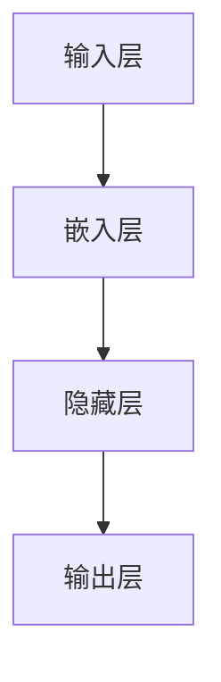

# 从零开始大模型开发与微调：FastText的原理与基础算法

## 1.背景介绍

在自然语言处理(NLP)领域,词向量技术是一种将单词映射到连续向量空间的方法,这种方法能够捕捉单词之间的语义关系和上下文信息。传统的one-hot编码方式虽然简单直观,但存在着维度灾难和无法体现词与词之间的相似性等问题。而词向量技术通过将单词映射到低维连续向量空间,不仅能够有效降低维度,还能捕捉单词之间的语义关系,从而为NLP任务提供有价值的输入特征。

Word2Vec和GloVe是两种经典的词向量表示方法,它们分别基于浅层神经网络和矩阵分解的思想,通过模型训练获得单词向量表示。然而,这些方法在处理较长文本时存在一些缺陷,例如无法很好地捕捉长距离依赖关系,并且计算效率较低。为了解决这些问题,Facebook AI研究院(FAIR)于2016年提出了FastText模型。

### 1.1 FastText简介

FastText是一种用于高效学习单词表示和句子分类的库,它是Word2Vec的扩展版本。与Word2Vec相比,FastText具有以下几个主要优点:

1. **子词表示**:FastText将每个单词视为字符n-gram的组合,这使得它能够更好地处理复杂词汇、新词和未被词典收录的词。
2. **高效训练**:FastText采用了HOGWILD!并行训练算法,可以在多核CPU上高效地进行训练。
3. **多标签分类**:FastText不仅支持单标签分类,还支持多标签分类,可以同时预测多个标签。

FastText广泛应用于多种NLP任务,如文本分类、情感分析、语种识别等,并展现出优异的性能表现。

## 2.核心概念与联系

### 2.1 词向量(Word Embeddings)

词向量是将单词映射到连续向量空间的一种方法,每个单词都被表示为一个固定长度的密集向量。这些向量能够捕捉单词之间的语义和上下文关系,使得在向量空间中,语义相似的单词彼此靠近,而语义不相似的单词则相距较远。

词向量技术为NLP任务提供了有价值的输入特征,使得模型能够更好地理解和处理自然语言数据。常见的词向量表示方法包括Word2Vec、GloVe和FastText等。

### 2.2 子词表示(Subword Representations)

FastText的一个关键创新点是引入了子词表示的概念。传统的词向量方法将每个单词视为一个原子单元,但这种方式无法很好地处理复杂词汇、新词和未被词典收录的词。

为了解决这个问题,FastText将每个单词视为字符n-gram的组合,即将单词拆分为多个子词单元。例如,单词"where"可以被表示为"<wh"、"whe"、"her"、"ere"、"re>"这些子词单元的组合。通过这种方式,FastText能够更好地捕捉单词的内部结构,并为未见过的单词生成表示。

### 2.3 HOGWILD!并行训练算法

为了提高训练效率,FastText采用了HOGWILD!并行训练算法。该算法允许多个线程同时读写共享参数,而无需任何锁机制或同步操作,从而实现了高效的并行训练。

HOGWILD!算法的核心思想是利用了自然梯度下降的稀疏性质和参数更新的渐近收敛性。在实践中,该算法展现出了良好的收敛性能,并且能够在多核CPU上高效地进行训练,大大缩短了训练时间。

### 2.4 层次softmax和负采样

为了加速训练过程并降低计算复杂度,FastText采用了层次softmax和负采样等优化技术。

层次softmax是一种基于哈夫曼树的层次概率计算方法,它将softmax分类问题转化为一系列的二分类问题,从而降低了计算复杂度。

负采样则是一种通过采样负例来近似语言模型目标函数的技术。它通过对目标函数进行重新参数化,将计算复杂度从与词汇表大小成线性关系降低到与采样负例数量成线性关系,从而大大提高了训练效率。

## 3.核心算法原理具体操作步骤

FastText的核心算法原理基于Word2Vec的Skip-gram模型,但做了一些关键的改进和扩展。下面我们将详细介绍FastText的训练过程和算法细节。

### 3.1 模型架构

FastText的模型架构如下图所示:

- **输入层**:输入层接受一个中心单词及其上下文窗口内的单词。
- **嵌入层**:嵌入层将每个单词映射到一个固定长度的向量空间,得到单词的嵌入表示。
- **隐藏层**:隐藏层对上下文单词的嵌入表示进行求和,得到上下文的综合表示。
- **输出层**:输出层根据中心单词的嵌入表示和上下文的综合表示,计算预测中心单词的概率分布。

### 3.2 子词表示

FastText的一个核心创新点是引入了子词表示的概念。具体来说,对于每个单词,FastText将其视为字符n-gram的组合,并为每个n-gram学习一个向量表示。单词的嵌入表示则由其所有n-gram的嵌入表示的求和得到。

例如,对于单词"where",我们可以将其拆分为以下n-gram:

- n = 3: <wh, whe, her, ere, re>
- n = 4: <whe, wher, here, ere>
- n = 5: <where>

其中,`<`和`>`分别表示单词的开始和结束。然后,我们为每个n-gram学习一个向量表示,并将它们相加作为单词"where"的最终嵌入表示。

通过这种方式,FastText能够更好地捕捉单词的内部结构,并为未见过的单词生成表示,从而提高了模型的泛化能力。

### 3.3 模型训练

FastText的模型训练过程与Word2Vec的Skip-gram模型类似,但做了一些优化和改进。

给定一个中心单词 $w_c$ 及其上下文窗口内的单词 $w_{o_1}, w_{o_2}, ..., w_{o_C}$,我们的目标是最大化以下对数似然函数:

$$\mathcal{L} = \sum_{c=1}^C \sum_{o=1}^{O} \log P(w_{o} | w_c)$$

其中,$ P(w_{o} | w_c) $表示给定中心单词 $w_c$ 时,预测上下文单词 $w_o$ 的概率。

为了计算 $P(w_{o} | w_c)$,我们首先需要获得中心单词和上下文单词的嵌入表示。对于中心单词 $w_c$,我们将其视为字符n-gram的组合,并将所有n-gram的嵌入表示相加,得到中心单词的最终嵌入表示 $\vec{v}_c$。对于上下文单词 $w_o$,我们同样将其视为n-gram的组合,并将所有n-gram的嵌入表示相加,得到上下文单词的最终嵌入表示 $\vec{v}_o$。

接下来,我们将中心单词的嵌入表示 $\vec{v}_c$ 与一个上下文矩阵 $W$ 相乘,得到一个分数向量 $\vec{z}$:

$$\vec{z} = W \cdot \vec{v}_c$$

然后,我们使用softmax函数将分数向量 $\vec{z}$ 转换为概率分布:

$$P(w_o | w_c) = \frac{e^{\vec{z}_{o}}}{\sum_{w=1}^{V} e^{\vec{z}_{w}}}$$

其中, $V$ 是词汇表的大小, $\vec{z}_o$ 是分数向量 $\vec{z}$ 中与上下文单词 $w_o$ 对应的分数。

为了加速训练过程并降低计算复杂度,FastText采用了层次softmax和负采样等优化技术。

#### 层次softmax

层次softmax是一种基于哈夫曼树的层次概率计算方法,它将softmax分类问题转化为一系列的二分类问题,从而降低了计算复杂度。

具体来说,我们首先构建一个基于词频的哈夫曼树,将所有单词按照词频从高到低排序,并将它们组织成一棵二叉树。然后,我们沿着从根节点到目标单词的路径,对每个内部节点计算一个二分类概率,最终将这些概率相乘即可得到目标单词的概率。

通过这种方式,层次softmax将计算复杂度从 $O(V)$ 降低到 $O(\log V)$,其中 $V$ 是词汇表的大小。

#### 负采样

负采样则是一种通过采样负例来近似语言模型目标函数的技术。它通过对目标函数进行重新参数化,将计算复杂度从与词汇表大小成线性关系降低到与采样负例数量成线性关系,从而大大提高了训练效率。

具体来说,对于每个正例(中心单词和上下文单词的配对),我们从词汇表中随机采样 $k$ 个负例(不属于上下文的单词)。然后,我们最大化以下对数似然函数:

$$\mathcal{L} = \log \sigma(\vec{v}_c^T \vec{v}_o) + \sum_{i=1}^k \mathbb{E}_{w_i \sim P_n(w)} \left[ \log \sigma(-\vec{v}_c^T \vec{v}_{w_i}) \right]$$

其中, $\sigma$ 是sigmoid函数, $\vec{v}_c$ 和 $\vec{v}_o$ 分别是中心单词和上下文单词的嵌入表示, $P_n(w)$ 是负采样分布(通常是单词的归一化词频)。

通过这种方式,负采样将计算复杂度从 $O(V)$ 降低到 $O(k)$,其中 $k$ 是采样的负例数量。

### 3.4 HOGWILD!并行训练算法

为了提高训练效率,FastText采用了HOGWILD!并行训练算法。该算法允许多个线程同时读写共享参数,而无需任何锁机制或同步操作,从而实现了高效的并行训练。

HOGWILD!算法的核心思想是利用了自然梯度下降的稀疏性质和参数更新的渐近收敛性。具体来说,在每个迭代中,每个线程都会独立地读取当前的参数值,计算梯度,并更新参数。由于大多数参数在任何给定的迭代中都不会被更新,因此不同线程之间的参数更新冲突是稀疏的。

在实践中,HOGWILD!算法展现出了良好的收敛性能,并且能够在多核CPU上高效地进行训练,大大缩短了训练时间。

## 4.数学模型和公式详细讲解举例说明

在这一节,我们将详细讲解FastText中使用的数学模型和公式,并给出具体的例子进行说明。

### 4.1 Skip-gram模型

FastText的核心算法基于Word2Vec的Skip-gram模型,因此我们首先介绍Skip-gram模型的数学表示。

给定一个中心单词 $w_c$ 及其上下文窗口内的单词 $w_{o_1}, w_{o_2}, ..., w_{o_C}$,Skip-gram模型的目标是最大化以下对数似然函数:

$$\mathcal{L} = \sum_{c=1}^C \sum_{o=1}^{O} \log P(w_{o} | w_c)$$

其中,$ P(w_{o} | w_c) $表示给定中心单词 $w_c$ 时,预测上下文单词 $w_o$ 的概率。

为了计算 $P(w_{o} | w_c)$,我们首先需要获得中心单词和上下文单词的嵌入表示,分别记为 $\vec{v}_c$ 和 $\vec{v}_o$。然后,我们将中心单词的嵌入表示 $\vec{v}_c$ 与一个上下文矩阵 $W$ 相乘,得到一个分数向量 $\vec{z}$:

$$\vec{z} = W \cdot \vec{v}_c$$

最后,我们使用softmax函数将分数向量