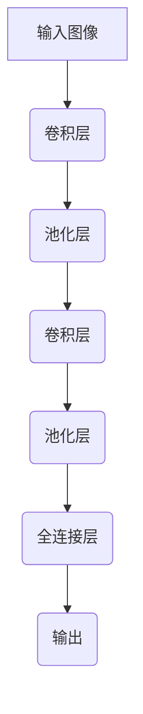
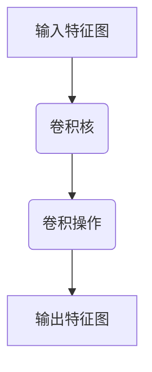
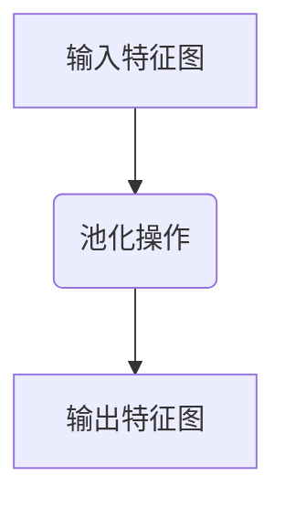
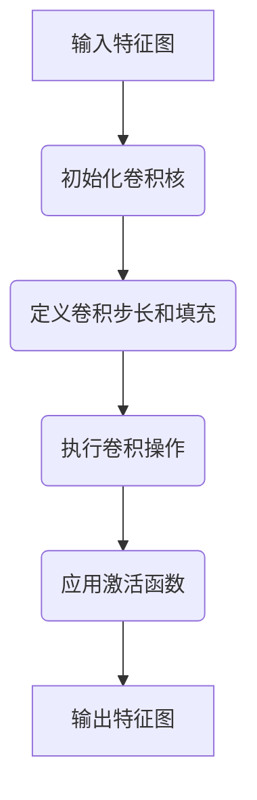
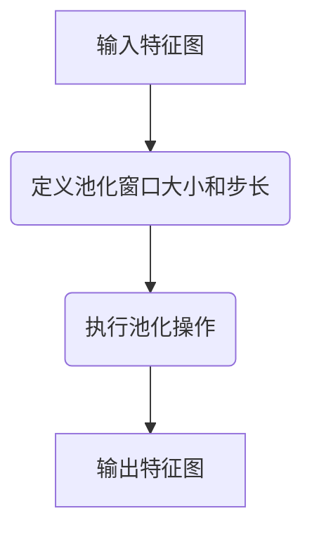
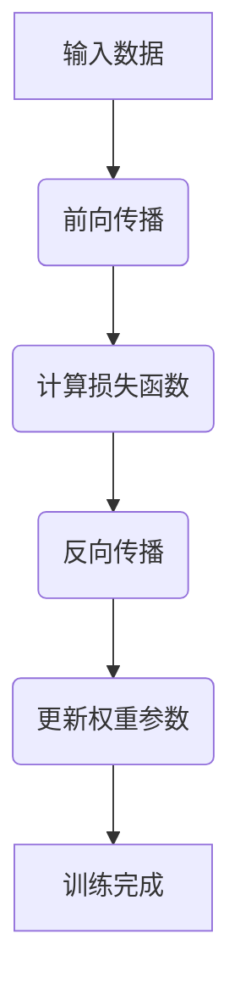

# 从零开始大模型开发与微调：卷积神经网络的原理

## 1.背景介绍

### 1.1 人工智能的兴起

人工智能(Artificial Intelligence, AI)是当代科技发展的热点领域之一,近年来受到了前所未有的关注和投资。随着算力的不断提升、数据量的激增以及算法的创新,AI技术在多个领域取得了突破性进展,展现出巨大的应用潜力。

### 1.2 深度学习的重要性

深度学习(Deep Learning)作为AI的核心技术之一,已经广泛应用于计算机视觉、自然语言处理、语音识别等诸多领域。通过构建深层次的神经网络模型,并基于海量数据进行训练,深度学习能够自动学习特征表示,捕捉数据中的复杂模式,从而解决传统机器学习方法难以应对的挑战性问题。

### 1.3 卷积神经网络在计算机视觉中的作用

在计算机视觉领域,卷积神经网络(Convolutional Neural Network, CNN)是最成功和最广泛使用的深度学习模型之一。CNN能够有效地捕捉图像的空间和局部相关性,从而实现对图像进行精确分类、检测和分割等任务。随着数据量的不断增加和算力的提升,训练大型CNN模型成为可能,这为解决更加复杂的视觉任务奠定了基础。

## 2.核心概念与联系

### 2.1 卷积神经网络的基本结构

卷积神经网络由多个卷积层、池化层和全连接层组成。其中,卷积层是CNN的核心部分,用于从输入图像中提取局部特征;池化层用于降低特征维度,减少计算量;全连接层则负责将提取的特征映射到最终的输出,如分类或回归等任务。



### 2.2 卷积操作原理

卷积操作是CNN中最关键的步骤之一。它通过在输入特征图上滑动卷积核(也称为滤波器),对局部区域进行加权求和,从而生成新的特征图。不同的卷积核能够捕捉不同的特征模式,如边缘、纹理等。通过堆叠多个卷积层,CNN可以逐层提取更加抽象和复杂的特征表示。



### 2.3 池化操作原理

池化操作通常在卷积操作之后进行,目的是降低特征图的空间维度,从而减少计算量和参数数量。常见的池化方式包括最大池化(Max Pooling)和平均池化(Average Pooling)。最大池化保留局部区域中的最大值,而平均池化则计算局部区域的平均值。池化操作不仅能够降低计算复杂度,还具有一定的平移不变性,有助于提高模型的泛化能力。



### 2.4 非线性激活函数

在卷积神经网络中,通常在卷积操作之后应用非线性激活函数,如ReLU(Rectified Linear Unit)。这种非线性映射能够增加网络的表达能力,捕捉输入数据中的非线性关系。同时,ReLU函数还具有计算简单、收敛快速等优点,因此被广泛应用于现代CNN模型中。

### 2.5 正则化技术

为了防止CNN模型过拟合,提高其泛化能力,通常需要采用正则化技术。常见的正则化方法包括L1/L2正则化(权重衰减)、Dropout、BatchNormalization等。这些技术能够减少模型的复杂度,提高其对噪声和小扰动的鲁棒性,从而提高模型在未见数据上的性能表现。

## 3.核心算法原理具体操作步骤

### 3.1 卷积操作步骤

1. **初始化卷积核**:根据任务需求和经验,初始化一组卷积核的权重参数。
2. **定义卷积步长和填充**:确定卷积核在输入特征图上滑动的步长,以及是否需要在特征图边缘进行填充(Zero Padding)以保持特征图尺寸不变。
3. **执行卷积操作**:将卷积核在输入特征图上滑动,对每个局部区域进行加权求和,生成新的特征图。
4. **应用激活函数**:通常在卷积操作之后应用非线性激活函数,如ReLU。
5. **重复上述步骤**:对于多个卷积核,重复执行上述步骤,生成多个输出特征图。



### 3.2 池化操作步骤

1. **定义池化窗口大小和步长**:确定池化操作的窗口大小(如2x2)和窗口在输入特征图上滑动的步长。
2. **执行池化操作**:对输入特征图的局部区域应用最大池化或平均池化操作,生成新的特征图。
3. **重复上述步骤**:对输入特征图的所有局部区域重复执行池化操作,直至完成整个特征图的池化。



### 3.3 前向传播和反向传播

1. **前向传播**:将输入数据通过卷积层、池化层和全连接层进行前向传播,计算最终的输出。
2. **计算损失函数**:根据输出和ground truth标签,计算损失函数的值,如交叉熵损失(分类任务)或均方误差(回归任务)。
3. **反向传播**:利用链式法则,计算损失函数相对于每个权重参数的梯度。
4. **更新权重参数**:使用优化算法(如随机梯度下降)根据计算得到的梯度,更新网络中的权重参数。
5. **重复上述步骤**:对训练数据集中的所有样本重复执行前向传播、计算损失、反向传播和更新权重的过程,直至模型收敛或达到最大迭代次数。



## 4.数学模型和公式详细讲解举例说明

### 4.1 卷积操作数学表示

卷积操作可以用下式表示:

$$
(I * K)(i, j) = \sum_{m} \sum_{n} I(i+m, j+n) K(m, n)
$$

其中:
- $I$表示输入特征图
- $K$表示卷积核
- $i, j$表示输出特征图的坐标
- $m, n$表示卷积核的坐标

该公式描述了卷积核在输入特征图上滑动,对每个局部区域进行加权求和的过程。

举例说明:

假设输入特征图$I$的大小为$5 \times 5$,卷积核$K$的大小为$3 \times 3$,步长为1,无填充。则输出特征图$O$的大小为$3 \times 3$,计算过程如下:

$$
\begin{aligned}
O(0, 0) &= I(0, 0)K(0, 0) + I(0, 1)K(0, 1) + \cdots + I(2, 2)K(2, 2) \\
O(0, 1) &= I(0, 1)K(0, 0) + I(0, 2)K(0, 1) + \cdots + I(2, 3)K(2, 2) \\
&\vdots \\
O(2, 2) &= I(2, 2)K(0, 0) + I(2, 3)K(0, 1) + \cdots + I(4, 4)K(2, 2)
\end{aligned}
$$

### 4.2 池化操作数学表示

最大池化操作可以用下式表示:

$$
(I \circledast K)(i, j) = \max_{(m, n) \in R} I(i+m, j+n)
$$

其中:
- $I$表示输入特征图
- $K$表示池化窗口
- $i, j$表示输出特征图的坐标
- $R$表示池化窗口的区域
- $\circledast$表示最大池化操作

该公式描述了在输入特征图的局部区域内取最大值的过程。

举例说明:

假设输入特征图$I$的大小为$4 \times 4$,池化窗口大小为$2 \times 2$,步长为2,则输出特征图$O$的大小为$2 \times 2$,计算过程如下:

$$
\begin{aligned}
O(0, 0) &= \max\{I(0, 0), I(0, 1), I(1, 0), I(1, 1)\} \\
O(0, 1) &= \max\{I(0, 2), I(0, 3), I(1, 2), I(1, 3)\} \\
O(1, 0) &= \max\{I(2, 0), I(2, 1), I(3, 0), I(3, 1)\} \\
O(1, 1) &= \max\{I(2, 2), I(2, 3), I(3, 2), I(3, 3)\}
\end{aligned}
$$

### 4.3 反向传播和梯度计算

在CNN的训练过程中,需要计算损失函数相对于每个权重参数的梯度,以便进行参数更新。这个过程可以通过反向传播算法实现,利用链式法则计算梯度。

假设损失函数为$L$,输出为$y$,权重参数为$w$,则根据链式法则:

$$
\frac{\partial L}{\partial w} = \frac{\partial L}{\partial y} \cdot \frac{\partial y}{\partial w}
$$

其中,第一项$\frac{\partial L}{\partial y}$可以通过损失函数的定义直接计算得到,第二项$\frac{\partial y}{\partial w}$则需要通过反向传播算法计算。

反向传播算法的核心思想是从输出层开始,逐层计算每个层的梯度,并将梯度传递到前一层,直到计算出所有权重参数的梯度。这个过程可以利用动态规划的思想,避免重复计算,提高效率。

## 5.项目实践:代码实例和详细解释说明

为了更好地理解卷积神经网络的原理和实现,我们将通过一个实际的代码示例来演示如何构建和训练一个简单的CNN模型。在这个示例中,我们将使用Python编程语言和PyTorch深度学习框架。

### 5.1 导入所需库

```python
import torch
import torch.nn as nn
import torch.optim as optim
from torchvision import datasets, transforms
```

我们首先导入PyTorch库,包括`torch`、`torch.nn`(构建神经网络模型)、`torch.optim`(优化器)和`torchvision`(数据集和数据预处理工具)。

### 5.2 定义CNN模型

```python
class CNN(nn.Module):
    def __init__(self):
        super(CNN, self).__init__()
        self.conv1 = nn.Conv2d(1, 16, kernel_size=3, stride=1, padding=1)
        self.pool = nn.MaxPool2d(kernel_size=2, stride=2)
        self.conv2 = nn.Conv2d(16, 32, kernel_size=3, stride=1, padding=1)
        self.fc1 = nn.Linear(32 * 7 * 7, 128)
        self.fc2 = nn.Linear(128, 10)

    def forward(self, x):
        x = self.pool(nn.functional.relu(self.conv1(x)))
        x = self.pool(nn.functional.relu(self.conv2(x)))
        x = x.view(-1, 32 * 7 * 7)
        x = nn.functional.relu(self.fc1(x))
        x = self.fc2(x)
        return x
```

在这个示例中,我们定义了一个简单的CNN模型,用于对MNIST手写数字图像进行分类。该模型包含以下层:

- `conv1`: 第一个卷积