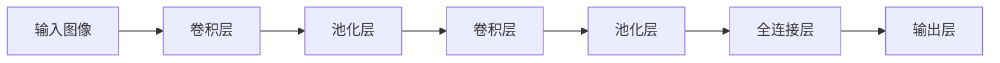

# 从零开始大模型开发与微调：实战：基于卷积的MNIST手写体分类

## 1.背景介绍

### 1.1 手写体数字识别的重要性

在当今数字时代,手写体数字识别技术已经广泛应用于多个领域,如邮政编码识别、银行支票自动处理、表格数据输入等。随着人工智能技术的快速发展,基于深度学习的手写体数字识别算法取得了长足进步,识别准确率不断提高。

### 1.2 MNIST数据集介绍

MNIST(Mixed National Institute of Standards and Technology)数据库是一个入门级的计算机视觉数据集,由来自美国人口普查局员工的手写数字构成。它包含一组60,000个训练图像和一组10,000个测试图像,每个图像都是一个28x28像素的手写数字,标注范围从0到9。

MNIST数据集因其简单性和实用性而广受欢迎,被广泛用于机器学习和深度学习算法的基准测试和教学演示。许多顶尖的机器学习模型都在MNIST上进行了测试和优化。

### 1.3 卷积神经网络在图像识别中的应用

卷积神经网络(Convolutional Neural Network, CNN)是一种专门用于处理图像和视频数据的深度神经网络。它通过局部连接、权值共享和池化等操作,能够有效地捕捉图像的局部特征,并对位移、缩放和其他形式扭曲保持一定程度的稳健性。

由于CNN在图像识别任务中表现出色,因此将其应用于MNIST手写体数字识别是一个很好的实践案例,可以帮助我们深入理解CNN的工作原理和优势。

## 2.核心概念与联系

### 2.1 卷积神经网络的基本结构

卷积神经网络主要由以下几个关键层组成:

1. **卷积层(Convolutional Layer)**: 通过滑动卷积核在输入图像上进行卷积操作,提取局部特征。
2. **池化层(Pooling Layer)**: 对卷积层的输出进行下采样,减小数据量,提高模型的泛化能力。
3. **全连接层(Fully Connected Layer)**: 将前面层的特征映射到最终的分类空间。

这些层按照一定的顺序堆叠,构成了完整的卷积神经网络模型。



### 2.2 卷积运算

卷积运算是CNN的核心操作,它通过在输入数据上滑动卷积核,计算局部区域与卷积核的点积,从而提取局部特征。

假设输入数据为$I$,卷积核为$K$,卷积运算可以表示为:

$$
S(i, j) = (I * K)(i, j) = \sum_{m}\sum_{n}I(i+m, j+n)K(m, n)
$$

其中$S(i, j)$是输出特征图在$(i, j)$位置的值。通过在整个输入数据上滑动卷积核,可以得到完整的输出特征图。

### 2.3 池化层

池化层的作用是对卷积层的输出进行下采样,减小数据量,提高模型的泛化能力。常见的池化操作有最大池化(Max Pooling)和平均池化(Average Pooling)。

以最大池化为例,它将输入特征图分成多个小区域,对每个区域取最大值作为输出。数学表达式如下:

$$
y_{i,j} = \max_{(m,n) \in R_{i,j}} x_{m,n}
$$

其中$y_{i,j}$是输出特征图在$(i, j)$位置的值,$R_{i,j}$是输入特征图上对应的小区域。

### 2.4 全连接层

全连接层是CNN中的最后一层,它将前面层提取的特征映射到最终的分类空间。每个神经元与前一层的所有神经元相连,因此称为"全连接"。

全连接层的输出通常使用Softmax函数进行归一化,得到每个类别的概率值。对于MNIST手写体数字识别任务,输出层包含10个神经元,对应0到9这10个数字类别。

## 3.核心算法原理具体操作步骤

### 3.1 数据预处理

在训练CNN模型之前,需要对MNIST数据集进行适当的预处理,包括:

1. **数据归一化**: 将像素值缩放到0到1的范围内,使用公式$x_{norm} = x / 255$。
2. **one-hot编码**: 将标签转换为one-hot编码格式,方便计算交叉熵损失。
3. **数据分割**: 将数据集分为训练集、验证集和测试集,用于模型训练、调参和评估。

### 3.2 模型构建

构建CNN模型的步骤如下:

1. **定义输入层**: 根据MNIST图像的尺寸(28x28)定义输入层。
2. **添加卷积层**: 添加多个卷积层,每个卷积层后面接一个激活函数(如ReLU)和一个池化层。
3. **添加全连接层**: 在卷积层之后添加一个或多个全连接层,用于将特征映射到分类空间。
4. **定义输出层**: 根据分类任务的类别数(MNIST为10类)定义输出层,使用Softmax激活函数。
5. **选择优化器和损失函数**: 通常使用Adam优化器和交叉熵损失函数。

一个典型的CNN模型结构可能如下:

```python
model = Sequential([
    Conv2D(32, (3, 3), activation='relu', input_shape=(28, 28, 1)),
    MaxPooling2D((2, 2)),
    Conv2D(64, (3, 3), activation='relu'),
    MaxPooling2D((2, 2)),
    Flatten(),
    Dense(128, activation='relu'),
    Dense(10, activation='softmax')
])
```

### 3.3 模型训练

训练CNN模型的步骤如下:

1. **准备数据**: 加载MNIST数据集,并进行预处理(归一化、one-hot编码等)。
2. **构建模型**: 使用上一步定义的模型结构构建CNN模型。
3. **编译模型**: 指定优化器、损失函数和评估指标。
4. **训练模型**: 使用`model.fit()`函数训练模型,可以设置训练参数如epochs、batch_size等。
5. **评估模型**: 在测试集上评估模型的性能,计算准确率等指标。
6. **保存模型**: 将训练好的模型保存,以备将来使用。

```python
model.compile(optimizer='adam', loss='categorical_crossentropy', metrics=['accuracy'])
history = model.fit(X_train, y_train, epochs=10, batch_size=128, validation_data=(X_val, y_val))
```

### 3.4 模型微调

如果模型在测试集上的性能不理想,可以尝试以下微调策略:

1. **增加训练轮数(epochs)**: 如果模型还没有完全收敛,可以增加训练轮数。
2. **调整学习率**: 适当调整学习率,可以帮助模型跳出局部最优。
3. **添加正则化**: 添加L1、L2正则化或dropout,可以减轻过拟合。
4. **调整模型结构**: 尝试增加或减少卷积层、全连接层的数量,调整卷积核大小等。
5. **数据增强**: 通过旋转、平移、缩放等方式增强训练数据,提高模型的泛化能力。

## 4.数学模型和公式详细讲解举例说明

### 4.1 卷积运算

卷积运算是CNN的核心操作,它通过在输入数据上滑动卷积核,计算局部区域与卷积核的点积,从而提取局部特征。

假设输入数据为$I$,卷积核为$K$,卷积运算可以表示为:

$$
S(i, j) = (I * K)(i, j) = \sum_{m}\sum_{n}I(i+m, j+n)K(m, n)
$$

其中$S(i, j)$是输出特征图在$(i, j)$位置的值。通过在整个输入数据上滑动卷积核,可以得到完整的输出特征图。

例如,假设输入数据$I$为:

$$
I = \begin{bmatrix}
1 & 2 & 3\\
4 & 5 & 6\\
7 & 8 & 9
\end{bmatrix}
$$

卷积核$K$为:

$$
K = \begin{bmatrix}
1 & 0 & 1\\
0 & 1 & 0\\
1 & 0 & 1
\end{bmatrix}
$$

则卷积运算的结果$S$为:

$$
S = \begin{bmatrix}
12 & 16 & 12\\
21 & 28 & 21\\
12 & 16 & 12
\end{bmatrix}
$$

可以看出,卷积运算能够提取输入数据的局部特征,例如边缘、角点等。通过堆叠多个卷积层,CNN可以逐步提取更高级的特征。

### 4.2 最大池化

最大池化是一种常见的池化操作,它将输入特征图分成多个小区域,对每个区域取最大值作为输出。数学表达式如下:

$$
y_{i,j} = \max_{(m,n) \in R_{i,j}} x_{m,n}
$$

其中$y_{i,j}$是输出特征图在$(i, j)$位置的值,$R_{i,j}$是输入特征图上对应的小区域。

例如,假设输入特征图$X$为:

$$
X = \begin{bmatrix}
1 & 2 & 3 & 4\\
5 & 6 & 7 & 8\\
9 & 10 & 11 & 12\\
13 & 14 & 15 & 16
\end{bmatrix}
$$

使用$2\times2$的最大池化,池化步长为2,则输出特征图$Y$为:

$$
Y = \begin{bmatrix}
6 & 8\\
14 & 16
\end{bmatrix}
$$

可以看出,最大池化能够保留每个区域内的最大值,从而实现下采样和特征压缩。这不仅减小了数据量,还增强了模型对位移和扭曲的鲁棒性。

### 4.3 Softmax函数

Softmax函数是一种常用的归一化函数,它将一个实数向量$\vec{x}$映射到另一个实数向量$\vec{y}$,使得$\vec{y}$的所有元素都在$[0, 1]$范围内,并且总和为1。

Softmax函数的数学表达式为:

$$
y_i = \frac{e^{x_i}}{\sum_{j=1}^{n}e^{x_j}}
$$

其中$x_i$是输入向量$\vec{x}$的第$i$个元素,$y_i$是输出向量$\vec{y}$的第$i$个元素,$n$是向量的维度。

在MNIST手写体数字识别任务中,CNN模型的输出层通常使用Softmax函数,将最后一层全连接层的输出转换为每个类别的概率值。例如,对于一个输入图像,输出层可能是:

$$
\vec{y} = \begin{bmatrix}
0.01 & 0.02 & 0.05 & 0.8 & 0.01 & 0.01 & 0.05 & 0.03 & 0.01 & 0.01
\end{bmatrix}
$$

这表示该图像被识别为数字4的概率为0.8,其他数字的概率较小。在训练过程中,模型会通过调整权重,使正确类别的概率值最大化。

## 5.项目实践：代码实例和详细解释说明

在这一部分,我们将使用Python和Keras库构建一个CNN模型,用于MNIST手写体数字识别任务。完整的代码如下:

```python
import numpy as np
from keras.datasets import mnist
from keras.models import Sequential
from keras.layers import Dense, Dropout, Flatten, Conv2D, MaxPooling2D
from keras.utils import to_categorical

# 加载MNIST数据集
(X_train, y_train), (X_test, y_test) = mnist.load_data()

# 数据预处理
X_train = X_train.reshape(X_train.shape[0], 28, 28, 1).astype('float32') / 255
X_test = X_test.reshape(X_test.shape[0], 28, 28, 1).astype('float32') / 255
y_train = to_categorical(y_train)
y_test = to_categorical(y_test)

# 构建CNN模型
model = Sequential()
model.add(Conv2D(32, (3, 3), activation='relu', input_shape=(28, 28, 1)))
model.add(MaxPooling2D((2, 