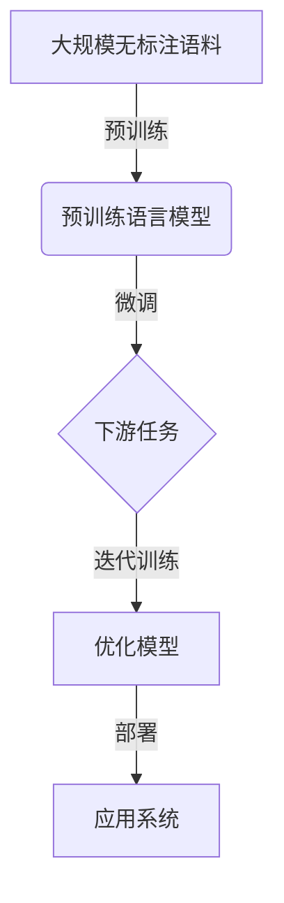

# 从零开始大模型开发与微调：更多的预训练模型

## 1. 背景介绍

### 1.1 大模型的兴起

近年来,大规模预训练语言模型在自然语言处理(NLP)领域取得了令人瞩目的成就。这些模型通过在海量无标注文本数据上进行预训练,学习到了丰富的语言知识和上下文表示,从而在下游任务上展现出了强大的泛化能力。

代表性的大模型包括 GPT(Generative Pre-trained Transformer)、BERT(Bidirectional Encoder Representations from Transformers)、XLNet、RoBERTa、ALBERT等。它们在机器翻译、问答系统、文本摘要、情感分析等多个任务上都取得了新的最佳成绩。

### 1.2 预训练模型的优势

预训练模型的主要优势在于:

1. **数据高效利用**:通过在大规模无标注数据上预训练,可以有效地利用互联网上的海量文本资源,学习到通用的语言表示。

2. **知识迁移**:预训练得到的语言模型可以在各种下游任务上进行微调(fine-tuning),实现知识迁移,避免从头开始训练,提高了任务学习的效率。

3. **少标注数据要求**:由于模型已经学习到了丰富的语言知识,因此在有限的标注数据上进行微调,就可以取得很好的性能表现。

### 1.3 大模型面临的挑战

尽管大模型取得了卓越的成绩,但它们也面临一些挑战:

1. **计算资源消耗大**:大规模预训练需要消耗大量的计算资源,对硬件设备、能源等都提出了很高的要求。

2. **数据质量影响大**:预训练质量很大程度上依赖于训练数据的质量和多样性,如何获取高质量的大规模数据是一个挑战。

3. **可解释性较差**:大模型通常是黑盒模型,其内部工作机理较为复杂,缺乏可解释性,难以对其进行分析和改进。

4. **知识遗忘**:在下游任务微调过程中,模型可能会遗忘之前学到的一些通用知识,导致性能下降。

5. **偏见和不当内容**:预训练语料中可能存在一些有偏见或不当内容,会影响模型的公平性和安全性。

因此,如何进一步提高大模型的性能、降低资源消耗、增强可解释性和鲁棒性,是当前研究的重点方向。

## 2. 核心概念与联系

### 2.1 预训练与微调

预训练(Pre-training)和微调(Fine-tuning)是大模型开发中的两个关键概念:

1. **预训练**:在大规模无标注文本数据上训练语言模型,学习通用的语言表示。常用的预训练目标包括掩码语言模型(Masked Language Model)、下一句预测(Next Sentence Prediction)等。

2. **微调**:将预训练得到的语言模型在特定的下游任务数据上进行进一步训练,使模型适应该任务的特征分布。微调过程通常只需要调整模型的部分参数,避免从头开始训练。

预训练和微调的结合使得大模型能够高效地利用无标注数据和有标注数据,实现通用知识和任务特定知识的融合。

### 2.2 自监督学习

大模型预训练过程中广泛采用了自监督学习(Self-Supervised Learning)的思想。自监督学习是一种利用无标注数据进行模型训练的范式,它通过构建预训练目标(如掩码语言模型)来自动生成监督信号,使模型学习到有用的数据表示。

相比于监督学习需要大量人工标注数据,自监督学习可以充分利用互联网上的海量无标注数据,降低了数据标注成本。同时,自监督学习还能够捕捉数据中的丰富信息,提高模型的泛化能力。

### 2.3 迁移学习

大模型开发中广泛应用了迁移学习(Transfer Learning)的思想。迁移学习旨在将在源域(如预训练语料)学习到的知识迁移到目标域(如下游任务),从而提高目标任务的学习效率。

在大模型中,预训练过程相当于在通用语料域进行知识学习,而微调过程则是将这些知识迁移到特定任务域。通过迁移学习,模型可以避免从头开始训练,充分利用已有的知识,加快任务学习的速度。

### 2.4 注意力机制

自注意力(Self-Attention)机制是大模型(如Transformer)的核心组件之一。它允许模型捕捉输入序列中任意两个位置之间的关系,并根据这些关系动态地计算序列表示。

相比于传统的循环神经网络(RNN)和卷积神经网络(CNN),自注意力机制具有更好的并行计算能力,能够有效地捕捉长距离依赖关系,因此在大模型中得到了广泛应用。

### 2.5 Mermaid 流程图

以下是大模型开发与微调的核心流程:



上述流程图展示了大模型开发的主要步骤:

1. 在大规模无标注语料上进行预训练,获得预训练语言模型。
2. 将预训练模型在特定下游任务数据上进行微调,适应任务特征分布。
3. 根据模型在下游任务上的性能,进行迭代训练和优化。
4. 将优化后的模型部署到实际的应用系统中。

## 3. 核心算法原理具体操作步骤

### 3.1 预训练阶段

大模型预训练阶段的核心算法原理和具体操作步骤如下:

1. **构建语料库**:从互联网上收集大规模无标注文本数据,构建预训练语料库。常见的语料来源包括网页、书籍、维基百科等。

2. **数据预处理**:对语料进行标记化(tokenization)、过滤、采样等预处理操作,将其转换为模型可接受的输入格式。

3. **设计预训练目标**:设计自监督学习的预训练目标,常见的目标包括掩码语言模型(Masked Language Model)和下一句预测(Next Sentence Prediction)等。

4. **模型初始化**:初始化预训练模型的参数,通常采用随机初始化或基于其他预训练模型进行初始化(如BERT基于GPT初始化)。

5. **模型训练**:使用设计好的预训练目标,在大规模语料上训练模型参数。训练过程通常采用随机梯度下降(SGD)等优化算法,并结合各种正则化技术(如dropout、权重衰减等)来防止过拟合。

6. **模型评估**:在保留的验证集上评估预训练模型的性能,如语言模型的困惑度(perplexity)等指标。根据评估结果,可以调整模型结构、超参数等,进行迭代优化。

7. **模型存储**:将训练好的预训练模型参数存储下来,以备后续在下游任务上进行微调和部署。

预训练阶段的关键在于设计合理的预训练目标,并在大规模高质量语料上进行充分训练,使模型学习到丰富的语言知识和上下文表示。

### 3.2 微调阶段

大模型微调阶段的核心算法原理和具体操作步骤如下:

1. **准备任务数据**:收集特定下游任务的标注数据集,并进行必要的数据预处理,如分词、填充、编码等。

2. **加载预训练模型**:加载预训练好的语言模型参数,作为微调的初始化参数。

3. **构建微调模型**:根据下游任务的特点,在预训练模型的基础上构建微调模型。常见的做法是在预训练模型的输出上添加特定的任务层(task-specific layer),如分类层、序列标注层等。

4. **设置微调策略**:确定微调过程中需要更新的模型参数。通常情况下,只需要微调预训练模型的部分参数(如最后几层),而保持大部分参数固定,以避免知识遗忘。

5. **模型微调**:使用下游任务的标注数据,对微调模型进行训练。微调过程通常采用较小的学习率,以实现对预训练模型的细微调整。

6. **模型评估**:在保留的测试集上评估微调模型在下游任务上的性能,如分类准确率、F1分数等指标。根据评估结果,可以调整模型结构、超参数等,进行迭代优化。

7. **模型部署**:将最终的微调模型部署到实际的应用系统中,用于处理新的输入数据。

微调阶段的关键在于合理利用预训练模型的知识,并在有限的任务数据上进行适当的调整,使模型能够很好地适应下游任务的特征分布。

## 4. 数学模型和公式详细讲解举例说明

大模型中广泛使用了自注意力(Self-Attention)机制,其数学模型和公式如下:

假设输入序列为 $X = (x_1, x_2, \dots, x_n)$,其中 $x_i \in \mathbb{R}^{d_x}$ 表示第 $i$ 个位置的输入向量。自注意力机制的计算过程可以表示为:

$$\begin{aligned}
Q &= XW^Q \\
K &= XW^K \\
V &= XW^V \\
\text{Attention}(Q, K, V) &= \text{softmax}\left(\frac{QK^T}{\sqrt{d_k}}\right)V
\end{aligned}$$

其中:

- $W^Q \in \mathbb{R}^{d_x \times d_k}$、$W^K \in \mathbb{R}^{d_x \times d_k}$、$W^V \in \mathbb{R}^{d_x \times d_v}$ 分别是查询(Query)、键(Key)和值(Value)的线性投影矩阵。
- $Q \in \mathbb{R}^{n \times d_k}$ 表示查询矩阵,其中每一行对应一个位置的查询向量。
- $K \in \mathbb{R}^{n \times d_k}$ 表示键矩阵,其中每一行对应一个位置的键向量。
- $V \in \mathbb{R}^{n \times d_v}$ 表示值矩阵,其中每一行对应一个位置的值向量。
- $\text{softmax}(\cdot)$ 是softmax函数,用于计算注意力权重。
- $\frac{QK^T}{\sqrt{d_k}}$ 计算查询和键之间的相似性分数,其中 $\sqrt{d_k}$ 是一个缩放因子,用于避免内积过大导致的梯度饱和问题。

自注意力机制的核心思想是,通过计算查询和所有键之间的相似性分数,得到一个注意力权重矩阵。然后,将注意力权重矩阵与值矩阵相乘,即可获得每个位置的加权和表示,作为该位置的输出向量。

以上是自注意力机制的基本形式,在实际应用中还会引入多头注意力(Multi-Head Attention)、位置编码(Positional Encoding)等扩展,以提高模型的表示能力和捕捉长距离依赖关系的能力。

## 5. 项目实践:代码实例和详细解释说明

以下是使用PyTorch实现自注意力机制的代码示例,并对关键步骤进行了详细解释:

```python
import torch
import torch.nn as nn

class MultiHeadAttention(nn.Module):
    def __init__(self, d_model, num_heads):
        super(MultiHeadAttention, self).__init__()
        self.num_heads = num_heads
        self.d_model = d_model
        
        self.W_q = nn.Linear(d_model, d_model)
        self.W_k = nn.Linear(d_model, d_model)
        self.W_v = nn.Linear(d_model, d_model)
        self.W_o = nn.Linear(d_model, d_model)
        
    def forward(self, query, key, value, mask=None):
        # 1. 线性投影
        query = self.W_q(query)
        key = self.W_k(key)
        value = self.W_v(value)
        
        # 2. 分头
        q = query.view(query.size(0), -1, self.num_