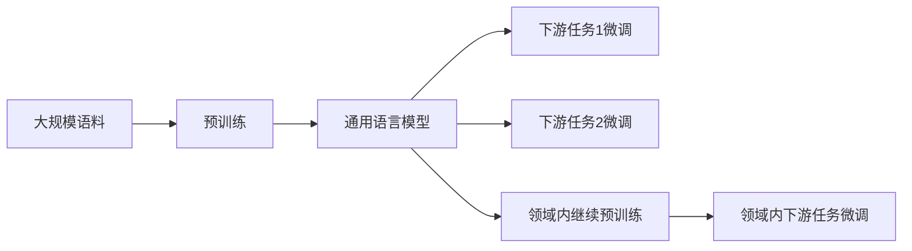

# 从零开始大模型开发与微调：汉字的文本处理

## 1. 背景介绍
### 1.1 大模型的兴起
近年来,随着深度学习技术的飞速发展,大规模预训练语言模型(Pre-trained Language Models,PLMs)受到了学术界和工业界的广泛关注。以GPT、BERT、RoBERTa等为代表的大模型在各类自然语言处理任务上取得了显著的性能提升,展现出了强大的语言理解和生成能力。这些大模型通过在海量文本语料上进行无监督预训练,学习到了丰富的语言知识和通用语义表示,可以方便地应用到下游任务中,大大降低了任务特定训练数据的需求。

### 1.2 中文大模型面临的挑战 
然而,目前大多数主流的大模型都是在英文等拉丁语系语料上训练的,对中文等表意文字的支持还不够完善。相比英文等拼音文字,中文作为一种表意文字,具有字符数量多、语法结构灵活、语义复杂等特点,给大模型的开发和应用带来了独特的挑战:

1. 汉字字符集巨大,需要更大的词表和嵌入维度。
2. 中文缺乏显式的词边界,需要进行分词等预处理。
3. 中文语法结构灵活多变,对模型捕捉长距离依赖提出更高要求。
4. 中文语义丰富,一词多义、同义词等现象普遍,语义理解难度大。

因此,要让大模型很好地处理中文,需要针对性地进行模型结构优化、训练技巧改进以及中文特有的文本处理。本文将系统地介绍如何从零开始进行面向中文的大模型开发与微调,重点关注其中的文本处理环节。

### 1.3 本文的组织结构
全文组织结构如下:
- 第2节介绍大模型开发的核心概念,包括预训练、微调、迁移学习等。 
- 第3节重点讲解中文文本处理的各个步骤,如编码、分词、词嵌入等。
- 第4节介绍相关的数学原理,包括 Transformer 结构、注意力机制、损失函数等。
- 第5节给出基于PyTorch的大模型实现代码,并进行详细的注释说明。
- 第6节讨论中文大模型的主要应用场景,如机器翻译、智能问答、文本生成等。
- 第7节推荐一些开源的中文大模型和实用工具,方便读者进一步研究。
- 第8节总结全文,并展望中文大模型未来的发展方向和挑战。
- 第9节的附录部分解答了一些常见问题。

## 2. 核心概念与联系
### 2.1 大模型的定义与特点
大模型泛指基于海量数据训练的大规模深度神经网络模型,通常包含数亿到数千亿个参数。它们一般采用Transformer等高容量的网络结构,并在大规模无标注语料上进行自监督预训练,学习通用的语言表示。预训练阶段常见的训练目标有语言模型、掩码语言模型等,旨在让模型从海量语料中习得丰富的语法、语义、常识等知识。这些知识可以在下游任务微调时加以利用,大幅提升模型的泛化能力。

### 2.2 预训练(Pre-training)
预训练是大模型的关键所在。与传统的有监督学习不同,预训练不需要人工标注数据,而是让模型在大规模无标注语料上自主学习,从而掌握语言的一般规律。常见的预训练任务包括:

- 语言模型(Language Modeling):让模型学习根据上文预测下一个词,捕捉词序关系。
- 掩码语言模型(Masked Language Modeling):随机掩盖句子中的部分词,让模型根据上下文预测,学习词的语义。
- 句子连贯性判别(Next Sentence Prediction):让模型判断两个句子在语义上是否连贯,学习长距离语义依赖。
- 词类比推理(Word Analogy):让模型学习词之间的语义关系,如"北京之于中国相当于巴黎之于法国"。

通过这些预训练任务,模型可以学习到语言的一般性知识,建立起丰富的语言表示空间。

### 2.3 微调(Fine-tuning)
微调是利用预训练模型来解决具体任务的过程。具体来说,我们在预训练模型的基础上添加一些任务特定的输出层(如分类、序列标注等),然后在带标签的任务数据上进一步训练模型,让其学会完成特定任务。由于预训练模型已经具备了丰富的语言知识,微调一般只需要少量的任务数据和训练轮数就可以取得不错的效果。微调可以显著提高模型的样本效率和泛化能力。

### 2.4 迁移学习(Transfer Learning)  
迁移学习是指将一个领域学习到的知识迁移应用到另一个相关领域。大模型的预训练-微调范式本质上就是一种迁移学习,即将大规模语料上学到的通用语言知识迁移到具体任务中。此外,我们还可以在已有大模型的基础上,利用领域数据进行继续预训练,学习特定领域知识,然后再微调到具体任务,实现领域内的迁移学习。

### 2.5 概念之间的关系
下图展示了预训练、微调、迁移学习这几个核心概念之间的关系:

可以看到,预训练是利用大规模语料训练通用语言模型的过程;微调是在预训练模型基础上利用任务数据训练的过程;领域内继续预训练是利用预训练模型在特定领域语料上进一步训练的过程,相当于在通用和特定领域之间的迁移学习。

## 3. 核心算法原理具体操作步骤
本节重点介绍中文大模型开发中的核心环节——文本处理,主要包括编码、分词、词嵌入等步骤。

### 3.1 文本编码
首先需要将原始的中文文本转换为计算机能够处理的数字形式,这个过程称为编码(Encoding)。常见的中文编码方式有:

- UTF-8:一种变长编码,可以覆盖几乎所有的汉字,是目前应用最广泛的编码方式。
- GBK:双字节编码,覆盖了大部分常用汉字,但已经较为过时。
- BIG5:繁体中文编码,应用于港澳台地区。

在大模型开发中,我们通常采用UTF-8编码。编码后,每个汉字都对应一个或多个字节的数字表示。

编码的具体步骤如下:
1. 读入原始中文文本。
2. 指定编码格式,如UTF-8。
3. 利用编码格式将每个汉字转换为对应的字节数字。
4. 将编码后的数字序列传入后续的文本处理流程。

### 3.2 中文分词
与英文不同,中文文本没有显式的词边界(如空格),需要通过分词(Word Segmentation)将连续的字符序列切分成有意义的词。分词的目的是让模型更好地理解文本语义。常见的中文分词方法有:

- 基于字典的方法:维护一个词典,将文本与词典匹配来识别词。
- 基于统计的方法:通过统计词频、互信息等信息,利用机器学习方法建立分词模型。
- 基于神经网络的方法:利用BiLSTM-CRF等深度学习模型进行端到端的分词。

目前,主流的中文分词工具有jieba、THULAC、LTP等,多采用基于统计的方法。在大模型开发中,我们可以利用这些工具进行分词预处理。

分词的基本步骤如下:
1. 对编码后的文本进行预处理,如去除乱码、标点、特殊字符等。
2. 加载分词工具和相应的词典、模型。
3. 调用分词接口,对文本进行分词。分词后,词之间通常用空格隔开。
4. 将分词后的文本传入后续的词嵌入等处理。

### 3.3 词嵌入
为了让模型更好地理解词语语义,我们通常将每个词映射到一个低维稠密向量,称为词嵌入(Word Embedding)。词嵌入可以通过词共现统计(如GloVe)或神经网络学习(如word2vec)等方法获得。在大模型中,我们通常使用随机初始化的词嵌入,并在训练过程中进行端到端学习。

构建词嵌入的步骤如下:
1. 对分词后的文本建立词表,记录所有唯一词。
2. 根据词表大小和嵌入维度随机初始化词嵌入矩阵,每一行对应一个词的嵌入向量。 
3. 将词映射为词表中的索引,然后通过索引在嵌入矩阵中查找对应的词向量。
4. 将词向量序列传入神经网络模型进行训练,在训练过程中端到端优化嵌入矩阵。

### 3.4 文本处理流程总结
综上,中文大模型开发中的文本处理可以总结为"编码-分词-嵌入"三个主要步骤,如下图所示:

这个流程可以有效地将原始的中文文本转换为神经网络可以处理的数值形式,为后续的大模型训练奠定基础。

## 4. 数学模型和公式详细讲解举例说明
本节介绍构建中文大模型所涉及的主要数学原理,包括Transformer结构、注意力机制、掩码语言模型等。

### 4.1 Transformer结构
Transformer是一种基于自注意力机制的神经网络结构,已成为大模型的主流架构。与传统的RNN、CNN等结构不同,Transformer可以并行计算,更适合处理长文本。

Transformer主要由编码器(Encoder)和解码器(Decoder)组成,每个编码器和解码器都包含多个相同的子层。以编码器为例,主要包含三个子层:

- 自注意力层(Self-Attention):捕捉文本内部的长距离依赖关系。
- 前馈神经网络层(Feed-Forward):增加模型的非线性表达能力。
- 残差连接和层归一化(Residual Connection and Layer Normalization):促进梯度传播,加速训练收敛。

假设编码器的输入是一个词嵌入序列 $\mathbf{X} \in \mathbb{R}^{n \times d}$,其中 $n$ 为序列长度, $d$ 为嵌入维度。自注意力层首先将 $\mathbf{X}$ 线性变换为查询矩阵 $\mathbf{Q}$、键矩阵 $\mathbf{K}$ 和值矩阵 $\mathbf{V}$:

$$
\mathbf{Q} = \mathbf{X} \mathbf{W}^Q, \quad
\mathbf{K} = \mathbf{X} \mathbf{W}^K, \quad
\mathbf{V} = \mathbf{X} \mathbf{W}^V
$$

其中 $\mathbf{W}^Q, \mathbf{W}^K, \mathbf{W}^V \in \mathbb{R}^{d \times d_k}$ 为可学习的权重矩阵。然后,通过查询矩阵和键矩阵的点积计算注意力权重,再对值矩阵加权求和,得到输出 $\mathbf{Z}$:

$$
\mathbf{Z} = \text{softmax} \left( \frac{\mathbf{Q} \mathbf{K}^T}{\sqrt{d_k}} \right) \mathbf{V}
$$

前馈层通过两层全连接网络增加非线性变换:

$$
\text{FFN}(\mathbf{Z}) = \text{ReLU}(\mathbf{Z} \mathbf{W}_1 + \mathbf{b}_1) \mathbf{W}_2 + \mathbf{b}_2
$$

残差连接和层归一化