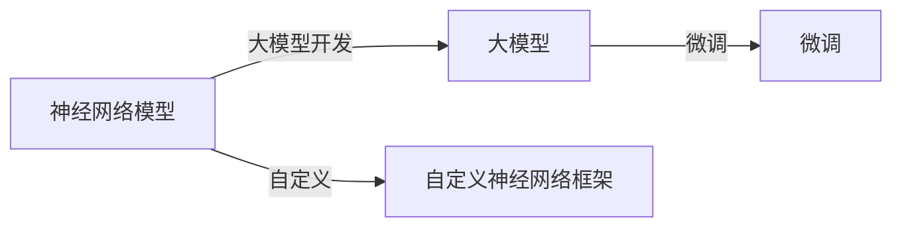

## 1.背景介绍

在人工智能领域，神经网络模型的开发和微调是一项核心技术。许多先进的AI应用，如自动驾驶、智能医疗、自然语言处理等，都离不开大模型的开发与微调。然而，如何从零开始，实现自定义神经网络框架，是许多研发人员和AI爱好者面临的挑战。今天，我将带领大家一起探讨这个问题。

## 2.核心概念与联系

神经网络模型的开发与微调，主要涉及到以下几个核心概念：

- **神经网络模型**：神经网络模型是一种模仿人脑神经元连接方式的计算模型，用于处理和解决复杂的非线性问题。
- **大模型**：大模型通常指的是参数量较大的神经网络模型，例如BERT、GPT-3等。
- **微调**：微调是一种迁移学习技术，通过在预训练模型的基础上进行细节调整，使模型能够适应新的任务。
- **自定义神经网络框架**：自定义神经网络框架指的是根据特定需求，自行设计和实现的神经网络模型结构。

这些概念之间的联系可以通过以下Mermaid流程图进行展示：



## 3.核心算法原理具体操作步骤

开发大模型和进行微调的核心算法原理可以概括为以下几个步骤：

1. **模型设计**：设计神经网络的结构，包括选择适合的层类型、设置层数和节点数等。
2. **模型训练**：通过前向传播和反向传播算法，逐步调整模型的参数，使模型的预测结果尽可能接近实际结果。
3. **模型微调**：在预训练模型的基础上，对模型进行微调，使其能够适应新的任务。微调通常包括冻结部分层的参数、调整学习率等。
4. **模型评估**：通过准确率、损失函数值等指标，评估模型的性能。

## 4.数学模型和公式详细讲解举例说明

在神经网络模型开发与微调中，我们需要理解一些核心的数学模型和公式。例如，前向传播和反向传播算法的数学模型。

- **前向传播**：在前向传播阶段，我们通过以下公式计算每一层的输出：

$$
h_{l} = f(W_{l}h_{l-1} + b_{l})
$$

其中，$h_{l}$表示第$l$层的输出，$W_{l}$和$b_{l}$分别表示第$l$层的权重和偏置，$f$表示激活函数。

- **反向传播**：在反向传播阶段，我们通过以下公式更新每一层的权重和偏置：

$$
W_{l} = W_{l} - \alpha \frac{\partial L}{\partial W_{l}}
$$

$$
b_{l} = b_{l} - \alpha \frac{\partial L}{\partial b_{l}}
$$

其中，$L$表示损失函数，$\alpha$表示学习率，$\frac{\partial L}{\partial W_{l}}$和$\frac{\partial L}{\partial b_{l}}$分别表示损失函数关于权重和偏置的梯度。

## 5.项目实践：代码实例和详细解释说明

下面，我们将通过一个简单的例子，来展示如何在Python中使用PyTorch库，实现神经网络模型的开发与微调。

```python
import torch
import torch.nn as nn
import torch.optim as optim

# 定义模型
class Net(nn.Module):
    def __init__(self):
        super(Net, self).__init__()
        self.fc1 = nn.Linear(10, 20)
        self.fc2 = nn.Linear(20, 2)

    def forward(self, x):
        x = torch.relu(self.fc1(x))
        x = self.fc2(x)
        return x

# 实例化模型
net = Net()

# 定义损失函数和优化器
criterion = nn.CrossEntropyLoss()
optimizer = optim.SGD(net.parameters(), lr=0.01)

# 训练模型
for epoch in range(100):
    inputs, labels = torch.randn(5, 10), torch.tensor([1, 0, 1, 0, 1])
    outputs = net(inputs)
    loss = criterion(outputs, labels)
    optimizer.zero_grad()
    loss.backward()
    optimizer.step()

# 微调模型
for param in net.fc1.parameters():
    param.requires_grad = False
optimizer = optim.SGD(filter(lambda p: p.requires_grad, net.parameters()), lr=0.01)
```

在这个例子中，我们首先定义了一个简单的神经网络模型，然后通过反复迭代，训练模型的参数。在模型训练完成后，我们冻结了第一层的参数，然后对模型进行微调。

## 6.实际应用场景

神经网络模型的开发与微调，在许多实际应用场景中都有着广泛的应用。例如：

- **自然语言处理**：在自然语言处理中，我们可以通过开发大模型，如BERT、GPT-3等，进行语义理解、情感分析、机器翻译等任务。同时，我们也可以通过微调技术，使模型能够适应特定的任务，如特定领域的文本分类、命名实体识别等。
- **计算机视觉**：在计算机视觉中，我们可以通过开发大模型，如ResNet、VGG等，进行图像分类、物体检测、语义分割等任务。同时，我们也可以通过微调技术，使模型能够适应特定的任务，如特定场景的目标检测、特定人群的人脸识别等。

## 7.工具和资源推荐

在神经网络模型的开发与微调中，以下工具和资源可能会对你有所帮助：

- **PyTorch**：一个具有强大功能和灵活性的深度学习框架，适合进行神经网络模型的开发与微调。
- **TensorFlow**：一个由Google开发的开源机器学习框架，提供了丰富的API和工具，支持多种平台和语言。
- **Hugging Face Transformers**：一个提供了大量预训练模型和微调方法的库，适合进行自然语言处理任务。

## 8.总结：未来发展趋势与挑战

随着技术的发展，神经网络模型的开发与微调将会面临新的趋势和挑战。

- **趋势**：随着计算能力的提升和数据量的增加，大模型将会越来越普遍。同时，微调技术也将更加成熟，能够更好地适应各种任务。
- **挑战**：如何有效地训练大模型，以及如何在微调中保持模型的泛化能力，将会是未来的重要挑战。

## 9.附录：常见问题与解答

1. **问**：如何选择合适的神经网络结构？
   **答**：选择神经网络结构需要考虑任务的复杂性、数据的量和质量、计算资源等因素。一般来说，任务越复杂，需要的模型就越大；数据量越大，可以训练的模型就越复杂；计算资源越丰富，可以尝试的模型就越多。

2. **问**：如何进行模型的微调？
   **答**：模型的微调通常包括冻结部分层的参数、调整学习率等。具体的微调策略需要根据任务的具体情况来确定。

3. **问**：如何评估模型的性能？
   **答**：评估模型的性能可以通过准确率、损失函数值等指标。除了这些指标外，还可以通过实际的应用效果来评估模型的性能。

作者：禅与计算机程序设计艺术 / Zen and the Art of Computer Programming