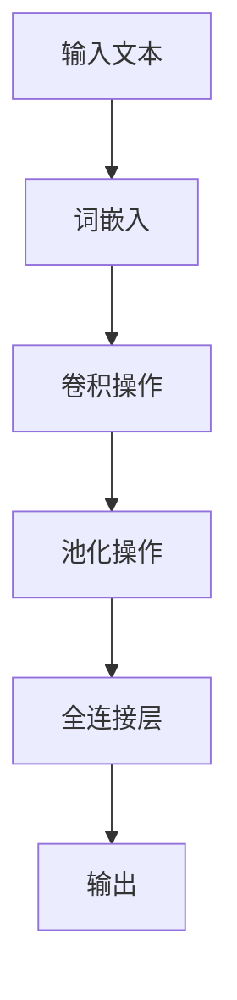

# 从零开始大模型开发与微调：针对文本的卷积神经网络模型简介—词卷积

## 1.背景介绍

### 1.1 自然语言处理的重要性

在当今的数字时代，自然语言处理(Natural Language Processing, NLP)已经成为一个不可或缺的技术领域。它使计算机能够理解、解释和生成人类语言,为各种应用程序提供了强大的支持,如机器翻译、文本分类、情感分析、问答系统等。随着大数据和人工智能技术的快速发展,NLP的重要性与日俱增。

### 1.2 深度学习在NLP中的应用

深度学习(Deep Learning)是一种基于人工神经网络的机器学习技术,它通过构建多层非线性变换模型来学习数据的高阶特征表示,从而解决复杂的问题。近年来,深度学习在NLP领域取得了巨大的成功,推动了该领域的快速发展。

### 1.3 卷积神经网络在NLP中的作用

卷积神经网络(Convolutional Neural Network, CNN)最初被广泛应用于计算机视觉领域,但后来也被成功地引入到NLP任务中。CNN能够自动学习文本数据的局部特征,并通过卷积和池化操作提取高阶语义表示,从而有效地捕捉文本的上下文信息。

### 1.4 词卷积模型的优势

传统的NLP模型通常依赖于手工设计的特征工程,而词卷积(Word-level CNN)模型则能够自动学习文本的语义表示,无需复杂的特征工程。此外,词卷积模型具有参数高效、训练简单、可解释性强等优势,因此在NLP任务中得到了广泛的应用。

## 2.核心概念与联系

### 2.1 词嵌入(Word Embedding)

词嵌入是将单词映射到低维连续向量空间的技术,它能够捕捉单词之间的语义和句法关系。在词卷积模型中,通常使用预训练的词嵌入(如Word2Vec或GloVe)作为输入,以提高模型的性能。

### 2.2 卷积操作(Convolution Operation)

卷积操作是CNN的核心部分,它通过在输入数据上滑动卷积核(Kernel)来提取局部特征。在词卷积模型中,卷积核会在词嵌入矩阵上滑动,捕捉不同窗口大小的语义信息。

### 2.3 池化操作(Pooling Operation)

池化操作用于降低特征维度,同时保留重要的特征信息。在词卷积模型中,通常使用最大池化(Max Pooling)来捕捉每个卷积核窗口中最重要的特征。

### 2.4 全连接层(Fully Connected Layer)

全连接层是神经网络的最后一层,它将前面层的特征映射到目标空间。在词卷积模型中,全连接层通常用于将卷积和池化后的特征映射到最终的分类或回归任务。

### 2.5 核心概念关系图



## 3.核心算法原理具体操作步骤

### 3.1 数据预处理

1. **文本清理**: 去除文本中的标点符号、数字、特殊字符等无用信息。
2. **分词**: 将文本按照一定的规则分割成单词序列。
3. **构建词典**: 统计语料库中出现的所有单词,并为每个单词分配一个唯一的索引。
4. **填充(Padding)**: 将所有句子的长度统一为最大长度,短句子使用特殊的填充标记(如0)进行填充。

### 3.2 词嵌入层

使用预训练的词嵌入模型(如Word2Vec或GloVe)将每个单词映射到低维连续向量空间。假设词典的大小为$V$,词嵌入的维度为$d$,则词嵌入矩阵的大小为$V \times d$。

### 3.3 卷积层

1. **卷积核初始化**: 初始化多个不同窗口大小的卷积核,如$n$个大小为$h \times d$的卷积核。
2. **卷积操作**: 对于每个卷积核,在词嵌入矩阵上进行卷积操作,生成一个特征映射。假设句子长度为$l$,则每个特征映射的大小为$l-h+1$。
3. **激活函数**: 通常使用非线性激活函数(如ReLU)对卷积结果进行处理,以增加模型的表达能力。

### 3.4 池化层

对每个特征映射进行最大池化操作,提取最重要的特征。假设使用宽度为$s$的最大池化,则每个特征映射的大小将变为$\frac{l-h+1}{s}+1$。

### 3.5 全连接层

将所有池化后的特征映射拼接成一个向量,并通过全连接层映射到目标空间(如分类或回归任务)。

### 3.6 模型训练

使用反向传播算法和优化器(如Adam或SGD)对模型进行端到端的训练,最小化损失函数(如交叉熵损失或均方误差)。

## 4.数学模型和公式详细讲解举例说明

### 4.1 词嵌入层

设$x_i \in \mathbb{R}^d$表示第$i$个单词的词嵌入向量,则输入句子$X$的词嵌入矩阵为:

$$X = \begin{bmatrix} x_1 \\ x_2 \\ \vdots \\ x_l \end{bmatrix} \in \mathbb{R}^{l \times d}$$

其中$l$为句子长度。

### 4.2 卷积层

对于大小为$h \times d$的卷积核$W_j$,其卷积操作可表示为:

$$c_{i,j} = f(W_j \cdot x_{i:i+h-1} + b_j)$$

其中$f$为非线性激活函数(如ReLU),$b_j$为偏置项,$x_{i:i+h-1}$表示从第$i$个单词开始的长度为$h$的窗口。对于整个句子,第$j$个卷积核的特征映射为:

$$\vec{c_j} = [c_{1,j}, c_{2,j}, \dots, c_{l-h+1,j}]$$

### 4.3 池化层

对于每个特征映射$\vec{c_j}$,使用宽度为$s$的最大池化操作:

$$\hat{c_j} = \max\limits_{i=1,\dots,\frac{l-h+1}{s}+1} \{c_{(i-1)s+1,j}, \dots, c_{is,j}\}$$

其中$\hat{c_j}$为池化后的特征。

### 4.4 全连接层

将所有池化后的特征拼接成一个向量$z$:

$$z = [\hat{c_1}, \hat{c_2}, \dots, \hat{c_n}]$$

然后通过全连接层映射到目标空间:

$$\hat{y} = \sigma(W_o z + b_o)$$

其中$W_o$和$b_o$分别为全连接层的权重和偏置,$\sigma$为激活函数(如Softmax)。

### 4.5 损失函数和优化

对于分类任务,通常使用交叉熵损失函数:

$$J(\theta) = -\frac{1}{N} \sum_{i=1}^N \sum_{j=1}^C y_{i,j} \log \hat{y}_{i,j}$$

其中$\theta$为模型参数,$N$为训练样本数,$C$为类别数,$y_{i,j}$和$\hat{y}_{i,j}$分别为真实标签和预测概率。

对于回归任务,通常使用均方误差损失函数:

$$J(\theta) = \frac{1}{N} \sum_{i=1}^N (\hat{y}_i - y_i)^2$$

其中$\hat{y}_i$和$y_i$分别为预测值和真实值。

使用优化算法(如Adam或SGD)最小化损失函数,从而训练模型参数$\theta$。

## 5.项目实践：代码实例和详细解释说明

下面是一个使用PyTorch实现的词卷积模型示例,用于文本分类任务。

### 5.1 导入所需库

```python
import torch
import torch.nn as nn
import torch.nn.functional as F
```

### 5.2 定义词卷积模型

```python
class WordCNN(nn.Module):
    def __init__(self, vocab_size, embedding_dim, n_filters, filter_sizes, output_dim, dropout):
        super().__init__()
        
        self.embedding = nn.Embedding(vocab_size, embedding_dim)
        self.convs = nn.ModuleList([nn.Conv2d(1, n_filters, (filter_size, embedding_dim)) 
                                    for filter_size in filter_sizes])
        self.fc = nn.Linear(len(filter_sizes) * n_filters, output_dim)
        self.dropout = nn.Dropout(dropout)
        
    def forward(self, text):
        # text = [batch size, sent len]
        embedded = self.embedding(text)
        # embedded = [batch size, sent len, emb dim]
        embedded = embedded.unsqueeze(1)
        # embedded = [batch size, 1, sent len, emb dim]
        conved = [F.relu(conv(embedded)).squeeze(3) for conv in self.convs]
        # conved_n = [batch size, n_filters, sent len - filter_size + 1]
        pooled = [F.max_pool1d(conv, conv.shape[2]).squeeze(2) for conv in conved]
        # pooled_n = [batch size, n_filters]
        cat = self.dropout(torch.cat(pooled, dim=1))
        # cat = [batch size, n_filters * len(filter_sizes)]
        return self.fc(cat)
```

### 5.3 代码解释

1. **初始化层**:
   - `nn.Embedding`层用于将单词索引映射到词嵌入向量。
   - `nn.Conv2d`层用于实现卷积操作,每个卷积核的大小为`(filter_size, embedding_dim)`。
   - `nn.Linear`层用于实现全连接层,将池化后的特征映射到目标空间。
   - `nn.Dropout`层用于防止过拟合。

2. **前向传播**:
   - 将输入文本`text`通过`nn.Embedding`层获取词嵌入向量`embedded`。
   - 对`embedded`增加一个维度,使其形状为`[batch_size, 1, sent_len, emb_dim]`,以便进行2D卷积操作。
   - 对每个卷积核进行卷积操作,并应用ReLU激活函数,得到一系列特征映射`conved`。
   - 对每个特征映射进行最大池化操作,得到一系列池化后的特征`pooled`。
   - 将所有池化后的特征拼接成一个向量`cat`,并通过Dropout层防止过拟合。
   - 将`cat`输入全连接层,得到最终的输出。

### 5.4 使用示例

```python
# 超参数设置
vocab_size = 10000
embedding_dim = 300
n_filters = 100
filter_sizes = [3, 4, 5]
output_dim = 2  # 二分类任务
dropout = 0.5

# 初始化模型
model = WordCNN(vocab_size, embedding_dim, n_filters, filter_sizes, output_dim, dropout)

# 准备输入数据
text = torch.randint(0, vocab_size, (32, 50))  # 批量大小为32,句子长度为50

# 前向传播
output = model(text)
```

在上述示例中,我们定义了一个词卷积模型,用于二分类任务。模型的输入是一个形状为`(32, 50)`的张量,表示一个批量中包含32个长度为50的句子,每个单词用一个索引表示。模型的输出是一个形状为`(32, 2)`的张量,表示每个句子属于两个类别的概率分数。

## 6.实际应用场景

词卷积模型在自然语言处理领域有着广泛的应用,包括但不限于以下场景:

1. **文本分类**: 将文本(如新闻、评论、电子邮件等)分类到预定义的类别中,如情感分析、垃圾邮件检测、主题分类等。

2. **序列标注**: 对文本序列中的每个单词或短语进行标注,如命名实体识别、词性标注、语义角色标注等。

3. **机器翻译**: 将一种自然语言的文本翻译成另一种语言,如英语到中文的翻译。

4. **文本相似度计算**: 计算两段文本之间的语义相似度,用于文本聚类、重复检测、问答系统等应用。

5. **关系抽取**: 从文本中识别和抽取实体之间的关