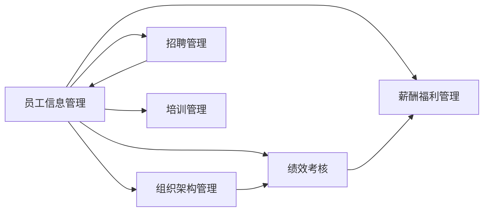

# 企业人事管理系统详细设计与具体代码实现

## 1. 背景介绍

在现代企业管理中,人力资源管理是一个至关重要的环节。随着企业规模的不断扩大,人员数量的增加,传统的人工管理方式已经无法满足企业发展的需求。因此,开发一套功能完善、高效稳定的人事管理系统就显得尤为重要。

本文将详细介绍企业人事管理系统的设计与实现。通过对系统需求的分析,设计出合理的系统架构,并使用主流的技术栈进行开发,最终实现一个可用性高、扩展性强的人事管理系统。

## 2. 核心概念与联系

在企业人事管理系统中,涉及到以下几个核心概念:

- 员工信息管理:包括员工的基本信息、职位、薪资、考勤等内容。
- 组织架构管理:企业内部的部门结构、岗位设置、汇报关系等。
- 招聘管理:员工招聘流程、面试安排、offer管理等。
- 绩效考核:员工绩效目标设定、考核、结果反馈等。
- 薪酬福利管理:工资计算、社保公积金、福利发放等。
- 培训管理:员工培训计划、课程安排、效果评估等。

这些概念之间存在着紧密的联系。员工信息是整个系统的基础数据,组织架构关系到员工的所属部门和汇报对象,招聘管理是员工入职的起点,绩效考核和薪酬发放需要依赖员工信息和考勤数据,培训管理也需要与员工信息挂钩。

下图展示了这些概念之间的关系:



## 3. 核心算法原理具体操作步骤

在人事管理系统中,有几个核心算法值得关注:

### 3.1 组织架构的树形结构设计

组织架构通常是一个树形结构。可以用如下步骤构建组织架构树:

1. 定义部门类,包含部门ID、部门名称、父部门ID等字段。
2. 从数据库中查询所有部门数据,形成部门列表。
3. 遍历部门列表,对于每个部门:
   - 如果父部门ID为空,则该部门为根节点,加入树的顶层。 
   - 否则,在树中找到该部门的父部门,将该部门加入父部门的子部门列表。
4. 返回构建好的组织架构树。

### 3.2 考勤数据的统计算法

考勤数据的统计可以按照以下步骤进行:

1. 确定统计的时间范围,如最近一个月。
2. 从数据库中查询该时间范围内的所有考勤记录。
3. 对每条考勤记录,判断其打卡时间是否在正常上下班时间范围内,如果不在,则记为异常打卡。
4. 按员工和日期分组,统计每个员工每天的上班时间、下班时间、工作时长。
5. 汇总每个员工在统计时间范围内的总工作时长、异常打卡次数等指标。

### 3.3 绩效考核的计算方法

绩效考核可以根据员工的KPI(关键绩效指标)来计算。具体步骤如下:

1. 为每个员工设定KPI,包括考核指标和目标值。
2. 定期(如每个季度)对员工的实际表现进行评分。
3. 对每项KPI,用员工的实际得分除以目标值,得到完成率。
4. 将所有KPI的完成率乘以相应的权重,再求和,得到员工的总分。
5. 根据预设的分数区间,给员工定级(A/B/C/D等)。

## 4. 数学模型和公式详细讲解举例说明

在人事管理系统中,经常需要用到一些数学模型和公式。下面以薪酬计算为例进行说明。

假设某公司的薪酬结构为:基本工资 + 绩效奖金 + 加班费 - 社保公积金 - 个人所得税。

其中,基本工资和社保公积金是固定的,绩效奖金根据员工的绩效考核等级计算,加班费根据加班时长和加班工资率计算,个人所得税根据应纳税所得额和税率表计算。

设:
- 基本工资为 $W$
- 绩效考核等级为 $L$,对应的奖金系数为 $C_L$
- 加班时长为 $H$,加班工资率为 $R$
- 社保公积金比例为 $P$
- 应纳税所得额为 $S$,对应的税率为 $T_S$

则,员工的实际到手工资 $I$ 的计算公式为:

$$
I = W + W \times C_L + H \times R - W \times P - S \times T_S
$$

举例:某员工基本工资为8000元,绩效考核等级为B(奖金系数0.2),当月加班10小时,加班工资率为50元/小时,社保公积金比例为10%,应纳税所得额为6000元,税率为10%。

代入公式计算:

$$
\begin{aligned}
I &= 8000 + 8000 \times 0.2 + 10 \times 50 - 8000 \times 10\% - 6000 \times 10\% \\
&= 8000 + 1600 + 500 - 800 - 600 \\
&= 8700 \text{(元)}
\end{aligned}
$$

因此,该员工当月实际到手工资为8700元。

## 5. 项目实践:代码实例和详细解释说明

下面以Java语言为例,展示人事管理系统的部分代码实现。

### 5.1 员工类的定义

```java
public class Employee {
    private Integer id; // 员工ID
    private String name; // 姓名
    private String gender; // 性别
    private Date birthday; // 出生日期
    private String idCard; // 身份证号
    private String phone; // 手机号
    private String email; // 邮箱
    private Date hireDate; // 入职日期
    private String jobNumber; // 工号
    private String department; // 部门
    private String position; // 职位
    // 省略getter和setter方法
}
```

Employee类定义了员工的基本信息字段,包括ID、姓名、性别、出生日期、身份证号、手机号、邮箱、入职日期、工号、部门、职位等。

### 5.2 员工管理的Service层

```java
@Service
public class EmployeeService {
    @Autowired
    private EmployeeMapper employeeMapper;
    
    // 获取所有员工列表
    public List<Employee> getAllEmployees() {
        return employeeMapper.selectAll();
    }
    
    // 根据ID获取员工
    public Employee getEmployeeById(Integer id) {
        return employeeMapper.selectByPrimaryKey(id);
    }
    
    // 新增员工
    public void addEmployee(Employee employee) {
        employeeMapper.insertSelective(employee);
    }
    
    // 更新员工信息
    public void updateEmployee(Employee employee) {
        employeeMapper.updateByPrimaryKeySelective(employee);
    }
    
    // 删除员工
    public void deleteEmployee(Integer id) {
        employeeMapper.deleteByPrimaryKey(id);
    }
}
```

EmployeeService是员工管理的业务逻辑层,提供了获取员工列表、根据ID查询员工、新增员工、更新员工信息、删除员工等方法。其中,employeeMapper是MyBatis的Mapper接口,负责与数据库交互。

### 5.3 员工控制器

```java
@RestController
@RequestMapping("/employee")
public class EmployeeController {
    @Autowired
    private EmployeeService employeeService;
    
    @GetMapping("/list")
    public List<Employee> list() {
        return employeeService.getAllEmployees();
    }
    
    @GetMapping("/{id}")
    public Employee getById(@PathVariable Integer id) {
        return employeeService.getEmployeeById(id);
    }
    
    @PostMapping
    public void add(@RequestBody Employee employee) {
        employeeService.addEmployee(employee);
    }
    
    @PutMapping
    public void update(@RequestBody Employee employee) {
        employeeService.updateEmployee(employee);
    }
    
    @DeleteMapping("/{id}")
    public void delete(@PathVariable Integer id) {
        employeeService.deleteEmployee(id);
    }
}
```

EmployeeController是员工管理的控制层,提供了员工的增删改查等RESTful接口。接口的具体路径为:

- GET /employee/list :获取员工列表
- GET /employee/{id} :根据ID查询员工  
- POST /employee :新增员工
- PUT /employee :更新员工信息
- DELETE /employee/{id} :删除员工

控制层通过调用Service层的方法,完成业务逻辑,并将结果返回给前端。

## 6. 实际应用场景

企业人事管理系统在实际工作中有广泛的应用,下面列举几个典型场景:

1. 员工入职:通过系统录入员工信息,包括个人信息、合同信息、岗位信息等,可以快速完成员工入职手续。

2. 员工离职:员工离职时,在系统中进行离职操作,记录离职原因、离职日期等,并进行工资结算、社保公积金减员等后续处理。

3. 组织架构调整:通过系统调整组织架构,如新增部门、合并部门、调整部门负责人等,可以实时更新员工的所属部门和汇报关系。

4. 考勤管理:员工的考勤打卡记录会自动导入系统,形成考勤报表,用于考勤异常分析、加班费计算、请假审批等。

5. 绩效考核:每个考核周期,员工的绩效目标和评分都会录入系统,自动生成绩效考核结果,并与薪酬挂钩。

6. 薪酬发放:系统根据员工的岗位、级别、绩效结果等因素,自动计算每个月的工资,并生成工资条,减少了人工计算的工作量。

7. 数据统计与分析:通过系统可以方便地统计员工的年龄、学历、司龄等分布情况,为人力资源决策提供数据支持。

总之,人事管理系统贯穿了员工从入职到离职的全生命周期,极大地提高了人力资源管理的效率和准确性。

## 7. 工具和资源推荐

在开发企业人事管理系统时,可以使用以下工具和资源:

1. 开发语言:Java、Python、C#等。

2. 前端框架:Vue.js、React、Angular等。

3. 后端框架:Spring Boot、Django、ASP.NET等。

4. 数据库:MySQL、Oracle、SQL Server等。

5. ORM框架:MyBatis、Hibernate、Entity Framework等。

6. 缓存:Redis、Memcached等。

7. 权限框架:Shiro、Spring Security等。

8. 工作流引擎:Activiti、Flowable等。

9. 报表工具:JasperReports、BIRT等。

10. 集成开发环境:IntelliJ IDEA、Eclipse、Visual Studio等。

选择合适的技术栈,并进行必要的学习和训练,可以事半功倍地完成系统开发。同时,也要关注人力资源领域的最新动态和发展趋势,学习优秀的系统设计案例,不断优化和完善自己的系统。

## 8. 总结:未来发展趋势与挑战

展望未来,企业人事管理系统还有很大的发展空间。以下是一些值得关注的趋势:

1. 人工智能应用:利用机器学习、自然语言处理等技术,实现智能化的简历解析、面试评估、绩效预测等功能,提高人力资源管理的效率和准确性。

2. 大数据分析:收集和分析员工的各种数据,如考勤、绩效、培训、离职等,挖掘隐藏的规律和趋势,为人力资源决策提供数据支持。

3. 移动化:开发移动端应用,方便员工使用手机查看考勤、申请请假、查询工资等,提高员工的使用体验和工作效率。

4. 社交化:引入社交元素,如员工论坛、内部消息等,加强员工之间的沟通和交流,提高员工的参与度和凝聚力。

5. 个性化:根据不同员工的特点和需求,提供个性化的服务和功能,如针对新员工的入职引导、针对管理者的领导力培训等。

当然,人事管理系统的发展也面临着一些挑战:

1. 数据安全与隐私保护:员工数据属