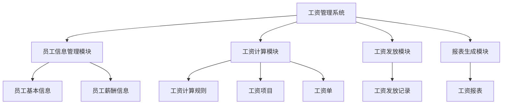

# 企业工资管理系统详细设计与具体代码实现

## 1.背景介绍

在任何企业中,工资管理系统都是一个至关重要的组成部分。准确、高效地计算和发放员工工资,不仅关系到企业的正常运营,也直接影响到员工的切身利益。传统的人工计算和管理方式已经无法满足现代企业的需求,因此开发一套完善的工资管理系统就显得尤为必要。

工资管理系统的主要功能包括:记录员工基本信息、计算工资、发放工资、生成工资报表等。系统需要考虑不同工种、不同薪酬模式、加班费、奖惩、扣款等多种因素,并严格遵守相关的法律法规。同时,系统还需要具备良好的安全性、可扩展性和用户友好性。

## 2.核心概念与联系

在设计工资管理系统之前,我们需要了解一些核心概念:

1. **员工信息(Employee)**: 包括员工的基本信息(姓名、工号、部门、职位等)和薪酬信息(基本工资、绩效工资、津贴等)。

2. **工资项目(SalaryItem)**: 构成员工工资的各个组成部分,如基本工资、绩效工资、加班费、奖金、扣款等。

3. **工资计算规则(SalaryCalculationRule)**: 根据不同的工种、薪酬模式制定相应的工资计算规则,如计算加班费的方式、绩效工资的计算公式等。

4. **工资单(PaySlip)**: 记录员工某个时间段(如一个月)的工资明细,包括各个工资项目的金额及总工资。

5. **工资发放记录(PaymentRecord)**: 记录工资的实际发放情况,如发放日期、发放方式(现金或转账)等。

6. **工资报表(SalaryReport)**: 根据需求生成各种工资报表,如部门工资报表、个人工资报表等,用于统计和分析。

这些核心概念相互关联、相互作用,共同构成了工资管理系统的基本框架。

## 3.核心算法原理具体操作步骤

工资管理系统的核心算法是根据员工信息和工资计算规则计算员工的工资,具体操作步骤如下:

1. 获取员工基本信息和薪酬信息。

2. 根据员工的工种和薪酬模式,确定适用的工资计算规则。

3. 遍历员工的工资项目,按照对应的计算规则计算每一项的金额。

4. 将所有工资项目金额相加,得到员工的总工资。

5. 生成工资单,记录员工的工资明细。

6. 根据工资发放规则,发放员工工资并记录发放情况。

以计算员工加班费为例,算法步骤如下:

```python
# 计算加班费
def calculate_overtime_pay(employee, overtime_hours):
    base_salary = employee.base_salary
    hourly_rate = base_salary / (21.75 * 8)  # 假设一个月工作日21.75天,每天8小时
    overtime_rate = 1.5 * hourly_rate  # 加班费为平时工资的1.5倍
    overtime_pay = overtime_hours * overtime_rate
    return overtime_pay
```

该算法首先根据员工的基本工资计算出每小时的工资率,然后乘以加班小时数和加班费率(1.5倍)即可得到加班费金额。

## 4.数学模型和公式详细讲解举例说明

在工资管理系统中,我们需要使用一些数学模型和公式来计算员工的工资,下面将详细讲解其中的几个重要模型和公式。

### 4.1 绩效工资计算模型

绩效工资是许多企业广泛采用的一种薪酬模式,它将员工的工资与其工作绩效挂钩,旨在激励员工提高工作效率。一种常见的绩效工资计算模型如下:

$$
薪酬 = 基本工资 + 绩效工资
$$

$$
绩效工资 = 基本工资 \times 绩效系数
$$

其中,绩效系数是根据员工的绩效评分计算得出的一个系数,通常在0到2之间。绩效评分可以由员工的上级主管或者人力资源部门根据员工的工作表现进行评定。

例如,某员工的基本工资为5000元,绩效评分为4分(满分5分),绩效系数为0.8,则该员工的绩效工资为:

$$
绩效工资 = 5000 \times 0.8 = 4000 (元)
$$

因此,该员工当月的总薪酬为:

$$
薪酬 = 5000 + 4000 = 9000 (元)
$$

### 4.2 加班费计算公式

根据《中华人民共和国劳动法》的规定,员工加班的工资应当不低于平时工资的150%。因此,加班费的计算公式如下:

$$
加班费 = 加班时长 \times 时薪 \times 加班费率
$$

其中,时薪可以按照以下公式计算:

$$
时薪 = \frac{基本工资}{法定工作时长}
$$

加班费率通常为1.5或2,分别对应平时加班和节假日加班的情况。

假设某员工的基本工资为6000元,法定工作时长为160小时(按21.75天计算,每天工作8小时),该员工在某月加班20小时,则其加班费为:

$$
时薪 = \frac{6000}{160} = 37.5 (元/小时)
$$

$$
加班费 = 20 \times 37.5 \times 1.5 = 1125 (元)
$$

### 4.3 奖金计算模型

许多企业会根据员工的绩效或者公司的经营状况,向员工发放一定的奖金。奖金的计算模型可以是:

$$
奖金 = 基本工资 \times 奖金系数
$$

其中,奖金系数可以由公司根据实际情况确定,例如0.5或1等。

如果某员工的基本工资为8000元,奖金系数为0.8,则该员工的奖金为:

$$
奖金 = 8000 \times 0.8 = 6400 (元)
$$

## 5.项目实践:代码实例和详细解释说明

为了更好地理解工资管理系统的设计和实现,我们将通过一个具体的代码实例来进行说明。这个实例使用Python编写,采用面向对象的设计方式,包含了工资管理系统的核心功能。

### 5.1 系统架构

工资管理系统的总体架构如下所示:



系统主要由四个模块组成:

1. **员工信息管理模块**: 维护员工的基本信息和薪酬信息。
2. **工资计算模块**: 根据员工信息和工资计算规则,计算员工的工资,生成工资单。
3. **工资发放模块**: 根据工资单,发放员工工资并记录发放情况。
4. **报表生成模块**: 根据需求生成各种工资报表,用于统计和分析。

### 5.2 核心类设计

根据上述架构,我们可以设计出以下核心类:

1. `Employee`: 员工类,包含员工的基本信息和薪酬信息。
2. `SalaryItem`: 工资项目类,表示构成员工工资的各个组成部分。
3. `SalaryCalculationRule`: 工资计算规则类,定义不同工种和薪酬模式下的工资计算方式。
4. `PaySlip`: 工资单类,记录员工某个时间段的工资明细。
5. `PaymentRecord`: 工资发放记录类,记录工资的实际发放情况。
6. `SalaryReport`: 工资报表类,用于生成各种工资报表。

下面是这些核心类的简化实现:

```python
class Employee:
    def __init__(self, name, department, position, base_salary):
        self.name = name
        self.department = department
        self.position = position
        self.base_salary = base_salary
        self.salary_items = []

    def add_salary_item(self, salary_item):
        self.salary_items.append(salary_item)

    def calculate_total_salary(self):
        total_salary = self.base_salary
        for item in self.salary_items:
            total_salary += item.amount
        return total_salary

class SalaryItem:
    def __init__(self, name, amount):
        self.name = name
        self.amount = amount

class SalaryCalculationRule:
    def calculate_salary(self, employee):
        # 根据员工信息和具体规则计算工资
        pass

class PaySlip:
    def __init__(self, employee, date):
        self.employee = employee
        self.date = date
        self.salary_items = []
        self.total_salary = 0

    def add_salary_item(self, salary_item):
        self.salary_items.append(salary_item)
        self.total_salary += salary_item.amount

class PaymentRecord:
    def __init__(self, employee, pay_date, amount, method):
        self.employee = employee
        self.pay_date = pay_date
        self.amount = amount
        self.method = method

class SalaryReport:
    def __init__(self, employees, date_range):
        self.employees = employees
        self.date_range = date_range

    def generate_report(self):
        # 根据员工信息和时间范围生成报表
        pass
```

### 5.3 工资计算示例

下面是一个计算员工工资的具体示例:

```python
# 创建员工对象
employee = Employee("张三", "技术部", "软件工程师", 8000)

# 添加工资项目
employee.add_salary_item(SalaryItem("绩效工资", 2000))
employee.add_salary_item(SalaryItem("加班费", 500))
employee.add_salary_item(SalaryItem("奖金", 1000))

# 计算总工资
total_salary = employee.calculate_total_salary()
print(f"张三的总工资为: {total_salary} 元")

# 生成工资单
pay_date = "2023-05-31"
pay_slip = PaySlip(employee, pay_date)
for item in employee.salary_items:
    pay_slip.add_salary_item(item)

print("工资单明细:")
print(f"姓名: {employee.name}")
print(f"日期: {pay_slip.date}")
for item in pay_slip.salary_items:
    print(f"{item.name}: {item.amount} 元")
print(f"总工资: {pay_slip.total_salary} 元")

# 发放工资并记录
payment_method = "银行转账"
payment_record = PaymentRecord(employee, pay_date, pay_slip.total_salary, payment_method)
print(f"已通过{payment_method}方式发放{employee.name}工资 {payment_record.amount} 元")
```

输出结果:

```
张三的总工资为: 11500 元
工资单明细:
姓名: 张三
日期: 2023-05-31
绩效工资: 2000 元
加班费: 500 元
奖金: 1000 元
总工资: 11500 元
已通过银行转账方式发放张三工资 11500 元
```

在这个示例中,我们首先创建了一个员工对象,并为其添加了不同的工资项目。然后,我们计算了员工的总工资,生成了工资单,并最终发放了工资并记录了发放情况。

通过这个实例,我们可以看到如何使用面向对象的设计方式,将工资管理系统的不同功能模块化,从而提高代码的可读性和可维护性。同时,这个实例也展示了如何计算不同类型的工资项目,以及如何生成工资单和记录工资发放情况。

## 6.实际应用场景

工资管理系统在现实生活中有着广泛的应用场景,包括但不限于:

1. **企业内部使用**: 各类企业都需要一套完善的工资管理系统,用于准确计算和发放员工工资,同时生成相关报表用于统计和分析。

2. **人力资源外包服务**: 一些专业的人力资源服务公司可以为客户提供工资管理系统,帮助客户outsource工资管理相关工作。

3. **政府机构和事业单位**: 政府部门、学校、医院等事业单位也需要工资管理系统来管理员工工资。

4. **工会和劳工组织**: 工会和劳工组织可以使用工资管理系统来监督企业是否按照法律法规发放员工工