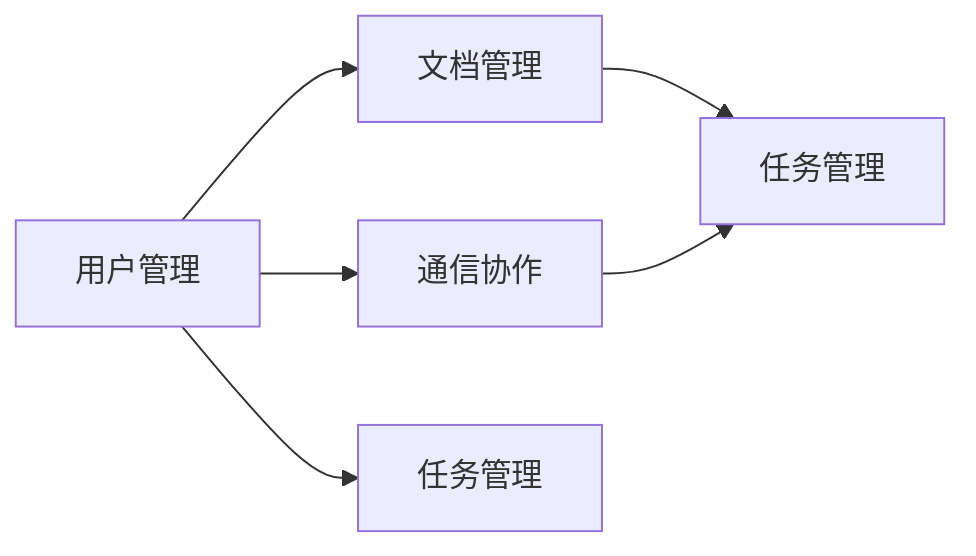

## 1.背景介绍

随着信息技术的发展和互联网的普及，企业网络办公系统已成为企业日常运营的重要组成部分。它不仅提供了有效的信息管理和通信工具，还改变了传统的工作方式，提高了工作效率，促进了企业的发展。本文将详细介绍企业网络办公系统的设计思路和具体实现。

## 2.核心概念与联系

企业网络办公系统主要包括以下几个核心概念：

- **用户管理**：包括用户注册、登录、权限分配等功能；
- **文档管理**：包括文档上传、下载、编辑、共享等功能；
- **通信协作**：包括邮件、即时通讯、会议等功能；
- **任务管理**：包括任务分配、进度跟踪、完成情况反馈等功能。

这些核心概念之间的联系主要体现在用户管理是所有功能的基础，文档管理和通信协作是企业日常工作的主要内容，任务管理是对企业工作进行有效管理的重要工具。



## 3.核心算法原理具体操作步骤

企业网络办公系统的设计和实现主要包括以下几个步骤：

1. **需求分析**：通过与企业进行深度交流，了解企业的具体需求，确定系统的功能模块；
2. **系统设计**：根据需求分析的结果，设计系统的架构和数据库模型，确定各个功能模块的具体实现方式；
3. **代码编写**：根据系统设计的结果，编写代码，实现各个功能模块；
4. **系统测试**：对系统进行全面的测试，确保系统的稳定性和可用性；
5. **系统部署**：将系统部署到企业的服务器上，进行实际运行。

## 4.数学模型和公式详细讲解举例说明

在企业网络办公系统中，我们通常需要处理大量的数据，例如用户信息、文档信息、任务信息等。这些数据通常存储在数据库中，我们可以通过SQL语言来操作这些数据。

假设我们有一个用户表（User），包含了用户ID（UserID）、用户名（UserName）、密码（Password）等字段，我们可以通过以下的SQL语句来查询用户信息：

```sql
SELECT * FROM User WHERE UserName = '张三';
```

这条SQL语句的意思是从用户表中查询用户名为“张三”的用户的所有信息。其中，“SELECT *”表示查询所有字段，“FROM User”表示从用户表中查询，“WHERE UserName = '张三'”表示查询条件是用户名为“张三”。

## 5.项目实践：代码实例和详细解释说明

下面我们以一个简单的用户登录功能为例，展示一下企业网络办公系统的代码实现。

这个用户登录功能主要包括以下几个步骤：

1. 用户输入用户名和密码；
2. 系统根据用户名查询用户信息；
3. 系统比较输入的密码和查询到的密码是否一致；
4. 如果密码一致，登录成功；否则，登录失败。

以下是这个功能的代码实现：

```python
def login(username, password):
    # 查询用户信息
    user = query_user(username)
    if user is None:
        return '用户不存在'
    # 比较密码
    if user.password == password:
        return '登录成功'
    else:
        return '密码错误'
```

在这段代码中，我们首先调用`query_user`函数查询用户信息，然后比较输入的密码和查询到的密码是否一致，最后返回登录结果。

## 6.实际应用场景

企业网络办公系统广泛应用于各种企业和组织，包括但不限于以下几种场景：

- **远程办公**：在新冠疫情的影响下，远程办公成为了一种新的工作方式。企业网络办公系统可以提供一种有效的远程协作工具，使得员工可以在家中进行工作；
- **团队协作**：在大型项目中，团队成员需要进行密切的协作。企业网络办公系统可以提供一种有效的协作工具，使得团队成员可以方便地共享信息和协同工作；
- **任务管理**：对于管理者来说，对员工的工作进行有效的管理是一项重要的任务。企业网络办公系统可以提供一种有效的任务管理工具，使得管理者可以方便地分配任务和跟踪进度。

## 7.工具和资源推荐

在设计和实现企业网络办公系统时，我们可以使用以下几种工具和资源：

- **开发工具**：如Visual Studio Code、PyCharm等，可以提供代码编写、调试、测试等功能；
- **开发框架**：如Django、Flask等，可以提供用户管理、数据库操作、模板渲染等功能；
- **数据库系统**：如MySQL、PostgreSQL等，可以提供数据存储、查询、更新等功能；
- **服务器系统**：如Linux、Windows Server等，可以提供系统运行的环境。

## 8.总结：未来发展趋势与挑战

随着云计算、大数据、人工智能等技术的发展，企业网络办公系统将面临更大的发展机遇和挑战。

- **发展机遇**：新技术的发展将为企业网络办公系统提供更强大的功能，例如云存储可以提供几乎无限的存储空间，人工智能可以提供智能的任务分配和进度跟踪等功能；
- **挑战**：新技术的发展也将带来更大的挑战，例如数据安全问题、技术更新速度快等。

## 9.附录：常见问题与解答

1. **Q: 企业网络办公系统的安全性如何保证？**
   A: 企业网络办公系统的安全性主要通过用户权限管理、数据加密、安全审计等方式来保证。

2. **Q: 企业网络办公系统的可用性如何保证？**
   A: 企业网络办公系统的可用性主要通过系统冗余、负载均衡、故障恢复等方式来保证。

3. **Q: 企业网络办公系统的易用性如何保证？**
   A: 企业网络办公系统的易用性主要通过用户友好的界面设计、详细的使用说明、及时的用户支持等方式来保证。

作者：禅与计算机程序设计艺术 / Zen and the Art of Computer Programming