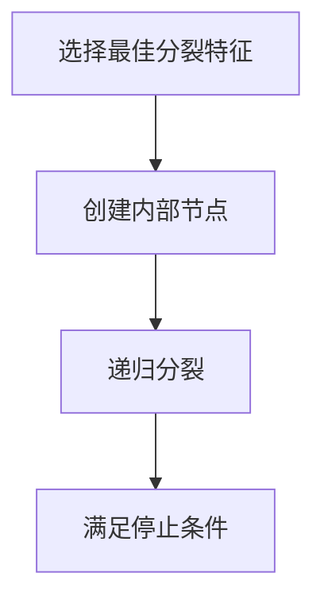

# 使用决策树提高准确率的实例讲解

## 1.背景介绍

决策树是一种广泛应用于分类和回归任务的机器学习算法。其直观的树状结构使得决策树在解释性和可视化方面具有显著优势。决策树通过一系列的决策规则将数据集划分成不同的类别或预测值，从而实现对数据的分类或回归。本文将详细介绍决策树的核心概念、算法原理、数学模型、实际应用以及未来发展趋势。

## 2.核心概念与联系

### 2.1 决策树的基本结构

决策树由节点和边组成，节点分为内部节点和叶节点。内部节点表示特征的测试，叶节点表示类别或预测值。树的根节点是整个决策过程的起点。

### 2.2 信息增益与基尼指数

信息增益和基尼指数是决策树中常用的分裂标准。信息增益衡量特征对数据集的不确定性减少程度，而基尼指数则衡量数据集的纯度。

### 2.3 过拟合与剪枝

过拟合是决策树常见的问题，通常通过剪枝技术来解决。剪枝分为预剪枝和后剪枝，预剪枝在树生成过程中进行剪枝，而后剪枝在树生成后进行剪枝。

## 3.核心算法原理具体操作步骤

### 3.1 决策树生成算法

决策树生成算法主要包括ID3、C4.5和CART。ID3算法基于信息增益，C4.5算法基于信息增益比，CART算法基于基尼指数。

### 3.2 决策树生成步骤

1. 选择最佳分裂特征：根据分裂标准选择最佳特征。
2. 创建内部节点：根据最佳特征创建内部节点。
3. 递归分裂：对每个子节点递归执行上述步骤，直到满足停止条件。



## 4.数学模型和公式详细讲解举例说明

### 4.1 信息增益

信息增益的计算公式为：

$$
IG(D, A) = H(D) - \sum_{v \in Values(A)} \frac{|D_v|}{|D|} H(D_v)
$$

其中，$H(D)$ 是数据集 $D$ 的熵，$D_v$ 是特征 $A$ 取值为 $v$ 的子集。

### 4.2 基尼指数

基尼指数的计算公式为：

$$
Gini(D) = 1 - \sum_{i=1}^{m} p_i^2
$$

其中，$p_i$ 是类别 $i$ 的概率。

### 4.3 示例

假设有一个数据集 $D$，包含两个特征 $A$ 和 $B$，以及两个类别 $C_1$ 和 $C_2$。通过计算信息增益和基尼指数，可以选择最佳分裂特征。

## 5.项目实践：代码实例和详细解释说明

### 5.1 数据集准备

我们将使用Python的scikit-learn库来实现决策树。首先，准备一个简单的数据集。

```python
from sklearn.datasets import load_iris
from sklearn.model_selection import train_test_split

# 加载数据集
iris = load_iris()
X = iris.data
y = iris.target

# 划分训练集和测试集
X_train, X_test, y_train, y_test = train_test_split(X, y, test_size=0.3, random_state=42)
```

### 5.2 决策树训练

使用scikit-learn中的DecisionTreeClassifier进行训练。

```python
from sklearn.tree import DecisionTreeClassifier

# 创建决策树分类器
clf = DecisionTreeClassifier()

# 训练模型
clf.fit(X_train, y_train)
```

### 5.3 模型评估

评估模型的准确率。

```python
from sklearn.metrics import accuracy_score

# 预测
y_pred = clf.predict(X_test)

# 计算准确率
accuracy = accuracy_score(y_test, y_pred)
print(f"模型准确率: {accuracy:.2f}")
```

## 6.实际应用场景

### 6.1 医疗诊断

决策树可以用于医疗诊断，通过分析患者的症状和体征，预测疾病的可能性。

### 6.2 客户分类

在市场营销中，决策树可以用于客户分类，帮助企业制定个性化的营销策略。

### 6.3 风险评估

在金融领域，决策树可以用于风险评估，预测贷款违约的可能性。

## 7.工具和资源推荐

### 7.1 scikit-learn

scikit-learn是一个强大的机器学习库，提供了丰富的决策树算法实现。

### 7.2 Graphviz

Graphviz是一个开源的图形可视化工具，可以用于绘制决策树。

### 7.3 UCI机器学习库

UCI机器学习库提供了丰富的数据集资源，可以用于决策树的实验和研究。

## 8.总结：未来发展趋势与挑战

### 8.1 发展趋势

随着数据量的增加和计算能力的提升，决策树算法将继续发展。集成学习方法（如随机森林和梯度提升树）将进一步提高决策树的性能。

### 8.2 挑战

决策树面临的主要挑战是过拟合和计算复杂度。未来的研究将致力于开发更有效的剪枝技术和优化算法。

## 9.附录：常见问题与解答

### 9.1 决策树如何处理缺失值？

决策树可以通过插值或使用缺失值处理策略来处理缺失值。

### 9.2 决策树是否适用于高维数据？

决策树在高维数据中可能表现不佳，通常需要结合降维技术或使用集成学习方法。

### 9.3 如何选择决策树的参数？

可以通过交叉验证和网格搜索来选择决策树的最佳参数。

---

作者：禅与计算机程序设计艺术 / Zen and the Art of Computer Programming