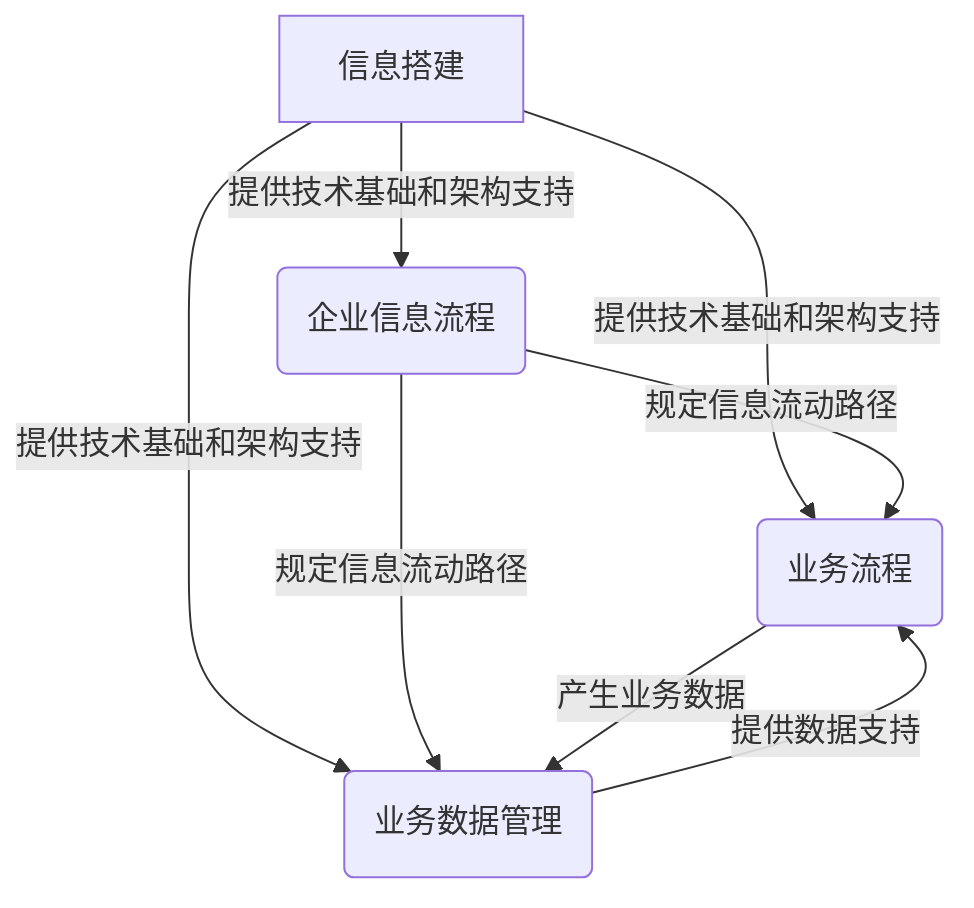

# 信息搭建、企业信息流程、业务流程、业务数据管理系统搭建

## 1.背景介绍

### 1.1 信息化时代的挑战

在当今信息时代,数据和信息已经成为企业运营和决策的核心资产。随着业务复杂性的不断增加,企业面临着如何高效管理和利用大量的数据和信息的挑战。传统的数据管理方式已经无法满足现代企业的需求,因此构建高效的信息系统、流程管理和数据管理系统成为企业提高竞争力的关键。

### 1.2 企业信息化的重要性

企业信息化是指利用现代信息技术来改造企业的管理模式、业务流程和运营方式,实现企业内部信息的高效流动和共享。通过信息化,企业可以提高运营效率、降低成本、优化决策过程、增强市场响应能力,从而获得竞争优势。

### 1.3 信息搭建的概念

信息搭建是指根据企业的实际需求,设计并构建一套完整的信息系统架构,包括硬件基础设施、软件平台、数据管理、应用系统等多个层面。信息搭建的目标是实现企业内部信息的高效采集、传输、存储、处理和应用,为企业的各项业务活动提供信息支持。

## 2.核心概念与联系

### 2.1 企业信息流程

企业信息流程是指企业内部信息在各个部门、岗位和业务环节之间的流动路径。它规定了信息的生成、采集、传输、处理和应用的顺序和方式,确保信息能够及时、准确地流动到需要的地方。

企业信息流程通常包括以下几个关键环节:

1. 信息采集
2. 信息传输
3. 信息处理
4. 信息存储
5. 信息应用
6. 信息反馈

### 2.2 业务流程

业务流程是指企业为实现特定业务目标而执行的一系列有序活动。它定义了各个业务活动的执行顺序、依赖关系和职责分工,确保企业的业务运营高效、协调和一致。

业务流程通常包括以下几个关键要素:

1. 业务活动
2. 执行顺序
3. 决策点
4. 并行/分支
5. 数据输入/输出
6. 角色和职责

### 2.3 业务数据管理

业务数据管理是指对企业内部产生的各种业务数据进行有效的采集、存储、维护和利用。它确保企业拥有高质量、一致和可靠的数据资产,为业务决策和运营提供数据支持。

业务数据管理通常包括以下几个关键环节:

1. 数据采集
2. 数据存储
3. 数据质量控制
4. 数据整合
5. 数据分析
6. 数据应用

### 2.4 信息搭建、企业信息流程、业务流程和业务数据管理的关系

这四个概念之间存在着密切的联系和相互依赖关系:

1. 信息搭建为企业信息流程、业务流程和业务数据管理提供了技术基础和架构支持。
2. 企业信息流程规定了信息在企业内部的流动路径,为业务流程和数据管理提供了信息支持。
3. 业务流程定义了企业的业务活动和执行顺序,产生了大量的业务数据。
4. 业务数据管理负责采集、存储和利用这些业务数据,为业务决策和优化提供数据支持。

只有将这四个方面紧密结合,企业才能真正实现信息化,提高运营效率和竞争力。

## 3.核心算法原理具体操作步骤

在信息搭建、企业信息流程、业务流程和业务数据管理系统的构建过程中,需要应用多种算法和技术原理。以下是一些核心算法原理及其具体操作步骤:

### 3.1 数据建模算法

数据建模是构建高质量数据模型的关键步骤,它确保数据结构能够准确反映业务需求。常用的数据建模算法包括实体-关系建模(ER)、维度建模和数据仓库建模等。

1. 实体-关系建模(ER)算法步骤:
   - 识别实体及其属性
   - 确定实体之间的关系
   - 构建ER图
   - 规范化数据模型

2. 维度建模算法步骤:
   - 确定事实表和维度表
   - 设计维度层次结构
   - 构建星型/雪花型模式
   - 优化查询性能

3. 数据仓库建模算法步骤:
   - 确定数据源和目标
   - 设计数据仓库架构
   - 构建ETL流程
   - 实现数据集成和加载

### 3.2 业务流程建模算法

业务流程建模是将复杂的业务活动可视化和形式化的过程,常用的算法包括流程图、Petri网、BPMN等。

1. 流程图算法步骤:
   - 确定流程边界和目标
   - 识别流程活动和决策点
   - 绘制流程图符号
   - 优化流程路径

2. Petri网算法步骤:
   - 定义位置和转移
   - 建立Petri网模型
   - 分析网络性质
   - 验证和优化流程

3. BPMN算法步骤:
   - 确定流程参与者
   - 绘制流程图元素
   - 定义流程规则和约束
   - 模拟和优化流程

### 3.3 数据质量管理算法

数据质量管理是确保企业数据的完整性、一致性和准确性的关键步骤,常用的算法包括数据清洗、数据匹配和数据规范化等。

1. 数据清洗算法步骤:
   - 定义数据质量规则
   - 识别异常值和缺失值
   - 执行数据转换和修复
   - 验证数据质量

2. 数据匹配算法步骤:
   - 选择匹配策略
   - 构建匹配规则
   - 执行数据比对
   - 合并和去重数据

3. 数据规范化算法步骤:
   - 确定规范化标准
   - 构建规范化规则
   - 执行数据转换
   - 验证规范化结果

### 3.4 信息安全算法

信息安全是保护企业数据和信息系统免受未经授权的访问、使用、披露、中断、修改或破坏的关键步骤,常用的算法包括加密、访问控制和入侵检测等。

1. 加密算法步骤:
   - 选择加密算法和密钥长度
   - 生成密钥
   - 执行加密操作
   - 管理密钥生命周期

2. 访问控制算法步骤:
   - 确定访问控制策略
   - 定义用户角色和权限
   - 实现身份认证和授权
   - 审计和监控访问行为

3. 入侵检测算法步骤:
   - 确定检测策略和规则
   - 收集和分析系统日志
   - 识别异常行为和攻击模式
   - 响应和防御入侵行为

这些算法原理和具体操作步骤为信息搭建、企业信息流程、业务流程和业务数据管理系统的构建提供了理论和技术支撑。

## 4.数学模型和公式详细讲解举例说明

在信息搭建、企业信息流程、业务流程和业务数据管理系统中,数学模型和公式扮演着重要的角色,用于描述和优化各种过程和系统。以下是一些常见的数学模型和公式,以及它们的详细讲解和举例说明。

### 4.1 信息熵模型

信息熵是信息论中的一个重要概念,用于衡量信息的不确定性或随机性。在数据管理和信息系统中,信息熵模型可以用于评估数据质量、优化数据存储和传输等。

信息熵公式:

$$H(X) = -\sum_{i=1}^{n} p(x_i) \log_2 p(x_i)$$

其中:
- $H(X)$ 表示随机变量 $X$ 的信息熵
- $n$ 是随机变量 $X$ 可能取值的个数
- $p(x_i)$ 是随机变量 $X$ 取值 $x_i$ 的概率

例如,在数据压缩中,我们可以利用信息熵来评估数据的压缩潜力。具有较高信息熵的数据意味着它包含更多的不确定性,因此具有更大的压缩空间。

### 4.2 马尔可夫模型

马尔可夫模型是一种描述随机过程的数学模型,它假设未来状态只依赖于当前状态,而与过去状态无关。在业务流程建模和优化中,马尔可夫模型可以用于分析和预测流程的行为。

马尔可夫过程的状态转移概率公式:

$$P(X_{t+1} = j | X_t = i, X_{t-1} = i_{t-1}, \ldots, X_0 = i_0) = P(X_{t+1} = j | X_t = i)$$

其中:
- $X_t$ 表示时刻 $t$ 的状态
- $P(X_{t+1} = j | X_t = i)$ 表示从状态 $i$ 转移到状态 $j$ 的概率

例如,在客户服务中心的呼叫路由中,我们可以使用马尔可夫模型来预测呼叫量的变化,从而优化工作人员的调度和资源分配。

### 4.3 线性规划模型

线性规划是一种求解最优化问题的数学模型,它通过在给定的约束条件下,寻找目标函数的最大值或最小值。在资源优化和决策支持系统中,线性规划模型可以用于资源分配、生产计划和物流优化等。

线性规划模型的标准形式:

$$\begin{align}
\max \ &\sum_{j=1}^{n} c_j x_j \\
\text{s.t.} \ &\sum_{j=1}^{n} a_{ij} x_j \leq b_i, \quad i = 1, 2, \ldots, m \\
&x_j \geq 0, \quad j = 1, 2, \ldots, n
\end{align}$$

其中:
- $c_j$ 是目标函数中的系数
- $x_j$ 是决策变量
- $a_{ij}$ 和 $b_i$ 分别表示约束条件中的系数和常数项

例如,在供应链管理中,我们可以使用线性规划模型来确定最佳的产品分配方案,以最小化运输成本和库存成本,同时满足客户需求。

### 4.4 队列理论模型

队列理论是研究等待线路现象的一个分支,它描述了客户或任务在系统中的到达、排队和服务过程。在业务流程优化和系统性能评估中,队列理论模型可以用于分析和改进服务水平。

队列模型的基本公式:

$$\begin{align}
\lambda &= \text{到达率} \\
\mu &= \text{服务率} \\
\rho &= \lambda / \mu \quad (\rho < 1) \\
L &= \text{系统长度} \\
W &= \text{等待时间}
\end{align}$$

其中:
- $\lambda$ 表示客户或任务的到达率
- $\mu$ 表示服务器的服务率
- $\rho$ 表示系统的利用率,必须小于 1 以保证稳定性
- $L$ 表示系统中的平均客户或任务数量
- $W$ 表示客户或任务在系统中的平均等待时间

例如,在呼叫中心中,我们可以使用队列理论模型来分析呼入呼叫的等待时间,从而确定合适的人员配置和服务水平目标。

这些数学模型和公式为信息搭建、企业信息流程、业务流程和业务数据管理系统提供了理论基础和分析工具,有助于优化系统设计和提高运营效率。

## 5.项目实践:代码实例和