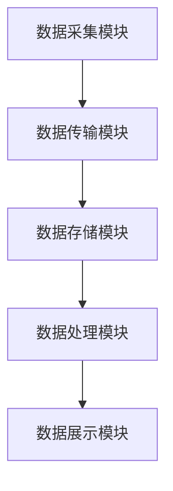

# 信息网管理系统设计与实现

## 1.背景介绍

在当今信息化社会，信息网管理系统（Information Network Management System，INMS）在各行各业中扮演着至关重要的角色。无论是企业内部的信息流转，还是跨组织的信息共享，INMS都提供了高效、安全、可靠的解决方案。本文将深入探讨信息网管理系统的设计与实现，旨在为读者提供全面的技术指导和实践经验。

## 2.核心概念与联系

### 2.1 信息网管理系统的定义

信息网管理系统是一种用于管理、监控和优化信息网络的综合性软件系统。它涵盖了从数据采集、传输、存储到处理、分析和展示的全过程。

### 2.2 主要组成部分

- **数据采集模块**：负责从各种数据源获取数据。
- **数据传输模块**：确保数据在不同节点之间的高效传输。
- **数据存储模块**：提供可靠的数据存储解决方案。
- **数据处理模块**：对数据进行清洗、转换和分析。
- **数据展示模块**：通过可视化手段展示数据分析结果。

### 2.3 各模块之间的联系

各模块之间通过标准化接口进行通信，确保系统的模块化和可扩展性。以下是一个简单的Mermaid流程图，展示了各模块之间的联系：



## 3.核心算法原理具体操作步骤

### 3.1 数据采集算法

数据采集是INMS的第一步，通常采用分布式采集算法，以提高数据采集的效率和可靠性。以下是一个典型的数据采集算法步骤：

1. **初始化采集节点**：配置采集节点的参数，如IP地址、端口等。
2. **数据抓取**：通过API或爬虫技术从数据源抓取数据。
3. **数据预处理**：对抓取的数据进行初步清洗和格式转换。
4. **数据传输**：将预处理后的数据传输到数据传输模块。

### 3.2 数据传输算法

数据传输模块采用高效的传输协议，如TCP/IP、UDP等，确保数据的快速传输和完整性。以下是数据传输的具体步骤：

1. **建立连接**：与目标节点建立可靠的传输连接。
2. **数据打包**：将数据打包成适合传输的格式。
3. **数据发送**：通过传输协议发送数据包。
4. **确认接收**：接收方确认数据包的接收情况，发送方根据确认信息进行重传或结束传输。

### 3.3 数据存储算法

数据存储模块采用分布式存储算法，如HDFS、Cassandra等，确保数据的高可用性和可扩展性。以下是数据存储的具体步骤：

1. **数据分片**：将大数据集分成多个小数据块。
2. **数据写入**：将数据块写入分布式存储系统。
3. **数据备份**：为每个数据块创建多个副本，存储在不同的节点上。
4. **数据索引**：为数据块创建索引，便于快速查询。

### 3.4 数据处理算法

数据处理模块采用并行计算和分布式计算算法，如MapReduce、Spark等，确保数据处理的高效性。以下是数据处理的具体步骤：

1. **任务分解**：将大任务分解成多个小任务。
2. **任务分配**：将小任务分配给不同的计算节点。
3. **任务执行**：各计算节点并行执行小任务。
4. **结果合并**：将各节点的计算结果合并成最终结果。

### 3.5 数据展示算法

数据展示模块采用可视化算法，如D3.js、ECharts等，确保数据展示的直观性和美观性。以下是数据展示的具体步骤：

1. **数据获取**：从数据处理模块获取分析结果。
2. **数据转换**：将分析结果转换成适合展示的格式。
3. **图表生成**：生成各种图表，如折线图、柱状图、饼图等。
4. **图表展示**：通过Web界面或移动端展示图表。

## 4.数学模型和公式详细讲解举例说明

### 4.1 数据采集模型

数据采集可以看作是一个时间序列问题，假设我们有一个数据源 $S$，在时间点 $t$ 采集到的数据为 $D_t$，则数据采集过程可以表示为：

$$
D_t = f(S, t)
$$

其中，$f$ 是数据采集函数，$S$ 是数据源，$t$ 是时间点。

### 4.2 数据传输模型

数据传输可以看作是一个网络流问题，假设我们有一个数据包 $P$，从节点 $A$ 传输到节点 $B$，则数据传输过程可以表示为：

$$
T(P, A, B) = \sum_{i=1}^{n} L_i
$$

其中，$T$ 是数据传输函数，$P$ 是数据包，$A$ 和 $B$ 是传输节点，$L_i$ 是第 $i$ 条传输路径的延迟。

### 4.3 数据存储模型

数据存储可以看作是一个分布式存储问题，假设我们有一个数据块 $B$，存储在 $m$ 个节点上，则数据存储过程可以表示为：

$$
S(B) = \sum_{j=1}^{m} R_j
$$

其中，$S$ 是数据存储函数，$B$ 是数据块，$R_j$ 是第 $j$ 个节点的存储容量。

### 4.4 数据处理模型

数据处理可以看作是一个并行计算问题，假设我们有一个大任务 $T$，分解成 $k$ 个小任务，则数据处理过程可以表示为：

$$
P(T) = \sum_{k=1}^{n} C_k
$$

其中，$P$ 是数据处理函数，$T$ 是大任务，$C_k$ 是第 $k$ 个小任务的计算时间。

### 4.5 数据展示模型

数据展示可以看作是一个可视化问题，假设我们有一个数据集 $D$，生成的图表为 $G$，则数据展示过程可以表示为：

$$
V(D) = G
$$

其中，$V$ 是数据展示函数，$D$ 是数据集，$G$ 是生成的图表。

## 5.项目实践：代码实例和详细解释说明

### 5.1 数据采集代码实例

以下是一个简单的数据采集代码实例，使用Python和Requests库从API获取数据：

```python
import requests

def fetch_data(api_url):
    response = requests.get(api_url)
    if response.status_code == 200:
        return response.json()
    else:
        return None

api_url = "https://api.example.com/data"
data = fetch_data(api_url)
print(data)
```

### 5.2 数据传输代码实例

以下是一个简单的数据传输代码实例，使用Python和Socket库进行数据传输：

```python
import socket

def send_data(data, host, port):
    with socket.socket(socket.AF_INET, socket.SOCK_STREAM) as s:
        s.connect((host, port))
        s.sendall(data.encode('utf-8'))
        response = s.recv(1024)
    return response.decode('utf-8')

host = "127.0.0.1"
port = 65432
data = "Hello, World!"
response = send_data(data, host, port)
print(response)
```

### 5.3 数据存储代码实例

以下是一个简单的数据存储代码实例，使用Python和SQLite进行数据存储：

```python
import sqlite3

def store_data(db_name, table_name, data):
    conn = sqlite3.connect(db_name)
    c = conn.cursor()
    c.execute(f"CREATE TABLE IF NOT EXISTS {table_name} (id INTEGER PRIMARY KEY, value TEXT)")
    c.execute(f"INSERT INTO {table_name} (value) VALUES (?)", (data,))
    conn.commit()
    conn.close()

db_name = "example.db"
table_name = "data"
data = "Sample Data"
store_data(db_name, table_name, data)
```

### 5.4 数据处理代码实例

以下是一个简单的数据处理代码实例，使用Python和Pandas进行数据处理：

```python
import pandas as pd

def process_data(data):
    df = pd.DataFrame(data)
    df['processed'] = df['value'].apply(lambda x: x * 2)
    return df

data = {'value': [1, 2, 3, 4, 5]}
processed_data = process_data(data)
print(processed_data)
```

### 5.5 数据展示代码实例

以下是一个简单的数据展示代码实例，使用Python和Matplotlib进行数据展示：

```python
import matplotlib.pyplot as plt

def plot_data(data):
    plt.plot(data['value'], data['processed'])
    plt.xlabel('Value')
    plt.ylabel('Processed Value')
    plt.title('Data Visualization')
    plt.show()

data = {'value': [1, 2, 3, 4, 5], 'processed': [2, 4, 6, 8, 10]}
plot_data(data)
```

## 6.实际应用场景

### 6.1 企业内部信息管理

在企业内部，INMS可以用于管理各种信息流，如员工信息、客户信息、财务信息等。通过INMS，企业可以实现信息的高效流转和共享，提高工作效率和决策质量。

### 6.2 跨组织信息共享

在跨组织的信息共享中，INMS可以提供安全、可靠的信息传输和存储解决方案，确保信息在不同组织之间的高效流转和共享。

### 6.3 智能城市

在智能城市建设中，INMS可以用于管理各种城市信息，如交通信息、环境信息、能源信息等。通过INMS，城市管理者可以实现信息的实时监控和分析，提高城市管理的智能化水平。

### 6.4 物联网

在物联网应用中，INMS可以用于管理各种物联网设备的信息，如传感器数据、设备状态等。通过INMS，物联网系统可以实现信息的高效采集、传输、存储和处理，提高系统的智能化水平。

## 7.工具和资源推荐

### 7.1 开发工具

- **Python**：一种高效、易用的编程语言，适用于数据采集、处理和展示。
- **Requests**：一个简单易用的HTTP库，适用于数据采集。
- **Socket**：一个底层网络编程库，适用于数据传输。
- **SQLite**：一个轻量级的关系型数据库，适用于数据存储。
- **Pandas**：一个强大的数据处理库，适用于数据处理。
- **Matplotlib**：一个强大的数据可视化库，适用于数据展示。

### 7.2 资源推荐

- **API文档**：了解各种数据源的API文档，便于数据采集。
- **网络编程书籍**：学习网络编程的基础知识，便于数据传输。
- **数据库书籍**：学习数据库的基础知识，便于数据存储。
- **数据处理书籍**：学习数据处理的基础知识，便于数据处理。
- **数据可视化书籍**：学习数据可视化的基础知识，便于数据展示。

## 8.总结：未来发展趋势与挑战

### 8.1 未来发展趋势

随着信息技术的不断发展，INMS将朝着智能化、自动化、分布式和可扩展的方向发展。未来，INMS将更加注重数据的实时性和准确性，提供更加智能化的决策支持。

### 8.2 面临的挑战

尽管INMS在各行各业中有着广泛的应用，但其在实际应用中仍面临着一些挑战，如数据的安全性和隐私保护、系统的可扩展性和可靠性等。未来，INMS需要不断优化和改进，以应对这些挑战。

## 9.附录：常见问题与解答

### 9.1 数据采集过程中如何处理数据丢失问题？

在数据采集过程中，可以通过设置重试机制和数据校验机制来处理数据丢失问题。例如，可以在数据采集失败时进行多次重试，并在数据采集成功后进行数据校验，确保数据的完整性和准确性。

### 9.2 数据传输过程中如何保证数据的安全性？

在数据传输过程中，可以通过加密技术和安全传输协议来保证数据的安全性。例如，可以使用SSL/TLS协议进行数据加密传输，防止数据在传输过程中被窃取和篡改。

### 9.3 数据存储过程中如何提高数据的可用性？

在数据存储过程中，可以通过分布式存储和数据备份来提高数据的可用性。例如，可以使用HDFS、Cassandra等分布式存储系统，将数据存储在多个节点上，并为每个数据块创建多个副本，确保数据的高可用性。

### 9.4 数据处理过程中如何提高数据的处理效率？

在数据处理过程中，可以通过并行计算和分布式计算来提高数据的处理效率。例如，可以使用MapReduce、Spark等分布式计算框架，将大任务分解成多个小任务，并行执行，提高数据的处理效率。

### 9.5 数据展示过程中如何提高数据的可视化效果？

在数据展示过程中，可以通过选择合适的图表类型和可视化工具来提高数据的可视化效果。例如，可以使用D3.js、ECharts等可视化工具，生成各种图表，如折线图、柱状图、饼图等，提高数据的可视化效果。

---

作者：禅与计算机程序设计艺术 / Zen and the Art of Computer Programming