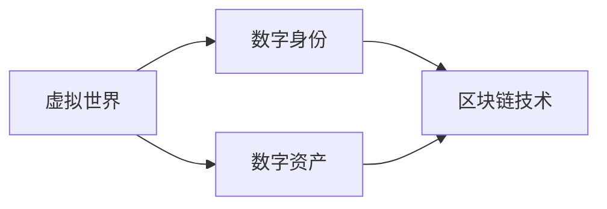

# 元宇宙 (Metaverse)

## 1. 背景介绍
### 1.1 元宇宙的起源与发展
#### 1.1.1 科幻小说中的元宇宙概念
#### 1.1.2 技术发展推动元宇宙的实现
#### 1.1.3 元宇宙的现状与未来展望

### 1.2 元宇宙的定义与特征
#### 1.2.1 元宇宙的定义
#### 1.2.2 元宇宙的主要特征
#### 1.2.3 元宇宙与虚拟现实、增强现实的区别

## 2. 核心概念与联系
### 2.1 虚拟世界
#### 2.1.1 虚拟世界的定义
#### 2.1.2 虚拟世界的构建要素
#### 2.1.3 虚拟世界与现实世界的交互

### 2.2 数字身份
#### 2.2.1 数字身份的概念
#### 2.2.2 数字身份的特点与应用
#### 2.2.3 数字身份的安全与隐私保护

### 2.3 数字资产
#### 2.3.1 数字资产的定义与分类
#### 2.3.2 数字资产的价值与交易
#### 2.3.3 数字资产的权属与确权

### 2.4 区块链技术
#### 2.4.1 区块链技术的基本原理
#### 2.4.2 区块链在元宇宙中的应用
#### 2.4.3 区块链与元宇宙的融合发展



## 3. 核心算法原理具体操作步骤
### 3.1 虚拟世界的构建算法
#### 3.1.1 三维建模与渲染
#### 3.1.2 物理引擎与碰撞检测  
#### 3.1.3 场景优化与加载

### 3.2 数字身份的生成与验证
#### 3.2.1 密码学算法
#### 3.2.2 生物特征识别
#### 3.2.3 多因素认证

### 3.3 数字资产的发行与交易
#### 3.3.1 数字资产的铸造
#### 3.3.2 智能合约
#### 3.3.3 去中心化交易

### 3.4 区块链的共识机制
#### 3.4.1 工作量证明(PoW)
#### 3.4.2 权益证明(PoS)  
#### 3.4.3 委托权益证明(DPoS)

## 4. 数学模型和公式详细讲解举例说明
### 4.1 三维空间中的坐标系与变换
#### 4.1.1 笛卡尔坐标系
三维笛卡尔坐标系中，一个点P的坐标可以表示为$(x,y,z)$，其中$x$、$y$、$z$分别表示点P在$x$、$y$、$z$轴上的坐标值。

#### 4.1.2 齐次坐标
齐次坐标是在笛卡尔坐标系的基础上引入一个额外的维度$w$，将三维点$(x,y,z)$表示为四维点$(x,y,z,w)$，其中$w$称为齐次坐标。当$w \neq 0$时，齐次坐标$(x,y,z,w)$表示三维空间中的点$(\frac{x}{w},\frac{y}{w},\frac{z}{w})$。

#### 4.1.3 仿射变换
仿射变换是一种保持直线和平行性的线性变换，可以用矩阵乘法来表示。在三维空间中，仿射变换可以表示为：

$$
\begin{bmatrix}
x' \\
y' \\
z' \\
1
\end{bmatrix}
=
\begin{bmatrix}
a_{11} & a_{12} & a_{13} & t_x \\
a_{21} & a_{22} & a_{23} & t_y \\
a_{31} & a_{32} & a_{33} & t_z \\
0 & 0 & 0 & 1
\end{bmatrix}
\begin{bmatrix}
x \\
y \\
z \\
1
\end{bmatrix}
$$

其中，$a_{ij}$表示线性变换矩阵，$t_x$、$t_y$、$t_z$表示平移向量。

### 4.2 密码学中的数学基础
#### 4.2.1 模运算
模运算是密码学中常用的数学工具，对于整数$a$、$b$和正整数$m$，如果$a-b$能被$m$整除，则称$a$与$b$模$m$同余，记作$a \equiv b \pmod{m}$。

#### 4.2.2 欧拉定理
欧拉定理指出，对于任意正整数$a$和$n$，如果$a$与$n$互质，则有：

$$a^{\varphi(n)} \equiv 1 \pmod{n}$$

其中，$\varphi(n)$表示小于$n$且与$n$互质的正整数个数，称为欧拉函数。

#### 4.2.3 椭圆曲线加密
椭圆曲线加密（ECC）是一种基于椭圆曲线数学的公钥加密算法。椭圆曲线可以表示为方程：

$$y^2 = x^3 + ax + b$$

其中，$a$和$b$是满足一定条件的常数。ECC的安全性基于椭圆曲线离散对数问题（ECDLP）的难解性。

### 4.3 区块链中的共识算法
#### 4.3.1 工作量证明(PoW)
工作量证明要求矿工通过解决一个计算难题来竞争区块的记账权。计算难题通常是找到一个随机数$nonce$，使得区块头哈希值满足一定的难度条件：

$$H(blockHeader || nonce) < target$$

其中，$H$表示哈希函数，$blockHeader$表示区块头信息，$target$表示难度目标值。

#### 4.3.2 权益证明(PoS)
权益证明根据节点持有的代币数量和时间来选择区块的记账权。节点被选中的概率与其持有的代币数量成正比，持有时间越长，被选中的概率越大。

#### 4.3.3 委托权益证明(DPoS)
委托权益证明是对权益证明的改进，通过投票选举出一定数量的代表节点来负责区块的生成和验证。持币者可以将自己的投票权委托给其信任的节点，获得一定的奖励。

## 5. 项目实践：代码实例和详细解释说明
### 5.1 虚拟世界的构建
以下是使用Three.js库构建一个简单的三维虚拟世界的示例代码：

```javascript
// 创建场景
const scene = new THREE.Scene();

// 创建相机
const camera = new THREE.PerspectiveCamera(75, window.innerWidth / window.innerHeight, 0.1, 1000);
camera.position.set(0, 0, 5);

// 创建渲染器
const renderer = new THREE.WebGLRenderer();
renderer.setSize(window.innerWidth, window.innerHeight);
document.body.appendChild(renderer.domElement);

// 创建一个立方体
const geometry = new THREE.BoxGeometry();
const material = new THREE.MeshBasicMaterial({ color: 0x00ff00 });
const cube = new THREE.Mesh(geometry, material);
scene.add(cube);

// 渲染场景
function animate() {
  requestAnimationFrame(animate);
  cube.rotation.x += 0.01;
  cube.rotation.y += 0.01;
  renderer.render(scene, camera);
}
animate();
```

这段代码首先创建了一个场景`scene`，然后创建了一个透视相机`camera`，设置了相机的位置。接着创建了一个WebGL渲染器`renderer`，并将其添加到文档中。

然后，代码创建了一个立方体几何体`geometry`和一个基本材质`material`，并将它们组合成一个网格对象`cube`，添加到场景中。

最后，通过`animate`函数实现了连续渲染，在每一帧中更新立方体的旋转角度，并使用渲染器将场景渲染到页面上。

### 5.2 数字身份的生成与验证
以下是使用Python实现数字身份生成与验证的示例代码：

```python
import hashlib
import random

# 生成数字身份
def generate_digital_identity(user_id):
    salt = str(random.randint(1000, 9999))
    hash_input = user_id + salt
    digital_identity = hashlib.sha256(hash_input.encode()).hexdigest()
    return digital_identity, salt

# 验证数字身份
def verify_digital_identity(user_id, salt, digital_identity):
    hash_input = user_id + salt
    computed_identity = hashlib.sha256(hash_input.encode()).hexdigest()
    return computed_identity == digital_identity

# 示例用法
user_id = "user123"
digital_identity, salt = generate_digital_identity(user_id)
print("Digital Identity:", digital_identity)
print("Salt:", salt)

is_valid = verify_digital_identity(user_id, salt, digital_identity)
print("Is Valid:", is_valid)
```

这段代码定义了两个函数：`generate_digital_identity`用于生成数字身份，`verify_digital_identity`用于验证数字身份。

在生成数字身份时，首先生成一个随机的盐值`salt`，然后将用户ID和盐值拼接起来作为哈希函数的输入，使用SHA-256算法计算哈希值，得到数字身份`digital_identity`。

在验证数字身份时，将用户ID、盐值和待验证的数字身份作为输入，重新计算哈希值，并与待验证的数字身份进行比较，如果相等则验证通过。

示例代码演示了如何使用这两个函数生成和验证数字身份。生成数字身份时，传入用户ID，返回生成的数字身份和盐值。验证数字身份时，传入用户ID、盐值和待验证的数字身份，返回验证结果。

### 5.3 数字资产的发行与交易
以下是使用Solidity语言实现一个简单的ERC20代币合约，用于数字资产的发行与交易：

```solidity
pragma solidity ^0.8.0;

contract MyToken {
    string public name;
    string public symbol;
    uint8 public decimals;
    uint256 public totalSupply;

    mapping(address => uint256) public balanceOf;
    mapping(address => mapping(address => uint256)) public allowance;

    event Transfer(address indexed from, address indexed to, uint256 value);
    event Approval(address indexed owner, address indexed spender, uint256 value);

    constructor(string memory _name, string memory _symbol, uint8 _decimals, uint256 _initialSupply) {
        name = _name;
        symbol = _symbol;
        decimals = _decimals;
        totalSupply = _initialSupply * 10 ** decimals;
        balanceOf[msg.sender] = totalSupply;
    }

    function transfer(address _to, uint256 _value) public returns (bool success) {
        require(balanceOf[msg.sender] >= _value, "Insufficient balance");
        balanceOf[msg.sender] -= _value;
        balanceOf[_to] += _value;
        emit Transfer(msg.sender, _to, _value);
        return true;
    }

    function approve(address _spender, uint256 _value) public returns (bool success) {
        allowance[msg.sender][_spender] = _value;
        emit Approval(msg.sender, _spender, _value);
        return true;
    }

    function transferFrom(address _from, address _to, uint256 _value) public returns (bool success) {
        require(balanceOf[_from] >= _value, "Insufficient balance");
        require(allowance[_from][msg.sender] >= _value, "Insufficient allowance");
        balanceOf[_from] -= _value;
        balanceOf[_to] += _value;
        allowance[_from][msg.sender] -= _value;
        emit Transfer(_from, _to, _value);
        return true;
    }
}
```

这个合约定义了一个名为`MyToken`的ERC20代币。合约中包含了代币的基本信息，如名称`name`、符号`symbol`、小数位数`decimals`和总供应量`totalSupply`。

合约中定义了两个映射：`balanceOf`用于记录每个地址的代币余额，`allowance`用于记录授权转账的额度。

合约还定义了两个事件：`Transfer`用于记录代币转账的信息，`Approval`用于记录授权转账的信息。

构造函数`constructor`接受代币的名称、符号、小数位数和初始供应量作为参数，并初始化合约的状态变量。

`transfer`函数用于转账代币，将指定数量的代币从发送者的账户转移到接收者的账户。

`approve`函数用于授权其他地址转移代币，允许被授权地址从发送者的账户中转移指定数量的代币。

`transferFrom`函数用于被授权地址从发送者的账户中转移代币到接收者的账户，前提是发送者已经授权了足够的额度。

这个合约实现了ERC20代币的基本功