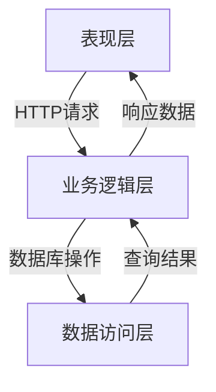
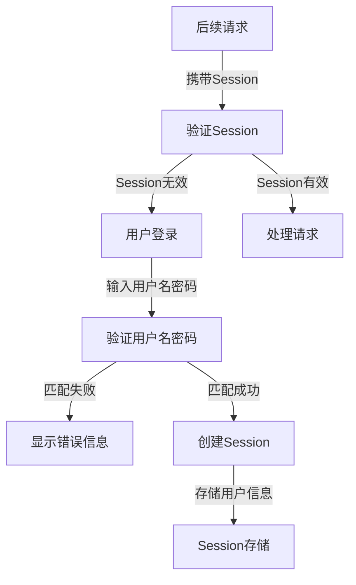
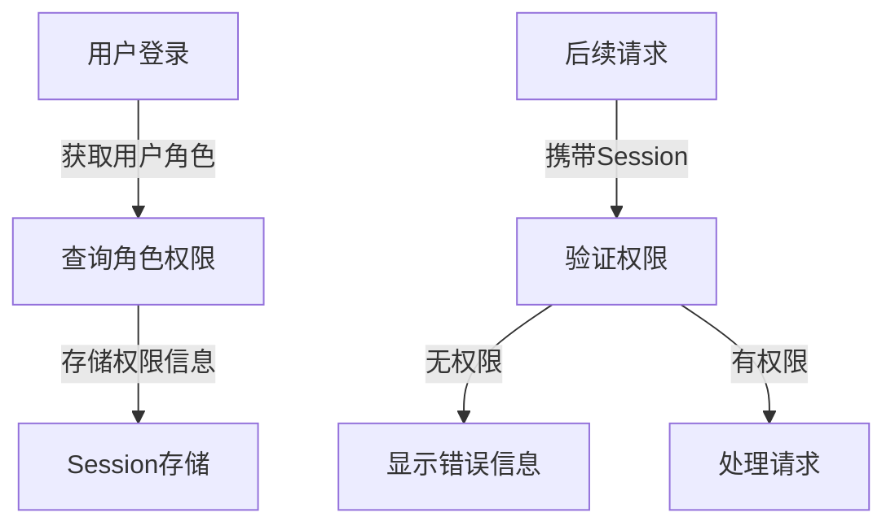
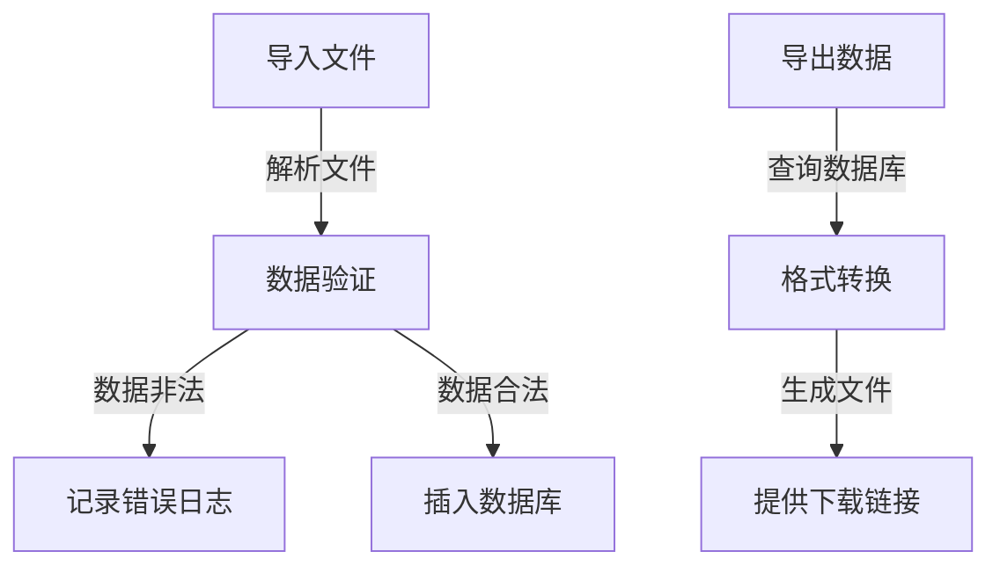

# 公司员工个人信息网络管理系统详细设计与具体代码实现

## 1.背景介绍

### 1.1 现状与挑战

在当今快节奏的商业环境中，有效管理员工信息对于企业的高效运营至关重要。随着公司规模的不断扩大,员工人数的持续增长,传统的纸质文件和电子表格等管理方式已经无法满足日益复杂的需求。因此,构建一个集中式的员工信息管理系统势在必行,以确保数据的准确性、一致性和安全性。

然而,开发这样一个系统并非易事。它需要处理大量的数据,涉及多种功能模块,并且必须具有良好的可扩展性和可维护性。同时,系统还需要考虑用户体验、数据隐私和安全等多个方面的需求。

### 1.2 系统目标

本文旨在介绍一种基于 Web 的员工信息管理系统的设计与实现,该系统能够满足以下主要目标:

1. 集中存储和管理公司所有员工的个人信息,包括基本资料、联系方式、教育背景、工作经历等。
2. 提供用户友好的界面,方便员工查看和修改自己的信息。
3. 实现基于角色的访问控制,确保只有授权人员才能查看和编辑相关信息。
4. 支持数据导入导出功能,方便与其他系统集成。
5. 具有良好的可扩展性和可维护性,以适应未来的需求变化。

## 2.核心概念与联系

### 2.1 系统架构概览

该员工信息管理系统采用经典的三层架构,包括表现层(Presentation Layer)、业务逻辑层(Business Logic Layer)和数据访问层(Data Access Layer)。



### 2.2 核心模块

系统的核心模块包括:

1. **用户模块**: 管理系统用户的注册、登录、权限等功能。
2. **员工信息模块**: 维护员工的基本资料、联系方式、教育背景、工作经历等信息。
3. **权限控制模块**: 实现基于角色的访问控制,确保数据的安全性和隐私性。
4. **数据导入导出模块**: 支持将员工信息导入导出到其他系统或文件。

### 2.3 数据模型

员工信息管理系统的数据模型由多个相互关联的表组成,主要包括:

- `User`: 存储系统用户信息,如用户名、密码、角色等。
- `Employee`: 存储员工的基本资料,如姓名、出生日期、性别等。
- `Contact`: 存储员工的联系方式,如电话、邮箱、地址等。
- `Education`: 存储员工的教育背景,如学校、专业、学位等。
- `Experience`: 存储员工的工作经历,如公司、职位、时间段等。

## 3.核心算法原理具体操作步骤  

### 3.1 用户认证

用户认证是系统的核心功能之一,它确保只有合法用户才能访问相应的数据和功能。该系统采用了基于 Session 的认证机制,具体流程如下:

1. 用户在登录页面输入用户名和密码。
2. 系统将用户名和密码的哈希值与数据库中的记录进行比对。
3. 如果匹配成功,系统将用户的相关信息存储在服务器的 Session 中。
4. 对于每一个后续的请求,系统都会验证 Session 是否有效。
5. 如果 Session 无效或已过期,系统将要求用户重新登录。



### 3.2 权限控制

为了保护敏感数据的安全性和隐私性,系统实现了基于角色的访问控制(RBAC)机制。每个用户在系统中被分配一个或多个角色,不同的角色拥有不同的权限。

1. 在用户登录成功后,系统会根据用户的角色从数据库中查询相应的权限。
2. 对于每一个请求,系统会检查用户是否具有执行该操作的权限。
3. 如果用户有足够的权限,则允许执行该操作;否则,系统将拒绝该请求并显示错误信息。



### 3.3 数据导入导出

为了方便与其他系统集成,该系统支持将员工信息导入导出到不同的文件格式,如 CSV、Excel 等。导入导出的具体步骤如下:

1. **导入**:
   1. 用户选择要导入的文件。
   2. 系统解析文件的格式和内容。
   3. 对于每一条记录,系统会执行数据验证和转换。
   4. 将合法的记录插入到相应的数据库表中。
   5. 记录导入日志,包括成功导入的记录数和失败的记录详情。

2. **导出**:
   1. 用户选择要导出的数据范围,如所有员工、部门员工等。
   2. 系统从数据库中查询相应的记录。
   3. 将查询结果转换为指定的文件格式。
   4. 提供文件下载链接给用户。



## 4.数学模型和公式详细讲解举例说明

在员工信息管理系统中,我们可以使用一些数学模型和公式来优化系统的性能和用户体验。以下是一些常见的应用场景:

### 4.1 数据压缩

为了节省存储空间和提高网络传输效率,我们可以对员工信息进行压缩。一种常见的无损压缩算法是霍夫曼编码(Huffman Coding),它的核心思想是为出现频率较高的字符分配较短的编码,而为出现频率较低的字符分配较长的编码。

设有一个字符集 $C = \{c_1, c_2, \ldots, c_n\}$,其中每个字符 $c_i$ 出现的概率为 $p_i$,则根据信息论,我们可以计算出每个字符的最优编码长度:

$$l_i = -\log_2 p_i$$

基于这个公式,我们可以构建霍夫曼树,并从中得到每个字符的霍夫曼编码。压缩后的数据大小可以使用以下公式计算:

$$\text{Compressed Size} = \sum_{i=1}^n l_i \times p_i \times \text{Original Size}$$

### 4.2 相似度计算

在员工信息管理系统中,我们可能需要计算员工之间的相似度,以便进行推荐或分组。一种常见的相似度度量方法是余弦相似度(Cosine Similarity),它通过计算两个向量之间的夹角余弦值来衡量它们的相似程度。

设有两个员工 $A$ 和 $B$,他们的信息可以表示为向量 $\vec{a}$ 和 $\vec{b}$,则两个员工之间的余弦相似度可以计算如下:

$$\text{Similarity}(A, B) = \cos(\theta) = \frac{\vec{a} \cdot \vec{b}}{|\vec{a}||\vec{b}|} = \frac{\sum_{i=1}^n a_i b_i}{\sqrt{\sum_{i=1}^n a_i^2} \sqrt{\sum_{i=1}^n b_i^2}}$$

其中 $\theta$ 是两个向量之间的夹角。相似度的取值范围为 $[0, 1]$,值越大表示两个员工越相似。

### 4.3 推荐系统

在员工信息管理系统中,我们可以利用协同过滤算法(Collaborative Filtering)为员工推荐相关的职位或培训课程。协同过滤算法的核心思想是基于用户之间的相似度来预测用户对某个项目的偏好程度。

假设我们有一个用户-项目评分矩阵 $R$,其中 $r_{ui}$ 表示用户 $u$ 对项目 $i$ 的评分。我们可以使用基于用户的协同过滤算法来预测用户 $u$ 对项目 $j$ 的评分:

$$\hat{r}_{uj} = \bar{r}_u + \frac{\sum_{v \in N(u,j)} \text{sim}(u, v)(r_{vj} - \bar{r}_v)}{\sum_{v \in N(u,j)} |\text{sim}(u, v)|}$$

其中 $\bar{r}_u$ 和 $\bar{r}_v$ 分别表示用户 $u$ 和 $v$ 的平均评分, $N(u,j)$ 表示对项目 $j$ 有评分的用户集合, $\text{sim}(u, v)$ 表示用户 $u$ 和 $v$ 之间的相似度。

## 5.项目实践：代码实例和详细解释说明

在本节中,我们将提供一些核心模块的代码实例,并对其进行详细的解释说明。

### 5.1 用户认证模块

以下是用户认证模块的核心代码,它使用 Flask 框架和 Flask-Login 扩展实现:

```python
from flask import Flask, render_template, redirect, url_for, flash
from flask_login import LoginManager, UserMixin, login_user, logout_user, login_required, current_user
from werkzeug.security import generate_password_hash, check_password_hash

app = Flask(__name__)
app.secret_key = 'your_secret_key'
login_manager = LoginManager(app)

# 用户模型
class User(UserMixin):
    def __init__(self, id, username, password):
        self.id = id
        self.username = username
        self.password_hash = generate_password_hash(password)

    def verify_password(self, password):
        return check_password_hash(self.password_hash, password)

# 从数据库加载用户
@login_manager.user_loader
def load_user(user_id):
    # 从数据库查询用户信息
    user = get_user_from_db(user_id)
    if user:
        return User(user.id, user.username, user.password)
    return None

# 登录路由
@app.route('/login', methods=['GET', 'POST'])
def login():
    if request.method == 'POST':
        username = request.form.get('username')
        password = request.form.get('password')
        user = get_user_from_db(username)
        if user and user.verify_password(password):
            login_user(user)
            return redirect(url_for('dashboard'))
        flash('Invalid username or password', 'error')
    return render_template('login.html')

# 登出路由
@app.route('/logout')
@login_required
def logout():
    logout_user()
    return redirect(url_for('login'))
```

在这个示例中,我们定义了一个 `User` 类,它继承自 `UserMixin` 类,用于存储用户信息和验证密码。`load_user` 函数从数据库加载用户信息,并将其转换为 `User` 对象。

`login` 视图函数处理用户登录请求。它从表单中获取用户名和密码,验证用户信息是否正确。如果验证通过,则使用 `login_user` 函数将用户登录,并重定向到仪表板页面。否则,它会显示错误消息。

`logout` 视图函数使用 `logout_user` 函数注销当前用户,并重定向到登录页面。

### 5.2 权限控制模块

以下是权限控制模块的核心代码,它使用基于角色的访问控制 (RBAC) 机制:

```python
from flask_principal import Principal, Permission, RoleNeed, UserNeed

app = Flask(__name__)
principal = Principal(app)

# 定义角色和权限
admin_role = RoleNeed('admin')
employee_role = RoleNeed('employee')

admin_permission = Permission(admin_