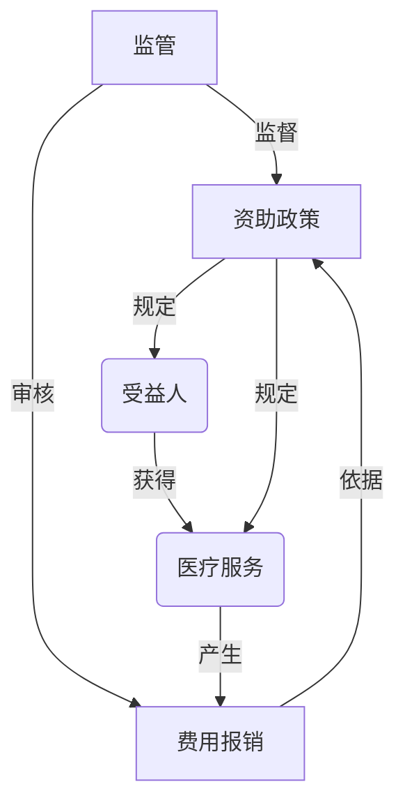

# 公费医疗管理系统详细设计与具体代码实现

## 1.背景介绍

随着医疗保健体系的不断发展和人口老龄化的加剧,公费医疗管理系统在各国家和地区的医疗卫生事业中扮演着越来越重要的角色。公费医疗管理系统旨在为符合条件的人群提供医疗费用的全部或部分资助,确保他们能够获得所需的医疗服务,减轻个人和家庭的经济负担。

公费医疗管理系统通常包括以下几个主要方面:

1. 受益人资格认定:确定哪些人群符合公费医疗资助的条件,如低收入家庭、残疾人士、退伍军人等。

2. 医疗服务范围:规定哪些医疗服务可以获得资助,如门诊、住院、手术、药品等。

3. 费用报销流程:建立标准化的费用报销流程,包括收集和审核相关文件、计算资助金额、发放资助款项等。

4. 数据管理:建立完善的数据库系统,记录受益人信息、医疗服务明细、费用报销情况等,用于统计分析和决策支持。

5. 监管机制:设立相应的监管机构和措施,防止滥用和欺诈行为,确保资金的合理使用。

## 2.核心概念与联系

公费医疗管理系统涉及多个核心概念,它们之间存在着密切的联系。以下是一些关键概念及其相互关系:

1. **受益人(Beneficiary)**:指符合条件可获得公费医疗资助的人群,是整个系统的核心对象。

2. **医疗服务(Medical Service)**:指受益人可获得资助的各种医疗项目,如门诊、住院、手术等,是系统的主要服务对象。

3. **资助政策(Subsidy Policy)**:规定了受益人资格条件、医疗服务范围、资助比例等,是系统运行的基本准则。

4. **费用报销(Expense Reimbursement)**:受益人支付医疗费用后,向系统申请相应资助金额的过程。

5. **监管(Supervision)**:通过审核、稽核等措施,确保系统公平、合理、高效运行。

这些核心概念之间存在着紧密的联系,相互影响和制约。如资助政策决定了受益人资格和医疗服务范围,费用报销过程需要依据政策进行审核,监管则贯穿于整个系统的运行过程。只有这些概念协调一致,系统才能高效运转。



## 3.核心算法原理具体操作步骤

公费医疗管理系统的核心算法主要包括以下几个方面:

### 3.1 受益人资格认定算法

该算法用于判断某个人是否符合公费医疗资助的条件,主要步骤如下:

1. 收集受益人基本信息,如身份证号、家庭收入、残疾情况等。

2. 根据现行资助政策,提取相关资格条件规则。

3. 对受益人信息进行规则匹配,判断是否满足条件。

4. 如果满足条件,则认定为受益人,否则不予认定。

该算法可以采用规则引擎或决策树等技术实现。

### 3.2 医疗费用计算算法

该算法用于计算受益人的实际医疗费用和资助金额,主要步骤如下:

1. 获取受益人的医疗服务明细,包括项目名称、收费标准等。

2. 根据现行资助政策,提取相关医疗服务的资助比例规则。

3. 对每个医疗服务项目,计算实际费用和资助金额。

4. 汇总所有项目,得到受益人的总医疗费用和资助总额。

该算法需要处理不同医疗服务项目的费用计算规则,可以采用面向对象设计等方式提高可扩展性。

### 3.3 费用报销审核算法

该算法用于审核受益人的费用报销申请,主要步骤如下:

1. 获取受益人提交的报销申请,包括相关票据、医疗记录等。

2. 验证受益人身份和资格有效性。

3. 对报销申请进行合法性和完整性检查。

4. 调用医疗费用计算算法,计算实际费用和资助金额。

5. 根据计算结果和现行政策,作出审核决定(通过或拒绝)。

该算法需要处理各种异常情况,如信息不完整、重复报销等,可以采用状态机或工作流引擎等技术实现。

## 4.数学模型和公式详细讲解举例说明

在公费医疗管理系统中,数学模型和公式主要用于计算医疗费用和资助金额。以下是一些常见的模型和公式:

### 4.1 医疗费用计算模型

假设一个受益人 $i$ 在某次就医中接受了 $n$ 种医疗服务,每种服务的费用为 $c_j(1 \leq j \leq n)$,那么受益人的总医疗费用 $C_i$ 可以表示为:

$$C_i = \sum_{j=1}^{n} c_j$$

### 4.2 资助金额计算模型

假设对于某种医疗服务 $j$,其资助比例为 $r_j(0 \leq r_j \leq 1)$,那么该服务的资助金额 $s_j$ 可以表示为:

$$s_j = r_j \times c_j$$

进而,受益人 $i$ 的总资助金额 $S_i$ 可以表示为:

$$S_i = \sum_{j=1}^{n} s_j = \sum_{j=1}^{n} r_j \times c_j$$

### 4.3 自付金额计算模型

受益人的自付金额 $P_i$ 即为总医疗费用 $C_i$ 减去总资助金额 $S_i$:

$$P_i = C_i - S_i = \sum_{j=1}^{n} c_j - \sum_{j=1}^{n} r_j \times c_j = \sum_{j=1}^{n} (1 - r_j) \times c_j$$

### 4.4 举例说明

假设一位受益人 Alice 在某次就医中接受了以下三种医疗服务:

- 门诊费用 $100$ 元,资助比例 $80\%$
- 手术费用 $5000$ 元,资助比例 $70\%$
- 住院费用 $2000$ 元,资助比例 $60\%$

根据上述模型和公式,可以计算出:

- Alice 的总医疗费用 $C_A = 100 + 5000 + 2000 = 7100$ 元
- 门诊费用资助金额 $s_1 = 0.8 \times 100 = 80$ 元
- 手术费用资助金额 $s_2 = 0.7 \times 5000 = 3500$ 元
- 住院费用资助金额 $s_3 = 0.6 \times 2000 = 1200$ 元
- Alice 的总资助金额 $S_A = 80 + 3500 + 1200 = 4780$ 元
- Alice 的自付金额 $P_A = 7100 - 4780 = 2320$ 元

通过这些公式和模型,系统可以精确计算出每位受益人的医疗费用和资助金额,为费用报销流程提供数据支持。

## 5.项目实践:代码实例和详细解释说明

为了更好地理解公费医疗管理系统的实现,我们将提供一个基于 Java 语言的代码示例,包括核心类和方法的实现。

### 5.1 核心类设计

```java
// 受益人类
class Beneficiary {
    private String id; // 身份证号
    private String name;
    private boolean eligible; // 是否符合资格
    // 构造函数、getter/setter方法
}

// 医疗服务类
class MedicalService {
    private String name; // 服务名称
    private double cost; // 费用
    private double subsidyRatio; // 资助比例
    // 构造函数、getter/setter方法
}

// 费用报销申请类
class ReimbursementClaim {
    private Beneficiary beneficiary;
    private List<MedicalService> services;
    private double totalCost; // 总费用
    private double subsidyAmount; // 资助金额
    private double selfPayAmount; // 自付金额
    private boolean approved; // 是否通过审核
    // 构造函数、getter/setter方法
}
```

### 5.2 资格认定方法

```java
// 资格认定规则(伪代码)
boolean isEligible(Beneficiary beneficiary) {
    if (beneficiary.getIncome() < 2000) return true; // 低收入家庭
    if (beneficiary.isDisabled()) return true; // 残疾人士
    // 其他规则...
    return false;
}
```

### 5.3 费用计算方法

```java
// 计算费用报销明细
void calculateClaim(ReimbursementClaim claim) {
    double totalCost = 0;
    double subsidyAmount = 0;
    for (MedicalService service : claim.getServices()) {
        totalCost += service.getCost();
        subsidyAmount += service.getCost() * service.getSubsidyRatio();
    }
    claim.setTotalCost(totalCost);
    claim.setSubsidyAmount(subsidyAmount);
    claim.setSelfPayAmount(totalCost - subsidyAmount);
}
```

### 5.4 报销审核方法

```java
// 审核费用报销申请
boolean approveClaim(ReimbursementClaim claim) {
    // 验证受益人资格
    if (!isEligible(claim.getBeneficiary())) return false;

    // 检查申请合法性
    if (!validateClaim(claim)) return false;

    // 计算费用明细
    calculateClaim(claim);

    // 其他审核规则...

    claim.setApproved(true);
    return true;
}
```

上述代码示例展示了公费医疗管理系统的核心类和方法实现,包括受益人资格认定、医疗费用计算和费用报销审核等功能。在实际项目中,这些代码需要进一步扩展和优化,以满足更复杂的业务需求和非功能性需求。

## 6.实际应用场景

公费医疗管理系统在现实生活中有着广泛的应用场景,为不同群体提供医疗保障。以下是一些典型的应用场景:

### 6.1 城乡低保人群

城乡低保人群是公费医疗管理系统的主要受益对象。由于家庭收入低于当地最低生活保障线,他们难以承担高昂的医疗费用。通过公费医疗系统,他们可以获得部分或全部费用的资助,减轻经济负担。

### 6.2 残疾人士

残疾人士由于生理或心理缺陷,在就医方面面临着特殊的挑战。公费医疗管理系统为残疾人士提供了必要的医疗保障,确保他们能够获得所需的治疗和康复服务。

### 6.3 退伍军人

作为对退伍军人的优待,许多国家都为他们提供公费医疗资助。这不仅是对他们为国家做出贡献的回报,也是维护军人权益的重要体现。

### 6.4 特殊疾病患者

某些罕见疾病或重症患者的医疗费用往往高昂且长期,给个人和家庭带来沉重的经济负担。公费医疗管理系统可以为这些患者提供专门的资助计划,确保他们能够得到及时和持续的治疗。

### 6.5 自然灾害和突发事件

在自然灾害或其他突发事件中,大量民众可能受伤或患病,需要紧急医疗救助。公费医疗管理系统可以快速启动应急预案,为受灾群众提供必要的医疗资助。

通过上述应用场景,我们可以看到公费医疗管理系统在保障民众健康权益、减轻家庭经济负担、促进社会公平正义等方面发挥着重要作用。

## 7.工具和资源推荐

在开发和维护公费医疗管理系统的过程中,可以利用一些优秀的工具和资源,以提高效率和质量。以下是一些推荐:

### 7.1 开发工具

- **集成开发环境(IDE)**: 如 IntelliJ IDEA、Eclipse 等,提供代码编辑、调试、版本控制等功能。
- **数据库管理工具**: 如 MySQL Work