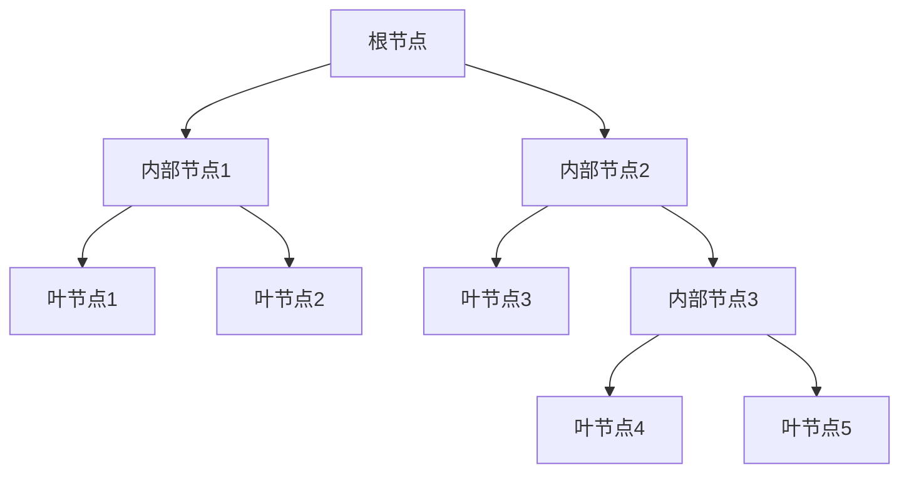

# 决策树算法在智能物流系统中的实践

## 1.背景介绍

### 1.1 智能物流系统的重要性

在当今快节奏的商业环境中，高效的物流系统对于企业的成功至关重要。随着电子商务的蓬勿发展和客户需求的不断变化,物流运营面临着前所未有的挑战。传统的物流系统已经无法满足现代化需求,因此引入智能化技术成为了必然选择。

智能物流系统通过集成先进的人工智能算法、大数据分析和物联网技术,旨在优化物流流程、提高运营效率、降低成本并提升客户体验。其中,决策树算法作为一种强大的机器学习技术,在智能物流系统中扮演着关键角色。

### 1.2 决策树算法概述

决策树算法是一种监督学习算法,通过构建决策树模型来解决分类和回归问题。它根据训练数据中特征的条件,将实例按照树状结构进行递归划分,最终得到一个决策树模型。该模型可用于对新实例进行预测或决策。

决策树算法具有以下优点:

- 可解释性强,树状结构易于理解
- 无需特征缩放,可处理数值型和类别型特征
- 可自动处理缺失值
- 训练速度快,计算高效

这些优点使决策树算法在智能物流系统中有着广泛的应用前景。

## 2.核心概念与联系

### 2.1 决策树基本概念

决策树由节点和边构成,包含三种类型的节点:

1. **根节点**: 树的起点
2. **内部节点**: 用于对实例数据进行分类测试
3. **叶节点**: 代表了最终的决策结果

每个内部节点都对应一个特征,根据特征的取值将实例数据划分到子节点。决策树的构建过程是一个递归的过程,直到满足停止条件为止。



### 2.2 决策树与物流系统的联系

在智能物流系统中,决策树算法可以应用于多个场景:

- **路线规划**: 根据起点、终点、货物属性等特征,决策最优运输路线
- **仓储管理**: 基于库存水平、货物类型等,决策货物的入库位置和出库顺序
- **配送优化**: 通过决策树模型,合理安排配送车辆和人员,优化配送路线
- **异常检测**: 利用历史数据训练决策树模型,对物流流程中的异常进行检测和预警

通过构建适当的决策树模型,智能物流系统可以自动化决策过程,提高运营效率和决策质量。

## 3.核心算法原理具体操作步骤  

决策树算法的核心在于如何构建决策树模型。常见的决策树算法包括ID3、C4.5和CART等。以下是CART(Classification and Regression Tree)决策树算法的具体步骤:

### 3.1 选择最优特征

CART算法使用基尼指数或熵作为指标,选择具有最大信息增益的特征作为当前节点的分裂特征。

1. 计算数据集D的基尼指数或熵
2. 对于每个特征A:
    - 按特征A的取值将D划分为多个子集D1,D2,...
    - 计算A=a1时的基尼指数/熵,A=a2时的基尼指数/熵,...
    - 计算A的加权平均基尼指数/熵
3. 选择加权平均基尼指数/熵最小的特征作为分裂特征

### 3.2 生成子节点

根据选定的分裂特征,生成子节点:

- 如果分裂特征是数值型,则按特征值排序后,寻找使基尼指数/熵最小的分割点,将数据划分为两个子集
- 如果分裂特征是类别型,则按特征取值将数据划分为多个子集

### 3.3 递归构建决策树

对于每个子节点:

- 如果子节点的实例属于同一类别,则将该节点标记为叶节点
- 如果没有更多特征可用于划分,则将该节点标记为叶节点,类别为数据中实例最多的类别
- 否则,继续在该子节点上递归调用步骤3.1和3.2,生成新的子节点

### 3.4 决策树剪枝

为了防止过拟合,CART算法采用代价复杂度剪枝策略:

1. 从完整生成的决策树底部开始剪枝
2. 计算将当前内部节点转变为叶节点后的代价复杂度
3. 如果代价复杂度小于设定的阈值,则将该节点转变为叶节点
4. 重复步骤2和3,直到代价复杂度大于阈值为止

通过上述步骤,CART算法可以高效地构建出决策树模型,并通过剪枝策略控制模型的复杂度,避免过拟合。

## 4.数学模型和公式详细讲解举例说明

在决策树算法中,常用的数学模型和公式包括基尼指数、信息熵、信息增益等。下面将详细讲解这些公式及其在算法中的应用。

### 4.1 基尼指数(Gini Index)

基尼指数用于度量数据集D的纯度,其值越小,数据集D的纯度越高。对于二分类问题,基尼指数的计算公式如下:

$$Gini(D) = 1 - \sum_{k=1}^{K}p_k^2$$

其中:
- K是类别的个数
- $p_k$是类别k在数据集D中的比例

例如,对于一个包含6个正例和4个反例的数据集D,其基尼指数为:

$$Gini(D) = 1 - (0.6)^2 - (0.4)^2 = 0.48$$

在特征A的条件下,数据集D被划分为D1,D2,...,Dn,则A的基尼指数为:

$$Gini_A(D) = \sum_{j=1}^{n}\frac{|D_j|}{|D|}Gini(D_j)$$

CART算法选择具有最小基尼指数的特征作为分裂特征。

### 4.2 信息熵(Entropy)

信息熵用于度量数据集D的无序程度,其值越小,数据集D的纯度越高。对于多分类问题,信息熵的计算公式如下:

$$Ent(D) = -\sum_{k=1}^{K}p_k\log_2p_k$$

其中:
- K是类别的个数
- $p_k$是类别k在数据集D中的比例

例如,对于一个包含6个正例和4个反例的数据集D,其信息熵为:

$$Ent(D) = -(0.6\log_20.6 + 0.4\log_20.4) \approx 0.971$$

在特征A的条件下,数据集D被划分为D1,D2,...,Dn,则A的信息熵为:

$$Ent_A(D) = \sum_{j=1}^{n}\frac{|D_j|}{|D|}Ent(D_j)$$

### 4.3 信息增益(Information Gain)

信息增益用于度量特征A对数据集D的"不确定性"的减少程度,其值越大,说明特征A对数据集D的分类能力越强。信息增益的计算公式如下:

$$Gain(D,A) = Ent(D) - Ent_A(D)$$

ID3算法选择具有最大信息增益的特征作为分裂特征。

### 4.4 实例:决策树分类

假设我们有一个包含天气情况和是否适合打球的数据集,如下表所示:

| 天气 | 温度 | humidity | 风力 | 是否适合打球 |
|------|------|----------|------|--------------|
| 晴朗 | 高温 | 高       | 弱   | 否           |
| 晴朗 | 高温 | 高       | 强   | 否           |
| 阴天 | 高温 | 高       | 弱   | 是           |
| 雨天 | 温和 | 高       | 弱   | 是           |
| 雨天 | 冷   | 常规     | 弱   | 是           |
| 雨天 | 冷   | 常规     | 强   | 否           |
| 阴天 | 冷   | 常规     | 强   | 是           |
| 晴朗 | 温和 | 高       | 弱   | 否           |
| 晴朗 | 冷   | 常规     | 弱   | 是           |
| 雨天 | 温和 | 常规     | 弱   | 是           |
| 晴朗 | 温和 | 常规     | 强   | 是           |
| 阴天 | 温和 | 高       | 强   | 是           |
| 阴天 | 高温 | 常规     | 弱   | 是           |
| 雨天 | 温和 | 高       | 强   | 否           |

我们希望构建一个决策树模型,根据天气情况预测是否适合打球。

1. 首先计算整个数据集D的信息熵:

   $$Ent(D) = -(9/14)\log_2(9/14) - (5/14)\log_2(5/14) \approx 0.940$$

2. 计算以"天气"特征划分后的信息熵:

   - 晴朗: $Ent(D_{\text{晴朗}}) = -(2/5)\log_2(2/5) - (3/5)\log_2(3/5) \approx 0.971$
   - 阴天: $Ent(D_{\text{阴天}}) = -(3/4)\log_2(3/4) - (1/4)\log_2(1/4) \approx 0.811$
   - 雨天: $Ent(D_{\text{雨天}}) = -(3/5)\log_2(3/5) - (2/5)\log_2(2/5) \approx 0.971$

   因此,"天气"特征的信息熵为:
   $$Ent_{\text{天气}}(D) = (5/14)\times0.971 + (4/14)\times0.811 + (5/14)\times0.971 \approx 0.933$$

3. 计算"天气"特征的信息增益:
   $$Gain(D,\text{天气}) = 0.940 - 0.933 = 0.007$$

4. 以同样的方式计算其他特征的信息增益,结果如下:
   - $Gain(D,\text{温度}) = 0.029$
   - $Gain(D,\text{humidity}) = 0.151$
   - $Gain(D,\text{风力}) = 0.048$

5. 由于"humidity"特征具有最大的信息增益,因此选择它作为根节点的分裂特征。

通过上述过程,我们可以继续递归构建决策树模型。该实例展示了如何应用信息熵和信息增益公式来构建决策树分类器。

## 5.项目实践:代码实例和详细解释说明

为了更好地理解决策树算法在实践中的应用,我们将使用Python中的scikit-learn库,构建一个决策树模型来解决物流配送问题。

### 5.1 问题描述

假设我们有一家物流公司,需要根据包裹的重量、尺寸和目的地来决定使用何种运输方式(陆运、航运或空运)。我们将使用历史数据训练一个决策树模型,以预测新包裹的最佳运输方式。

### 5.2 数据准备

我们首先导入所需的库和示例数据集:

```python
import pandas as pd
from sklearn.tree import DecisionTreeClassifier
from sklearn.model_selection import train_test_split
from sklearn.metrics import accuracy_score

# 加载示例数据
data = pd.read_csv('logistics_data.csv')
X = data.drop('transport_mode', axis=1)
y = data['transport_mode']
```

`logistics_data.csv`包含以下列:

- weight: 包裹重量(kg)
- dimensions: 包裹尺寸(cm)
- distance: 目的地距离(km)
- transport_mode: 运输方式(0-陆运, 1-航运, 2-空运)

### 5.3 构建决策树模型

```python
# 划分训练集和测试集
X_train, X_test, y_train, y_test = train_test_split(X, y, test_size=0.2, random_state=42)

# 创建决策树分类器
clf = DecisionTreeClassifier(criterion='gini', max_depth=4)

# 训练模