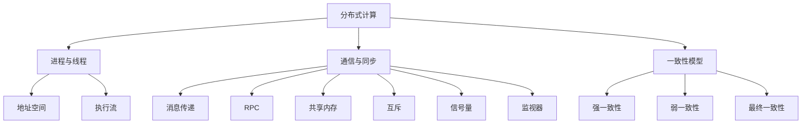

# 分布式计算原理与代码实战案例讲解

## 1. 背景介绍

在当今数据量爆炸式增长的时代，单机系统已经无法满足日益增长的计算需求。为了解决这一问题,分布式计算应运而生。分布式计算系统通过将大量的计算任务分配到多个计算节点上并行执行,从而显著提高了系统的计算能力和可扩展性。

分布式计算的概念最早可以追溯到20世纪60年代,当时主要应用于科学计算领域。随着互联网技术的快速发展,分布式计算逐渐渗透到了各个领域,例如大数据处理、机器学习、在线服务等。目前,分布式计算已经成为构建大规模、高性能、高可用系统的核心技术之一。

### 1.1 分布式计算的优势

相较于传统的单机系统,分布式计算具有以下显著优势:

1. **高性能计算能力**:通过将计算任务分配到多个节点上并行执行,可以充分利用集群的计算资源,大幅提升系统的整体计算能力。

2. **高可扩展性**:分布式系统可以通过添加新的计算节点来线性扩展系统的计算能力,满足不断增长的计算需求。

3. **高可用性**:分布式系统中的节点通常是松耦合的,单个节点的故障不会导致整个系统瘫痪,从而提高了系统的可用性。

4. **容错性**:分布式系统通常采用冗余备份机制,当某个节点发生故障时,可以将任务迁移到其他节点上执行,提高了系统的容错能力。

5. **资源利用率高**:分布式系统可以充分利用各个节点上的计算资源,提高了资源的利用效率。

### 1.2 分布式计算的挑战

尽管分布式计算带来了诸多优势,但同时也面临着一些挑战:

1. **并发控制**:在分布式环境中,多个节点可能同时访问共享资源,需要采用合理的并发控制机制来避免数据竞争和不一致问题。

2. **故障处理**:分布式系统中的节点可能会出现各种故障,如硬件故障、网络故障等,需要设计合理的容错机制来保证系统的可靠性。

3. **分区容忍**:分布式系统中的节点可能会被划分为多个分区,需要采用合理的分区容忍机制来保证系统的一致性。

4. **负载均衡**:为了充分利用集群资源,需要采用合理的负载均衡策略将任务均匀分配到各个节点上。

5. **数据一致性**:在分布式环境中,数据可能会被复制到多个节点上,需要采用合理的数据一致性协议来保证数据的一致性。

6. **调试和监控**:相较于单机系统,分布式系统的调试和监控更加复杂,需要采用专门的工具和技术来实现。

## 2. 核心概念与联系

为了更好地理解分布式计算的原理,我们需要先了解一些核心概念及它们之间的联系。

### 2.1 进程与线程

进程(Process)是操作系统中最基本的执行单元,它是一个具有独立功能的程序在运行时的实例。每个进程都有自己独立的地址空间,用于存储代码、数据和其他资源。

线程(Thread)是进程中的一个执行流,它是CPU调度和分派的基本单位。一个进程可以包含多个线程,这些线程共享进程的地址空间,但每个线程都有自己的寄存器和执行堆栈。

在分布式计算中,进程和线程的概念扩展到了多台计算机之间。每台计算机上运行的程序实例可以看作是一个进程,而每个进程中的执行流则对应一个线程。不同计算机上的进程通过网络进行通信和协作,共同完成分布式计算任务。

### 2.2 通信与同步

在分布式系统中,进程之间需要通过网络进行通信来交换数据和协调操作。常见的通信方式包括:

1. **消息传递**(Message Passing):进程之间通过发送和接收消息进行通信。
2. **远程过程调用**(Remote Procedure Call, RPC):一个进程可以像调用本地函数一样调用另一个进程中的函数。
3. **共享内存**(Shared Memory):多个进程共享同一块内存区域,通过读写共享内存来进行通信。

除了通信,分布式系统中的进程还需要进行同步操作,以保证系统的正确性和一致性。常见的同步机制包括:

1. **互斥**(Mutual Exclusion):在同一时间,只允许一个进程访问共享资源。
2. **信号量**(Semaphore):通过信号量来控制对共享资源的访问。
3. **监视器**(Monitor):将共享资源封装在监视器中,通过监视器提供的接口来访问共享资源。

通信和同步是分布式计算中的两个关键概念,它们共同构成了分布式系统的基础。

### 2.3 一致性模型

在分布式系统中,由于节点之间的通信存在延迟,不同节点对共享数据的观察可能不一致。为了解决这个问题,引入了一致性模型(Consistency Model)的概念。

常见的一致性模型包括:

1. **强一致性**(Strong Consistency):所有节点对共享数据的观察都是一致的,任何一次写操作对所有后续读操作都是可见的。
2. **弱一致性**(Weak Consistency):不保证所有节点对共享数据的观察都是一致的,但最终会收敛到一致状态。
3. **最终一致性**(Eventual Consistency):不保证任何时刻所有节点对共享数据的观察都是一致的,但在一段时间后,所有节点对共享数据的观察都会收敛到相同的值。

不同的一致性模型在可用性、一致性和分区容忍性之间存在权衡,这就是著名的CAP理论所描述的。在设计分布式系统时,需要根据具体场景选择合适的一致性模型。

### 2.4 核心概念关系图

为了更好地理解上述核心概念之间的关系,我们可以使用Mermaid流程图进行可视化表示:

上图展示了分布式计算的核心概念及它们之间的关系。进程和线程是分布式计算的基本执行单元,它们通过通信和同步机制进行协作。一致性模型则用于保证分布式系统中数据的一致性。这些概念相互关联,共同构成了分布式计算的理论基础。

## 3. 核心算法原理具体操作步骤

分布式计算涉及多个核心算法,这些算法用于解决分布式系统中的各种问题,如通信、同步、一致性等。下面我们将介绍几种常见的分布式算法及其具体操作步骤。

### 3.1 两阶段提交协议(Two-Phase Commit Protocol)

两阶段提交协议是一种用于解决分布式事务的原子性问题的算法。它可以确保多个节点上的事务要么全部提交,要么全部回滚,从而保证事务的一致性。

算法步骤如下:

1. **准备阶段(Prepare Phase)**:
   - 协调者(Coordinator)向所有参与者(Participant)发送准备请求。
   - 参与者执行事务操作,并将Undo和Redo信息记录到日志中。
   - 参与者响应协调者,如果准备成功则回复"Yes",否则回复"No"。

2. **提交阶段(Commit Phase)**:
   - 如果协调者收到了所有参与者的"Yes"响应,则向所有参与者发送提交请求。
   - 参与者收到提交请求后,将事务操作的结果永久化,并向协调者发送"ACK"响应。
   - 如果协调者收到了任何一个"No"响应或者在超时时间内没有收到所有参与者的响应,则向所有参与者发送回滚请求。
   - 参与者收到回滚请求后,利用Undo信息进行回滚操作。

3. **完成阶段**:
   - 协调者收到所有参与者的"ACK"响应后,完成事务提交过程。
   - 如果发生了任何失败情况,协调者将重试或终止事务。

两阶段提交协议可以保证分布式事务的原子性,但存在着单点故障(协调者崩溃)、阻塞问题(参与者崩溃)和数据不一致问题(协调者在发送提交请求之前崩溃)等缺陷。因此,在实际应用中,通常会采用改进版本的三阶段提交协议或其他更加可靠的分布式事务处理方案。

### 3.2 Paxos算法

Paxos算法是一种用于解决分布式系统中一致性问题的算法。它可以在存在节点故障和网络故障的情况下,保证多个节点对某个值达成一致。

算法步骤如下:

1. **准备阶段(Prepare Phase)**:
   - 一个节点被选举为提案者(Proposer),向其他节点发送准备请求(Prepare Request),包含提案编号。
   - 接受者(Acceptor)收到准备请求后,如果提案编号大于它已经响应过的最大提案编号,则响应最新的已接受值和接受编号。

2. **接受阶段(Accept Phase)**:
   - 提案者收到来自过半数接受者的响应后,从中选择编号最大的已接受值作为新提案值。
   - 提案者向所有接受者发送接受请求(Accept Request),包含新提案值和提案编号。
   - 接受者收到接受请求后,如果提案编号大于它已经响应过的最大提案编号,则接受该提案值。

3. **学习阶段(Learn Phase)**:
   - 一旦提案值被过半数接受者接受,该提案值就被选定为最终值。
   - 所有节点学习到这个最终值,从而达成一致。

Paxos算法可以在存在节点故障和网络故障的情况下保证一致性,但它相对复杂,实现和理解都有一定难度。在实际应用中,通常会采用更加简化的Raft算法或ZAB(Zookeeper Atomic Broadcast)算法。

### 3.3 Raft算法

Raft算法是一种更加易于理解和实现的分布式一致性算法,它被广泛应用于分布式系统中,例如etcd、Consul等。

算法步骤如下:

1. **领导者选举(Leader Election)**:
   - 初始状态下,所有节点都是跟随者(Follower)。
   - 节点通过随机超时时间进入候选人(Candidate)状态,并向其他节点发送请求投票(RequestVote)消息。
   - 如果一个候选人获得了过半数节点的投票,它就成为新的领导者(Leader)。

2. **日志复制(Log Replication)**:
   - 领导者负责管理集群中的日志复制。
   - 客户端向领导者发送请求,领导者将请求作为新的日志条目附加到日志中。
   - 领导者并行地将新的日志条目复制到集群中的其他节点。

3. **安全性(Safety)**:
   - 如果至少有一个节点已经应用了某个日志条目到状态机,那么其他节点永远不会应用一个不同的日志条目到相同的索引位置。
   - 领导者只有在获得过半数节点的确认后,才能将日志条目应用到状态机。

4. **成员变更(Membership Changes)**:
   - 集群成员变更(如添加或删除节点)是一个特殊的日志条目,由领导者协调完成。
   - 成员变更需要经过两阶段协议:第一阶段配置新的集群配置,第二阶段提交配置变更。

Raft算法相对于Paxos算法更加易于理解和实现,同时也提供了强大的一致性保证。它已经成为构建分布式