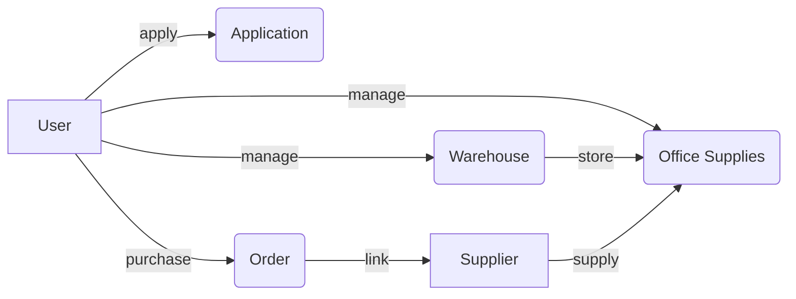

# 办公用品管理系统详细设计与具体代码实现

## 1.背景介绍
在现代化的办公环境中,办公用品的管理与使用是一个不可或缺的环节。传统的人工管理模式效率低下,容易出错,难以满足日益增长的办公需求。因此,开发一套高效、智能、易用的办公用品管理系统势在必行。本文将详细阐述如何从零开始设计并实现一个完整的办公用品管理系统,涵盖需求分析、架构设计、数据库设计、核心算法、代码实现等各个方面。

## 2.核心概念与联系
要设计一个优秀的办公用品管理系统,首先需要理清其中的核心概念以及它们之间的关联。
### 2.1 办公用品(Office Supplies)
办公用品泛指日常办公中使用的各类物品,如文具、电子设备、耗材等。每一件办公用品都有其唯一的编号、名称、类别、规格、库存量、存放位置等属性信息。
### 2.2 用户(User)
系统的使用者,可以是普通员工或管理员。不同身份的用户拥有不同的系统权限。如普通员工可以查看、借用办公用品,管理员还可以采购、入库、盘点等。
### 2.3 仓库(Warehouse)  
存放办公用品的地点,可以是实体仓库或虚拟的存储位置概念。每个仓库有其编号、名称、位置、管理员等信息。
### 2.4 供应商(Supplier)
办公用品的供货方,为系统补充办公用品库存。主要信息包括供应商编号、名称、联系方式、供货类别、合作记录等。
### 2.5 申请(Application)
用户提交的办公用品使用申请,包含申请单号、申请人、申请物品、数量、用途、使用时间等。
### 2.6 订单(Order) 
由管理员向供应商发起的采购订单,包含订单号、采购物品、数量、金额、收货仓库、下单时间、收货时间等。

以上这些核心概念之间的关系可以用下面的 Mermaid 图来表示:


## 3.核心算法原理具体操作步骤
办公用品管理系统的核心算法可以分为以下几个模块:
### 3.1 库存管理算法
主要用于管理办公用品的库存信息,包括入库、出库、库存预警等。
#### 3.1.1 入库操作
1. 根据采购订单信息将相应物品录入系统
2. 更新物品的库存量
3. 记录入库操作日志

#### 3.1.2 出库操作
1. 根据用户申请信息,判断库存是否满足需求 
2. 若满足则同意申请,更新相应物品库存量
3. 若不满足则拒绝申请,返回库存不足提示
4. 记录出库操作日志

#### 3.1.3 库存预警
1. 设置物品最低库存阈值
2. 定期检查物品库存量与阈值大小
3. 若库存量低于阈值则触发预警提示,通知管理员及时补货

### 3.2 即时通讯算法
用于实现用户之间的实时交流,如申请审批、询问库存等。主要采用 WebSocket 技术。
1. 用户上线时建立 WebSocket 连接
2. 在线用户可互相发送即时消息
3. 服务端收到消息后转发给目标用户
4. 用户下线时关闭 WebSocket 连接

### 3.3 智能推荐算法
利用大数据和机器学习技术,根据用户的历史申请记录智能推荐其可能需要的办公用品。
1. 收集用户历史申请数据,如申请物品、数量、频率等 
2. 使用协同过滤等推荐算法训练用户画像模型
3. 根据用户的即时行为给出个性化推荐
4. 实时更新模型,提高推荐精度

## 4.数学模型和公式详细讲解举例说明
在办公用品管理系统中,需要用到一些数学模型和公式,下面以库存管理中的经济订货批量(EOQ)模型为例进行讲解。

EOQ 模型是用于确定每次采购的最佳订货量,以使总的存储成本和订货成本最小。其公式为:

$$
EOQ = \sqrt{\frac{2DS}{H}}
$$

其中:
- $EOQ$: 经济订货批量
- $D$: 一定时间内(如一年)的需求量
- $S$: 每次订货的固定成本
- $H$: 单位商品的年度存储成本

举例说明,假设某办公用品一年的需求量为1000件,每次订货的固定成本为100元,单位商品的年度存储成本为2元,则其经济订货批量为:

$$
EOQ = \sqrt{\frac{2*1000*100}{2}} = 100
$$

这表明每次采购100件是最经济的,既不会因为频繁小批量采购而增加订货成本,也不会因为大批量采购占用过多资金和仓储空间而增加存储成本。

管理员可以根据 EOQ 模型来制定最优的采购策略,合理控制办公用品的库存水平和采购频率,节约企业的运营成本。

## 5.项目实践：代码实例和详细解释说明
下面以办公用品管理系统的核心模块——库存管理为例,给出其关键代码实现和详细解释。

### 5.1 OfficeSupplies 类
表示办公用品的基本属性和操作方法。
```java
public class OfficeSupplies {
    private String id;  // 编号
    private String name;  // 名称
    private String type;  // 类别
    private String specification;  // 规格
    private int stock;  // 库存
    private String location;  // 位置
    
    // 构造方法
    public OfficeSupplies(String id, String name, String type, 
                          String specification, int stock, String location) {
        this.id = id;
        this.name = name;
        this.type = type;
        this.specification = specification;
        this.stock = stock;
        this.location = location;
    }
    
    // getter和setter方法
    // ...
    
    // 入库操作
    public void stockIn(int num) {
        this.stock += num;
        System.out.println(this.name + "入库" + num + "件，当前库存为" + this.stock);
    }
    
    // 出库操作
    public boolean stockOut(int num) {
        if (this.stock >= num) {
            this.stock -= num;
            System.out.println(this.name + "出库" + num + "件，当前库存为" + this.stock);
            return true;
        } else {
            System.out.println(this.name + "库存不足，出库失败");
            return false;
        }
    }
}
```

### 5.2 Warehouse 类
表示仓库的基本属性和操作方法。
```java
public class Warehouse {
    private String id;  // 编号 
    private String name;  // 名称
    private String location;  // 位置
    private List<OfficeSupplies> supplies = new ArrayList<>();  // 存储的办公用品
    
    // 构造方法
    public Warehouse(String id, String name, String location) {
        this.id = id;
        this.name = name;
        this.location = location;
    }
    
    // getter和setter方法 
    // ...
    
    // 向仓库中添加办公用品
    public void addSupplies(OfficeSupplies item) {
        supplies.add(item);
        System.out.println(item.getName() + "已入库" + this.name);
    }
    
    // 从仓库中移除办公用品
    public void removeSupplies(OfficeSupplies item) {
        supplies.remove(item);
        System.out.println(item.getName() + "已从" + this.name + "出库");
    }
    
    // 查找仓库中的办公用品
    public OfficeSupplies findSuppliesById(String id) {
        for (OfficeSupplies item : supplies) {
            if (item.getId().equals(id)) {
                return item;
            }
        }
        return null;
    }
}
```

### 5.3 InventoryManagement 类
负责管理所有仓库的办公用品库存信息。
```java
public class InventoryManagement {
    private List<Warehouse> warehouses = new ArrayList<>();  // 管理的仓库列表
    
    // 添加仓库
    public void addWarehouse(Warehouse warehouse) {
        warehouses.add(warehouse);
    }
    
    // 添加办公用品
    public void addSupplies(String warehouseId, OfficeSupplies item) {
        Warehouse warehouse = findWarehouseById(warehouseId);
        if (warehouse != null) {
            warehouse.addSupplies(item);
        }
    }
    
    // 移除办公用品
    public void removeSupplies(String warehouseId, OfficeSupplies item) {
        Warehouse warehouse = findWarehouseById(warehouseId);
        if (warehouse != null) {
            warehouse.removeSupplies(item);
        }
    }
    
    // 根据仓库编号查找仓库
    private Warehouse findWarehouseById(String warehouseId) {
        for (Warehouse warehouse : warehouses) {
            if (warehouse.getId().equals(warehouseId)) {
                return warehouse;
            }
        }
        return null;
    }
    
    // 根据办公用品编号查找办公用品
    public OfficeSupplies findSuppliesById(String suppliesId) {
        for (Warehouse warehouse : warehouses) {
            OfficeSupplies item = warehouse.findSuppliesById(suppliesId);
            if (item != null) {
                return item;
            }
        }
        return null;
    }
    
    // 办公用品入库操作
    public void stockIn(String suppliesId, int num) {
        OfficeSupplies item = findSuppliesById(suppliesId);
        if (item != null) {
            item.stockIn(num);
        }
    }
    
    // 办公用品出库操作
    public boolean stockOut(String suppliesId, int num) {
        OfficeSupplies item = findSuppliesById(suppliesId);
        if (item != null) {
            return item.stockOut(num);
        }
        return false;
    }
}
```

以上就是办公用品管理系统库存管理模块的核心代码实现,通过 OfficeSupplies、Warehouse、InventoryManagement 这三个类的协作,实现了对办公用品的入库、出库、查询等基本操作。其中的关键点在于:
- 每一件办公用品都用 OfficeSupplies 对象表示,并存储在对应的 Warehouse 对象中
- Warehouse 对象表示一个仓库,管理其中存储的所有办公用品
- InventoryManagement 对象作为统一的入口,管理所有的仓库,并提供办公用品的入库、出库等操作接口
- 入库操作通过调用 OfficeSupplies 对象的 stockIn 方法实现,同时输出操作日志
- 出库操作通过调用 OfficeSupplies 对象的 stockOut 方法实现,需要判断库存是否充足,同时输出操作日志

这样的设计思路清晰明了,代码结构也比较简洁规范,易于扩展和维护。在实际开发中,还可以在此基础上结合数据库、缓存等技术,进一步提高系统的性能和稳定性。

## 6.实际应用场景
办公用品管理系统可应用于各类企事业单位、学校、医院等组织的日常办公场景中,为其提供一站式的办公用品管理服务。
### 6.1 企业办公室
- 管理文具、电脑、打印机耗材等各类办公用品的采购、入库、领用等业务流程
- 员工可通过系统查询办公用品库存情况,在线填写申请领用单
- 管理员根据申请单安排物品出库,并记录领用信息,定期盘点
- 系统自动统计办公用品的消耗情况和趋势,为采购决策提供数据支持

### 6.2 学校教务处
- 管理教学用品如粉笔、白板笔、实验耗材等的采购、发放 
- 任课教师可通过系统申领教学所需用品,教务员及时准备并记录
- 系统提供各类教学用品的消耗统计报表,优化采购计划
- 支持与学校财务系统对接,自动生成用品采购付款单

### 6.3 医院药房
- 药品及医疗耗材等特殊"办公用品"的精细化管理
- 严格控制药品的入库、发放流程,保障用药安全
- 实时监控药品库存情况,及时预警补货,确保供应
- 与医生开药系统无缝连接,自动同步药品领用记录