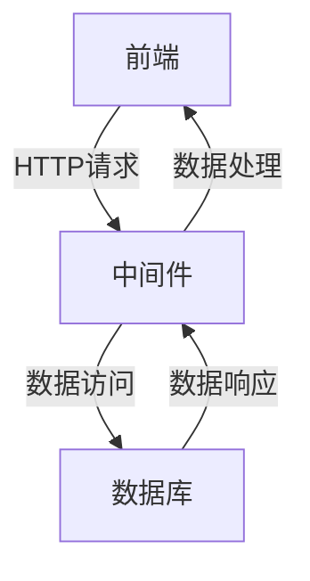
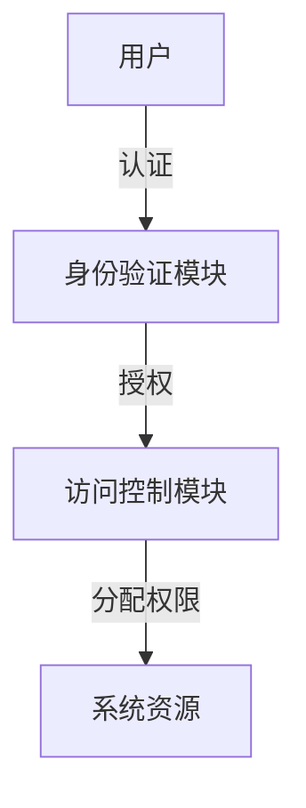
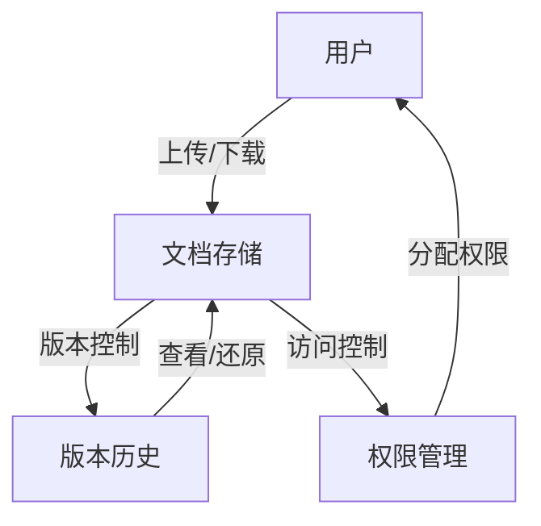
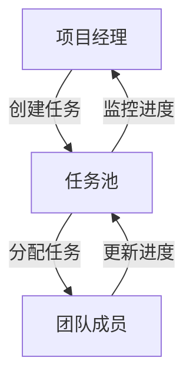
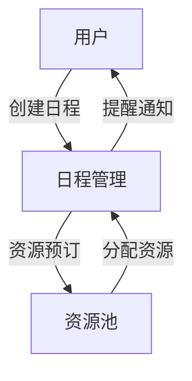
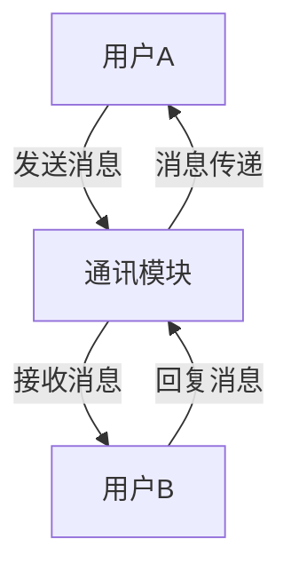
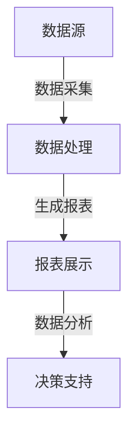

# 办公管理系统设计与实现

## 1. 背景介绍

在当今快节奏的商业环境中，高效的办公管理系统对于提高工作效率、优化资源利用和实现业务目标至关重要。随着信息技术的不断发展,传统的纸质办公模式已经无法满足现代企业的需求,因此开发一个高效、安全、易用的办公管理系统势在必行。

办公管理系统的主要目标是为企业提供一个集中的平台,用于管理日常办公活动、协作项目、跟踪任务进度、共享文件和资源等。通过集成多种功能模块,办公管理系统可以显著提高工作效率,减少重复劳动,提高信息传递的准确性和及时性,从而为企业创造更大的价值。

## 2. 核心概念与联系

### 2.1 系统架构

办公管理系统通常采用分层架构设计,包括表现层(前端)、业务逻辑层(中间件)和数据访问层(后端)。前端负责用户界面和交互,中间件处理业务逻辑,后端则与数据库进行交互。这种分层设计有利于系统的可维护性和可扩展性。

### 2.2 用户管理

用户管理是办公管理系统的核心功能之一,它负责管理系统用户的身份认证、授权和访问控制。通常会采用基于角色的访问控制(RBAC)模型,根据用户的角色分配不同的权限,从而实现对系统资源的精细化管理。

### 2.3 文档管理

文档管理模块用于存储、组织和共享各种类型的文件,如Word文档、Excel表格、PDF文件等。它通常包括版本控制、访问权限管理、全文搜索等功能,方便用户高效地管理和利用文档资源。

### 2.4 任务管理

任务管理模块用于创建、分配、跟踪和协作完成各种任务。它通常包括任务分解、进度监控、提醒通知等功能,有助于提高工作效率和团队协作水平。

### 2.5 日程安排

日程安排模块用于管理个人和团队的日常日程,包括会议安排、任务提醒、工作计划等。它可以与其他模块(如任务管理、文档管理等)集成,提供一站式的工作管理体验。

### 2.6 通讯与协作

通讯与协作模块为用户提供即时通讯、在线会议、讨论板等功能,促进团队成员之间的实时交流和远程协作。它可以与其他模块无缝集成,实现高效的信息共享和协同办公。

### 2.7 报表与分析

报表与分析模块通过数据可视化和分析工具,为管理层提供关键业务指标、工作效率报告等,支持数据驱动的决策过程。它可以从系统中的各个模块收集相关数据,并生成直观的报表和图表。

## 3. 核心算法原理具体操作步骤

### 3.1 用户认证与授权

用户认证和授权是办公管理系统中最关键的安全机制之一。常见的用户认证方式包括用户名/密码认证、双因素认证、生物识别认证等。授权则通常采用基于角色的访问控制(RBAC)模型。

1. **用户注册**
   - 用户提供基本信息(用户名、密码、邮箱等)
   - 系统对用户信息进行验证和存储
   - 向用户发送激活邮件或短信

2. **用户登录**
   - 用户输入用户名和密码
   - 系统验证用户凭据是否正确
   - 生成会话令牌(Session Token)或访问令牌(Access Token)

3. **访问控制**
   - 用户发起对系统资源的访问请求
   - 系统检查用户的角色和权限
   - 根据访问控制策略决定是否允许访问

4. **授权流程**
   - 管理员为用户分配角色
   - 每个角色关联一组预定义的权限
   - 用户根据所属角色获得相应的系统访问权限

### 3.2 文档版本控制

文档版本控制是文档管理模块的核心功能之一,它确保文档在编辑和修改过程中的一致性和可追溯性。常见的版本控制算法包括基于差异的版本控制和基于快照的版本控制。

1. **基于差异的版本控制**
   - 初始版本作为基线
   - 每次编辑后,计算与上一版本的差异(Delta)
   - 存储差异而非完整文件,节省存储空间
   - 恢复到任意版本时,应用所有差异

2. **基于快照的版本控制**
   - 每次编辑后,存储完整文件副本(快照)
   - 占用更多存储空间,但恢复速度更快
   - 适用于大型二进制文件的版本控制

3. **合并冲突解决**
   - 当多个用户同时编辑同一文件时,可能产生冲突
   - 系统检测冲突,提示用户手动解决冲突
   - 合并后的版本作为新的基线版本

### 3.3 任务调度算法

任务调度算法用于合理分配和优化任务执行顺序,提高系统资源利用率和任务完成效率。常见的任务调度算法包括先来先服务(FCFS)、shortest job first(SJF)、优先级调度等。

1. **先来先服务(FCFS)**
   - 按照任务到达的时间顺序执行
   - 简单易实现,但可能导致饥饿问题

2. **shortest job first(SJF)**
   - 优先执行估计运行时间最短的任务
   - 可以提高平均等待时间和周转时间
   - 需要准确估计每个任务的运行时间

3. **优先级调度**
   - 为每个任务分配优先级
   - 优先执行优先级高的任务
   - 可能导致低优先级任务长期等待

4. **多级反馈队列调度**
   - 将任务分为多个优先级队列
   - 高优先级队列使用SJF或优先级调度
   - 低优先级队列使用时间片轮转调度
   - 任务可在队列间上下移动,实现折中

### 3.4 全文搜索算法

全文搜索算法用于快速查找文档中包含特定关键词的内容,是文档管理系统的重要功能之一。常见的全文搜索算法包括倒排索引、布尔模型、向量空间模型等。

1. **倒排索引**
   - 构建词项到文档的映射表
   - 查询时,根据关键词快速定位相关文档
   - 支持模糊搜索、短语搜索等高级功能

2. **布尔模型**
   - 使用布尔运算符(AND、OR、NOT)组合关键词
   - 精确匹配满足条件的文档
   - 查询效率高,但灵活性较差

3. **向量空间模型**
   - 将文档和查询表示为向量
   - 计算文档向量和查询向量的相似度
   - 返回与查询最相关的文档
   - 支持模糊匹配和相关性排序

### 3.5 实时通讯算法

实时通讯算法用于实现办公管理系统中的即时消息传递、在线会议等功能。常见的实时通讯算法包括长轮询(Long Polling)、HTTP流(HTTP Streaming)、WebSocket等。

1. **长轮询(Long Polling)**
   - 客户端发送请求,服务器持有连接
   - 有新消息时,服务器立即响应并关闭连接
   - 客户端收到响应后,立即发送新请求

2. **HTTP流(HTTP Streaming)**
   - 服务器不关闭连接,持续推送数据
   - 客户端持续接收数据流
   - 实现实时消息推送,但浏览器兼容性差

3. **WebSocket**
   - 建立全双工的持久连接
   - 服务器和客户端可以双向实时通信
   - 支持二进制数据传输,适合多媒体通讯
   - 大多数现代浏览器和服务器支持WebSocket协议

### 3.6 数据可视化算法

数据可视化算法用于将原始数据转换为直观的图形表示,方便用户理解和分析数据。常见的数据可视化算法包括条形图、折线图、饼图、散点图等。

1. **条形图**
   - 使用矩形条表示数据值
   - 适用于对比不同类别的数据

2. **折线图**
   - 使用连续的线段表示数据趋势
   - 适用于展示随时间变化的数据

3. **饼图**
   - 使用扇形表示数据占比
   - 适用于展示构成整体的部分

4. **散点图**
   - 使用点在坐标系中的位置表示两个变量的值
   - 适用于展示变量之间的关系

5. **热力图**
   - 使用颜色深浅表示数据值的大小
   - 适用于可视化二维或三维数据分布

## 4. 数学模型和公式详细讲解举例说明

### 4.1 用户活跃度模型

用户活跃度模型用于衡量用户在系统中的参与程度,可以为系统优化和个性化服务提供依据。常见的用户活跃度模型包括基于时间的衰减模型和基于行为的加权模型。

1. **基于时间的衰减模型**

用户活跃度随时间呈指数衰减,最近的活动权重最高。活跃度计算公式如下:

$$
A(u, t) = \sum_{i=1}^{n} w_i \cdot \exp(-\lambda(t - t_i))
$$

其中:
- $A(u, t)$ 表示用户 $u$ 在时间 $t$ 的活跃度
- $w_i$ 表示第 $i$ 次活动的权重
- $\lambda$ 是衰减系数,控制活跃度衰减速度
- $t_i$ 是第 $i$ 次活动的时间戳

2. **基于行为的加权模型**

不同类型的用户行为对活跃度的贡献不同,可以为每种行为分配不同的权重。活跃度计算公式如下:

$$
A(u, t) = \sum_{i=1}^{n} w_i \cdot f(b_i, t)
$$

其中:
- $A(u, t)$ 表示用户 $u$ 在时间 $t$ 的活跃度
- $w_i$ 表示行为类型 $i$ 的权重
- $f(b_i, t)$ 是行为 $b_i$ 对活跃度的贡献函数,可根据具体情况定义

### 4.2 协同过滤推荐算法

协同过滤推荐算法是一种常用的个性化推荐技术,通过分析用户之间的相似性或项目之间的相似性,为用户推荐感兴趣的项目。常见的协同过滤算法包括基于用户的协同过滤和基于项目的协同过滤。

1. **基于用户的协同过