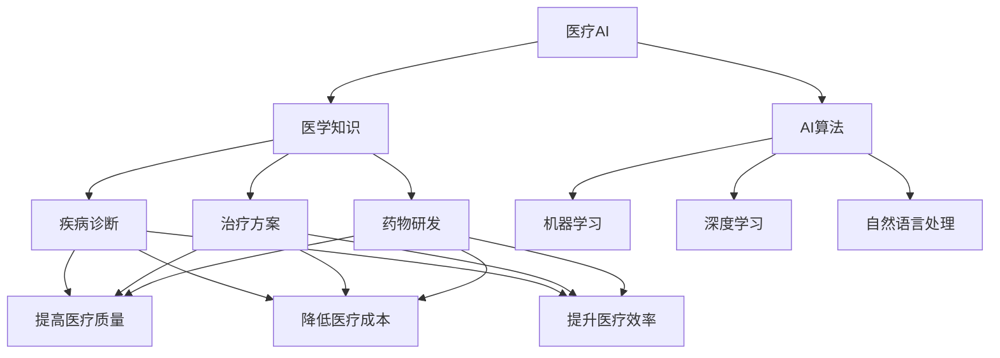

# 医疗AI人才：构建智慧医疗人才梯队

## 1.背景介绍

随着人工智能(AI)技术在医疗领域的快速发展,医疗AI人才已成为医疗行业的香饽饽。医疗AI不仅可以提高诊断准确性、优化治疗方案,还能够加速新药研发、提升医疗服务效率。然而,目前医疗AI人才供不应求,构建医疗AI人才梯队迫在眉睫。

### 1.1 医疗AI的崛起

近年来,AI技术在医疗领域取得了长足进步,例如:

- 图像识别:AI可以准确识别X光、CT、MRI等医学影像,辅助医生诊断疾病。
- 药物发现:AI可以加速新药筛选和优化,缩短新药研发周期。
- 个性化治疗:AI可以分析患者数据,提供个性化的治疗方案。
- 智能助理:AI可以作为医生的智能助理,提高工作效率。

这些应用促进了医疗AI人才的需求激增。

### 1.2 医疗AI人才短缺

尽管医疗AI前景广阔,但目前面临严重的人才短缺:

- 复合型人才稀缺:精通医学和AI双领域的复合型人才极为罕见。
- 培养周期长:培养医疗AI人才需要多年的系统学习和实践。
- 薪酬待遇高:医疗AI人才薪酬远高于传统医疗岗位,用人成本高昂。

据统计,目前全球医疗AI人才缺口高达20万人。构建医疗AI人才梯队,已成为医疗行业的当务之急。

## 2.核心概念与联系

### 2.1 医疗AI的定义

医疗AI是指将人工智能技术应用于医疗卫生领域,包括疾病诊断、治疗方案制定、药物研发、医疗服务管理等多个环节。它融合了医学知识和AI算法,旨在提高医疗质量、降低医疗成本、提升医疗效率。



### 2.2 医疗AI人才的类型

医疗AI人才可分为以下几类:

1. **AI专家**:掌握AI理论和算法,如机器学习、深度学习、自然语言处理等。
2. **医学专家**:拥有扎实的医学理论基础和临床实践经验。
3. **AI+医学复合型人才**:精通AI和医学双领域知识,能够将两者有机结合。
4. **数据分析师**:擅长处理和分析医疗大数据,为AI模型提供高质量数据支持。
5. **产品经理**:负责医疗AI产品的需求分析、设计和上线运营。

这些人才通力合作,共同推动医疗AI的发展。

## 3.核心算法原理具体操作步骤  

医疗AI涉及多种算法,如机器学习、深度学习、自然语言处理等。以下将介绍其中两种核心算法的原理和操作步骤。

### 3.1 支持向量机(SVM)

支持向量机是一种常用的监督学习算法,广泛应用于医疗图像分析和疾病诊断。

#### 3.1.1 算法原理

SVM的基本思想是在高维空间中找到一个超平面,将不同类别的数据点分开,且分隔超平面与最近数据点的距离最大。这个最大间隔使得SVM具有很好的泛化能力。

$$
\begin{aligned}
\min_{w,b} \frac{1}{2} \|w\|^2 \\
\text{s.t. } y_i(w^Tx_i+b) \geq 1, \quad i=1,\ldots,n
\end{aligned}
$$

其中$w$是超平面的法向量,$b$是偏移量,$x_i$是训练样本,$y_i$是样本标签。

#### 3.1.2 操作步骤

1. **数据预处理**:对医疗数据(如影像)进行标准化、去噪等预处理。
2. **特征提取**:从原始数据中提取有意义的特征,如从CT图像中提取肿瘤区域的形状、纹理等特征。
3. **构建SVM模型**:使用训练数据构建SVM分类器模型。
4. **模型评估**:在测试集上评估模型的分类性能,如准确率、召回率等指标。
5. **模型调优**:根据评估结果,调整SVM的超参数(如核函数、惩罚系数等),提高模型性能。
6. **模型部署**:将训练好的SVM模型部署到医疗AI系统中,用于疾病诊断等应用。

### 3.2 卷积神经网络(CNN)

卷积神经网络是一种常用的深度学习算法,在医疗图像分析领域有广泛应用。

#### 3.2.1 算法原理

CNN由卷积层、池化层和全连接层组成。卷积层可自动从原始数据(如图像)中提取特征,池化层用于降维,全连接层对特征进行分类或回归。


#### 3.2.2 操作步骤

1. **数据准备**:收集并标注大量医疗影像数据,如X光、CT、MRI等。
2. **数据增强**:通过旋转、平移、缩放等方式对训练数据进行增强,提高模型泛化能力。
3. **模型设计**:设计CNN模型结构,包括卷积层数量、卷积核大小、池化方式等超参数。
4. **模型训练**:使用训练数据对CNN模型进行训练,通常采用随机梯度下降等优化算法。
5. **模型评估**:在测试集上评估CNN模型的性能,如分类准确率、灵敏度、特异度等指标。
6. **模型调优**:根据评估结果,调整模型超参数、增加训练数据等,不断提高模型性能。
7. **模型部署**:将训练好的CNN模型部署到医疗AI系统中,用于疾病诊断、病理分析等应用。

## 4.数学模型和公式详细讲解举例说明

在医疗AI领域,数学模型和公式扮演着重要角色,为算法提供理论基础和计算支撑。以下将详细讲解两种常用的数学模型。

### 4.1 Logistic回归

Logistic回归是一种广泛应用于疾病风险预测的监督学习算法。它可以估计某个事件发生的概率,常用于二分类问题。

#### 4.1.1 模型公式

$$
P(Y=1|X) = \frac{1}{1+e^{-(w_0+w_1x_1+w_2x_2+\cdots+w_nx_n)}}
$$

其中$Y$是二值标签(0或1),$X$是特征向量$(x_1,x_2,\cdots,x_n)$,$w_i$是对应特征的权重系数。

通过训练数据拟合参数$w_i$,可以得到事件发生的概率$P(Y=1|X)$。

#### 4.1.2 实例说明

某医院希望预测患者是否会患上心脏病,收集了一组患者的健康数据,包括年龄、体重指数、血压等特征,以及是否患心脏病的标签。

使用Logistic回归模型,可以计算出每个患者患心脏病的概率值。医生可根据这个概率值,对高风险患者采取预防措施。

例如,某60岁、肥胖、高血压的患者,模型预测他患心脏病的概率为0.85。医生会建议他改善生活方式,并定期复查。

### 4.2 生存分析

生存分析是研究某事件发生所需时间的一种统计方法,在医疗领域常用于分析患者的存活时间。

#### 4.2.1 模型公式

生存函数:
$$
S(t) = P(T>t)
$$
危险函数:
$$
h(t) = \lim_{\Delta t \rightarrow 0} \frac{P(t \leq T<t+\Delta t|T \geq t)}{\Delta t}
$$

其中$T$是随机变量(如患者存活时间),$S(t)$表示至少存活到时间$t$的概率,$h(t)$表示在时间$t$发生事件的条件风险率。

通过估计这些函数,可以分析影响存活时间的危险因素。

#### 4.2.2 实例说明

某医院对100名肺癌患者进行为期5年的随访,记录了他们的存活时间。研究人员希望分析影响患者存活时间的因素,如年龄、吸烟史、肿瘤分期等。

使用生存分析模型,可以估计患者群体的生存函数和危险函数,并将它们与各种因素建模,找出对存活时间有显著影响的危险因素。

例如,研究发现晚期肺癌患者的中位存活时间仅为8个月,而早期患者可达3年以上。吸烟也是一个重要的危险因素,会显著缩短存活时间。

## 5.项目实践:代码实例和详细解释说明

为了帮助读者更好地理解医疗AI算法,本节将提供一个基于Python的实战项目示例,并详细解释代码。

### 5.1 项目概述

该项目旨在构建一个深度学习模型,对皮肤癌进行分类。我们将使用一个开源的皮肤病变图像数据集,并基于卷积神经网络(CNN)训练一个二分类模型,预测给定图像是良性皮肤病变还是恶性皮肤癌。

### 5.2 数据准备

首先,我们需要导入所需的Python库。

```python
import numpy as np
import pandas as pd
import matplotlib.pyplot as plt
from tensorflow.keras.preprocessing.image import ImageDataGenerator
from tensorflow.keras.applications import VGG16
from tensorflow.keras.layers import Dense, Flatten
from tensorflow.keras.models import Model
```

然后,加载并探索数据集。该数据集包含两个文件夹,分别存储良性和恶性皮肤病变图像。

```python
import os

# 设置数据路径
data_dir = 'skin-cancer-data'

# 获取图像文件路径
image_paths = {
    'malignant': [os.path.join(data_dir, 'malignant', filename) for filename in os.listdir(os.path.join(data_dir, 'malignant'))],
    'benign': [os.path.join(data_dir, 'benign', filename) for filename in os.listdir(os.path.join(data_dir, 'benign'))]
}

# 统计图像数量
print(f'Number of malignant images: {len(image_paths["malignant"])}')
print(f'Number of benign images: {len(image_paths["benign"])}')
```

### 5.3 数据预处理

为了提高模型的泛化能力,我们对图像数据进行增强,包括随机旋转、平移、缩放等操作。

```python
# 设置图像大小和批量大小
img_size = 224
batch_size = 32

# 创建数据生成器
datagen = ImageDataGenerator(
    rescale=1./255,
    rotation_range=20,
    width_shift_range=0.2,
    height_shift_range=0.2,
    shear_range=0.2,
    zoom_range=0.2,
    horizontal_flip=True
)

# 生成训练和验证数据
train_generator = datagen.flow_from_directory(
    data_dir,
    target_size=(img_size, img_size),
    batch_size=batch_size,
    class_mode='binary',
    subset='training'
)

val_generator = datagen.flow_from_directory(
    data_dir,
    target_size=(img_size, img_size),
    batch_size=batch_size,
    class_mode='binary',
    subset='validation'
)
```

### 5.4 模型构建

我们将使用预训练的VGG16模型作为基础,并在顶层添加自定义的全连接层,用于二分类任务。

```python
# 加载预训练模型
base_model = VGG16(weights='imagenet', include_top=False, input_shape=(img_size, img_size, 3))

# 冻结基础