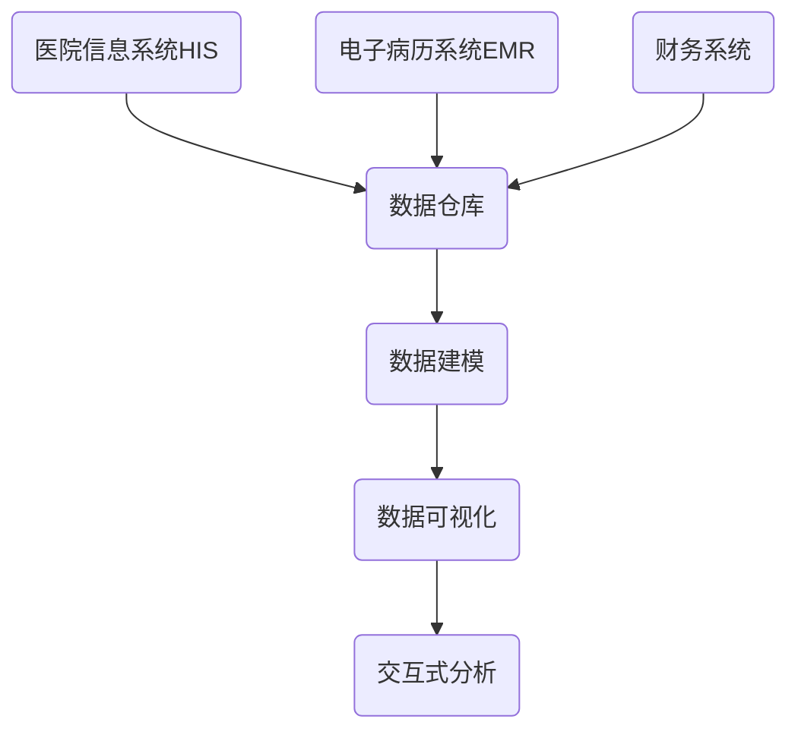

# 医院营收信息可视化系统设计与实现

## 1.背景介绍

### 1.1 医疗行业现状与挑战

随着医疗保健行业的快速发展,医院的运营管理变得越来越复杂。医院需要处理大量的患者数据、收费信息、医疗资源分配等,这些数据通常分散在不同的系统和部门中。有效地整合和分析这些数据对于医院的决策和运营优化至关重要。

医院营收是医院运营的核心指标之一,直接影响着医院的财务状况和可持续发展。然而,传统的营收管理方式存在诸多挑战:

1. **数据碎片化**: 营收相关数据分散在医院信息系统(HIS)、电子病历系统(EMR)、财务系统等不同系统中,难以整合和分析。

2. **缺乏实时监控**: 营收数据的收集和统计通常是事后进行的,无法实时掌握营收状况,难以及时发现问题并采取措施。

3. **分析能力有限**: 传统的报表和图表无法充分展现数据之间的关联性,难以深入挖掘潜在的营收影响因素。

4. **决策支持不足**: 缺乏科学的决策支持工具,医院管理层难以基于数据做出明智的营收管理决策。

### 1.2 可视化技术的重要性

在这种背景下,医院营收信息可视化系统应运而生。可视化技术能够将复杂的数据以直观、易于理解的形式呈现,帮助决策者快速获取信息,发现数据模式和趋势,从而支持更好的决策。

通过可视化技术,医院可以:

1. **整合多源数据**: 将来自不同系统和部门的营收相关数据集中到一个平台,实现数据的无缝整合。

2. **实时监控**: 通过实时数据采集和可视化,实现对医院营收状况的实时监控,及时发现异常情况。

3. **多维度分析**: 利用可视化工具的交互式分析功能,从多个维度(如科室、医生、病种等)分析营收数据,发现潜在的营收影响因素。

4. **决策支持**: 基于可视化分析结果,为医院管理层提供科学的决策支持,优化营收管理策略。

总的来说,医院营收信息可视化系统能够帮助医院全面掌握营收状况,深入分析影响因素,从而提高营收管理水平,实现医院的可持续发展。

## 2.核心概念与联系

在设计和实现医院营收信息可视化系统之前,我们需要了解一些核心概念及它们之间的联系。

### 2.1 医院信息系统(HIS)

医院信息系统(Hospital Information System, HIS)是医院的核心信息管理系统,集成了医院的各个业务流程和数据,包括患者信息、医嘱、收费、药品管理等模块。HIS是医院营收信息的主要来源之一。

### 2.2 电子病历系统(EMR)

电子病历系统(Electronic Medical Record, EMR)用于记录和管理患者的诊疗过程,包括病史、体征、检查结果、治疗方案等信息。EMR系统中的数据可以反映患者的就诊情况,对分析营收具有重要意义。

### 2.3 财务系统

财务系统负责管理医院的收支情况,包括收费、付款、报账等功能。财务系统中的数据是分析医院营收的直接依据。

### 2.4 数据仓库

数据仓库(Data Warehouse)是一种面向主题的、集成的、非易失的、时间变化数据的集合。在医院营收信息可视化系统中,数据仓库用于整合来自HIS、EMR、财务系统等不同源系统的数据,为后续的数据分析和可视化提供支持。

### 2.5 数据建模

数据建模是将现实世界的概念和规则转换为数据结构和关系的过程。在医院营收信息可视化系统中,需要对营收相关的数据进行建模,以便于数据的存储、查询和分析。

### 2.6 数据可视化

数据可视化是将数据转换为图形或图像的过程,旨在以直观的方式呈现数据,帮助人们更好地理解和分析数据。在医院营收信息可视化系统中,数据可视化是核心功能之一,用于展现医院的营收状况、趋势和影响因素。

### 2.7 交互式分析

交互式分析(Interactive Analysis)是指用户可以通过图形用户界面(GUI)与数据进行交互,如筛选、切片、钻取等操作,以探索数据并获得洞见。在医院营收信息可视化系统中,交互式分析功能可以帮助用户从多个维度分析营收数据,发现潜在的影响因素。

### 2.8 关系图

上述核心概念之间的关系如下图所示:

医院信息系统(HIS)、电子病历系统(EMR)和财务系统是医院营收信息的主要来源。这些数据通过数据仓库进行整合,然后进行数据建模,最终通过数据可视化和交互式分析功能呈现给用户。

## 3.核心算法原理具体操作步骤

在医院营收信息可视化系统中,核心算法主要包括数据ETL(Extract, Transform, Load)和数据可视化算法。

### 3.1 数据ETL

数据ETL是将数据从源系统提取(Extract)、转换(Transform)到目标数据仓库的过程,并最终加载(Load)到数据仓库中。数据ETL是构建数据仓库和数据集市的关键步骤,也是实现数据整合的核心。

数据ETL的具体操作步骤如下:

1. **提取(Extract)**: 从源系统(如HIS、EMR、财务系统等)中提取所需的数据。这一步需要确定提取哪些数据、从哪些源系统提取、使用什么方式提取(如SQL查询、文件导入等)。

2. **转换(Transform)**: 对提取的数据进行清洗、转换和集成,以满足数据仓库的要求。转换操作包括数据类型转换、缺失值处理、代码转换、数据规范化等。

3. **加载(Load)**: 将转换后的数据加载到目标数据仓库中。加载可以采用全量加载或增量加载的方式,需要考虑数据仓库的模型和性能要求。

在医院营收信息可视化系统中,数据ETL需要从HIS、EMR、财务系统等源系统中提取与营收相关的数据,如患者信息、就诊记录、收费明细等。然后对这些数据进行转换和集成,最终加载到数据仓库中,为后续的数据分析和可视化提供支持。

### 3.2 数据可视化算法

数据可视化算法是将数据转换为图形或图像的核心算法,旨在以直观的方式呈现数据,帮助用户理解和分析数据。常用的数据可视化算法包括:

1. **布局算法**: 用于确定可视化元素(如节点、链接等)在画布上的位置和排列方式,如力导向布局算法、层次布局算法等。

2. **渲染算法**: 用于将数据映射到可视化元素的属性(如颜色、大小、形状等),如颜色映射算法、大小映射算法等。

3. **交互算法**: 用于响应用户的交互操作(如缩放、平移、选择等),如缩放算法、平移算法、选择算法等。

4. **数据转换算法**: 用于将原始数据转换为可视化所需的数据格式,如层次数据转换算法、网络数据转换算法等。

在医院营收信息可视化系统中,常用的可视化图表包括柱状图、折线图、饼图、树状图、地理信息可视化等。这些可视化图表的实现都需要运用上述算法。例如,在绘制科室营收的柱状图时,需要使用布局算法确定每个柱子的位置,使用渲染算法将营收数据映射到柱子的高度,使用交互算法响应用户的缩放、平移操作。

此外,在实现交互式分析功能时,也需要运用上述算法。例如,当用户选择某个科室进行钻取分析时,需要使用数据转换算法将原始数据转换为层次数据格式,然后使用布局算法和渲染算法生成新的可视化图表。

## 4.数学模型和公式详细讲解举例说明

在医院营收信息可视化系统中,数学模型和公式主要应用于数据转换、数据聚合和数据可视化等方面。

### 4.1 数据转换

在数据ETL过程中,常需要对原始数据进行转换,以满足数据仓库的要求或者进行特定的分析。常见的数据转换操作包括:

1. **数据类型转换**: 将原始数据的数据类型转换为目标数据类型。例如,将字符串类型的日期转换为日期类型:

$$
date = parse\_date(string\_date, format)
$$

其中,`parse_date`是日期解析函数,`string_date`是原始字符串日期,`format`是日期格式。

2. **缺失值处理**: 对缺失值进行填充或删除。常用的填充方法包括均值填充、中位数填充等。例如,使用均值填充缺失值:

$$
x_i = \begin{cases}
x_i, & \text{if } x_i \text{ is not missing}\\
\overline{x}, & \text{if } x_i \text{ is missing}
\end{cases}
$$

其中,`x_i`是第`i`个数据点,`\overline{x}`是数据的均值。

3. **数据规范化**: 将数据转换到特定的范围内,以便进行比较或应用某些算法。常用的规范化方法包括Min-Max规范化、Z-Score规范化等。例如,使用Min-Max规范化将数据映射到[0, 1]范围内:

$$
x_{norm} = \frac{x - x_{min}}{x_{max} - x_{min}}
$$

其中,`x`是原始数据,`x_{min}`和`x_{max}`分别是数据的最小值和最大值,`x_{norm}`是规范化后的数据。

### 4.2 数据聚合

在数据分析过程中,常需要对数据进行聚合,以获得汇总信息或统计指标。常见的聚合操作包括:

1. **求和**: 计算一组数据的总和。例如,计算某个科室的总营收:

$$
revenue_{total} = \sum_{i=1}^{n} revenue_i
$$

其中,`revenue_i`是第`i`个病人的营收,`n`是病人总数,`revenue_{total}`是该科室的总营收。

2. **计数**: 计算满足特定条件的数据个数。例如,计算某个科室就诊人数:

$$
count = \sum_{i=1}^{n} \mathbb{1}(department_i = department)
$$

其中,`department_i`是第`i`个病人就诊的科室,`department`是目标科室,`\mathbb{1}`是指示函数,当条件成立时取值为1,否则为0。`count`是就诊该科室的病人总数。

3. **平均值**: 计算一组数据的算术平均值。例如,计算某个科室的平均住院天数:

$$
\overline{length\_of\_stay} = \frac{1}{n}\sum_{i=1}^{n} length\_of\_stay_i
$$

其中,`length\_of\_stay_i`是第`i`个病人的住院天数,`n`是病人总数,`\overline{length\_of\_stay}`是该科室的平均住院天数。

### 4.3 数据可视化

在数据可视化过程中,常需要使用数学模型和公式将原始数据映射到可视化元素的属性,如颜色、大小、位置等。

1. **颜色映射**: 将数据值映射到颜色范围内,以便用颜色编码表示数据大小。常用的颜色映射方法包括线性映射、对数映射等。例如,使用线性映射将数据值映射到RGB颜色空间:

$$
\begin{aligned}
r &= \frac{value - value_{min}}{value_{max} - value_{min}} \\
g &= 1 - r \\
b &= 0
\end{aligned}
$$

其中,`value`是原