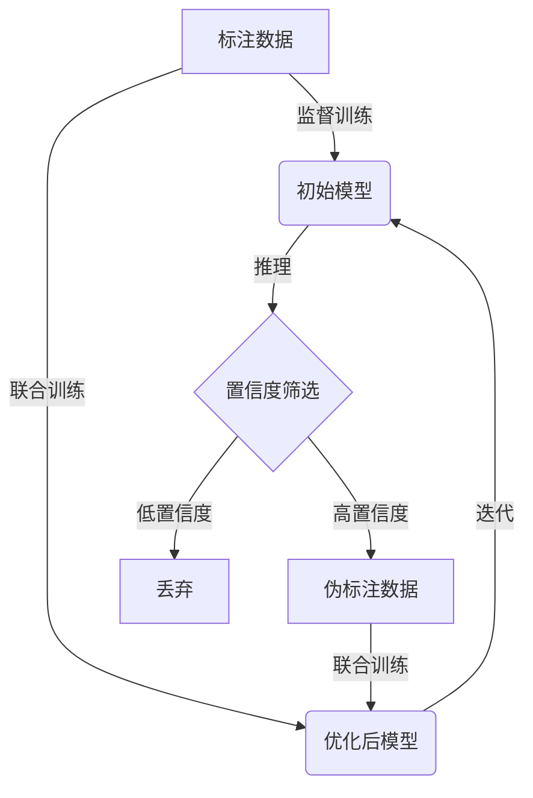

# 半监督学习(Semi-Supervised Learning) - 原理与代码实例讲解

## 1.背景介绍

在现实世界中,获取大量高质量的标注数据通常是一项昂贵且耗时的任务。而半监督学习(Semi-Supervised Learning, SSL)正是为了解决这一问题而产生的机器学习范式。它利用少量标注数据和大量未标注数据进行训练,旨在提高模型的泛化能力和预测精度。

半监督学习的核心思想是,除了利用标注数据中的显式监督信息外,还可以从未标注数据中挖掘隐式的数据分布和结构信息,将其作为辅助知识引入模型训练过程。通过这种方式,模型可以更好地捕捉数据的内在规律,从而提高在未见数据上的表现。

### 1.1 半监督学习的重要性

随着大数据时代的到来,数据的获取成本大幅降低,但对数据进行标注的人力和财力成本却在不断增加。这使得半监督学习在诸多领域受到广泛关注,例如:

- 计算机视觉:图像/视频标注需要大量人力
- 自然语言处理:语料标注耗时耗力
- 生物信息学:基因数据标注需要专业知识
- 网络安全:恶意软件样本缺乏标注

半监督学习为这些领域提供了一种有效的解决方案,可以充分利用现有的大量未标注数据,减轻标注压力,提高模型性能。

### 1.2 半监督学习的分类

根据利用未标注数据的方式不同,半监督学习可分为以下几种主要类型:

1. **生成模型方法**:利用生成模型(如高斯混合模型、隐马尔可夫模型等)对未标注数据建模,将其作为训练的辅助知识。
2. **半监督支持向量机**:通过将未标注数据映射到低密度区域,最大化决策边界与未标注实例之间的距离。
3. **基于图的半监督学习**:构建数据的相似性图,利用图上的标注和未标注数据进行集合传播。
4. **半监督聚类**:结合聚类方法对未标注数据进行软分类,并将其作为监督信号引入模型训练。
5. **半监督深度学习**:利用自编码器、对抗生成网络等深度模型从未标注数据中提取有用的特征表示。

本文将重点介绍半监督深度学习方法,它在近年来展现出了巨大的潜力。

## 2.核心概念与联系

### 2.1 半监督学习的形式化定义

给定一个训练数据集 $\mathcal{D} = \{\mathcal{D}_l, \mathcal{D}_u\}$,其中 $\mathcal{D}_l = \{(x_i, y_i)\}_{i=1}^{l}$ 为标注数据集, $\mathcal{D}_u = \{x_j\}_{j=l+1}^{l+u}$ 为未标注数据集。半监督学习的目标是利用 $\mathcal{D}_l$ 和 $\mathcal{D}_u$ 训练一个模型 $f: \mathcal{X} \rightarrow \mathcal{Y}$,使其在未见数据上的预测性能优于仅使用 $\mathcal{D}_l$ 训练的监督学习模型。

### 2.2 半监督学习的假设

半监督学习的有效性建立在以下几个基本假设之上:

1. **平滑性假设(Smoothness Assumption)**:如果两个实例在数据空间中很接近,那么它们很可能属于同一个类别。
2. **聚类假设(Cluster Assumption)**:数据集中的实例倾向于形成离散的团簇,每个团簇内的实例属于同一个类别。
3. **流形假设(Manifold Assumption)**:数据实际上躺在一个低维流形上,不同类别的数据位于不同的流形。

这些假设反映了真实世界数据的一些内在特性,为半监督学习提供了理论基础。不同的半监督学习算法往往利用了其中的一种或多种假设。

### 2.3 半监督学习与其他机器学习范式的关系

半监督学习可以看作是无监督学习和监督学习之间的一种折中,它们之间的关系如下:

- **监督学习**:仅利用标注数据 $\mathcal{D}_l$ 进行训练。
- **无监督学习**:仅利用未标注数据 $\mathcal{D}_u$ 进行训练,目标是发现数据的内在结构。
- **半监督学习**:同时利用 $\mathcal{D}_l$ 和 $\mathcal{D}_u$ 进行训练,结合了监督和无监督学习的优点。

半监督学习还与其他一些机器学习范式存在密切联系,例如:

- **迁移学习**:利用源域的数据改善目标域的模型性能,可视为一种特殊的半监督学习。
- **主动学习**:通过智能地选择未标注实例进行标注,来提高模型性能,与半监督学习有着互补作用。

## 3.核心算法原理具体操作步骤

### 3.1 半监督深度学习的基本思路

半监督深度学习的核心思路是:利用深度神经网络从未标注数据中提取有用的特征表示,并将其作为监督信号引入模型训练过程。常见的做法包括:

1. 利用自编码器(AutoEncoder)对未标注数据进行重构,将重构误差作为无监督损失函数。
2. 使用生成对抗网络(GAN),将判别器对未标注数据的判别结果作为无监督损失函数。
3. 对未标注数据进行伪标注(Pseudo-Labeling),将伪标签作为监督信号。

通过这些方法,模型可以同时利用标注数据和未标注数据进行训练,提高泛化能力。

### 3.2 基于自编码器的半监督学习

自编码器(AutoEncoder)是一种无监督神经网络模型,通过重构输入数据来学习其特征表示。在半监督学习中,我们可以利用自编码器对未标注数据进行重构,并将重构误差作为无监督损失函数,如下所示:

$$J = J_l + \lambda J_u$$

其中 $J_l$ 是标注数据的监督损失函数(如交叉熵损失), $J_u$ 是未标注数据的重构损失函数, $\lambda$ 是权重系数。通过联合优化这两个损失函数,模型可以同时学习有监督和无监督的特征表示。

自编码器的变体(如变分自编码器、去噪自编码器等)也广泛应用于半监督学习中,以捕捉更丰富的数据分布信息。

### 3.3 基于生成对抗网络的半监督学习

生成对抗网络(Generative Adversarial Networks, GAN)是一种无监督生成模型,由生成器和判别器组成。在半监督学习中,我们可以利用GAN对未标注数据进行判别,并将判别器的判别结果作为无监督损失函数,如下所示:

$$J = J_l + \lambda J_u^{adv}$$

其中 $J_u^{adv}$ 是未标注数据的对抗损失函数,它衡量了判别器对未标注数据的判别结果与真实数据分布之间的差异。通过优化这个损失函数,模型可以学习到更好的数据分布表示,从而提高泛化能力。

除了基本的GAN框架,还有许多改进的半监督GAN模型,如Triple-GAN、BadGAN等,它们在不同场景下展现出优异的性能。

### 3.4 基于伪标注的半监督学习

伪标注(Pseudo-Labeling)是一种简单而有效的半监督学习方法。它的基本思路是:首先使用标注数据训练一个初始模型,然后利用该模型对未标注数据进行预测,将高置信度的预测结果作为伪标签,最后将伪标注数据与原始标注数据一同用于模型的进一步训练。

伪标注的优点是简单高效,缺点是容易受到噪声标签的影响。为了提高其性能,通常需要采用一些策略,如:

1. **置信度筛选**:只保留模型预测置信度较高的伪标签。
2. **迭代训练**:重复执行伪标注和模型训练的过程,逐步提高标签质量。
3. **标签平滑**:对伪标签进行软化处理,降低其对模型训练的影响。

伪标注方法可以与其他半监督学习方法相结合,形成更加强大的半监督模型。

### 3.5 半监督学习算法流程图

以下是基于伪标注的半监督深度学习算法的基本流程:

该算法的具体步骤如下:

1. 使用标注数据对初始模型进行监督训练。
2. 利用初始模型对未标注数据进行推理,获得预测结果及置信度分数。
3. 根据置信度阈值,保留高置信度预测作为伪标注数据,丢弃低置信度预测。
4. 将伪标注数据与原始标注数据进行联合训练,获得优化后的模型。
5. 重复步骤2-4,迭代训练模型,直至收敛或达到预期性能。

## 4.数学模型和公式详细讲解举例说明

### 4.1 半监督深度学习的损失函数

在半监督深度学习中,我们通常需要同时优化标注数据和未标注数据的损失函数。一种常见的形式如下:

$$J = J_l + \lambda J_u$$

其中:

- $J_l$ 是标注数据的监督损失函数,通常采用交叉熵损失:

$$J_l = -\frac{1}{l}\sum_{i=1}^{l}\sum_{k=1}^{K}y_{ik}\log p(y_k|x_i;\theta)$$

其中 $y_{ik}$ 是one-hot编码的标签, $p(y_k|x_i;\theta)$ 是模型对样本 $x_i$ 预测为类别 $k$ 的概率。

- $J_u$ 是未标注数据的无监督损失函数,根据具体的半监督学习方法而不同。例如,对于基于自编码器的方法,可以使用重构损失:

$$J_u = \frac{1}{u}\sum_{j=l+1}^{l+u}||x_j - \hat{x}_j||^2$$

其中 $\hat{x}_j$ 是自编码器对未标注样本 $x_j$ 的重构结果。

- $\lambda$ 是一个权重系数,用于平衡监督损失和无监督损失的重要性。

通过联合优化上述损失函数,模型可以同时利用标注数据和未标注数据进行训练,提高泛化能力。

### 4.2 三元组损失函数

在一些基于度量学习的半监督方法中,常采用三元组损失函数(Triplet Loss)来捕捉数据的相似性结构。三元组损失函数的定义如下:

$$J_{triplet} = \sum_{i,j,k}\max(0, d(x_i, x_j) - d(x_i, x_k) + \alpha)$$

其中 $x_i$ 是一个锚点样本, $x_j$ 是与 $x_i$ 同类的正例样本, $x_k$ 是与 $x_i$ 不同类的负例样本。$d(\cdot, \cdot)$ 是一个度量函数,通常采用欧氏距离或余弦距离。$\alpha$ 是一个超参数,用于控制三元组之间的间隔margin。

该损失函数的目标是,使同类样本之间的距离小于异类样本之间的距离,从而学习到一个能够很好地分离不同类别的特征空间。在半监督学习中,我们可以利用标注数据和未标注数据构建三元组,并联合优化该损失函数。

### 4.3 基于图的半监督学习模型

在基于图的半监督学习模型中,我们首先构建一个相似性图 $G = (V, E)$,其中 $V$ 是数据集中所有样本的集合,$E$ 是样本之间的边集,边的权重表示两个样本之间的相似度