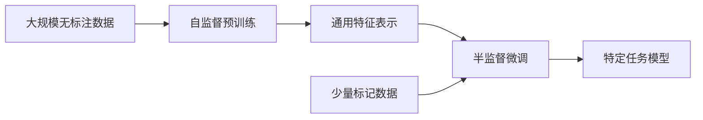

# 半监督学习中的自监督学习方法

## 1. 背景介绍
### 1.1 半监督学习的概念与挑战
#### 1.1.1 半监督学习的定义
半监督学习是机器学习中的一个重要分支,它介于有监督学习和无监督学习之间。在半监督学习中,训练数据集包含少量的标记数据和大量的未标记数据。相比于有监督学习,半监督学习可以利用大量的未标记数据来提高模型的性能;相比于无监督学习,半监督学习可以利用少量的标记数据来引导模型学习更有意义的特征表示。

#### 1.1.2 半监督学习面临的挑战
尽管半监督学习具有广阔的应用前景,但它也面临着一些挑战:

1. 如何有效地利用未标记数据来提高模型性能;
2. 如何设计合适的损失函数来同时考虑标记数据和未标记数据;  
3. 如何避免未标记数据引入噪声,影响模型性能;
4. 如何保证模型的泛化能力,避免过拟合。

### 1.2 自监督学习的兴起
#### 1.2.1 自监督学习的概念
自监督学习是近年来兴起的一种无监督表示学习方法。与传统的无监督学习不同,自监督学习不需要人工标注,而是通过对数据本身设计一个预测任务,让模型在完成这个任务的过程中学习到有用的特征表示。常见的自监督学习任务包括:

- 图像补全:随机遮挡图像的一部分,让模型预测被遮挡的像素值;
- 图像旋转:随机旋转图像,让模型预测旋转角度;
- 上下文预测:随机遮挡句子中的一些单词,让模型根据上下文预测被遮挡的单词。

#### 1.2.2 自监督学习的优势
自监督学习具有以下优势:

1. 不需要人工标注数据,大大减少了标注成本;
2. 可以充分利用大规模无标注数据,学习更加鲁棒的特征表示;
3. 学习到的特征表示可以迁移到下游任务,提高模型的泛化能力;
4. 设计巧妙的自监督任务可以引导模型学习到与下游任务相关的特征。

## 2. 核心概念与联系
### 2.1 半监督学习的分类
半监督学习可以分为以下几类:

- 生成式方法:假设数据服从某个概率分布,通过估计这个分布的参数来利用未标记数据,代表算法有高斯混合模型等;
- 半监督SVM:在SVM的目标函数中加入未标记数据的正则项,代表算法有TSVM等;
- 图半监督学习:把数据表示成图,通过标记数据的类别信息在图上传播来标记未标记数据,代表算法有标签传播等;
- 基于分歧的方法:训练多个分类器,利用不同分类器在未标记数据上的分歧来选择最有价值的未标记样本进行标注,代表算法有Co-Training等。

### 2.2 自监督学习与半监督学习的关系
自监督学习作为一种无监督表示学习方法,可以用来辅助半监督学习,主要有以下几种方式:

1. 自监督预训练+半监督微调:先在大规模无标注数据上进行自监督预训练,学习通用的特征表示,再在少量标记数据上进行半监督微调,完成特定任务;

2. 将自监督任务作为正则项:在半监督学习的损失函数中加入自监督任务的损失,引导模型学习更加通用和鲁棒的特征表示;

3. 将自监督任务产生的伪标签作为额外的监督信号:利用自监督任务产生的预测结果(如图像旋转的角度)作为未标记数据的伪标签,扩充训练集。

下图展示了自监督学习与半监督学习的关系:

## 3. 核心算法原理与具体步骤
本节介绍几种代表性的自监督学习辅助半监督学习的算法。

### 3.1 基于一致性正则化的半监督学习
一致性正则化(Consistency Regularization)是一类重要的半监督学习方法,其核心思想是:模型在未标记样本的不同扰动版本上的预测应该保持一致。形式化地,一致性正则化的目标函数可以写为:

$$
\mathcal{L}=\mathcal{L}_{s}+\lambda \mathcal{R}_{u}
$$

其中$\mathcal{L}_{s}$是有监督损失,$\mathcal{R}_{u}$是一致性正则项,表示模型在未标记样本的不同扰动版本上的预测差异,$\lambda$是权重系数。

基于一致性正则化的半监督学习算法主要有以下几个步骤:

1. 对于标记样本,计算其监督损失$\mathcal{L}_{s}$;

2. 对于未标记样本,生成其不同的扰动版本(如添加噪声、数据增强等),计算模型在这些版本上的预测差异$\mathcal{R}_{u}$;

3. 最小化总的损失函数$\mathcal{L}$,更新模型参数;

4. 重复步骤1-3,直到模型收敛。

代表算法有Π-Model、Temporal Ensembling、Mean Teacher等。

### 3.2 基于虚拟对抗训练的半监督学习
虚拟对抗训练(Virtual Adversarial Training, VAT)是一种基于对抗思想的半监督学习方法,其核心思想是:模型应该对输入的小扰动鲁棒,即使在对抗性噪声的影响下,模型的预测也应该保持不变。形式化地,VAT的目标函数可以写为:

$$
\mathcal{L}=\mathcal{L}_{s}+\lambda \mathcal{R}_{v a t}
$$

其中$\mathcal{R}_{v a t}$是虚拟对抗损失,表示在对抗性噪声$r_{vadv}$的影响下,模型预测的变化:

$$
\mathcal{R}_{v a t}=D\left[p(y | x), p\left(y | x+r_{v a d v}\right)\right]
$$

其中$D$是散度度量,如KL散度。$r_{vadv}$是使得模型预测变化最大的对抗性噪声:

$$
r_{v a d v}=\underset{r ;\|r\| \leq \epsilon}{\arg \max } D\left[p(y | x), p\left(y | x+r\right)\right]
$$

VAT的训练步骤如下:

1. 对于标记样本,计算其监督损失$\mathcal{L}_{s}$;

2. 对于未标记样本,计算其虚拟对抗损失$\mathcal{R}_{v a t}$:
   
   a. 计算模型在原始输入$x$上的预测分布$p(y|x)$;
   
   b. 计算对抗扰动$r_{vadv}$;
   
   c. 计算模型在扰动输入$x+r_{vadv}$上的预测分布$p(y|x+r_{vadv})$;
   
   d. 计算两个分布的散度$D[p(y|x),p(y|x+r_{vadv})]$得到$\mathcal{R}_{vat}$。

3. 最小化总的损失函数$\mathcal{L}$,更新模型参数;

4. 重复步骤1-3,直到模型收敛。

### 3.3 基于混合模型的半监督学习
混合模型(Mixup)是一种简单而有效的数据增强方法,通过线性插值生成新的训练样本。最近,有研究发现将Mixup应用到半监督学习中可以提高性能。

设$x_1,x_2$是两个样本,$y_1,y_2$是它们对应的标签(硬标签或软标签)。Mixup生成一个新的样本$\tilde{x}$和标签$\tilde{y}$:

$$
\begin{aligned}
\tilde{x} &=\lambda x_{1}+(1-\lambda) x_{2} \\
\tilde{y} &=\lambda y_{1}+(1-\lambda) y_{2}
\end{aligned}
$$

其中$\lambda\in[0,1]$服从Beta分布。

将Mixup应用到半监督学习中的关键是如何混合未标记样本。一种直观的方法是将未标记样本与标记样本混合,用标记样本的标签作为混合后样本的伪标签。但这可能会引入噪声。一种改进的方法是将未标记样本与未标记样本混合,用模型在混合前两个样本上的预测作为混合后样本的伪标签。

基于Mixup的半监督学习算法MixMatch的步骤如下:

1. 对于标记样本,通过Mixup数据增强生成新的标记样本;

2. 对于未标记样本:

   a. 对每个未标记样本,生成$K$个数据增强版本;
   
   b. 对每个版本,计算模型的预测,通过平均得到伪标签;
   
   c. 对未标记样本进行Mixup,混合后样本的伪标签通过加权平均伪标签获得。

3. 将标记样本和未标记样本混合,计算监督损失和一致性损失,更新模型;

4. 重复步骤1-3,直到模型收敛。

## 4. 数学模型和公式详解
本节对前面提到的一些关键的数学公式进行详细说明。

### 4.1 一致性正则化中的无偏估计
对于一致性正则化方法,模型在未标记样本的扰动版本$\alpha(x)$上的预测$f(\alpha(x))$应该与原始样本的预测$f(x)$一致。但是,由于扰动是随机的,每次采样得到的$f(\alpha(x))$都有差异,直接优化$f(x)$与$f(\alpha(x))$的差异会引入噪声。

为了解决这个问题,Temporal Ensembling和Mean Teacher分别提出了两种降噪的方法。

Temporal Ensembling使用指数滑动平均来累积模型在每个未标记样本上的预测:

$$
z_{i}^{\prime}=\alpha z_{i}+(1-\alpha) f\left(x_{i}\right)
$$

其中$z_i$是样本$x_i$的预测累积,$\alpha$是滑动平均系数。这样,一致性损失可以写为:

$$
\mathcal{R}_{u}=\frac{1}{n} \sum_{i=1}^{n}\left\|f\left(x_{i}\right)-z_{i}^{\prime}\right\|^{2}
$$

Mean Teacher使用两个模型:学生模型$f_{\theta}$和教师模型$f_{\theta'}$,其中教师模型的参数$\theta'$是学生模型参数$\theta$的指数滑动平均:

$$
\theta^{\prime}=\alpha \theta^{\prime}+(1-\alpha) \theta
$$

一致性损失定义为学生模型和教师模型在未标记样本上预测的差异:

$$
\mathcal{R}_{u}=\frac{1}{n} \sum_{i=1}^{n}\left\|f_{\theta}\left(x_{i}\right)-f_{\theta^{\prime}}\left(x_{i}\right)\right\|^{2}
$$

可以证明,这两种方法都是$\mathbb{E}_{\alpha}[f(\alpha(x))]$的无偏估计,因此可以有效降低噪声的影响。

### 4.2 虚拟对抗训练中的梯度近似
在虚拟对抗训练中,需要找到使得模型预测变化最大的对抗扰动$r_{vadv}$:

$$
r_{v a d v}=\underset{r ;\|r\| \leq \epsilon}{\arg \max } D\left[p(y | x), p\left(y | x+r\right)\right]
$$

直接求解这个优化问题是不现实的,因为$r$是连续的,解空间非常大。一种常用的近似方法是用一阶泰勒展开来近似:

$$
D\left[p(y | x), p\left(y | x+r\right)\right] \approx D\left[p(y | x), p\left(y | x\right)\right]+r^{T} \nabla_{x} D\left[p(y | x), p\left(y | x\right)\right]
$$

忽略常数项,近似的$r_{vadv}$为:

$$
r_{v a d v} \approx \