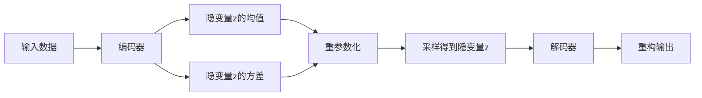

# 变分自编码器(Variational Autoencoder)原理与代码实战案例讲解

## 1. 背景介绍
### 1.1 自编码器的发展历程
#### 1.1.1 传统自编码器
#### 1.1.2 稀疏自编码器
#### 1.1.3 去噪自编码器
### 1.2 变分自编码器的提出
#### 1.2.1 变分推断的引入
#### 1.2.2 VAE的诞生
### 1.3 VAE的应用领域
#### 1.3.1 图像生成
#### 1.3.2 语音合成
#### 1.3.3 异常检测

## 2. 核心概念与联系
### 2.1 概率图模型
#### 2.1.1 有向图模型
#### 2.1.2 无向图模型 
#### 2.1.3 VAE中的概率图模型
### 2.2 变分推断
#### 2.2.1 变分下界(ELBO)
#### 2.2.2 KL散度
#### 2.2.3 重参数化技巧
### 2.3 编码器与解码器
#### 2.3.1 编码器的作用
#### 2.3.2 解码器的作用
#### 2.3.3 编码器与解码器的联系



## 3. 核心算法原理具体操作步骤
### 3.1 编码阶段
#### 3.1.1 输入数据的预处理
#### 3.1.2 编码器网络结构设计
#### 3.1.3 隐变量分布参数的估计
### 3.2 重参数化
#### 3.2.1 从隐变量分布中采样
#### 3.2.2 重参数化技巧的实现
### 3.3 解码阶段 
#### 3.3.1 解码器网络结构设计
#### 3.3.2 重构损失函数设计
### 3.4 模型训练
#### 3.4.1 ELBO损失函数
#### 3.4.2 反向传播与参数更新
#### 3.4.3 训练技巧与超参数选择

## 4. 数学模型和公式详细讲解举例说明
### 4.1 变分下界(ELBO)推导
#### 4.1.1 对数似然的变分下界
$$\log p(x) \ge \mathbb{E}_{q_\phi(z|x)}[\log p_\theta(x|z)] - D_{KL}(q_\phi(z|x)||p(z))$$
#### 4.1.2 最大化ELBO等价于最小化KL散度
### 4.2 重参数化技巧推导
#### 4.2.1 从标准正态分布采样
$$\epsilon \sim \mathcal{N}(0,I)$$
#### 4.2.2 线性变换得到目标分布的样本
$$z = \mu + \sigma \odot \epsilon$$
### 4.3 ELBO损失函数推导
#### 4.3.1 重构损失项
$$\mathbb{E}_{q_\phi(z|x)}[\log p_\theta(x|z)]$$
#### 4.3.2 KL散度正则化项
$$D_{KL}(q_\phi(z|x)||p(z)) = \frac{1}{2}\sum_{j=1}^J (1+\log(\sigma_j^2)-\mu_j^2-\sigma_j^2)$$

## 5. 项目实践：代码实例和详细解释说明
### 5.1 环境准备
#### 5.1.1 安装必要的库
#### 5.1.2 GPU配置
### 5.2 数据准备
#### 5.2.1 加载MNIST数据集
#### 5.2.2 数据预处理与数据增强
### 5.3 模型构建
#### 5.3.1 编码器网络构建
```python
class Encoder(nn.Module):
    def __init__(self, latent_dim):
        super(Encoder, self).__init__() 
        self.fc1 = nn.Linear(784, 512)
        self.fc2 = nn.Linear(512, 256) 
        self.fc31 = nn.Linear(256, latent_dim)
        self.fc32 = nn.Linear(256, latent_dim)
        
    def forward(self, x):
        h = F.relu(self.fc1(x))
        h = F.relu(self.fc2(h))
        mu = self.fc31(h)
        log_var = self.fc32(h)
        return mu, log_var
```
#### 5.3.2 解码器网络构建
```python
class Decoder(nn.Module):
    def __init__(self, latent_dim):
        super(Decoder, self).__init__()
        self.fc1 = nn.Linear(latent_dim, 256)  
        self.fc2 = nn.Linear(256, 512)
        self.fc3 = nn.Linear(512, 784)
        
    def forward(self, z):
        h = F.relu(self.fc1(z))
        h = F.relu(self.fc2(h))
        recon_x = torch.sigmoid(self.fc3(h))
        return recon_x
```
#### 5.3.3 VAE模型构建
```python
class VAE(nn.Module):
    def __init__(self, latent_dim):
        super(VAE, self).__init__()
        self.encoder = Encoder(latent_dim)
        self.decoder = Decoder(latent_dim)
    
    def reparameterize(self, mu, log_var):
        std = torch.exp(0.5*log_var)
        eps = torch.randn_like(std)
        return mu + eps*std
    
    def forward(self, x):
        mu, log_var = self.encoder(x)
        z = self.reparameterize(mu, log_var)
        recon_x = self.decoder(z)
        return recon_x, mu, log_var
```
### 5.4 模型训练
#### 5.4.1 定义ELBO损失函数
```python
def loss_function(recon_x, x, mu, log_var):
    BCE = F.binary_cross_entropy(recon_x, x.view(-1, 784), reduction='sum')
    KLD = -0.5 * torch.sum(1 + log_var - mu.pow(2) - log_var.exp())
    return BCE + KLD
```
#### 5.4.2 训练循环
```python
def train(epoch):
    model.train()
    train_loss = 0
    for batch_idx, (data, _) in enumerate(train_loader):
        data = data.to(device)
        optimizer.zero_grad()
        recon_batch, mu, log_var = model(data)
        loss = loss_function(recon_batch, data, mu, log_var)
        loss.backward()
        train_loss += loss.item()
        optimizer.step()
```
### 5.5 模型评估与可视化
#### 5.5.1 重构图像可视化
#### 5.5.2 隐空间插值
#### 5.5.3 生成新样本

## 6. 实际应用场景
### 6.1 图像生成
#### 6.1.1 人脸图像生成
#### 6.1.2 场景图像生成
#### 6.1.3 艺术风格迁移
### 6.2 语音合成
#### 6.2.1 语音转换
#### 6.2.2 歌声合成
### 6.3 异常检测
#### 6.3.1 工业制造异常检测
#### 6.3.2 医学影像异常检测

## 7. 工具和资源推荐
### 7.1 深度学习框架
#### 7.1.1 PyTorch
#### 7.1.2 TensorFlow
#### 7.1.3 Keras
### 7.2 开源实现
#### 7.2.1 官方实现
#### 7.2.2 第三方实现
### 7.3 相关论文与资料
#### 7.3.1 原始VAE论文
#### 7.3.2 VAE扩展与改进
#### 7.3.3 教程与博客

## 8. 总结：未来发展趋势与挑战
### 8.1 VAE的优势
#### 8.1.1 有效的隐空间表示学习
#### 8.1.2 可解释性与可控性
### 8.2 VAE的局限性
#### 8.2.1 生成样本多样性不足
#### 8.2.2 后验分布假设限制
### 8.3 VAE的改进方向
#### 8.3.1 更灵活的后验分布
#### 8.3.2 层次化VAE模型
#### 8.3.3 结合对抗生成网络
### 8.4 VAE的未来发展
#### 8.4.1 多模态学习
#### 8.4.2 元学习
#### 8.4.3 强化学习

## 9. 附录：常见问题与解答
### 9.1 VAE与传统AE有何区别？
VAE引入了变分推断，学习隐变量的概率分布，而不是直接学习隐变量的值，具有更强的生成能力和表示能力。
### 9.2 为什么要用重参数化技巧？
重参数化技巧可以将随机性从采样过程转移到输入噪声，使得梯度可以反向传播，从而允许端到端的训练。
### 9.3 VAE能否生成离散型数据？
VAE原本假设隐变量服从高斯分布，适合连续型数据。但可以通过Gumbel Softmax等技巧扩展到离散型数据。
### 9.4 后验分布假设对VAE性能的影响？
假设隐变量服从各向同性的高斯分布过于简单，限制了VAE的表示能力。可以考虑更灵活的分布，如混合高斯分布等。
### 9.5 如何衡量VAE生成样本的质量？
常用的指标有重构误差、Inception Score(IS)、Fréchet Inception Distance(FID)等，从不同角度评估生成样本的真实性和多样性。

作者：禅与计算机程序设计艺术 / Zen and the Art of Computer Programming