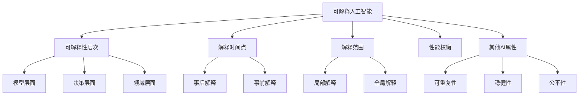

# 可解释人工智能 原理与代码实例讲解

## 1.背景介绍

### 1.1 人工智能的黑盒问题

人工智能技术在过去几年中取得了巨大的进步,尤其是深度学习模型在计算机视觉、自然语言处理等领域取得了显著的性能提升。然而,这些高度复杂的深度神经网络模型往往被视为"黑盒",其内部工作机制对于用户和开发者来说是不透明的。我们很难解释模型是如何得出特定的预测结果的,这给人工智能系统的可信度和可靠性带来了挑战。

### 1.2 可解释性的重要意义

人工智能系统的可解释性对于以下几个方面有重要意义:

1. 提高用户信任:如果用户能够理解AI系统的决策过程,他们更有可能信任并接受系统的输出结果。

2. 便于调试和改进:可解释性使得开发者能够洞察模型的内部工作机制,发现潜在的错误和偏差,从而对模型进行优化改进。

3. 满足法规要求:在一些关键领域如金融、医疗等,法规可能要求AI系统的决策过程必须是可解释和可审计的。

4. 促进人机协作:当人类能够理解AI系统的推理过程时,人类专家可以更好地利用AI所提供的洞见,AI系统也能更顺畅地融入人类的工作流程。

### 1.3 可解释人工智能的目标

可解释人工智能(Explainable AI,XAI)是一个旨在使人工智能系统的行为和决策过程对人类用户来说是可理解、可信任的新兴研究领域。它的主要目标包括:

1. 透明度:阐明AI系统如何将输入数据转化为输出决策的内部过程。

2. 可解释性:以人类可以理解的术语和概念来描述AI系统的工作原理。

3. 可信赖性:提高用户对AI系统输出结果的信任度。 

4. 问责制:确保AI系统的决策过程是可审计、可验证的,以满足道德和法律要求。

总之,可解释人工智能旨在打开AI系统的"黑盒",使其内部机制透明化,让人类用户能够洞察、理解、信任AI系统的工作方式,从而更好地利用AI技术造福人类社会。

## 2.核心概念与联系

### 2.1 可解释性的层次

可解释性可以在不同的层次上进行阐释:

1. 模型层面:解释整个AI模型的总体工作机制,如神经网络的拓扑结构、关键特征等。

2. 决策层面:解释AI系统如何得出单个样本的预测结果,强调决策过程中的关键因素。

3. 领域层面:结合特定应用领域的知识,用领域专业术语描述AI系统的工作原理。

### 2.2 事后解释与事前解释

根据解释的时间点,可解释性方法可分为:

1. 事后解释:在AI模型训练完成后,对其决策过程进行事后分析和阐释。主要关注已经做出的单个决策。

2. 事前解释:在AI模型开发过程中就考虑可解释性,构建本质上可解释的模型。关注模型的总体工作机制。

### 2.3 局部解释与全局解释

根据解释的范围,可解释性方法可分为:

1. 局部解释:解释模型对单个样本或一小部分样本的决策过程。

2. 全局解释:解释模型在整个数据集上的总体工作机制。

### 2.4 模型的可解释性与性能的权衡

一般来说,模型的可解释性与其性能往往存在一定的权衡:

1. 复杂的黑盒模型如深度神经网络,性能优异但可解释性差。

2. 简单的白盒模型如决策树、线性模型,可解释性好但性能相对较差。

因此,如何在保证一定性能的同时提高模型的可解释性,是一个需要平衡的问题。

### 2.5 可解释性与其他AI属性的关系

可解释性与其他几个AI系统属性的关系如下:

1. 可解释性与可重复性:可重复性指重复实验能得到一致的结果。它是可解释性的前提。

2. 可解释性与稳健性:稳健性指面对噪声扰动时保持输出一致。可解释性有助于分析影响稳健性的因素。

3. 可解释性与公平性:公平性指模型对不同群体无歧视。可解释性有助于发现模型中的偏差,提高公平性。

下图展示了可解释人工智能的核心概念之间的关系:

总之,可解释性是一个多层次、多角度的概念,在提高AI系统可解释性的同时,需要兼顾其性能、稳健性、公平性等其他重要属性。理解这些概念之间的联系,有助于我们更好地研究和应用可解释人工智能技术。

## 3.核心算法原理具体操作步骤

可解释人工智能的实现涉及多种算法和技术,下面我们重点介绍几种主要的方法:

### 3.1 基于特征重要性的解释方法

这类方法通过分析各输入特征对模型输出的影响程度,来解释模型的决策过程。主要步骤如下:

1. 特征打分:为每个输入特征分配一个重要性分数,表示该特征对模型输出的影响大小。常见的打分方法有:
   - 特征置换:随机打乱某个特征的取值,观察模型性能的变化幅度。
   - SHAP值:基于博弈论的Shapley值,分配每个特征的贡献度。
   
2. 特征可视化:将特征重要性分数以直观的可视化形式呈现,如条形图、热力图等。

3. 特征交互分析:探索特征之间的交互效应对模型输出的影响。

代表性算法: LIME(Local Interpretable Model-agnostic Explanations), SHAP(Shapley Additive Explanations)等。

### 3.2 基于规则提取的解释方法

这类方法从训练好的黑盒模型中提取出可解释的规则,揭示模型的决策逻辑。主要步骤如下:

1. 黑盒模型训练:在原始数据集上训练一个性能优异的黑盒模型。

2. 规则提取:使用启发式算法或决策树等白盒模型,拟合黑盒模型在数据集上的输入输出关系,生成决策规则。

3. 规则简化:对提取出的规则进行合并、剪枝等简化操作,提高规则的可解释性。

4. 规则可视化:以决策树、规则列表等形式直观地呈现提取出的规则。

代表性算法:CORELS(Certifiably Optimal RulE ListS), Trepan等。

### 3.3 基于反向传播的解释方法

这类方法利用神经网络的反向传播机制,识别对网络输出有重要影响的输入特征或网络结构。主要步骤如下:

1. 前向传播:输入数据通过神经网络计算输出。

2. 反向传播:从输出层开始,计算损失函数对各神经元激活值的梯度。

3. 梯度分析:根据梯度值的大小,判断各输入特征或神经元对输出的重要程度。

4. 显著性可视化:将输入特征的重要性映射回原始输入空间,生成显著性图。

代表性算法:CAM(Class Activation Mapping), Grad-CAM, LRP(Layer-wise Relevance Propagation)等。

### 3.4 基于样本扰动的解释方法 

这类方法通过对输入样本施加扰动,观察模型输出的变化,来分析模型的决策边界和敏感区域。主要步骤如下:

1. 扰动生成:在输入样本的特征空间中,生成一系列扰动后的新样本。

2. 模型推断:对扰动后的样本进行模型推断,得到其输出结果。

3. 差异分析:比较扰动前后样本的模型输出差异,分析各特征的影响。

4. 敏感区域可视化:找出模型输出对扰动最敏感的输入区域,形成敏感区域图。

代表性算法:PDA(Prediction Difference Analysis),Anchors等。

综上,可解释人工智能算法从不同角度出发,揭示AI模型的决策过程,各有优势和适用场景。在实践中需要根据具体的模型类型、任务需求、数据特点等因素,灵活选择和组合使用这些算法,以期获得全面、清晰的模型解释。

## 4.数学模型和公式详细讲解举例说明

本节我们以SHAP(Shapley Additive Explanations)算法为例,详细讲解其背后的数学原理。SHAP是一种基于博弈论的通用模型解释方法,可以用于衡量特征对模型输出的贡献度。

### 4.1 Shapley值的定义

在博弈论中,Shapley值用于衡量各参与者对合作收益的贡献大小。假设有一个由 $N$ 个参与者组成的博弈,其特征函数 $v:2^N \to \mathbb{R}$ 将参与者的每个子集映射到一个实数收益。对于第 $i$ 个参与者,其Shapley值定义为:

$$
\phi_i(v) = \sum_{S \subseteq N \setminus \{i\}} \frac{|S|!(|N|-|S|-1)!}{|N|!} (v(S \cup \{i\}) - v(S))
$$

其中, $S$ 为不包含第 $i$ 个参与者的任意子集, $|S|$ 为子集的大小, $|N|$ 为总参与者数。Shapley值反映了第 $i$ 个参与者对总收益的平均边际贡献。

### 4.2 将Shapley值应用于模型解释

SHAP将博弈论中的Shapley值概念引入到模型解释中。在这里,我们将特征看作博弈中的参与者,模型输出看作博弈的收益。给定一个样本 $x$,令 $x_S$ 表示仅保留特征子集 $S$ 的新样本(其余特征取边际分布的期望值),模型 $f$ 在 $x_S$ 上的预测值 $f(x_S)$ 即为特征子集 $S$ 的收益。由此,我们可以定义样本 $x$ 的特征 $i$ 的SHAP值为:

$$
\phi_i(f,x) = \sum_{S \subseteq F \setminus \{i\}} \frac{|S|!(|F|-|S|-1)!}{|F|!} (f(x_{S \cup \{i\}}) - f(x_S))
$$

其中, $F$ 为样本的完整特征集, $|F|$ 为特征总数。SHAP值 $\phi_i(f,x)$ 度量了特征 $i$ 对模型 $f$ 在样本 $x$ 上输出的贡献大小。

### 4.3 SHAP值的性质

SHAP值具有以下良好性质:

1. 局部准确性:样本的SHAP值之和加上期望输出等于模型在该样本上的实际输出。
   
   $$f(x)=\phi_0(f,x) + \sum_{i=1}^{|F|} \phi_i(f,x)$$
   
   其中基准值 $\phi_0(f,x)$ 为所有特征取边际分布期望值时的模型输出。

2. 一致性:如果在所有数据集上,一个特征的贡献始终大于另一个特征,则该特征的SHAP值也应始终更大。

3. 虚值属性:对于缺失特征(即对模型输出无影响的特征),其SHAP值恒为零。 

这些性质保证了SHAP值能够较好地反映特征的实际贡献,是一种可靠的特征重要性度量。

###