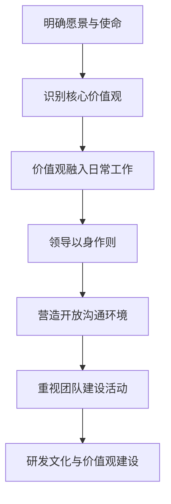

# 团队研发文化和价值观建设与传承

## 1. 背景介绍
### 1.1 研发团队文化的重要性
### 1.2 价值观在团队建设中的作用
### 1.3 研发文化与价值观传承的挑战

## 2. 核心概念与联系
### 2.1 研发文化的定义与内涵
### 2.2 团队价值观的内容与表现形式
### 2.3 文化与价值观之间的关系

## 3. 建设研发文化和价值观的具体步骤
### 3.1 明确团队愿景与使命
### 3.2 识别并确立核心价值观
### 3.3 将价值观融入日常工作
#### 3.3.1 招聘与面试
#### 3.3.2 新员工入职培训
#### 3.3.3 绩效考核与奖惩机制
### 3.4 领导者身先士卒，以身作则
### 3.5 营造开放、包容的沟通环境
### 3.6 重视团队建设活动

## 4. 研发文化与价值观建设的理论模型
### 4.1 Schein的组织文化三层次模型
### 4.2 Cameron和Quinn的竞争价值框架
### 4.3 Hofstede的文化维度理论

## 5. 实践案例：优秀IT企业的研发文化
### 5.1 Google：创新与自主
### 5.2 Amazon：客户至上与创新
### 5.3 Netflix：自由与责任
### 5.4 Spotify：敏捷与自治
### 5.5 Airbnb：简单与归属感

## 6. 研发文化与价值观在实际工作中的应用
### 6.1 提高团队凝聚力与归属感
### 6.2 激发员工创新与主动性
### 6.3 提升团队协作效率
### 6.4 吸引并留住优秀人才
### 6.5 塑造企业品牌形象

## 7. 推荐工具与资源
### 7.1 团队建设活动设计工具
### 7.2 员工满意度与敬业度调查问卷
### 7.3 企业文化评估与诊断工具
### 7.4 相关书籍与在线课程推荐

## 8. 总结：研发文化与价值观的未来趋势与挑战
### 8.1 远程办公对文化建设的影响
### 8.2 多元化团队的文化融合
### 8.3 持续学习与创新的重要性
### 8.4 领导力在文化传承中的关键作用

## 9. 附录：常见问题与解答
### 9.1 如何处理团队成员间的价值观冲突？
### 9.2 面对外部环境变化，如何保持文化的稳定性？
### 9.3 如何评估研发文化建设的成效？
### 9.4 中小型团队如何开展文化建设？

研发团队的文化和价值观是团队建设与管理中至关重要的一环。一个高效、创新、充满活力的研发团队离不开强大的文化支撑和共同的价值追求。团队文化犹如一面旗帜，凝聚着团队成员的心，激励着大家为共同的目标而奋斗。而价值观则是文化的核心，是团队成员行为的指南针，引领着大家在工作中做出正确的选择和判断。

然而，研发文化和价值观的建设与传承并非一蹴而就。它需要团队领导者的高度重视，需要全体成员的共同努力，更需要长期的坚持与投入。只有将文化与价值观真正融入到团队的日常工作中，并通过持续不断的宣导、践行和强化，才能真正将其内化为团队的DNA，成为推动团队不断前行的不竭动力。

本文将从背景介绍、核心概念、建设步骤、理论模型、实践案例等多个维度，全面探讨研发团队文化和价值观建设与传承的相关话题。通过研究优秀IT企业的成功经验，结合管理学理论和实践，我们将为广大研发团队领导者和成员提供一套切实可行的文化建设方法论，助力团队在激烈的市场竞争中赢得先机，实现基业长青。

## 1. 背景介绍

### 1.1 研发团队文化的重要性

在当今瞬息万变的商业环境下，一个企业的核心竞争力很大程度上取决于其研发团队的创新能力和执行效率。而团队文化则是影响团队绩效的关键因素之一。哈佛商学院教授约翰·科特曾指出："企业文化比企业战略更重要。"可见文化对于企业乃至团队的重要性。

一个积极向上、充满激情的研发团队文化能够激发员工的创造力，提升工作满意度和敬业度，吸引并留住优秀人才，从而为企业带来持续的创新动力和市场竞争优势。相反，一个消极懈怠、缺乏凝聚力的团队文化则会抑制员工的积极性，加剧内部矛盾，导致人才流失，最终影响企业的生存与发展。

### 1.2 价值观在团队建设中的作用

价值观是团队文化的灵魂，是指引团队成员行为的基本准则。明确、一致的价值观能够帮助团队成员形成共同的行为模式，减少内部冲突，提高决策效率。当团队成员对团队的价值观产生认同感时，他们更愿意为团队的目标而努力，表现出更高的忠诚度和主人翁意识。

此外，价值观还是吸引人才、塑造雇主品牌的重要法宝。当今的年轻一代员工更加注重企业文化和价值观与自身的契合度。一个拥有积极、进步价值观的团队更容易吸引到志同道合的优秀人才，而这些人才的加入又会进一步促进团队文化的发展和传承。

### 1.3 研发文化与价值观传承的挑战

然而，研发文化与价值观的建设和传承并非易事。随着团队规模的扩大、人员的更替，以及外部环境的变化，团队文化和价值观可能会逐渐变得模糊、稀释，甚至出现偏离。如何在动荡的环境中维系文化的稳定性，如何跨越地域和时间的障碍将价值观有效传递，如何应对多元化团队带来的文化冲突，这些都是摆在团队领导者面前的现实挑战。

## 2. 核心概念与联系

### 2.1 研发文化的定义与内涵

研发文化是指研发团队在长期工作实践中形成的，为团队成员所共同认可和遵循的一套价值观念、行为准则和工作方式的总和。它包括但不限于：创新精神、质量意识、协作精神、学习氛围、工程师文化等。研发文化对团队如何开展技术创新、如何进行项目管理、如何处理内外部关系等方面具有重要的指导意义。

一个优秀的研发文化应当是鼓励创新、崇尚简洁、追求卓越、注重协作、勇于担当、敢于质疑的文化。它能够最大限度地调动员工的积极性和创造力，营造一个开放、包容、充满活力的工作环境，推动技术创新和产品迭代。同时，优秀的研发文化也强调工程师的社会责任感，注重技术的道德伦理约束，追求用科技造福人类。

### 2.2 团队价值观的内容与表现形式

团队价值观是指团队成员共同信奉的基本信念、行为准则和判断标准。它回答了"我们是谁"、"我们要往哪儿走"、"什么对我们最重要"等一系列根本性问题。常见的团队价值观包括：诚信、尊重、创新、专注、协作、敬业等。不同的团队会根据自身的业务特点、发展阶段和领导风格，形成不同的价值观组合。

团队价值观可以以口号、标语、行为准则等显性形式出现，如"客户第一"、"拥抱变化"等。但更多时候，价值观是隐性的，体现在团队成员的日常言行举止中，如领导者的决策风格、员工的沟通方式、绩效考核的侧重点等。团队成员对价值观的认同感越强，价值观对其行为的影响就越大。

### 2.3 文化与价值观之间的关系

文化和价值观是相辅相成、密不可分的。价值观是文化的核心，是决定文化性质和方向的关键因素。没有价值观的支撑，文化就如同一盘散沙，缺乏凝聚力和向心力。而文化则是价值观的载体和表现形式，是价值观在组织行为中的具体体现。脱离了文化土壤，价值观就成了空洞的口号，难以落地生根。

因此，在团队文化建设中，必须高度重视价值观的塑造和传承。只有将价值观真正融入到文化的各个方面，并转化为团队成员看得见、摸得着的行为规范和工作习惯，才能形成强大的文化认同感和向心力，推动团队的可持续发展。

## 3. 建设研发文化和价值观的具体步骤

### 3.1 明确团队愿景与使命

团队愿景和使命是价值观的源头和归宿。愿景描绘了团队的理想状态和长远目标，使命则说明了团队的存在价值和责任担当。明确团队愿景和使命，有助于团队成员找到奋斗的方向和动力，增强使命感和责任感。因此，在建设研发文化和价值观时，首先要让全体成员参与到愿景和使命的讨论中来，形成共识，并将其作为文化建设的指引。

### 3.2 识别并确立核心价值观

在明确愿景和使命的基础上，团队需要进一步识别和确立自身的核心价值观。这需要团队成员深入思考："我们想成为一个什么样的团队？"、"什么样的行为在我们团队是受到鼓励和赞赏的？"通过头脑风暴、小组讨论等方式，团队可以梳理出一系列候选价值观。然后，通过投票、达成共识等方式，选出最能代表团队追求、最有利于团队发展的3-5个核心价值观。

确立核心价值观时需要注意以下几点：
- 价值观要简单、明确、易于理解和传播；
- 价值观要与团队的愿景、使命和业务特点相匹配；
- 价值观要能够转化为具体的行为标准和评判尺度；
- 价值观的数量不宜过多，一般3-5个即可。

### 3.3 将价值观融入日常工作

有了核心价值观还不够，关键是要将其落实到团队的日常运作中去。这需要将价值观体现和贯穿在团队管理的各个环节，形成"将价值观落地"的机制和氛围。

#### 3.3.1 招聘与面试

在招聘新员工时，要将价值观作为考察的重要维度。通过行为面试、情景模拟等方式，评估候选人的价值取向是否与团队价值观相匹配。这不仅能够帮助团队选拔到合适的人才，也能够向候选人传递团队的价值追求，提升雇主品牌。

#### 3.3.2 新员工入职培训

对新员工开展系统的入职培训，是传承团队文化和价值观的重要契机。通过讲述团队的发展历程、介绍核心价值观的内涵、分享优秀员工的事迹等方式，帮助新员工尽快融入团队文化，理解和认同团队的价值追求。

#### 3.3.3 绩效考核与奖惩机制

将价值观融入到绩效考核和奖惩机制中，用制度的力量引导和强化员工的行为。在设计考核指标时，要将价值观的践行情况作为重要的评价维度，并设置相应的权重。对于模范践行价值观的员工，要给予物质和精神奖励；对