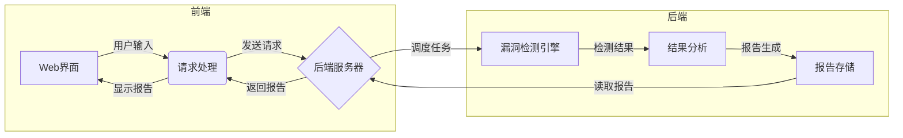

# 基于Python的在线网站安全检测系统

## 1.背景介绍

### 1.1 网络安全的重要性

在当今互联网时代,网站作为企业和个人展示自我、开展业务的重要窗口,其安全性备受关注。网站一旦遭受攻击,不仅会导致数据泄露、系统瘫痪等严重后果,还会造成巨大的经济损失和信誉危机。因此,保障网站的安全性对于任何组织机构都是至关重要的。

### 1.2 网站安全威胁

网站面临的主要安全威胁包括但不限于:

- **注入攻击**: 如SQL注入、命令注入等,通过在用户输入中注入恶意代码,获取敏感数据或执行任意操作。
- **跨站脚本攻击(XSS)**: 在网页中注入恶意脚本,窃取用户信息或控制浏览器。
- **跨站请求伪造(CSRF)**: 伪造用户请求,在用户不知情的情况下执行非法操作。
- **拒绝服务攻击(DoS/DDoS)**: 发送大量恶意请求,使网站服务器超载而瘫痪。
- **暴力破解**: 通过蛮力尝试大量可能的密码组合,破解系统账户密码。

### 1.3 现有网站安全检测方法

目前,网站安全检测主要采取以下几种方式:

1. **手动代码审计**: 由安全专家人工审查网站源代码,发现潜在漏洞。但效率低下,且需要大量人力。
2. **渗透测试**: 模拟真实攻击,检测网站在攻击下的表现。但成本高,风险大。
3. **Web应用防火墙(WAF)**: 通过规则过滤恶意流量,保护网站。但无法检测已存在的漏洞。
4. **漏洞扫描器**: 自动化工具,扫描常见漏洞。但存在误报高、遗漏的问题。

基于以上种种局限性,开发一款高效、准确的自动化网站安全检测系统显得尤为迫切。

## 2.核心概念与联系

### 2.1 Web安全三大要素

在设计网站安全检测系统之前,我们需要了解Web安全的三大要素:

1. **机密性(Confidentiality)**: 防止敏感信息泄露给未经授权的第三方。
2. **完整性(Integrity)**: 确保数据和系统在传输和存储过程中不被非法篡改。
3. **可用性(Availability)**: 保证合法用户随时可以访问系统及其资源。

我们的检测系统需要全方位覆盖这三大要素,以确保网站的整体安全性。

### 2.2 OWASP Top 10

OWASP(开放式Web应用程序安全项目)每几年发布一次最新的十大Web应用程序安全风险,被广泛认可为Web安全领域的权威标准。我们的检测系统需要重点关注OWASP Top 10中列出的漏洞,如注入、破坏身份认证、敏感数据泄露等。

### 2.3 Web安全检测技术

常见的Web安全检测技术包括:

- **静态代码分析**: 不运行程序,分析源代码或字节码,查找潜在漏洞。
- **动态应用程序扫描**: 模拟攻击者的行为,通过实际运行程序检测漏洞。
- **交互式应用程序安全测试(IAST)**: 结合静态和动态分析,在运行时检测和验证漏洞。

我们的系统将综合运用以上多种技术,以提高检测的全面性和准确性。

## 3.核心算法原理具体操作步骤

### 3.1 系统架构

我们的在线网站安全检测系统采用前后端分离的架构,具体如下:



前端提供Web界面,接收用户输入的待检测网站URL,并将请求发送给后端服务器。后端服务器调度漏洞检测引擎对目标网站进行全面检测,分析检测结果并生成报告,最终将报告返回给前端展示。

### 3.2 漏洞检测引擎

漏洞检测引擎是系统的核心模块,负责对目标网站执行各种安全检测。它由以下几个子模块组成:

#### 3.2.1 爬虫模块

爬虫模块的任务是自动发现并抓取目标网站的所有URL,为后续检测做准备。我们采用的是基于深度优先策略的网页爬虫算法:

1. 将种子URL放入队列
2. 从队列取出一个URL,获取页面内容
3. 从页面内容中提取新的URL,放入队列
4. 重复步骤2和3,直到队列为空

该算法的时间复杂度为O(|V|+|E|),其中|V|为网站URL数量,|E|为链接数量。为了提高爬虫效率,我们引入了多线程和去重机制。

#### 3.2.2 静态代码分析

静态分析模块对目标网站的源代码进行扫描,查找潜在的安全漏洞。我们采用了基于数据流分析的静态分析算法:

1. 构建程序的控制流图(CFG)和数据流图(DFG)
2. 针对每个源(Source)和sink(Sink),在CFG和DFG中查找是否存在数据流路径
3. 如果存在路径,则报告潜在漏洞

其中,Source表示用户可控数据的入口点,如HTTP参数、文件读取等;Sink表示安全敏感的操作,如数据库查询、命令执行等。该算法的时间复杂度取决于程序的规模和复杂度。

#### 3.2.3 动态应用程序扫描

动态扫描模块通过实际运行网站,模拟攻击者的行为,检测实际存在的漏洞。我们使用了基于有限状态机的网络漏洞扫描算法:

1. 根据Web应用程序的规范构建有限状态机模型
2. 遍历状态机,生成各种合法和非法的输入测试用例
3. 对每个测试用例,观察Web应用程序的响应
4. 如果响应异常,则报告相应的漏洞

该算法的时间复杂度取决于状态机的规模和测试用例的数量。我们还引入了智能模糊测试技术,以提高测试覆盖率。

### 3.3 结果分析与报告生成

在完成漏洞检测后,系统需要对检测结果进行综合分析,生成详细的报告。报告内容包括:

- 概要信息:检测时间、目标网站、检测范围等
- 漏洞列表:描述每个发现的漏洞的类型、位置、危害程度等
- 修复建议:为每个漏洞提供对应的修复方案和最佳实践
- 统计数据:按漏洞类型、严重程度等维度统计漏洞数量

报告将以用户友好的格式存储,以便后续查阅和分析。同时,我们还将提供自动化的漏洞修复功能,协助用户高效修复发现的漏洞。

## 4.数学模型和公式详细讲解举例说明

在网站安全检测过程中,我们需要借助一些数学模型和公式来量化和评估网站的安全性。以下是一些常用的模型和公式:

### 4.1 Common Vulnerability Scoring System (CVSS)

CVSS是一种开放的标准,用于捕获主要特征并产生可测量的评分,从而评估和优先排列漏洞的严重性。CVSS评分公式如下:

$$
CVSS = f(AV, AC, Au, C, I, A)
$$

其中:

- $AV$ 表示攻击向量(Attack Vector)
- $AC$ 表示攻击复杂度(Attack Complexity)  
- $Au$ 表示所需权限(Authentication)
- $C$ 表示机密性影响(Confidentiality Impact)
- $I$ 表示完整性影响(Integrity Impact)
- $A$ 表示可用性影响(Availability Impact)

每个指标都有对应的量化值,通过公式计算得到最终的CVSS评分,范围在0到10之间。CVSS评分越高,表明漏洞的危害程度越大。

### 4.2 Web应用程序漏洞扫描覆盖率

为了评估漏洞扫描的全面性,我们引入了扫描覆盖率的概念。设Web应用程序的所有可能状态为$S$,已扫描的状态集合为$S'$,则扫描覆盖率可表示为:

$$
覆盖率 = \frac{|S'|}{|S|}
$$

其中$|S|$和$|S'|$分别表示集合$S$和$S'$的基数。我们的目标是最大化扫描覆盖率,以发现更多潜在漏洞。

### 4.3 Web应用程序攻击面积

攻击面积(Attack Surface)是衡量系统暴露给潜在攻击者的总体风险程度的一种度量标准。对于Web应用程序,攻击面积可用以下公式计算:

$$
攻击面积 = \sum_{i=1}^{n}(资源\_权重_i \times 损失\_成本_i)
$$

其中$n$为暴露资源的总数,$资源\_权重_i$表示第$i$个资源的重要性权重,$损失\_成本_i$表示该资源被攻击后的潜在损失成本。通过最小化攻击面积,我们可以降低Web应用程序遭受攻击的风险。

以上这些数学模型和公式为我们量化和评估网站安全性提供了有力的理论支持。在实际应用中,我们将综合运用这些模型,为用户提供更加全面和准确的安全评估结果。

## 5.项目实践:代码实例和详细解释说明

为了更好地理解我们的在线网站安全检测系统,这里提供了一些核心代码示例,并对其进行了详细的解释说明。

### 5.1 爬虫模块

爬虫模块负责抓取目标网站的所有URL,为后续检测做准备。以下是基于深度优先策略的网页爬虫算法的Python实现:

```python
from collections import deque
from urllib.parse import urljoin

def crawl(seed_url):
    visited = set()
    queue = deque([seed_url])

    while queue:
        url = queue.pop()
        if url in visited:
            continue

        visited.add(url)
        print(f"Crawling: {url}")

        try:
            response = requests.get(url)
            content = response.text
        except Exception as e:
            print(f"Error crawling {url}: {e}")
            continue

        links = extract_links(content, url)
        for link in links:
            if link not in visited:
                queue.append(link)

def extract_links(content, base_url):
    links = []
    soup = BeautifulSoup(content, "html.parser")
    for link in soup.find_all("a"):
        href = link.get("href")
        if href:
            full_url = urljoin(base_url, href)
            links.append(full_url)
    return links
```

在这个示例中,`crawl`函数实现了爬虫的主要逻辑。它使用一个队列(`queue`)来存储待爬取的URL,并使用一个集合(`visited`)来记录已访问过的URL,防止重复爬取。

对于每个URL,爬虫会发送HTTP请求获取页面内容,然后使用`extract_links`函数从中提取新的链接,并将这些新链接加入队列中。这个过程会一直重复,直到队列为空。

`extract_links`函数使用了Python的`BeautifulSoup`库来解析HTML内容,并从中提取所有`<a>`标签中的`href`属性,构建新的链接。`urljoin`函数用于将相对链接转换为绝对链接。

为了提高爬虫的效率,我们可以引入多线程或多进程机制,同时爬取多个URL。此外,还可以添加一些优化策略,如设置爬取深度限制、URL过滤规则等。

### 5.2 静态代码分析

静态代码分析模块对目标网站的源代码进行扫描,查找潜在的安全漏洞。以下是一个基于数据流分