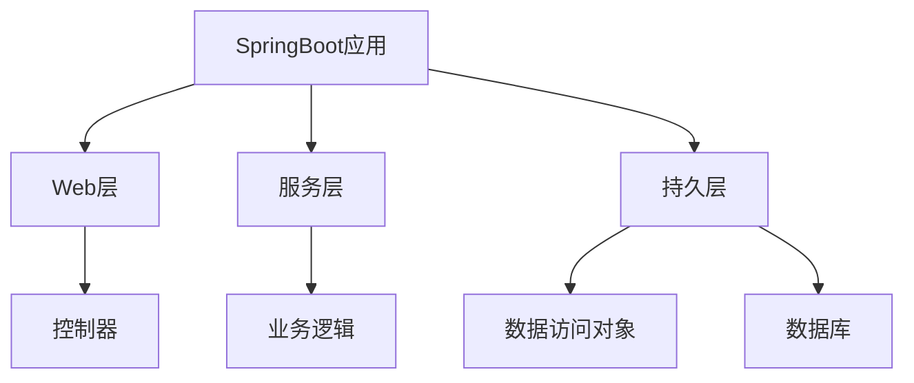

# 基于SpringBoot的停车场管理系统

## 1.背景介绍

随着城市化进程的加快和汽车保有量的不断增长,停车位的供给已经远远无法满足日益增长的需求。传统的人工管理停车场存在着诸多弊端,如收费效率低下、管理成本高昂、缺乏实时监控等问题。因此,构建一个基于现代化技术的智能停车场管理系统势在必行。

SpringBoot作为一个流行的Java框架,可以帮助开发人员快速构建高效、易于管理的应用程序。本文将介绍如何基于SpringBoot开发一个停车场管理系统,涵盖系统的核心概念、算法原理、数学模型、项目实践、应用场景、工具推荐以及未来发展趋势等内容。

## 2.核心概念与联系

停车场管理系统的核心概念包括:

1. **车位管理**: 对停车场内的车位进行实时监控和管理,包括车位状态检测、车位分配等功能。

2. **收费管理**: 根据停车时长和收费策略计算停车费用,提供多种支付方式。

3. **用户管理**: 记录用户信息,提供会员服务,实现个性化停车体验。

4. **数据分析**: 基于历史数据进行分析,优化停车场运营策略。

这些核心概念相互关联,共同构建了一个完整的停车场管理系统。

## 3.核心算法原理具体操作步骤

### 3.1 车位状态检测算法

车位状态检测是停车场管理系统的基础,主要通过传感器或视频监控技术来实现。常见的算法有:

1. **基于红外线传感器**:利用红外线发射器和接收器检测车位是否被占用。

2. **基于视频监控**:通过图像处理算法分析视频画面,识别车位的占用情况。

3. **基于磁感应技术**:在车位上安装地磁传感器,检测车辆的磁场变化。

### 3.2 车位分配算法

当有车辆进入停车场时,需要为其分配一个空闲车位。常见的车位分配算法有:

1. **最近距离优先算法**:为车辆分配距入口最近的空闲车位,减少行车路程。

2. **区域均衡算法**:将停车场划分为多个区域,优先分配空闲区域的车位,避免某些区域过度拥挤。

3. **动态规划算法**:建立数学模型,根据实时车位状态和预测的未来需求,动态调整车位分配策略。

### 3.3 收费计算算法

停车场收费通常基于停车时长和收费策略。常见的收费计算算法包括:

1. **阶梯式收费算法**:按时间段划分不同的收费标准,如前2小时5元/小时,2-4小时8元/小时。

2. **折扣优惠算法**:针对不同用户群体(如会员、长期停车等)提供不同的折扣优惠策略。

3. **动态定价算法**:根据实时车位供需情况,动态调整收费标准,实现高峰时段的需求管理。

## 4.数学模型和公式详细讲解举例说明

### 4.1 动态规划模型

动态规划是一种常用的数学模型,可以应用于车位分配和收费计算等场景。假设停车场共有N个车位,第i个车位的状态用$s_i$表示(0表示空闲,1表示占用)。我们的目标是最大化停车场的利用率,即最小化空闲车位数量。

定义状态转移方程为:

$$
f(i) = \min_{1 \leq j \leq i}\{f(j-1) + \sum_{k=j}^{i}s_k\}
$$

其中$f(i)$表示前i个车位的最小空闲车位数量。通过动态规划求解$f(N)$,即可得到整个停车场的最优车位分配方案。

### 4.2 排队论模型

在高峰时段,停车场的进出车辆可能会形成排队。我们可以使用排队论模型来分析和优化排队系统的性能。

假设车辆到达服从泊松分布,服务时间服从负指数分布,则根据$M/M/1$排队模型,系统的平均排队长度$L_q$和平均等待时间$W_q$可以表示为:

$$
L_q = \frac{\rho^2}{1-\rho}
$$

$$
W_q = \frac{\rho}{\mu(1-\rho)}
$$

其中$\rho$为系统的利用率,$\mu$为服务率。通过控制$\rho$的值,我们可以优化排队系统的性能,避免过度拥挤或资源浪费。

## 5.项目实践:代码实例和详细解释说明

### 5.1 系统架构

我们采用SpringBoot作为应用程序框架,结合Spring生态圈的其他组件构建停车场管理系统。系统架构如下所示:



1. **Web层**:提供RESTful API接口,处理HTTP请求和响应。
2. **服务层**:实现系统的业务逻辑,如车位管理、收费计算等。
3. **持久层**:负责与数据库进行交互,执行数据持久化操作。

### 5.2 车位管理模块

```java
// 车位实体类
@Entity
public class ParkingSpot {
    @Id
    private Long id;
    private boolean occupied;
    // 其他属性...
}

// 车位管理服务
@Service
public class ParkingSpotService {
    @Autowired
    private ParkingSpotRepository repository;

    public void updateStatus(Long spotId, boolean occupied) {
        ParkingSpot spot = repository.findById(spotId).orElseThrow(...);
        spot.setOccupied(occupied);
        repository.save(spot);
    }

    public List<ParkingSpot> findAvailableSpots() {
        return repository.findByOccupiedFalse();
    }
}
```

在上面的代码示例中,我们定义了`ParkingSpot`实体类来表示车位,并提供了`ParkingSpotService`服务类来管理车位状态。`updateStatus`方法用于更新车位的占用情况,`findAvailableSpots`方法用于查找空闲车位。

### 5.3 收费管理模块

```java
// 收费策略枚举
public enum PricingStrategy {
    HOURLY(5.0), // 每小时5元
    DAILY(30.0), // 每天30元
    MONTHLY(500.0); // 每月500元

    private double rate;

    PricingStrategy(double rate) {
        this.rate = rate;
    }

    public double getRate() {
        return rate;
    }
}

// 收费计算服务
@Service
public class PricingService {
    public double calculateFee(ParkingRecord record, PricingStrategy strategy) {
        long duration = record.getDepartureTime().getTime() - record.getArrivalTime().getTime();
        long hours = duration / (1000 * 60 * 60);

        switch (strategy) {
            case HOURLY:
                return hours * strategy.getRate();
            case DAILY:
                return Math.ceil(hours / 24.0) * strategy.getRate();
            case MONTHLY:
                // 计算月数并应用月费率
                ...
        }
    }
}
```

在上面的代码示例中,我们定义了`PricingStrategy`枚举类来表示不同的收费策略,并提供了`PricingService`服务类来计算停车费用。`calculateFee`方法根据停车记录和选择的收费策略计算应缴纳的费用。

## 6.实际应用场景

停车场管理系统可以应用于以下场景:

1. **商业停车场**:购物中心、机场、火车站等场所的停车场。

2. **住宅小区停车场**:为小区业主和访客提供停车服务。

3. **企业停车场**:为公司员工和访客提供停车位。

4. **路边停车**:对城市路边的付费停车区进行管理。

5. **校园停车场**:为师生提供校园内的停车服务。

这些场景都需要高效、智能的停车场管理系统来满足不断增长的停车需求,提高停车体验,优化资源利用。

## 7.工具和资源推荐

在开发停车场管理系统时,以下工具和资源可以为您提供帮助:

1. **Spring生态圈**:包括SpringBoot、Spring Data JPA、Spring Security等组件,提供了强大的应用程序框架支持。

2. **数据库**:常用的关系型数据库如MySQL、PostgreSQL,或者NoSQL数据库如MongoDB。

3. **消息队列**:如RabbitMQ、Kafka,用于实现异步处理和系统解耦。

4. **缓存**:如Redis,提高系统响应速度和并发能力。

5. **监控和日志工具**:如Prometheus、Grafana、ELK Stack,用于系统监控和日志管理。

6. **云平台**:如AWS、Azure、阿里云,提供云服务器、数据库、存储等资源。

7. **开源项目**:如GitHub上的相关开源停车场管理系统项目,可以作为参考和学习。

8. **在线社区**:如StackOverflow、Reddit等,可以寻求技术支持和解决方案。

## 8.总结:未来发展趋势与挑战

停车场管理系统的发展趋势包括:

1. **智能化**:利用人工智能、机器学习等技术,实现车位状态的自动检测、动态定价、需求预测等功能。

2. **物联网集成**:将停车场管理系统与传感器、摄像头等物联网设备深度集成,提高数据采集和监控能力。

3. **移动支付**:支持更多移动支付方式,如扫码支付、手机应用内支付等,提升用户体验。

4. **共享经济**:探索基于共享经济模式的停车位共享服务,提高停车资源利用率。

5. **可持续发展**:关注停车场的环境影响,推广电动车充电设施、节能照明等绿色措施。

未来,停车场管理系统还需要面临以下挑战:

1. **数据安全和隐私保护**:如何保护用户数据的安全性和隐私性。

2. **系统扩展性和可维护性**:如何设计可扩展、易维护的系统架构。

3. **成本控制**:如何在提供优质服务的同时,控制系统建设和运营成本。

4. **政策法规**:需要遵守相关的交通法规和政策要求。

5. **用户教育**:如何提高用户对智能停车系统的认知和使用水平。

## 9.附录:常见问题与解答

1. **如何处理车位占用检测的误差?**

   我们可以采用多种传感器技术的融合,提高检测的准确性。同时,也可以为用户提供手动报告车位状态的功能,作为辅助手段。

2. **如何防止车位被恶意占用?**

   可以设置车位的最长占用时间限制,超时将收取额外费用或采取其他惩罚措施。同时,可以部署监控设备,对恶意占用行为进行监督和处理。

3. **如何处理系统高峰时段的并发压力?**

   可以采用缓存、消息队列等技术,提高系统的响应能力和吞吐量。同时,可以考虑使用云服务器等可伸缩的基础设施资源。

4. **如何实现停车场的动态定价?**

   可以基于历史数据和实时供需情况,建立数学模型,动态调整收费标准。同时,也可以参考其他行业的动态定价策略,如航空公司的收费模式。

5. **如何处理停车场内的交通拥堵问题?**

   可以优化停车场的车道设计和引导标识,合理规划车辆进出路线。同时,也可以通过动态导航和信息发布,引导车辆合理分流。

作者:禅与计算机程序设计艺术 / Zen and the Art of Computer Programming