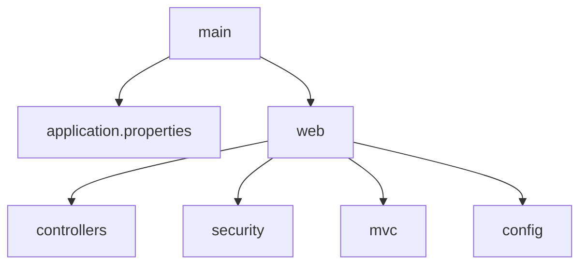

## 背景介绍

随着科技的进步和互联网的发展，扶贫众筹平台作为一种新型的社会公益活动，正在改变传统的慈善捐赠方式。这类平台利用互联网技术和大数据分析，让公众可以更加便捷地参与扶贫活动，同时也为受助人提供了更多元化的帮助渠道。SpringBoot，作为一个轻量级的Java微服务框架，因其快速开发、自动配置、集成特性以及良好的社区支持而受到广泛欢迎。因此，将SpringBoot应用于扶贫众筹平台系统，不仅可以提高系统的开发效率和可维护性，还能增强其功能性和扩展性，为实现扶贫目标提供强大的技术支持。

## 核心概念与联系

### 技术栈概述

- **SpringBoot**: 提供了一种快速构建Spring应用的方式，简化了Spring框架的配置，使得开发者能更专注于业务逻辑的实现而非基础框架的搭建。
- **MyBatis**: 是一个持久化层框架，用于映射数据库操作，实现数据的CRUD操作，确保数据与业务逻辑分离，提高代码的可读性和可维护性。
- **Redis**: 作为分布式缓存和消息队列系统，用于存储临时数据、缓存热点数据和实现异步处理机制，提升系统性能和响应速度。
- **MySQL**: 数据库管理系统，用于存储系统中所有相关数据，如用户信息、捐助记录、项目状态等。

### 技术间的联系

- SpringBoot与MyBatis结合，实现业务逻辑与数据库操作的解耦，提高了代码复用性和可维护性。
- Redis与SpringBoot配合，用于实现缓存策略和消息队列功能，提升了系统处理并发请求的能力和响应速度。
- MySQL作为数据存储中心，支撑着整个系统的基础数据需求，确保数据的安全性和完整性。

## 核心算法原理具体操作步骤

### 用户认证与授权流程

#### 步骤一：用户注册与登录
- 用户通过注册页面提交基本信息，SpringBoot后端接收并验证信息后，将用户信息保存至MySQL数据库。
- 登录时，前端向SpringBoot发送用户名和密码，后端验证正确后，生成JWT令牌并返回给前端。

#### 步骤二：权限管理
- 使用Spring Security实现角色和权限管理，根据用户角色分配相应的操作权限，如普通用户、管理员等。

### 众筹项目管理

#### 步骤一：项目创建与审核
- 用户在平台创建众筹项目时，需填写项目详情、目标金额、预期用途等信息，提交至管理员审核。
- 管理员审核通过后，项目进入公开筹款阶段。

#### 步骤二：众筹过程监控
- 实时更新众筹进度，包括已筹集金额、剩余时间、参与者数量等信息，供用户查看和参与。

### 交易与支付流程

#### 步骤一：支付处理
- 当用户选择捐款时，触发支付接口，将支付请求发送至第三方支付服务（如支付宝、微信支付）。
- 支付成功后，第三方服务回调SpringBoot后端，确认支付完成，同时更新数据库中的捐款记录。

#### 步骤二：资金划拨与监督
- 根据众筹项目的需要，将筹集的资金划拨至项目指定账户或直接用于资助受助对象。
- 实现资金使用的透明化，定期公布资金使用报告，接受公众监督。

## 数学模型和公式详细讲解举例说明

### 资金流转效率评估

- **公式**：资金流转效率 = 总捐款金额 / （总时间 * 平均处理时间）
- **解释**：此公式用于衡量众筹平台的资金处理能力，其中总捐款金额是指在特定时间段内所有捐款的总和，总时间是该时间段长度，平均处理时间是指处理每笔捐款所需的时间。

### 用户参与度分析

- **公式**：用户参与度 = （参与众筹项目次数 * 捐款总额）/ 总用户数量
- **解释**：此公式用于评估用户对平台的活跃程度和投入程度，反映了用户通过平台参与慈善活动的积极性。

## 项目实践：代码实例和详细解释说明

### SpringBoot项目结构



### MyBatis配置

```xml
<configuration>
    <mappers>
        <mapper resource=\"com.example.mapper.UserMapper.xml\"/>
    </mappers>
</configuration>
```

### Redis缓存策略

```java
// 使用RedisTemplate进行缓存操作
RedisTemplate<String, Object> redisTemplate = new RedissonClient().getRedisTemplate();
redisTemplate.opsForValue().set(\"key\", value);
```

### MySQL数据库操作

```sql
INSERT INTO users (username, password, role) VALUES ('user1', 'password1', 'user');
SELECT * FROM donations WHERE user_id = ?
```

## 实际应用场景

扶贫众筹平台不仅限于慈善机构和公众之间的连接，还可以拓展到企业社会责任领域，鼓励企业通过平台进行公益捐赠，同时为企业提供透明化的资金流向报告，增强社会对其责任行为的认可。此外，平台还可以整合数据分析，预测捐赠趋势，优化资源配置，提高资金使用效率。

## 工具和资源推荐

- **IDE**：IntelliJ IDEA 或 Eclipse
- **版本控制**：Git
- **云服务**：AWS、阿里云或Google Cloud Platform
- **测试框架**：JUnit、Mockito
- **文档生成工具**：Swagger、Javadoc

## 总结：未来发展趋势与挑战

随着AI和大数据技术的发展，未来的扶贫众筹平台将更加智能化，能够通过机器学习预测捐赠趋势、优化资金分配策略，以及通过自然语言处理技术更好地理解和回应公众的需求和反馈。同时，平台也面临着数据安全、隐私保护以及技术公平性等方面的挑战，需要不断探索解决方案。

## 附录：常见问题与解答

### Q: 如何确保资金的透明度和安全性？
A: 采用区块链技术可以实现资金流的透明化跟踪，确保每一笔交易都可追溯，同时利用加密算法保障资金转移的安全性。

### Q: 如何提升平台的用户体验？
A: 设计简洁直观的界面，提供实时反馈，优化加载速度，以及个性化推荐等功能，都能有效提升用户体验。

### Q: 如何吸引更多用户参与？
A: 通过社交媒体营销、合作伙伴推广、举办线上活动等方式，增强平台知名度和吸引力。

### Q: 如何解决数据隐私问题？
A: 强化数据加密措施，遵守GDPR等国际数据保护法规，建立透明的数据使用政策，增强用户信任。

## 结语

扶贫众筹平台通过科技的力量，为全球范围内的扶贫事业带来了新的机遇。SpringBoot、MyBatis、Redis和MySQL等技术的融合，不仅提升了平台的性能和稳定性，还赋予了其智能化的功能。面对未来，随着技术的不断创新，扶贫众筹平台有望在更广泛的领域发挥更大的影响力，推动全球社会向更加公平、可持续的方向发展。

作者：禅与计算机程序设计艺术 / Zen and the Art of Computer Programming