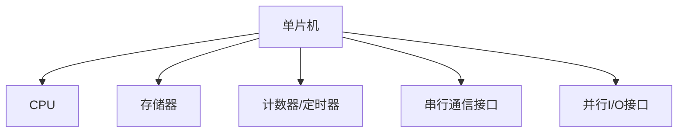
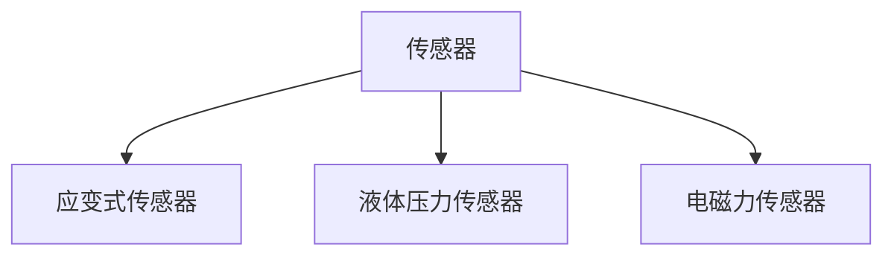
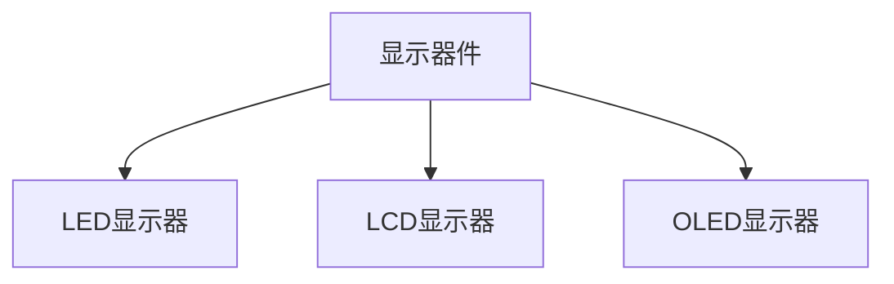
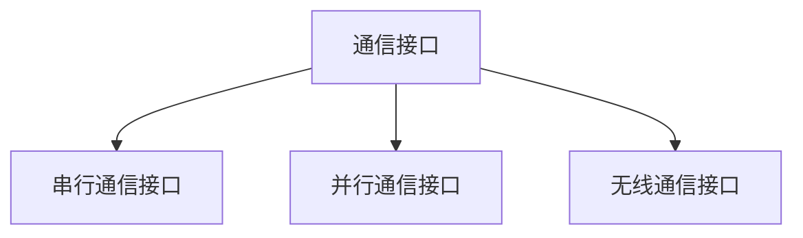
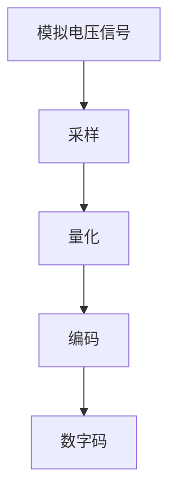
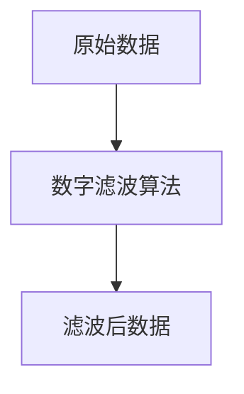
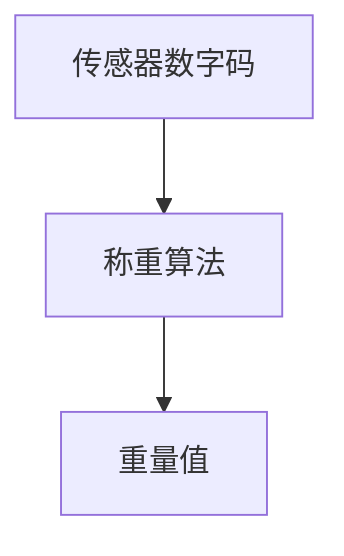
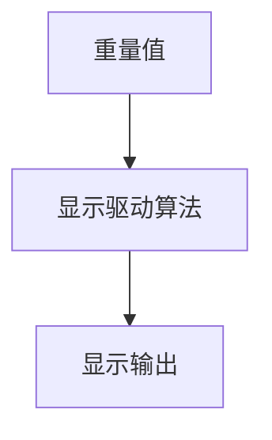
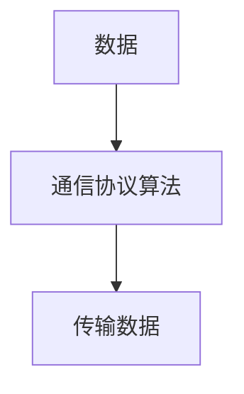

# 基于单片机电子秤的设计与实现

## 1. 背景介绍

在当今社会,电子秤的应用已经无处不在,从商场超市、工厂车间到实验室等场所,电子秤都扮演着重要的角色。随着科技的发展,电子秤的设计和制造也在不断进步,以满足不同领域的需求。其中,基于单片机的电子秤因其便携性、可靠性和可编程性,成为了一种受欢迎的选择。

单片机是一种集成了中央处理器(CPU)、存储器和输入/输出接口等功能于一体的微型计算机芯片。由于其体积小巧、成本低廉、功耗低等优点,单片机广泛应用于各种嵌入式系统中,包括电子秤。

本文将详细探讨基于单片机的电子秤的设计与实现,包括硬件电路设计、软件程序开发以及实际应用场景等方面。我们将深入分析核心概念和算法原理,并提供代码实例和实用工具推荐,帮助读者掌握这一领域的关键技术。

## 2. 核心概念与联系

在深入探讨基于单片机的电子秤设计之前,我们需要了解一些核心概念及其相互关系。

### 2.1 单片机

单片机是一种高度集成的微型计算机系统,通常由CPU、存储器(RAM和ROM)、计数器/定时器、串行通信接口、并行输入/输出接口等模块组成。它们通常采用哈佛架构或改进的哈佛架构,将程序存储器和数据存储器分开,提高了执行效率。

常见的单片机品牌包括Intel的8051系列、Microchip的PIC系列、Atmel的AVR系列等。每个系列都有自己的指令集、寄存器组和外设资源,开发人员需要根据具体应用场景选择合适的单片机型号。

### 2.2 传感器

电子秤的核心是测量被称物体的重量或质量。为了实现这一功能,我们需要使用称重传感器。常见的称重传感器包括:

1. **应变式传感器**: 利用应变原理测量被称物体对传感器产生的应变,根据应变大小计算重量。
2. **液体压力传感器**: 利用液体压力与重量之间的关系测量重量。
3. **电磁力传感器**: 利用电磁力与重量之间的关系测量重量。

其中,应变式传感器由于其高精度、高灵敏度和良好的线性特性,被广泛应用于电子秤的设计中。

### 2.3 A/D转换

由于单片机只能处理数字信号,而传感器输出的通常是模拟信号,因此我们需要使用模数转换器(A/D转换器)将模拟信号转换为数字信号,以便单片机进行处理。

A/D转换器的工作原理是对输入的模拟电压进行采样和量化,将其转换为数字码。常见的A/D转换方式包括逐次逼近式、双积分式、Σ-Δ调制式等。选择合适的A/D转换器对于获取准确的重量数据至关重要。

### 2.4 显示器件

为了将测量结果展示给用户,我们需要将数字信号转换为可视化的显示输出。常见的显示器件包括:

1. **LED显示器**: 利用发光二极管显示数字和字符。
2. **LCD显示器**: 利用液晶显示技术显示数字、字符和图形。
3. **OLED显示器**: 利用有机发光二极管显示技术,具有更高的对比度和更宽的视角。

选择合适的显示器件需要考虑显示效果、功耗、成本等因素。

### 2.5 通信接口

在某些应用场景中,我们需要将电子秤与其他设备(如计算机或网络)连接,以实现数据传输和远程控制。常见的通信接口包括:

1. **串行通信接口**: 如RS-232、USB等,用于与计算机或其他设备进行串行数据通信。
2. **并行通信接口**: 如并行端口,用于与打印机等设备进行并行数据通信。
3. **无线通信接口**: 如蓝牙、Wi-Fi等,用于与移动设备或网络进行无线数据通信。

选择合适的通信接口需要考虑传输速率、传输距离、成本等因素。

上述核心概念相互关联,共同构成了基于单片机的电子秤系统。单片机作为系统的控制中心,负责读取传感器数据、执行称重算法、驱动显示器件以及与外部设备进行通信。合理的硬件设计和软件编程是实现高性能电子秤的关键。

## 3. 核心算法原理具体操作步骤

基于单片机的电子秤系统需要执行一系列算法,以从传感器获取原始数据、进行数据处理、计算重量并显示结果。下面我们将详细介绍这些核心算法的原理和具体操作步骤。

### 3.1 A/D转换算法

由于传感器输出的是模拟电压信号,我们需要将其转换为数字信号,以便单片机进行处理。A/D转换算法的主要步骤如下:

1. **采样**: 对输入的模拟电压信号进行周期性采样,获取离散的电压值。
2. **量化**: 将采样得到的电压值映射到有限的量化级别,每个量化级别对应一个数字码。
3. **编码**: 将量化后的电压值转换为二进制数字码,以便单片机处理。

常见的A/D转换算法包括逐次逼近式、双积分式和Σ-Δ调制式等。选择合适的算法需要考虑转换速度、分辨率和精度等因素。

### 3.2 数字滤波算法

由于传感器输出的原始数据可能存在噪声和干扰,我们需要使用数字滤波算法对数据进行滤波处理,以提高测量精度。常见的数字滤波算法包括:

1. **移动平均滤波**: 计算一定窗口内数据的平均值,平滑噪声。
2. **中值滤波**: 取一定窗口内数据的中值,有效消除脉冲干扰。
3. **FIR/IIR滤波**: 使用有限/无限脉冲响应滤波器对数据进行滤波。

选择合适的滤波算法需要考虑噪声特性、实时性要求和计算复杂度等因素。

### 3.3 称重算法

称重算法是电子秤系统的核心算法,用于根据传感器输出的数字码计算被称物体的重量。常见的称重算法包括:

1. **线性称重算法**: 利用传感器的线性特性,通过线性方程直接计算重量。
2. **多点线性拟合算法**: 通过多点采样拟合传感器的非线性特性,提高计算精度。
3. **查表算法**: 预先建立传感器输出与重量之间的查找表,通过查表快速计算重量。

选择合适的称重算法需要考虑传感器的特性、计算精度要求和实时性要求等因素。

### 3.4 显示驱动算法

为了将计算得到的重量值显示在显示器件上,我们需要使用显示驱动算法。不同的显示器件有不同的驱动方式,常见的显示驱动算法包括:

1. **LED驱动算法**: 根据需要显示的数字或字符,控制对应的LED段码。
2. **LCD驱动算法**: 通过并行或串行接口向LCD发送显示数据和控制命令。
3. **OLED驱动算法**: 类似于LCD驱动,但需要考虑OLED的特殊驱动要求。

选择合适的显示驱动算法需要考虑显示器件的类型、显示效果要求和驱动复杂度等因素。

### 3.5 通信协议算法

如果需要将电子秤与其他设备(如计算机或网络)连接,我们需要使用通信协议算法实现数据传输和远程控制。常见的通信协议算法包括:

1. **串行通信协议**: 如RS-232、USB等,用于与计算机或其他设备进行串行数据通信。
2. **并行通信协议**: 如并行端口协议,用于与打印机等设备进行并行数据通信。
3. **无线通信协议**: 如蓝牙、Wi-Fi等,用于与移动设备或网络进行无线数据通信。

选择合适的通信协议算法需要考虑通信速率、传输距离、可靠性和安全性等因素。

上述核心算法相互配合,共同实现了基于单片机的电子秤系统的功能。根据具体应用场景和性能要求,我们可以选择合适的算法组合,并进行优化和改进,以提高系统的精度、实时性和可靠性。

## 4. 数学模型和公式详细讲解举例说明

在电子秤系统的设计和实现过程中,我们需要使用一些数学模型和公式来描述和计算相关参数。下面我们将详细讲解这些数学模型和公式,并给出具体的例子说明。

### 4.1 传感器线性模型

许多称重传感器(如应变式传感器)在一定范围内具有良好的线性特性,即传感器输出的电压或数字码与施加的重量成线性关系。我们可以使用线性方程来描述这种关系:

$$
y = kx + b
$$

其中,y表示传感器输出(电压或数字码),x表示施加的重量,k和b分别是线性方程的斜率和截距。

通过对传感器进行标定,我们可以确定k和b的值。例如,对于一个应变式传感器,我们可以在不施加重量时记录其输出y0,在施加已知重量m0时记录其输出y1,则有:

$$
y_0 = kb + b \\
y_1 = km_0 + b
$$

解这个方程组,我们可以得到k和b的值:

$$
k = \frac{y_1 - y_0}{m_0} \\
b = y_0 - k \times 0
$$

确定了k和b后,我们就可以使用线性方程计算任意重量x对应的传感器输出y,从而实现称重功能。

### 4.2 非线性拟合模型

虽然许多传感器在一定范围内具有线性特性,但在更大的范围内,它们可能表现出非线性特性。在这种情况下,我们需要使用更复杂的非线性模型来描述传感器的输出与重量之间的关系。

一种常用的非线性拟合模型是多项式模型:

$$
y = a_0 + a_1x + a_2x^2 + \cdots + a_nx^n
$$

其中,y表示传感器输出,x表示施加的重量,a0、a1、a2...an是需要确定的系数。

我们可以通过对传感器进行多点采样,获取一系列(x,y)数据对,然后使用最小二乘法或其他拟合算法